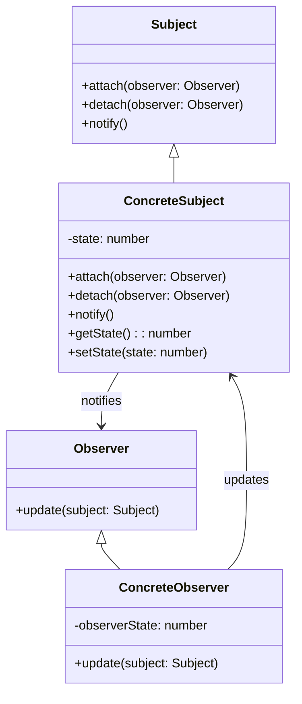
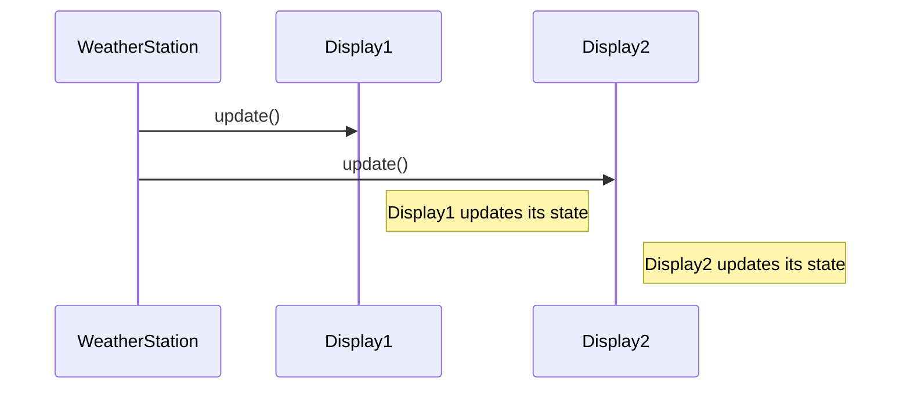

## 6.7 Observer Pattern

In the realm of software design, maintaining a consistent state across multiple objects without creating a tightly coupled system is a common challenge. The Observer Pattern offers a robust solution to this problem by establishing a one-to-many dependency between objects. When the state of one object changes, all its dependents are automatically notified and updated. This pattern is particularly useful in scenarios where multiple objects need to react to changes in another object, such as in GUI frameworks or event-driven systems.

### Definition and Intent

The Observer Pattern defines a one-to-many dependency between objects, ensuring that when one object (the subject) changes its state, all its dependents (observers) are notified and updated automatically. This pattern is instrumental in creating systems where objects need to be kept in sync without being tightly coupled.

#### Key Intentions:

- **Decoupling**: The Observer Pattern decouples the subject from its observers, allowing them to interact without being directly aware of each other's existence.
- **Dynamic Relationships**: Observers can be added or removed at runtime, providing flexibility in how objects interact.
- **Automatic Updates**: Changes in the subject automatically propagate to all observers, ensuring consistency across the system.

### Problem Solved by the Observer Pattern

In complex systems, it's common for multiple components to depend on the state of a single object. Without a structured approach, this can lead to tightly coupled code, making the system difficult to maintain and extend. The Observer Pattern addresses this by allowing objects to subscribe to changes in another object, ensuring that all dependents are notified of state changes without requiring direct dependencies.

#### Common Problems Addressed:

- **Tight Coupling**: Direct dependencies between objects can make a system rigid and difficult to modify. The Observer Pattern reduces these dependencies by introducing an intermediary (the subject).
- **Scalability**: As systems grow, maintaining direct dependencies between objects becomes impractical. The Observer Pattern allows for scalable systems where observers can be added or removed as needed.
- **Consistency**: Ensuring that all parts of a system remain consistent with each other can be challenging. The Observer Pattern automates this process by notifying all observers of changes.

### Key Components of the Observer Pattern

The Observer Pattern is composed of several key components, each playing a crucial role in maintaining the system's integrity and flexibility.

#### 1. Subject

The Subject is the core component that maintains a list of observers and notifies them of any state changes. It provides methods to attach and detach observers, ensuring that the system can dynamically adapt to changes.

```typescript
interface Subject {
    attach(observer: Observer): void;
    detach(observer: Observer): void;
    notify(): void;
}
```

#### 2. Observer

The Observer defines an interface for objects that should be notified of changes in the subject. Each observer implements an `update` method, which is called when the subject's state changes.

```typescript
interface Observer {
    update(subject: Subject): void;
}
```

#### 3. ConcreteSubject

The ConcreteSubject is a specific implementation of the Subject interface. It maintains its state and notifies observers when this state changes.

```typescript
class ConcreteSubject implements Subject {
    private observers: Observer[] = [];
    private state: number;

    public attach(observer: Observer): void {
        this.observers.push(observer);
    }

    public detach(observer: Observer): void {
        const observerIndex = this.observers.indexOf(observer);
        if (observerIndex !== -1) {
            this.observers.splice(observerIndex, 1);
        }
    }

    public notify(): void {
        for (const observer of this.observers) {
            observer.update(this);
        }
    }

    public getState(): number {
        return this.state;
    }

    public setState(state: number): void {
        this.state = state;
        this.notify();
    }
}
```

#### 4. ConcreteObserver

The ConcreteObserver implements the Observer interface and updates its state in response to notifications from the subject.

```typescript
class ConcreteObserver implements Observer {
    private observerState: number;

    public update(subject: Subject): void {
        if (subject instanceof ConcreteSubject) {
            this.observerState = subject.getState();
            console.log(`Observer state updated to: ${this.observerState}`);
        }
    }
}
```

### Diagram: Observer Pattern Structure

To better understand the relationships between these components, let's visualize the Observer Pattern structure.



### Promoting Loose Coupling and Extensibility

One of the primary advantages of the Observer Pattern is its ability to promote loose coupling between the subject and its observers. By defining a clear interface for communication, the pattern allows for flexible and extensible systems where components can interact without being tightly bound to each other.

#### Benefits of Loose Coupling:

- **Flexibility**: Observers can be added or removed without affecting the subject, allowing the system to adapt to changing requirements.
- **Reusability**: Components can be reused across different systems without modification, as they rely on a standard interface.
- **Maintainability**: Changes to one component do not necessitate changes to others, reducing the risk of introducing bugs.

### Implementing the Observer Pattern in TypeScript

Now that we have a theoretical understanding of the Observer Pattern, let's implement it in TypeScript. We'll create a simple example where a `WeatherStation` (subject) notifies multiple `Display` units (observers) of changes in temperature.

#### Step 1: Define the Subject Interface

We'll start by defining the `Subject` interface, which includes methods for attaching, detaching, and notifying observers.

```typescript
interface Subject {
    attach(observer: Observer): void;
    detach(observer: Observer): void;
    notify(): void;
}
```

#### Step 2: Define the Observer Interface

Next, we'll define the `Observer` interface, which includes an `update` method that will be called when the subject's state changes.

```typescript
interface Observer {
    update(subject: Subject): void;
}
```

#### Step 3: Implement the ConcreteSubject

The `WeatherStation` class will implement the `Subject` interface. It will maintain a list of observers and notify them of any changes in temperature.

```typescript
class WeatherStation implements Subject {
    private observers: Observer[] = [];
    private temperature: number;

    public attach(observer: Observer): void {
        this.observers.push(observer);
    }

    public detach(observer: Observer): void {
        const index = this.observers.indexOf(observer);
        if (index !== -1) {
            this.observers.splice(index, 1);
        }
    }

    public notify(): void {
        for (const observer of this.observers) {
            observer.update(this);
        }
    }

    public getTemperature(): number {
        return this.temperature;
    }

    public setTemperature(temp: number): void {
        this.temperature = temp;
        this.notify();
    }
}
```

#### Step 4: Implement the ConcreteObserver

The `Display` class will implement the `Observer` interface. It will update its display whenever the temperature changes.

```typescript
class Display implements Observer {
    private temperature: number;

    public update(subject: Subject): void {
        if (subject instanceof WeatherStation) {
            this.temperature = subject.getTemperature();
            console.log(`Display updated: Temperature is now ${this.temperature}°C`);
        }
    }
}
```

#### Step 5: Demonstrate the Observer Pattern

Finally, let's demonstrate the Observer Pattern in action by creating a `WeatherStation` and attaching multiple `Display` units to it.

```typescript
const weatherStation = new WeatherStation();
const display1 = new Display();
const display2 = new Display();

weatherStation.attach(display1);
weatherStation.attach(display2);

weatherStation.setTemperature(25); // Both displays will update to 25°C
weatherStation.setTemperature(30); // Both displays will update to 30°C
```

### Try It Yourself

To deepen your understanding, try modifying the code examples:

- **Add More Observers**: Create additional observer classes that react differently to temperature changes.
- **Implement Detach Logic**: Test the detach functionality by removing an observer and verifying that it no longer receives updates.
- **Extend Functionality**: Add more state variables to the `WeatherStation` and update the observers accordingly.

### Visualizing the Observer Pattern in Action

Let's visualize the flow of notifications in the Observer Pattern using a sequence diagram.



### References and Further Reading

- [MDN Web Docs: Observer Pattern](https://developer.mozilla.org/en-US/docs/Glossary/Observer_pattern)
- [Refactoring Guru: Observer Pattern](https://refactoring.guru/design-patterns/observer)
- [TypeScript Official Documentation](https://www.typescriptlang.org/docs/)

### Knowledge Check

Before we wrap up, let's reinforce what we've learned with a few questions:

- **What is the primary goal of the Observer Pattern?**
- **How does the Observer Pattern promote loose coupling?**
- **What are the key components of the Observer Pattern?**

### Summary

The Observer Pattern is a powerful tool for creating systems where multiple objects need to stay in sync without direct dependencies. By defining a clear interface for communication, it promotes loose coupling, flexibility, and maintainability. As you continue to explore design patterns, remember that the Observer Pattern is just one of many tools available to you. Keep experimenting, stay curious, and enjoy the journey!

## Quiz Time!



### What is the primary purpose of the Observer Pattern?

- [x] To define a one-to-many dependency between objects.
- [ ] To encapsulate a request as an object.
- [ ] To provide a way to access elements of a collection sequentially.
- [ ] To define an object that encapsulates how a set of objects interact.

> **Explanation:** The Observer Pattern's primary purpose is to define a one-to-many dependency between objects, ensuring that when one object changes state, all its dependents are notified and updated automatically.

### Which component in the Observer Pattern maintains a list of observers?

- [x] Subject
- [ ] Observer
- [ ] ConcreteObserver
- [ ] ConcreteSubject

> **Explanation:** The Subject is responsible for maintaining a list of observers and notifying them of any state changes.

### What method must an Observer implement to receive updates?

- [x] update()
- [ ] notify()
- [ ] attach()
- [ ] detach()

> **Explanation:** Observers must implement the `update()` method to receive notifications from the subject when its state changes.

### How does the Observer Pattern promote loose coupling?

- [x] By decoupling the subject from its observers, allowing them to interact without being directly aware of each other's existence.
- [ ] By encapsulating a request as an object.
- [ ] By providing a way to access elements of a collection sequentially.
- [ ] By defining an object that encapsulates how a set of objects interact.

> **Explanation:** The Observer Pattern promotes loose coupling by decoupling the subject from its observers, allowing them to interact without being directly aware of each other's existence.

### Which of the following is a benefit of using the Observer Pattern?

- [x] Flexibility
- [x] Reusability
- [ ] Tight Coupling
- [ ] Complexity

> **Explanation:** The Observer Pattern offers benefits such as flexibility and reusability by allowing observers to be added or removed without affecting the subject.

### In the Observer Pattern, what is the role of the ConcreteSubject?

- [x] To implement the Subject interface and notify observers of state changes.
- [ ] To define an updating interface for objects that should be notified.
- [ ] To encapsulate a request as an object.
- [ ] To provide a way to access elements of a collection sequentially.

> **Explanation:** The ConcreteSubject implements the Subject interface and is responsible for notifying observers of any state changes.

### What is a common use case for the Observer Pattern?

- [x] GUI frameworks
- [x] Event-driven systems
- [ ] Sorting algorithms
- [ ] Data serialization

> **Explanation:** Common use cases for the Observer Pattern include GUI frameworks and event-driven systems, where multiple objects need to react to changes in another object.

### What is the main advantage of using interfaces in the Observer Pattern?

- [x] They allow for flexible and extensible systems where components can interact without being tightly bound to each other.
- [ ] They encapsulate a request as an object.
- [ ] They provide a way to access elements of a collection sequentially.
- [ ] They define an object that encapsulates how a set of objects interact.

> **Explanation:** Interfaces in the Observer Pattern allow for flexible and extensible systems where components can interact without being tightly bound to each other.

### True or False: The Observer Pattern is only useful in GUI applications.

- [ ] True
- [x] False

> **Explanation:** False. While the Observer Pattern is commonly used in GUI applications, it is also useful in other scenarios such as event-driven systems and any situation where objects need to be kept in sync.

### What is the role of the ConcreteObserver in the Observer Pattern?

- [x] To implement the Observer interface and update its state in response to notifications.
- [ ] To maintain a list of observers and notify them of state changes.
- [ ] To encapsulate a request as an object.
- [ ] To provide a way to access elements of a collection sequentially.

> **Explanation:** The ConcreteObserver implements the Observer interface and updates its state in response to notifications from the subject.


