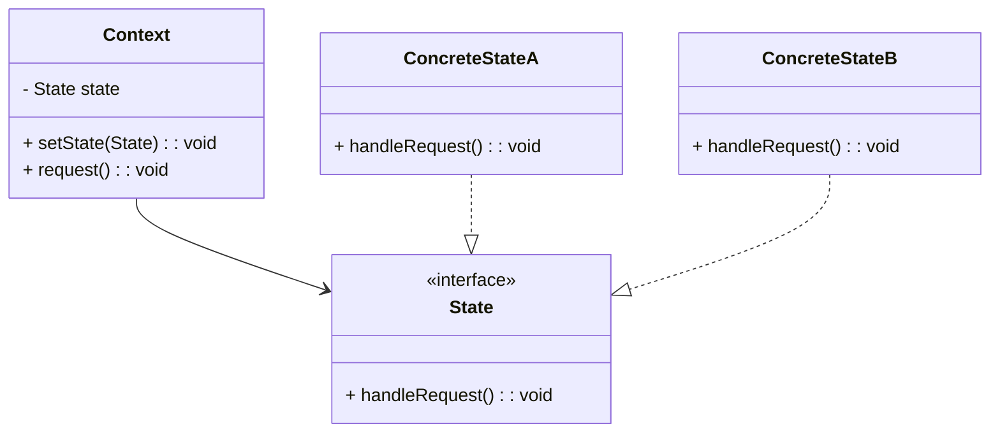

## 6.8.1 Implementing State in TypeScript

The State Pattern is a behavioral design pattern that allows an object to alter its behavior when its internal state changes. This pattern is particularly useful when an object must change its behavior at runtime depending on its state. In TypeScript, we can implement the State Pattern by encapsulating state-specific behavior in classes and managing state transitions effectively.

### Understanding the State Pattern

The State Pattern is about encapsulating the state-specific behavior of an object in separate classes, known as state classes. The object, known as the context, maintains a reference to a state object and delegates its behavior to the current state object. This pattern is beneficial in scenarios where an object can be in multiple states, and its behavior changes depending on its current state.

#### Key Components of the State Pattern

1. **State Interface**: Defines the interface for encapsulating the behavior associated with a particular state of the context.
2. **Concrete State Classes**: Implement the state interface and define specific behavior for each state.
3. **Context Class**: Maintains a reference to a state instance and delegates state-specific behavior to the current state object. It also allows changing the current state.

### Implementing the State Pattern in TypeScript

Let's explore how to implement the State Pattern in TypeScript with a practical example.

#### Step 1: Define the State Interface

First, we define a `State` interface that declares methods representing possible actions.

```typescript
// State.ts
export interface State {
    handleRequest(): void;
}
```

The `handleRequest` method is a placeholder for state-specific behavior.

#### Step 2: Implement Concrete State Classes

Next, we implement concrete state classes that define specific behaviors for each state.

```typescript
// ConcreteStateA.ts
import { State } from './State';

export class ConcreteStateA implements State {
    handleRequest(): void {
        console.log("ConcreteStateA handles the request.");
    }
}

// ConcreteStateB.ts
import { State } from './State';

export class ConcreteStateB implements State {
    handleRequest(): void {
        console.log("ConcreteStateB handles the request.");
    }
}
```

Each concrete state class implements the `State` interface and provides its own implementation of the `handleRequest` method.

#### Step 3: Create the Context Class

The `Context` class maintains a reference to a `State` instance and delegates actions to it. It also provides methods to change its current state.

```typescript
// Context.ts
import { State } from './State';

export class Context {
    private state: State;

    constructor(initialState: State) {
        this.state = initialState;
    }

    setState(state: State): void {
        console.log(`Context: Transition to ${state.constructor.name}`);
        this.state = state;
    }

    request(): void {
        this.state.handleRequest();
    }
}
```

The `Context` class has a `setState` method that allows changing the current state and a `request` method that delegates the action to the current state.

#### Step 4: Demonstrate State Transitions

Let's demonstrate how state transitions are handled within the `Context` or `State` classes.

```typescript
// Main.ts
import { Context } from './Context';
import { ConcreteStateA } from './ConcreteStateA';
import { ConcreteStateB } from './ConcreteStateB';

// Initialize context with ConcreteStateA
const context = new Context(new ConcreteStateA());

// Handle request in ConcreteStateA
context.request();

// Transition to ConcreteStateB
context.setState(new ConcreteStateB());

// Handle request in ConcreteStateB
context.request();
```

In this example, the `Context` is initialized with `ConcreteStateA`. When the `request` method is called, it delegates the action to `ConcreteStateA`. The `Context` then transitions to `ConcreteStateB`, and subsequent calls to `request` are handled by `ConcreteStateB`.

### Benefits of the State Pattern

The State Pattern offers several benefits in terms of code organization and avoiding complex conditionals:

1. **Encapsulation of State-Specific Behavior**: By encapsulating state-specific behavior in separate classes, we achieve a cleaner and more organized codebase.
2. **Ease of Adding New States**: Adding new states becomes straightforward as we only need to create new state classes without modifying existing code.
3. **Avoidance of Complex Conditionals**: The State Pattern eliminates the need for complex conditional statements to handle different states, resulting in more maintainable code.

### Visualizing the State Pattern

To better understand the State Pattern, let's visualize the relationships between the `Context`, `State`, and `ConcreteState` classes using a class diagram.



**Diagram Description**: This class diagram illustrates the relationships between the `Context`, `State`, and `ConcreteState` classes. The `Context` class maintains a reference to a `State` instance and delegates actions to it. The `ConcreteStateA` and `ConcreteStateB` classes implement the `State` interface and define specific behaviors for each state.

### Try It Yourself

To deepen your understanding of the State Pattern, try modifying the code examples:

- **Add a New State**: Implement a new concrete state class, `ConcreteStateC`, and demonstrate its behavior within the `Context`.
- **Extend State Behavior**: Add additional methods to the `State` interface and implement them in the concrete state classes.
- **Experiment with State Transitions**: Modify the `Context` class to automatically transition between states based on certain conditions.

### References and Further Reading

- [MDN Web Docs: State Pattern](https://developer.mozilla.org/en-US/docs/Web/JavaScript/Guide/State_Pattern)
- [Refactoring Guru: State Pattern](https://refactoring.guru/design-patterns/state)
- [TypeScript Handbook](https://www.typescriptlang.org/docs/handbook/)

### Knowledge Check

Before we conclude, let's reinforce our understanding with a few questions:

- What are the key components of the State Pattern?
- How does the State Pattern help in avoiding complex conditionals?
- What are the benefits of encapsulating state-specific behavior in separate classes?

### Embrace the Journey

Remember, mastering design patterns like the State Pattern is a journey. As you continue to explore and implement these patterns, you'll gain deeper insights into writing maintainable and scalable code. Keep experimenting, stay curious, and enjoy the process!

## Quiz Time!



### What is the primary purpose of the State Pattern?

- [x] To allow an object to alter its behavior when its internal state changes.
- [ ] To encapsulate data within an object.
- [ ] To separate the interface from implementation.
- [ ] To provide a simplified interface to a complex subsystem.

> **Explanation:** The State Pattern allows an object to change its behavior when its internal state changes, encapsulating state-specific behavior in separate classes.


### Which component of the State Pattern defines the interface for state-specific behavior?

- [x] State Interface
- [ ] Context Class
- [ ] Concrete State Class
- [ ] Singleton Class

> **Explanation:** The State Interface defines the methods that concrete state classes must implement, representing state-specific behavior.


### How does the Context class interact with the State Pattern?

- [x] It maintains a reference to a State instance and delegates actions to it.
- [ ] It implements the State interface directly.
- [ ] It defines specific behaviors for each state.
- [ ] It provides a simplified interface to the client.

> **Explanation:** The Context class maintains a reference to a State instance and delegates state-specific behavior to the current state object.


### What is a key benefit of using the State Pattern?

- [x] It avoids complex conditional statements for state management.
- [ ] It simplifies the user interface.
- [ ] It reduces the number of classes in a program.
- [ ] It increases the complexity of the code.

> **Explanation:** The State Pattern eliminates the need for complex conditional statements to handle different states, resulting in more maintainable code.


### How can new states be added in the State Pattern?

- [x] By creating new concrete state classes without modifying existing code.
- [ ] By modifying the Context class directly.
- [ ] By adding new methods to the State interface.
- [ ] By changing the implementation of existing concrete state classes.

> **Explanation:** New states can be added by creating new concrete state classes that implement the State interface, without modifying existing code.


### What method in the Context class allows changing the current state?

- [x] setState
- [ ] handleRequest
- [ ] request
- [ ] changeState

> **Explanation:** The setState method in the Context class allows changing the current state by updating the reference to a new State instance.


### Which of the following is NOT a component of the State Pattern?

- [x] Observer Class
- [ ] State Interface
- [ ] Concrete State Class
- [ ] Context Class

> **Explanation:** The Observer Class is not a component of the State Pattern. The State Pattern consists of the State Interface, Concrete State Classes, and the Context Class.


### How does the State Pattern improve code organization?

- [x] By encapsulating state-specific behavior in separate classes.
- [ ] By reducing the number of methods in a class.
- [ ] By eliminating the need for interfaces.
- [ ] By combining multiple classes into one.

> **Explanation:** The State Pattern improves code organization by encapsulating state-specific behavior in separate classes, resulting in a cleaner and more organized codebase.


### What is the role of Concrete State Classes in the State Pattern?

- [x] To implement the State interface and define specific behaviors for each state.
- [ ] To maintain a reference to the Context class.
- [ ] To provide a simplified interface to the client.
- [ ] To encapsulate data within an object.

> **Explanation:** Concrete State Classes implement the State interface and define specific behaviors for each state, encapsulating state-specific logic.


### True or False: The State Pattern can be used to manage state transitions within the Context class.

- [x] True
- [ ] False

> **Explanation:** True. The State Pattern can manage state transitions within the Context class by changing the reference to the current state object.


