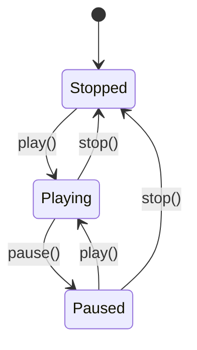

## 6.8.2 Managing Object State

In the dynamic world of software development, managing the state of an object is crucial for creating flexible and maintainable systems. The State Pattern is a behavioral design pattern that allows an object to change its behavior when its internal state changes. This pattern is particularly useful in scenarios where an object must behave differently depending on its current state, such as in user interfaces, game development, or workflow systems.

### Understanding the State Pattern

The State Pattern is designed to allow an object to alter its behavior when its internal state changes. The pattern involves three main components:

1. **Context**: The class that maintains an instance of a `State` subclass defining the current state.
2. **State**: An interface or abstract class that defines the behavior associated with a particular state.
3. **Concrete States**: Classes that implement the `State` interface, each representing a specific state and its associated behavior.

The `Context` delegates the behavior to the current `State` object, allowing for dynamic behavior changes without modifying the `Context` itself. This delegation enables the addition of new states without altering existing code, adhering to the Open/Closed Principle.

### Implementing the State Pattern in TypeScript

Let's delve into a practical example to illustrate how the State Pattern can be implemented in TypeScript. We'll create a simple media player that can be in different states: Playing, Paused, and Stopped.

#### Step 1: Define the State Interface

First, we define the `State` interface, which declares the methods that all concrete states must implement.

```typescript
interface State {
    play(): void;
    pause(): void;
    stop(): void;
}
```

#### Step 2: Create Concrete State Classes

Next, we implement the concrete state classes. Each class will define the behavior for a specific state of the media player.

```typescript
class PlayingState implements State {
    private player: MediaPlayer;

    constructor(player: MediaPlayer) {
        this.player = player;
    }

    play(): void {
        console.log("Already playing.");
    }

    pause(): void {
        console.log("Pausing playback.");
        this.player.setState(this.player.getPausedState());
    }

    stop(): void {
        console.log("Stopping playback.");
        this.player.setState(this.player.getStoppedState());
    }
}

class PausedState implements State {
    private player: MediaPlayer;

    constructor(player: MediaPlayer) {
        this.player = player;
    }

    play(): void {
        console.log("Resuming playback.");
        this.player.setState(this.player.getPlayingState());
    }

    pause(): void {
        console.log("Already paused.");
    }

    stop(): void {
        console.log("Stopping playback.");
        this.player.setState(this.player.getStoppedState());
    }
}

class StoppedState implements State {
    private player: MediaPlayer;

    constructor(player: MediaPlayer) {
        this.player = player;
    }

    play(): void {
        console.log("Starting playback.");
        this.player.setState(this.player.getPlayingState());
    }

    pause(): void {
        console.log("Cannot pause. Player is stopped.");
    }

    stop(): void {
        console.log("Already stopped.");
    }
}
```

#### Step 3: Implement the Context Class

The `MediaPlayer` class acts as the `Context`. It maintains a reference to the current state and delegates behavior to it.

```typescript
class MediaPlayer {
    private playingState: State;
    private pausedState: State;
    private stoppedState: State;
    private currentState: State;

    constructor() {
        this.playingState = new PlayingState(this);
        this.pausedState = new PausedState(this);
        this.stoppedState = new StoppedState(this);
        this.currentState = this.stoppedState; // Initial state
    }

    setState(state: State): void {
        this.currentState = state;
    }

    getPlayingState(): State {
        return this.playingState;
    }

    getPausedState(): State {
        return this.pausedState;
    }

    getStoppedState(): State {
        return this.stoppedState;
    }

    play(): void {
        this.currentState.play();
    }

    pause(): void {
        this.currentState.pause();
    }

    stop(): void {
        this.currentState.stop();
    }
}
```

### State Transitions and Events

State transitions in the State Pattern can be triggered by events or method calls. In our media player example, the transitions occur when the `play`, `pause`, or `stop` methods are called. Each method call results in a change to the player's state, altering its behavior accordingly.

#### Example Usage

Let's see how the media player behaves with different state transitions:

```typescript
const player = new MediaPlayer();

player.play();   // Output: Starting playback.
player.pause();  // Output: Pausing playback.
player.play();   // Output: Resuming playback.
player.stop();   // Output: Stopping playback.
player.pause();  // Output: Cannot pause. Player is stopped.
```

### Benefits of the State Pattern

1. **Extensibility**: New states can be added without modifying the `Context` or existing states, adhering to the Open/Closed Principle.
2. **Simplified Code**: The pattern eliminates complex conditional logic for state transitions, resulting in cleaner and more maintainable code.
3. **Encapsulation**: State-specific behavior is encapsulated within state classes, promoting separation of concerns.

### Considerations for State Transitions

When implementing the State Pattern, it's essential to ensure consistency during state transitions. Here are some considerations:

- **Atomicity**: Ensure that state transitions are atomic operations to prevent inconsistent states.
- **Validation**: Validate state transitions to avoid illegal state changes.
- **Concurrency**: Consider thread safety if the `Context` is accessed by multiple threads.

### Visualizing State Transitions

To better understand the flow of state transitions, let's visualize the state transitions of our media player using a state diagram.



This diagram illustrates the possible transitions between the states of the media player. Each transition is triggered by a method call, altering the player's behavior.

### Try It Yourself

To gain a deeper understanding of the State Pattern, try modifying the media player example:

- **Add a new state**: Implement a `FastForwardState` that allows the player to fast forward.
- **Modify transitions**: Change the behavior of the `stop` method to reset the player to the beginning of the track.
- **Enhance logging**: Add more detailed logging to track state transitions.

### Further Reading

For more information on the State Pattern and its applications, consider exploring the following resources:

- [Design Patterns: Elements of Reusable Object-Oriented Software](https://en.wikipedia.org/wiki/Design_Patterns) by Erich Gamma, Richard Helm, Ralph Johnson, and John Vlissides.
- [State Pattern on Refactoring.Guru](https://refactoring.guru/design-patterns/state)

### Key Takeaways

- The State Pattern allows objects to change behavior dynamically based on their internal state.
- It promotes extensibility and adherence to the Open/Closed Principle by encapsulating state-specific behavior.
- State transitions can be triggered by events or method calls, enabling flexible and maintainable code.

## Quiz Time!



### What is the primary purpose of the State Pattern?

- [x] To allow an object to change its behavior when its internal state changes.
- [ ] To manage object creation.
- [ ] To provide a simplified interface to a complex subsystem.
- [ ] To decouple an abstraction from its implementation.

> **Explanation:** The State Pattern is designed to enable an object to alter its behavior when its internal state changes, allowing for dynamic behavior changes.

### Which component of the State Pattern maintains a reference to the current state?

- [ ] State
- [x] Context
- [ ] Concrete State
- [ ] Interface

> **Explanation:** The `Context` class maintains a reference to the current state and delegates behavior to it.

### How does the State Pattern adhere to the Open/Closed Principle?

- [x] By allowing new states to be added without modifying the `Context` or existing states.
- [ ] By using inheritance to extend functionality.
- [ ] By encapsulating state-specific behavior within the `Context`.
- [ ] By using complex conditional logic for state transitions.

> **Explanation:** The State Pattern adheres to the Open/Closed Principle by allowing new states to be added without modifying the `Context` or existing states.

### What triggers state transitions in the State Pattern?

- [x] Events or method calls.
- [ ] Changes in the `Context` class.
- [ ] Modifications to the `State` interface.
- [ ] Alterations to the `Concrete State` classes.

> **Explanation:** State transitions in the State Pattern are typically triggered by events or method calls, which result in a change to the object's state.

### What is a key benefit of using the State Pattern?

- [x] Simplifies code by eliminating complex conditional logic.
- [ ] Increases the number of classes in the system.
- [ ] Requires more memory due to multiple state objects.
- [ ] Reduces the need for encapsulation.

> **Explanation:** The State Pattern simplifies code by eliminating complex conditional logic for state transitions, resulting in cleaner and more maintainable code.

### What should be considered to ensure consistency during state transitions?

- [x] Atomicity of state transitions.
- [ ] Increasing the number of state classes.
- [ ] Using global variables for state management.
- [ ] Avoiding encapsulation of state-specific behavior.

> **Explanation:** Ensuring atomicity of state transitions is crucial for maintaining consistency and preventing inconsistent states.

### How can new states be added in the State Pattern?

- [x] By implementing new `Concrete State` classes.
- [ ] By modifying the `Context` class.
- [ ] By altering the `State` interface.
- [ ] By using inheritance in the `Context` class.

> **Explanation:** New states can be added by implementing new `Concrete State` classes, allowing for extensibility without modifying the `Context`.

### What is the role of the `State` interface in the State Pattern?

- [x] To define the behavior associated with a particular state.
- [ ] To maintain a reference to the current state.
- [ ] To trigger state transitions.
- [ ] To encapsulate state-specific behavior within the `Context`.

> **Explanation:** The `State` interface defines the behavior associated with a particular state, which is implemented by concrete state classes.

### Which of the following is a common use case for the State Pattern?

- [x] Workflow systems.
- [ ] Object creation.
- [ ] Simplifying complex subsystems.
- [ ] Decoupling abstraction from implementation.

> **Explanation:** The State Pattern is commonly used in workflow systems, where an object's behavior changes based on its current state.

### True or False: The State Pattern requires modifying the `Context` class to add new states.

- [ ] True
- [x] False

> **Explanation:** False. The State Pattern allows new states to be added without modifying the `Context` class, adhering to the Open/Closed Principle.



Remember, mastering the State Pattern is just one step in your journey to becoming a more proficient software engineer. Keep experimenting, stay curious, and enjoy the journey!
