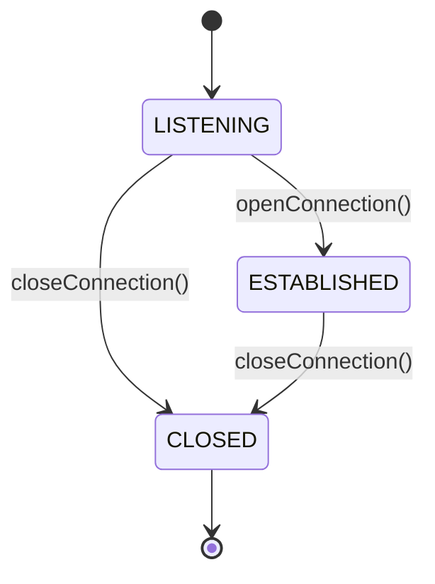

## 6.8.3 Use Cases and Examples

The State Pattern is a behavioral design pattern that allows an object to alter its behavior when its internal state changes. This pattern is particularly useful when dealing with objects that have complex state-dependent behavior. In this section, we will explore practical scenarios where the State Pattern is effectively applied, such as modeling the states of a TCP connection, implementing a vending machine, and managing user authentication states. We will also discuss the benefits and potential challenges of using the State Pattern.

### Understanding the State Pattern

Before diving into specific use cases, let's briefly revisit the core concept of the State Pattern. The pattern involves creating state classes that encapsulate the behavior associated with a particular state of the context object. The context object maintains a reference to an instance of a state subclass, which represents its current state. State transitions are handled by switching the current state object.

#### Key Components of the State Pattern

- **Context**: The object whose behavior varies based on its state. It maintains a reference to an instance of a state subclass.
- **State**: An interface or abstract class defining the behavior associated with a particular state.
- **Concrete States**: Subclasses of the State interface that implement the behavior specific to a state.

### Use Case 1: Modeling TCP Connection States

One classic example of the State Pattern is modeling the states of a TCP connection. A TCP connection can be in various states, such as LISTENING, ESTABLISHED, and CLOSED. Each state has specific behaviors and transitions to other states.

#### Implementing TCP Connection States in TypeScript

Let's implement a simplified version of a TCP connection using the State Pattern in TypeScript.

```typescript
// State interface
interface TCPState {
    openConnection(): void;
    closeConnection(): void;
}

// Context class
class TCPConnection {
    private state: TCPState;

    constructor(initialState: TCPState) {
        this.state = initialState;
    }

    setState(state: TCPState) {
        this.state = state;
    }

    openConnection() {
        this.state.openConnection();
    }

    closeConnection() {
        this.state.closeConnection();
    }
}

// Concrete State: Listening
class ListeningState implements TCPState {
    private connection: TCPConnection;

    constructor(connection: TCPConnection) {
        this.connection = connection;
    }

    openConnection() {
        console.log("Transitioning from LISTENING to ESTABLISHED");
        this.connection.setState(new EstablishedState(this.connection));
    }

    closeConnection() {
        console.log("Closing connection from LISTENING state");
        this.connection.setState(new ClosedState(this.connection));
    }
}

// Concrete State: Established
class EstablishedState implements TCPState {
    private connection: TCPConnection;

    constructor(connection: TCPConnection) {
        this.connection = connection;
    }

    openConnection() {
        console.log("Connection is already ESTABLISHED");
    }

    closeConnection() {
        console.log("Closing connection from ESTABLISHED state");
        this.connection.setState(new ClosedState(this.connection));
    }
}

// Concrete State: Closed
class ClosedState implements TCPState {
    private connection: TCPConnection;

    constructor(connection: TCPConnection) {
        this.connection = connection;
    }

    openConnection() {
        console.log("Cannot open connection from CLOSED state");
    }

    closeConnection() {
        console.log("Connection is already CLOSED");
    }
}

// Usage
const connection = new TCPConnection(new ListeningState(connection));
connection.openConnection(); // Transitioning from LISTENING to ESTABLISHED
connection.closeConnection(); // Closing connection from ESTABLISHED state
```

#### Explanation

In this example, we have defined a `TCPState` interface that declares methods for opening and closing a connection. The `TCPConnection` class acts as the context, maintaining a reference to the current state. We have three concrete state classes: `ListeningState`, `EstablishedState`, and `ClosedState`, each implementing the behavior specific to its state.

### Use Case 2: Implementing a Vending Machine

Another practical application of the State Pattern is in implementing a vending machine. A vending machine can be in different states, such as accepting coins, dispensing a product, or out of order. Each state has distinct behaviors and transitions.

#### Implementing a Vending Machine in TypeScript

Let's implement a vending machine using the State Pattern in TypeScript.

```typescript
// State interface
interface VendingMachineState {
    insertCoin(): void;
    selectProduct(): void;
    dispenseProduct(): void;
}

// Context class
class VendingMachine {
    private state: VendingMachineState;

    constructor(initialState: VendingMachineState) {
        this.state = initialState;
    }

    setState(state: VendingMachineState) {
        this.state = state;
    }

    insertCoin() {
        this.state.insertCoin();
    }

    selectProduct() {
        this.state.selectProduct();
    }

    dispenseProduct() {
        this.state.dispenseProduct();
    }
}

// Concrete State: Accepting Coins
class AcceptingCoinsState implements VendingMachineState {
    private machine: VendingMachine;

    constructor(machine: VendingMachine) {
        this.machine = machine;
    }

    insertCoin() {
        console.log("Coin inserted. You can now select a product.");
        this.machine.setState(new ProductSelectedState(this.machine));
    }

    selectProduct() {
        console.log("Insert a coin first.");
    }

    dispenseProduct() {
        console.log("Insert a coin and select a product first.");
    }
}

// Concrete State: Product Selected
class ProductSelectedState implements VendingMachineState {
    private machine: VendingMachine;

    constructor(machine: VendingMachine) {
        this.machine = machine;
    }

    insertCoin() {
        console.log("Product already selected. Dispensing product.");
        this.machine.setState(new DispensingProductState(this.machine));
    }

    selectProduct() {
        console.log("Product selected. Dispensing product.");
        this.machine.setState(new DispensingProductState(this.machine));
    }

    dispenseProduct() {
        console.log("Dispensing product.");
        this.machine.setState(new AcceptingCoinsState(this.machine));
    }
}

// Concrete State: Dispensing Product
class DispensingProductState implements VendingMachineState {
    private machine: VendingMachine;

    constructor(machine: VendingMachine) {
        this.machine = machine;
    }

    insertCoin() {
        console.log("Please wait, dispensing product.");
    }

    selectProduct() {
        console.log("Please wait, dispensing product.");
    }

    dispenseProduct() {
        console.log("Product dispensed. Thank you!");
        this.machine.setState(new AcceptingCoinsState(this.machine));
    }
}

// Usage
const vendingMachine = new VendingMachine(new AcceptingCoinsState(vendingMachine));
vendingMachine.insertCoin(); // Coin inserted. You can now select a product.
vendingMachine.selectProduct(); // Product selected. Dispensing product.
vendingMachine.dispenseProduct(); // Product dispensed. Thank you!
```

#### Explanation

In this example, we have defined a `VendingMachineState` interface that declares methods for inserting coins, selecting a product, and dispensing a product. The `VendingMachine` class acts as the context, maintaining a reference to the current state. We have three concrete state classes: `AcceptingCoinsState`, `ProductSelectedState`, and `DispensingProductState`, each implementing the behavior specific to its state.

### Use Case 3: Managing User Authentication States

The State Pattern can also be applied to manage user authentication states, such as logged out, logged in, and session expired. Each state has specific behaviors and transitions.

#### Implementing User Authentication States in TypeScript

Let's implement a user authentication system using the State Pattern in TypeScript.

```typescript
// State interface
interface AuthState {
    login(): void;
    logout(): void;
    expireSession(): void;
}

// Context class
class UserSession {
    private state: AuthState;

    constructor(initialState: AuthState) {
        this.state = initialState;
    }

    setState(state: AuthState) {
        this.state = state;
    }

    login() {
        this.state.login();
    }

    logout() {
        this.state.logout();
    }

    expireSession() {
        this.state.expireSession();
    }
}

// Concrete State: Logged Out
class LoggedOutState implements AuthState {
    private session: UserSession;

    constructor(session: UserSession) {
        this.session = session;
    }

    login() {
        console.log("Logging in...");
        this.session.setState(new LoggedInState(this.session));
    }

    logout() {
        console.log("Already logged out.");
    }

    expireSession() {
        console.log("Session cannot expire when logged out.");
    }
}

// Concrete State: Logged In
class LoggedInState implements AuthState {
    private session: UserSession;

    constructor(session: UserSession) {
        this.session = session;
    }

    login() {
        console.log("Already logged in.");
    }

    logout() {
        console.log("Logging out...");
        this.session.setState(new LoggedOutState(this.session));
    }

    expireSession() {
        console.log("Session expired.");
        this.session.setState(new SessionExpiredState(this.session));
    }
}

// Concrete State: Session Expired
class SessionExpiredState implements AuthState {
    private session: UserSession;

    constructor(session: UserSession) {
        this.session = session;
    }

    login() {
        console.log("Session expired. Please log in again.");
        this.session.setState(new LoggedInState(this.session));
    }

    logout() {
        console.log("Logging out from expired session...");
        this.session.setState(new LoggedOutState(this.session));
    }

    expireSession() {
        console.log("Session is already expired.");
    }
}

// Usage
const userSession = new UserSession(new LoggedOutState(userSession));
userSession.login(); // Logging in...
userSession.expireSession(); // Session expired.
userSession.logout(); // Logging out from expired session...
```

#### Explanation

In this example, we have defined an `AuthState` interface that declares methods for logging in, logging out, and expiring a session. The `UserSession` class acts as the context, maintaining a reference to the current state. We have three concrete state classes: `LoggedOutState`, `LoggedInState`, and `SessionExpiredState`, each implementing the behavior specific to its state.

### Benefits of the State Pattern

The State Pattern offers several benefits:

- **Simplifies State Management**: By encapsulating state-specific behavior in separate classes, the State Pattern simplifies the management of complex state-dependent behavior.
- **Improves Code Maintainability**: The pattern promotes separation of concerns, making the code easier to maintain and extend.
- **Facilitates State Transitions**: The pattern makes it easy to add new states and transitions without modifying existing code.

### Potential Challenges

While the State Pattern offers many benefits, it also presents some challenges:

- **Increased Number of Classes**: The pattern can lead to an increased number of classes, which may complicate the codebase.
- **Managing State Transitions**: Careful management of state transitions is required to ensure the correct behavior of the context object.

### When to Use the State Pattern

Consider using the State Pattern when:

- An object has complex state-dependent behavior.
- You want to simplify the management of state-specific behavior.
- You anticipate frequent changes to the state-specific behavior or transitions.

### Try It Yourself

Encourage readers to experiment with the State Pattern by modifying the code examples provided. For instance, try adding new states to the TCP connection, vending machine, or user authentication examples. Experiment with different state transitions and observe how the behavior of the context object changes.

### Visualizing State Transitions

To enhance understanding, let's visualize the state transitions for the TCP connection example using a state diagram.



#### Diagram Explanation

The state diagram above represents the state transitions of a TCP connection. The connection starts in the LISTENING state and can transition to the ESTABLISHED state by opening the connection or to the CLOSED state by closing the connection. Once closed, the connection cannot transition to any other state.

### Summary

The State Pattern is a powerful tool for managing complex state-dependent behavior in software applications. By encapsulating state-specific behavior in separate classes, the pattern simplifies state management, improves code maintainability, and facilitates state transitions. While the pattern may lead to an increased number of classes, its benefits often outweigh this drawback. Consider using the State Pattern when dealing with objects that have complex state-dependent behavior.

## Quiz Time!



### What is the primary benefit of using the State Pattern?

- [x] Simplifies the management of complex state-dependent behavior
- [ ] Reduces the number of classes in the codebase
- [ ] Increases the performance of the application
- [ ] Eliminates the need for state transitions

> **Explanation:** The State Pattern simplifies the management of complex state-dependent behavior by encapsulating state-specific behavior in separate classes.

### In the TCP connection example, what state does the connection transition to after calling `openConnection()` from the LISTENING state?

- [x] ESTABLISHED
- [ ] CLOSED
- [ ] LISTENING
- [ ] None of the above

> **Explanation:** The connection transitions to the ESTABLISHED state after calling `openConnection()` from the LISTENING state.

### Which of the following is a potential challenge of using the State Pattern?

- [x] Increased number of classes
- [ ] Reduced code maintainability
- [ ] Difficulty in adding new states
- [ ] Inability to manage state transitions

> **Explanation:** A potential challenge of using the State Pattern is the increased number of classes, which may complicate the codebase.

### In the vending machine example, what happens when a coin is inserted in the AcceptingCoinsState?

- [x] The state transitions to ProductSelectedState
- [ ] The state transitions to DispensingProductState
- [ ] The state remains in AcceptingCoinsState
- [ ] The product is dispensed immediately

> **Explanation:** When a coin is inserted in the AcceptingCoinsState, the state transitions to ProductSelectedState.

### What is the role of the Context class in the State Pattern?

- [x] Maintains a reference to the current state and delegates behavior to it
- [ ] Defines the behavior associated with each state
- [ ] Manages state transitions directly
- [ ] Acts as an interface for state-specific behavior

> **Explanation:** The Context class maintains a reference to the current state and delegates behavior to it.

### In the user authentication example, what state does the session transition to after calling `expireSession()` from the LoggedInState?

- [x] SessionExpiredState
- [ ] LoggedOutState
- [ ] LoggedInState
- [ ] None of the above

> **Explanation:** The session transitions to SessionExpiredState after calling `expireSession()` from the LoggedInState.

### When should you consider using the State Pattern?

- [x] When an object has complex state-dependent behavior
- [x] When you want to simplify the management of state-specific behavior
- [ ] When you want to reduce the number of classes
- [ ] When you anticipate infrequent changes to state-specific behavior

> **Explanation:** Consider using the State Pattern when an object has complex state-dependent behavior and you want to simplify the management of state-specific behavior.

### What is a key component of the State Pattern?

- [x] Context
- [x] State
- [ ] Singleton
- [ ] Adapter

> **Explanation:** Key components of the State Pattern include the Context and State.

### How does the State Pattern improve code maintainability?

- [x] By promoting separation of concerns
- [ ] By reducing the number of classes
- [ ] By eliminating state transitions
- [ ] By increasing application performance

> **Explanation:** The State Pattern improves code maintainability by promoting separation of concerns.

### True or False: The State Pattern can lead to an increased number of classes in the codebase.

- [x] True
- [ ] False

> **Explanation:** True. The State Pattern can lead to an increased number of classes, which may complicate the codebase.


