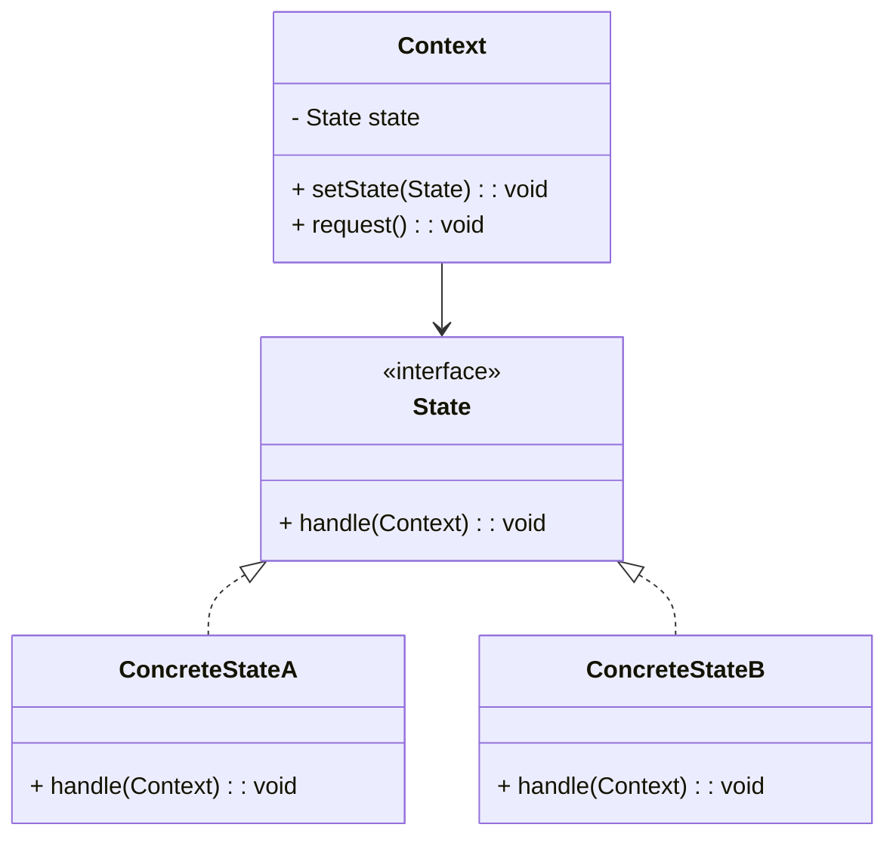
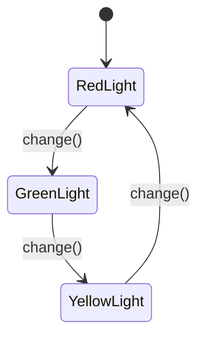

## 6.8 State Pattern

In the realm of software design, managing an object's behavior based on its state can often lead to complex and unwieldy code, especially when using large conditional statements. The State Pattern offers a robust solution to this problem by allowing an object to alter its behavior when its internal state changes, making it appear as though the object changes its class. This pattern is particularly useful in scenarios where an object must change its behavior at runtime depending on its state.

### Understanding the State Pattern

The State Pattern is a behavioral design pattern that encapsulates state-specific behavior and delegates behavior to the current state. It allows an object, known as the **Context**, to change its behavior when its internal state changes. The pattern involves three main components:

- **Context**: This is the class whose behavior changes based on its state. It maintains an instance of a State subclass that defines the current state.
- **State**: An interface or abstract class that defines the state-specific behavior that all ConcreteState classes must implement.
- **ConcreteState**: These are classes that implement the State interface and define behavior specific to a particular state of the Context.

#### Problem Solved by the State Pattern

The primary problem addressed by the State Pattern is the complexity that arises from using large conditional statements to manage state-specific behavior. When an object's behavior is dependent on its state, developers often resort to using `if...else` or `switch` statements to handle different states. This approach can lead to code that is difficult to maintain and extend. The State Pattern provides a cleaner and more scalable solution by organizing code around state-specific behavior, allowing each state to be represented by its own class.

### Key Components of the State Pattern

Let's delve deeper into the key components of the State Pattern and how they interact with each other.

#### Context

The **Context** is the class that maintains an instance of a ConcreteState subclass that defines the current state. It delegates state-specific behavior to the current state object. The Context class is aware of the different states and can switch between them.

```typescript
// Context.ts
class Context {
    private state: State;

    constructor(state: State) {
        this.state = state;
    }

    public setState(state: State): void {
        this.state = state;
    }

    public request(): void {
        this.state.handle(this);
    }
}
```

#### State

The **State** is an interface or abstract class that defines the state-specific behavior that all ConcreteState classes must implement. It declares methods that represent the behavior associated with a particular state.

```typescript
// State.ts
interface State {
    handle(context: Context): void;
}
```

#### ConcreteState

**ConcreteState** classes implement the State interface and define behavior specific to a particular state of the Context. Each ConcreteState class provides its own implementation of the state-specific behavior.

```typescript
// ConcreteStateA.ts
class ConcreteStateA implements State {
    public handle(context: Context): void {
        console.log("ConcreteStateA handles request.");
        context.setState(new ConcreteStateB());
    }
}

// ConcreteStateB.ts
class ConcreteStateB implements State {
    public handle(context: Context): void {
        console.log("ConcreteStateB handles request.");
        context.setState(new ConcreteStateA());
    }
}
```

### Visualizing the State Pattern

To better understand the State Pattern, let's visualize the relationships and state transitions using a UML class diagram.



**Diagram Description**: The diagram illustrates the State Pattern's structure, showing the Context class interacting with the State interface, which is implemented by ConcreteStateA and ConcreteStateB. The Context maintains a reference to a State object and delegates state-specific behavior to it.

### Implementing the State Pattern in TypeScript

Let's walk through a practical example of implementing the State Pattern in TypeScript. We'll create a simple traffic light system that changes its behavior based on its current state.

#### Step 1: Define the State Interface

First, we'll define a `TrafficLightState` interface that declares the `change` method, which each state will implement.

```typescript
// TrafficLightState.ts
interface TrafficLightState {
    change(light: TrafficLight): void;
}
```

#### Step 2: Implement Concrete States

Next, we'll implement the `RedLight`, `GreenLight`, and `YellowLight` classes, each representing a state of the traffic light.

```typescript
// RedLight.ts
class RedLight implements TrafficLightState {
    public change(light: TrafficLight): void {
        console.log("Changing from Red to Green.");
        light.setState(new GreenLight());
    }
}

// GreenLight.ts
class GreenLight implements TrafficLightState {
    public change(light: TrafficLight): void {
        console.log("Changing from Green to Yellow.");
        light.setState(new YellowLight());
    }
}

// YellowLight.ts
class YellowLight implements TrafficLightState {
    public change(light: TrafficLight): void {
        console.log("Changing from Yellow to Red.");
        light.setState(new RedLight());
    }
}
```

#### Step 3: Create the Context Class

Finally, we'll create the `TrafficLight` class, which acts as the Context. It maintains a reference to the current state and delegates state-specific behavior to it.

```typescript
// TrafficLight.ts
class TrafficLight {
    private state: TrafficLightState;

    constructor(initialState: TrafficLightState) {
        this.state = initialState;
    }

    public setState(state: TrafficLightState): void {
        this.state = state;
    }

    public change(): void {
        this.state.change(this);
    }
}
```

#### Step 4: Test the Implementation

Let's test our traffic light system to see how it changes states.

```typescript
// Main.ts
const trafficLight = new TrafficLight(new RedLight());

trafficLight.change(); // Changing from Red to Green.
trafficLight.change(); // Changing from Green to Yellow.
trafficLight.change(); // Changing from Yellow to Red.
```

### Benefits of the State Pattern

The State Pattern offers several advantages that enhance the maintainability and scalability of your code:

- **Encapsulation of State-Specific Behavior**: By encapsulating state-specific behavior in separate classes, the State Pattern promotes clean and organized code.
- **Elimination of Large Conditional Statements**: The pattern eliminates the need for large conditional statements, making the code easier to read and maintain.
- **Ease of Adding New States**: Adding new states is straightforward, as it involves creating a new ConcreteState class without modifying existing code.
- **Improved Maintainability**: By organizing code around state behavior, the pattern makes it easier to manage and extend the system as requirements change.

### TypeScript-Specific Features

TypeScript provides several features that make implementing the State Pattern more efficient and type-safe:

- **Interfaces and Type Safety**: TypeScript's interfaces ensure that all ConcreteState classes implement the required methods, providing compile-time type safety.
- **Classes and Inheritance**: TypeScript's class syntax and inheritance model make it easy to define and extend state-specific behavior.
- **Modules**: TypeScript's module system allows you to organize your state classes into separate files, improving code organization and maintainability.

### Try It Yourself

To deepen your understanding of the State Pattern, try modifying the traffic light example:

- **Add a New State**: Introduce a `FlashingLight` state that alternates between red and yellow.
- **Change State Transition Logic**: Modify the transition logic to skip the yellow state and go directly from green to red.
- **Implement a Timer**: Add a timer to automatically change states after a certain period.

### Visualizing State Transitions

Let's visualize the state transitions in our traffic light system using a state diagram.



**Diagram Description**: This state diagram illustrates the transitions between the RedLight, GreenLight, and YellowLight states in our traffic light system. Each transition is triggered by the `change()` method.

### Knowledge Check

To reinforce your understanding of the State Pattern, consider the following questions:

- How does the State Pattern improve code maintainability compared to using conditional statements?
- What are the key components of the State Pattern, and how do they interact?
- How can you add a new state to a system that uses the State Pattern?

### Conclusion

The State Pattern is a powerful tool for managing state-dependent behavior in a clean and organized manner. By encapsulating state-specific behavior in separate classes, it promotes maintainability and scalability, making it an ideal choice for systems with complex state transitions. As you continue to explore design patterns in TypeScript, remember that the State Pattern is just one of many tools available to help you write more maintainable and scalable code.

Remember, this is just the beginning. As you progress, you'll build more complex and interactive systems. Keep experimenting, stay curious, and enjoy the journey!

## Quiz Time!



### What is the primary problem that the State Pattern addresses?

- [x] Managing state-specific behavior without large conditional statements.
- [ ] Improving performance by reducing memory usage.
- [ ] Simplifying network communication.
- [ ] Enhancing user interface design.

> **Explanation:** The State Pattern addresses the complexity of managing state-specific behavior without resorting to large conditional statements, making the code more maintainable.

### Which component of the State Pattern defines the state-specific behavior?

- [ ] Context
- [x] State
- [ ] ConcreteState
- [ ] Transition

> **Explanation:** The State component is an interface or abstract class that defines the state-specific behavior that all ConcreteState classes must implement.

### How does the State Pattern promote maintainability?

- [x] By encapsulating state-specific behavior in separate classes.
- [ ] By using global variables to manage state.
- [ ] By reducing the number of classes in the system.
- [ ] By eliminating the need for interfaces.

> **Explanation:** The State Pattern promotes maintainability by encapsulating state-specific behavior in separate classes, making the code easier to manage and extend.

### What is the role of the Context class in the State Pattern?

- [x] It maintains an instance of a ConcreteState subclass and delegates behavior to it.
- [ ] It defines the state-specific behavior.
- [ ] It implements the State interface.
- [ ] It handles user input directly.

> **Explanation:** The Context class maintains an instance of a ConcreteState subclass and delegates state-specific behavior to it.

### In the traffic light example, what happens when the `change()` method is called on a `RedLight` state?

- [x] The state changes to `GreenLight`.
- [ ] The state changes to `YellowLight`.
- [ ] The state remains `RedLight`.
- [ ] The traffic light turns off.

> **Explanation:** When the `change()` method is called on a `RedLight` state, the state changes to `GreenLight`, as defined in the `RedLight` class.

### How can you add a new state to a system using the State Pattern?

- [x] Create a new ConcreteState class implementing the State interface.
- [ ] Modify the Context class to include the new state logic.
- [ ] Add a new method to the State interface.
- [ ] Use a switch statement to handle the new state.

> **Explanation:** To add a new state, you create a new ConcreteState class that implements the State interface, without modifying existing code.

### What TypeScript feature ensures that all ConcreteState classes implement the required methods?

- [x] Interfaces
- [ ] Classes
- [ ] Modules
- [ ] Generics

> **Explanation:** TypeScript interfaces ensure that all ConcreteState classes implement the required methods, providing compile-time type safety.

### What is the advantage of using TypeScript's module system in implementing the State Pattern?

- [x] It improves code organization and maintainability.
- [ ] It reduces the need for interfaces.
- [ ] It eliminates the need for classes.
- [ ] It simplifies network communication.

> **Explanation:** TypeScript's module system allows you to organize your state classes into separate files, improving code organization and maintainability.

### True or False: The State Pattern allows an object to change its class dynamically.

- [x] True
- [ ] False

> **Explanation:** True. The State Pattern allows an object to alter its behavior when its internal state changes, making it appear as though the object changes its class.

### Which of the following is NOT a benefit of the State Pattern?

- [ ] Improved maintainability
- [ ] Elimination of large conditional statements
- [x] Increased system performance
- [ ] Ease of adding new states

> **Explanation:** While the State Pattern improves maintainability and eliminates large conditional statements, it does not inherently increase system performance.


