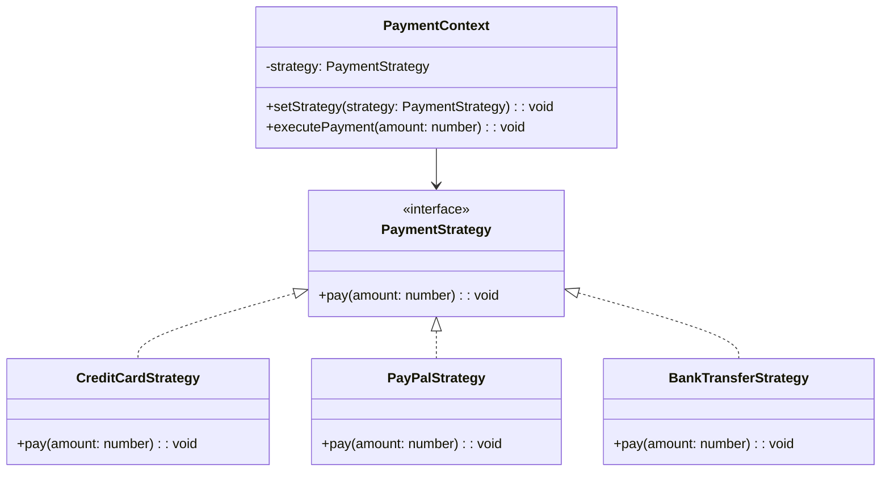

## 6.9.1 Implementing Strategy in TypeScript

The Strategy Pattern is a behavioral design pattern that enables selecting an algorithm's behavior at runtime. It defines a family of algorithms, encapsulates each one, and makes them interchangeable. This pattern is particularly useful when you want to switch between different algorithms dynamically without altering the client code that uses them.

### Understanding the Strategy Pattern

The Strategy Pattern consists of three main components:

1. **Strategy Interface**: Declares a method that all concrete strategies must implement. This method represents the algorithm that can be varied.

2. **Concrete Strategy Classes**: Implement the strategy interface, providing specific algorithms or behaviors.

3. **Context Class**: Maintains a reference to a strategy object and delegates the algorithm's execution to the current strategy. It allows changing the strategy at runtime.

### Implementing Strategy Pattern in TypeScript

Let's dive into implementing the Strategy Pattern in TypeScript. We will create a simple example of a payment processing system that can switch between different payment methods (strategies) such as credit card, PayPal, and bank transfer.

#### Step 1: Define the Strategy Interface

First, we define a `PaymentStrategy` interface that declares the `pay` method. This method will be implemented by all concrete strategies.

```typescript
// PaymentStrategy.ts
export interface PaymentStrategy {
    pay(amount: number): void;
}
```

#### Step 2: Implement Concrete Strategy Classes

Next, we create concrete strategy classes that implement the `PaymentStrategy` interface. Each class will provide a different implementation of the `pay` method.

```typescript
// CreditCardStrategy.ts
import { PaymentStrategy } from './PaymentStrategy';

export class CreditCardStrategy implements PaymentStrategy {
    pay(amount: number): void {
        console.log(`Paying $${amount} using Credit Card.`);
    }
}

// PayPalStrategy.ts
import { PaymentStrategy } from './PaymentStrategy';

export class PayPalStrategy implements PaymentStrategy {
    pay(amount: number): void {
        console.log(`Paying $${amount} using PayPal.`);
    }
}

// BankTransferStrategy.ts
import { PaymentStrategy } from './PaymentStrategy';

export class BankTransferStrategy implements PaymentStrategy {
    pay(amount: number): void {
        console.log(`Paying $${amount} using Bank Transfer.`);
    }
}
```

#### Step 3: Create the Context Class

The `PaymentContext` class will hold a reference to a `PaymentStrategy` and delegate the payment operation to the current strategy. It also provides a method to change the strategy at runtime.

```typescript
// PaymentContext.ts
import { PaymentStrategy } from './PaymentStrategy';

export class PaymentContext {
    private strategy: PaymentStrategy;

    constructor(strategy: PaymentStrategy) {
        this.strategy = strategy;
    }

    setStrategy(strategy: PaymentStrategy): void {
        this.strategy = strategy;
    }

    executePayment(amount: number): void {
        this.strategy.pay(amount);
    }
}
```

#### Step 4: Demonstrate Strategy Switching

Now, let's demonstrate how to use the `PaymentContext` to switch between different payment strategies dynamically.

```typescript
// Main.ts
import { PaymentContext } from './PaymentContext';
import { CreditCardStrategy } from './CreditCardStrategy';
import { PayPalStrategy } from './PayPalStrategy';
import { BankTransferStrategy } from './BankTransferStrategy';

// Initialize context with a credit card strategy
const paymentContext = new PaymentContext(new CreditCardStrategy());
paymentContext.executePayment(100);

// Change strategy to PayPal
paymentContext.setStrategy(new PayPalStrategy());
paymentContext.executePayment(200);

// Change strategy to Bank Transfer
paymentContext.setStrategy(new BankTransferStrategy());
paymentContext.executePayment(300);
```

### Exploring TypeScript's Role in the Strategy Pattern

TypeScript enhances the Strategy Pattern's implementation through its robust type system and interfaces. Here are some key benefits:

- **Type Safety**: TypeScript ensures that all strategies adhere to the `PaymentStrategy` interface, preventing runtime errors due to missing methods.

- **Intellisense and Autocompletion**: With TypeScript, you get better development tools support, including code completion and navigation, which speeds up development.

- **Refactoring**: TypeScript's static typing makes it easier to refactor code, as changes in one part of the codebase are automatically reflected in other parts.

### Managing Dependencies and Ensuring Interface Adherence

When implementing the Strategy Pattern, it's crucial to manage dependencies effectively and ensure that all strategies adhere to the required interface. Here are some best practices:

- **Use Dependency Injection**: Inject strategies into the context class to decouple the context from specific strategy implementations. This approach enhances testability and flexibility.

- **Leverage TypeScript's Interface**: Define clear interfaces for strategies to ensure consistent behavior across different implementations.

- **Test Strategies Independently**: Write unit tests for each strategy to verify that they conform to the expected behavior.

### Visualizing the Strategy Pattern

To better understand the Strategy Pattern, let's visualize the relationships between the components using a class diagram.



**Diagram Description**: This class diagram illustrates the Strategy Pattern's structure, showing the `PaymentStrategy` interface and its concrete implementations. The `PaymentContext` class holds a reference to a `PaymentStrategy` and delegates the payment operation to it.

### Try It Yourself

Experiment with the Strategy Pattern by modifying the code examples:

- **Add a New Payment Method**: Implement a new strategy class, such as `CryptoCurrencyStrategy`, and integrate it into the `PaymentContext`.

- **Enhance the Context Class**: Add logging or validation logic to the `PaymentContext` to track strategy changes or validate payment amounts.

- **Implement Strategy Caching**: Modify the `PaymentContext` to cache strategies and reuse them instead of creating new instances each time.

### Knowledge Check

To reinforce your understanding of the Strategy Pattern, consider these questions:

- How does the Strategy Pattern differ from the State Pattern?
- What are the advantages of using the Strategy Pattern in a large-scale application?
- How can TypeScript's type system prevent common mistakes when implementing the Strategy Pattern?

### Summary

The Strategy Pattern is a powerful tool for designing flexible and maintainable systems. By encapsulating algorithms in separate classes, you can easily switch between different behaviors without modifying client code. TypeScript's type system and interfaces further enhance the pattern's implementation, providing type safety and better development tools support.

Remember, this is just the beginning. As you progress, you'll build more complex and interactive systems using the Strategy Pattern. Keep experimenting, stay curious, and enjoy the journey!

## Quiz Time!



### What is the primary purpose of the Strategy Pattern?

- [x] To define a family of algorithms and make them interchangeable.
- [ ] To encapsulate object creation details.
- [ ] To provide a simplified interface to a complex subsystem.
- [ ] To ensure a class has only one instance.

> **Explanation:** The Strategy Pattern is used to define a family of algorithms, encapsulate each one, and make them interchangeable.

### Which component of the Strategy Pattern holds a reference to a strategy object?

- [x] Context
- [ ] Strategy Interface
- [ ] Concrete Strategy
- [ ] Client

> **Explanation:** The Context class holds a reference to a strategy object and delegates the algorithm's execution to it.

### How does TypeScript enhance the implementation of the Strategy Pattern?

- [x] By providing type safety and ensuring strategies adhere to the required interface.
- [ ] By allowing dynamic typing and runtime type checking.
- [ ] By enabling the use of global variables for strategy selection.
- [ ] By supporting multiple inheritance for strategy classes.

> **Explanation:** TypeScript enhances the Strategy Pattern by providing type safety and ensuring that all strategies adhere to the required interface.

### What method should all concrete strategies implement in the Strategy Pattern?

- [x] The method declared in the Strategy Interface.
- [ ] A method to change the context's state.
- [ ] A method to create new strategy instances.
- [ ] A method to log strategy execution.

> **Explanation:** All concrete strategies must implement the method declared in the Strategy Interface, representing the algorithm.

### What is a key benefit of using the Strategy Pattern?

- [x] It allows switching algorithms dynamically without altering client code.
- [ ] It reduces the number of classes in the application.
- [ ] It eliminates the need for interfaces.
- [ ] It ensures all objects are created through a factory.

> **Explanation:** The Strategy Pattern allows switching algorithms dynamically without altering the client code, providing flexibility.

### Which of the following is NOT a component of the Strategy Pattern?

- [ ] Strategy Interface
- [ ] Concrete Strategy
- [ ] Context
- [x] Singleton

> **Explanation:** The Singleton is not a component of the Strategy Pattern. The Strategy Pattern consists of a Strategy Interface, Concrete Strategies, and a Context.

### How can you change the strategy at runtime in the Strategy Pattern?

- [x] By calling a method in the Context class to set a new strategy.
- [ ] By modifying the Strategy Interface.
- [ ] By creating a new Context instance.
- [ ] By using a global variable to select the strategy.

> **Explanation:** You can change the strategy at runtime by calling a method in the Context class to set a new strategy.

### What is the role of the Context class in the Strategy Pattern?

- [x] To maintain a reference to a strategy and delegate algorithm execution.
- [ ] To implement multiple algorithms.
- [ ] To provide a simplified interface to a complex subsystem.
- [ ] To ensure a class has only one instance.

> **Explanation:** The Context class maintains a reference to a strategy and delegates the algorithm's execution to it.

### Which TypeScript feature helps ensure that all strategies implement the required methods?

- [x] Interfaces
- [ ] Generics
- [ ] Decorators
- [ ] Modules

> **Explanation:** Interfaces in TypeScript help ensure that all strategies implement the required methods, providing type safety.

### True or False: The Strategy Pattern allows for the dynamic selection of algorithms at runtime.

- [x] True
- [ ] False

> **Explanation:** True. The Strategy Pattern allows for the dynamic selection of algorithms at runtime by encapsulating them in separate strategy classes.


