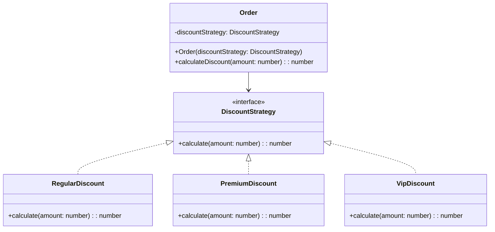

## 6.9.2 Replacing Conditional Logic

In the realm of software development, conditional logic is often necessary to dictate the flow of a program based on varying conditions. However, as applications grow in complexity, so too can the conditional statements that control them. This complexity can lead to code that is difficult to read, maintain, and extend. The Strategy Pattern offers a solution by replacing complex conditional logic with a more structured and modular approach.

### Understanding the Strategy Pattern

The Strategy Pattern is a behavioral design pattern that enables selecting an algorithm's behavior at runtime. Instead of implementing a single algorithm directly, code receives run-time instructions as to which in a family of algorithms to use. This pattern is particularly useful for replacing conditional logic, such as `if-else` or `switch` statements, with a more flexible and maintainable solution.

### The Problem with Conditional Logic

Consider a scenario where a program needs to perform different operations based on user input or other conditions. A common approach is to use conditional statements:

```typescript
function calculateDiscount(orderType: string, amount: number): number {
    if (orderType === 'regular') {
        return amount * 0.05;
    } else if (orderType === 'premium') {
        return amount * 0.10;
    } else if (orderType === 'vip') {
        return amount * 0.15;
    } else {
        return 0;
    }
}
```

While this approach works, it has several drawbacks:

- **Readability**: As the number of conditions increases, the logic becomes harder to follow.
- **Maintainability**: Adding new conditions requires modifying existing code, increasing the risk of introducing bugs.
- **Extensibility**: The code is not easily extendable to accommodate new types of discounts without altering the core logic.

### Refactoring with the Strategy Pattern

The Strategy Pattern can refactor the above logic into a more modular and maintainable form. Here's how we can achieve this:

1. **Define a Strategy Interface**: Create an interface that defines the method(s) each strategy must implement.

```typescript
interface DiscountStrategy {
    calculate(amount: number): number;
}
```

2. **Implement Concrete Strategies**: Create classes that implement the strategy interface for each type of discount.

```typescript
class RegularDiscount implements DiscountStrategy {
    calculate(amount: number): number {
        return amount * 0.05;
    }
}

class PremiumDiscount implements DiscountStrategy {
    calculate(amount: number): number {
        return amount * 0.10;
    }
}

class VipDiscount implements DiscountStrategy {
    calculate(amount: number): number {
        return amount * 0.15;
    }
}
```

3. **Context Class**: Create a context class that uses a strategy instance to perform the calculation.

```typescript
class Order {
    private discountStrategy: DiscountStrategy;

    constructor(discountStrategy: DiscountStrategy) {
        this.discountStrategy = discountStrategy;
    }

    calculateDiscount(amount: number): number {
        return this.discountStrategy.calculate(amount);
    }
}
```

4. **Using the Strategy Pattern**: Now, the client code can select the appropriate strategy at runtime.

```typescript
const orderType = 'premium'; // This could be dynamic
let discountStrategy: DiscountStrategy;

switch (orderType) {
    case 'regular':
        discountStrategy = new RegularDiscount();
        break;
    case 'premium':
        discountStrategy = new PremiumDiscount();
        break;
    case 'vip':
        discountStrategy = new VipDiscount();
        break;
    default:
        throw new Error('Invalid order type');
}

const order = new Order(discountStrategy);
console.log(order.calculateDiscount(1000)); // Outputs: 100
```

### Benefits of Using the Strategy Pattern

#### Improved Readability

By encapsulating each algorithm in its own class, the Strategy Pattern makes the code more readable. Each strategy is responsible for a single task, making it easier to understand and manage.

#### Enhanced Maintainability

The Strategy Pattern promotes the Open/Closed Principle, one of the SOLID principles of object-oriented design. The code is open for extension but closed for modification. To add a new discount type, we simply create a new strategy class without altering existing code.

#### Increased Extensibility

New strategies can be added with minimal impact on the existing system. This modularity makes it easier to adapt to changing requirements or to add new features.

#### Reduced Conditional Complexity

By eliminating complex conditional logic, the Strategy Pattern reduces the cognitive load on developers, allowing them to focus on the specific logic within each strategy.

### Potential Overhead

While the Strategy Pattern offers numerous benefits, it's important to consider the potential overhead introduced by additional classes and interfaces. In scenarios with a small number of conditions, the overhead might outweigh the benefits. However, as complexity increases, the advantages of using the Strategy Pattern become more apparent.

### Visualizing the Strategy Pattern

To better understand the Strategy Pattern, let's visualize its structure:



### Try It Yourself

Experiment with the Strategy Pattern by modifying the code examples:

- **Add a New Discount Type**: Implement a new strategy class for a "super vip" discount that offers a 20% discount.
- **Refactor the Client Code**: Replace the `switch` statement with a more dynamic approach, such as a factory pattern, to select the strategy.
- **Explore Different Contexts**: Use the Strategy Pattern in different scenarios, such as sorting algorithms or payment processing.

### Knowledge Check

- **What are the primary benefits of using the Strategy Pattern?**
- **How does the Strategy Pattern promote the Open/Closed Principle?**
- **What potential overhead should be considered when implementing the Strategy Pattern?**

### Conclusion

The Strategy Pattern is a powerful tool for replacing complex conditional logic with a more structured and maintainable approach. By encapsulating algorithms in separate classes, we can improve code readability, maintainability, and extensibility. While there is some overhead associated with additional classes and interfaces, the benefits often outweigh the costs, particularly in complex systems.

Remember, this is just the beginning. As you progress, you'll build more complex and interactive systems using design patterns. Keep experimenting, stay curious, and enjoy the journey!

## Quiz Time!



### What is the primary purpose of the Strategy Pattern?

- [x] To replace complex conditional logic with a more modular approach
- [ ] To increase the number of classes in a project
- [ ] To reduce the number of interfaces
- [ ] To eliminate the need for algorithms

> **Explanation:** The Strategy Pattern is designed to replace complex conditional logic by encapsulating algorithms in separate classes, making the code more modular and maintainable.

### How does the Strategy Pattern promote the Open/Closed Principle?

- [x] By allowing new strategies to be added without modifying existing code
- [ ] By requiring all strategies to be implemented in a single class
- [ ] By reducing the number of classes in a project
- [ ] By eliminating the need for interfaces

> **Explanation:** The Strategy Pattern promotes the Open/Closed Principle by allowing new strategies to be added through new classes, without altering the existing codebase.

### What is a potential drawback of using the Strategy Pattern?

- [x] Increased number of classes and interfaces
- [ ] Decreased code readability
- [ ] Reduced code maintainability
- [ ] Inability to add new strategies

> **Explanation:** A potential drawback of the Strategy Pattern is the increased number of classes and interfaces, which can introduce overhead.

### In the provided code example, what role does the `Order` class play?

- [x] It acts as the context that uses a strategy instance
- [ ] It implements the discount calculation directly
- [ ] It defines the strategy interface
- [ ] It selects the strategy at runtime

> **Explanation:** The `Order` class acts as the context that uses a strategy instance to perform the discount calculation.

### Which of the following is NOT a benefit of using the Strategy Pattern?

- [ ] Improved code readability
- [ ] Enhanced maintainability
- [ ] Increased extensibility
- [x] Reduced number of classes

> **Explanation:** While the Strategy Pattern improves readability, maintainability, and extensibility, it does not reduce the number of classes; in fact, it may increase them.

### How can new strategies be added in the Strategy Pattern?

- [x] By creating new classes that implement the strategy interface
- [ ] By modifying the existing strategy classes
- [ ] By adding new methods to the context class
- [ ] By using a switch statement

> **Explanation:** New strategies can be added by creating new classes that implement the strategy interface, adhering to the Open/Closed Principle.

### What is the role of the strategy interface in the Strategy Pattern?

- [x] To define the method(s) each strategy must implement
- [ ] To select the strategy at runtime
- [ ] To perform the algorithm directly
- [ ] To reduce the number of classes

> **Explanation:** The strategy interface defines the method(s) each strategy must implement, ensuring consistency across different strategies.

### What is a common use case for the Strategy Pattern?

- [x] Replacing complex conditional logic
- [ ] Reducing the number of classes in a project
- [ ] Eliminating the need for algorithms
- [ ] Decreasing code readability

> **Explanation:** A common use case for the Strategy Pattern is replacing complex conditional logic with a more modular and maintainable approach.

### True or False: The Strategy Pattern eliminates the need for conditional logic entirely.

- [ ] True
- [x] False

> **Explanation:** False. The Strategy Pattern does not eliminate the need for conditional logic entirely; it provides a more structured way to handle it by encapsulating algorithms in separate classes.


