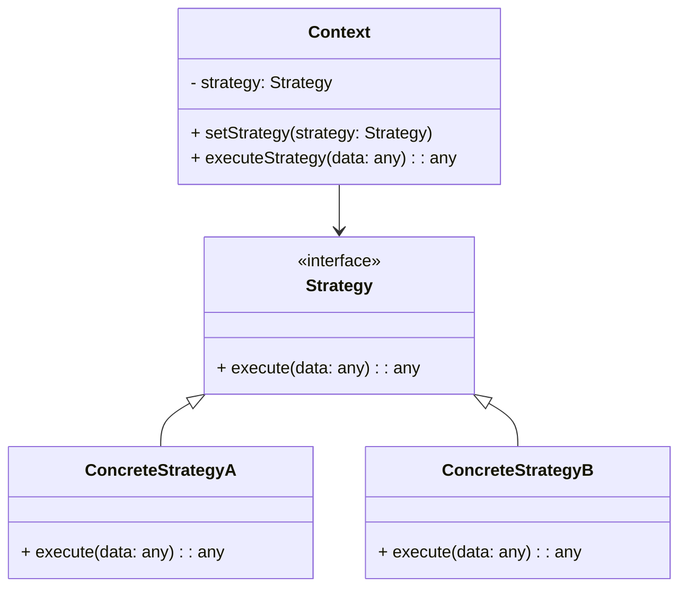

## 6.9.3 Use Cases and Examples

The Strategy Pattern is a powerful design pattern that enables the selection of algorithms at runtime, offering flexibility and enhancing code organization. In this section, we'll delve into practical scenarios where the Strategy Pattern can be effectively applied, such as sorting strategies, payment methods, and compression algorithms. By the end of this section, you'll understand how to leverage the Strategy Pattern to create adaptable and maintainable code in TypeScript.

### Introduction to the Strategy Pattern

The Strategy Pattern defines a family of algorithms, encapsulates each one, and makes them interchangeable. This pattern allows the algorithm to vary independently from the clients that use it. The key components of the Strategy Pattern include:

- **Strategy Interface**: Defines a common interface for all supported algorithms.
- **Concrete Strategies**: Implementations of the Strategy interface, each providing a different algorithm.
- **Context**: Maintains a reference to a Strategy object and delegates the algorithm execution to the Strategy.

### Practical Use Cases

Let's explore some practical use cases where the Strategy Pattern shines:

#### 1. Sorting Algorithms

Sorting is a fundamental operation in computer science, and different algorithms are suited to different types of data. By using the Strategy Pattern, we can allow users to select the most appropriate sorting algorithm based on the data characteristics.

**Example: Implementing Sorting Strategies**

Consider an application that needs to sort large datasets. We can implement different sorting algorithms as strategies and allow the user to choose the best one for their needs.

```typescript
// Strategy Interface
interface SortStrategy {
    sort(data: number[]): number[];
}

// Concrete Strategy: QuickSort
class QuickSort implements SortStrategy {
    sort(data: number[]): number[] {
        // Implement quicksort algorithm
        if (data.length <= 1) return data;
        const pivot = data[0];
        const left = data.slice(1).filter(item => item < pivot);
        const right = data.slice(1).filter(item => item >= pivot);
        return [...this.sort(left), pivot, ...this.sort(right)];
    }
}

// Concrete Strategy: MergeSort
class MergeSort implements SortStrategy {
    sort(data: number[]): number[] {
        // Implement mergesort algorithm
        if (data.length <= 1) return data;
        const middle = Math.floor(data.length / 2);
        const left = data.slice(0, middle);
        const right = data.slice(middle);
        return this.merge(this.sort(left), this.sort(right));
    }

    private merge(left: number[], right: number[]): number[] {
        let result: number[] = [];
        while (left.length && right.length) {
            if (left[0] < right[0]) {
                result.push(left.shift()!);
            } else {
                result.push(right.shift()!);
            }
        }
        return [...result, ...left, ...right];
    }
}

// Context
class SortContext {
    private strategy: SortStrategy;

    constructor(strategy: SortStrategy) {
        this.strategy = strategy;
    }

    setStrategy(strategy: SortStrategy) {
        this.strategy = strategy;
    }

    executeStrategy(data: number[]): number[] {
        return this.strategy.sort(data);
    }
}

// Usage
const data = [34, 7, 23, 32, 5, 62];
const context = new SortContext(new QuickSort());
console.log('QuickSort:', context.executeStrategy(data));

context.setStrategy(new MergeSort());
console.log('MergeSort:', context.executeStrategy(data));
```

**Explanation**: In this example, we define a `SortStrategy` interface and implement two concrete strategies: `QuickSort` and `MergeSort`. The `SortContext` class allows the client to set the desired sorting strategy and execute it. This approach provides flexibility to switch sorting algorithms at runtime based on data characteristics or user preferences.

**Try It Yourself**: Modify the code to add another sorting algorithm, such as Bubble Sort or Insertion Sort, and test how the context switches between different strategies.

#### 2. Payment Methods

In e-commerce applications, supporting multiple payment methods is crucial. The Strategy Pattern can be used to implement various payment strategies, allowing users to choose their preferred payment method.

**Example: Implementing Payment Strategies**

Let's implement different payment methods using the Strategy Pattern.

```typescript
// Strategy Interface
interface PaymentStrategy {
    pay(amount: number): void;
}

// Concrete Strategy: CreditCard
class CreditCardPayment implements PaymentStrategy {
    private cardNumber: string;

    constructor(cardNumber: string) {
        this.cardNumber = cardNumber;
    }

    pay(amount: number): void {
        console.log(`Paid ${amount} using Credit Card: ${this.cardNumber}`);
    }
}

// Concrete Strategy: PayPal
class PayPalPayment implements PaymentStrategy {
    private email: string;

    constructor(email: string) {
        this.email = email;
    }

    pay(amount: number): void {
        console.log(`Paid ${amount} using PayPal: ${this.email}`);
    }
}

// Concrete Strategy: Cryptocurrency
class CryptoPayment implements PaymentStrategy {
    private walletAddress: string;

    constructor(walletAddress: string) {
        this.walletAddress = walletAddress;
    }

    pay(amount: number): void {
        console.log(`Paid ${amount} using Cryptocurrency: ${this.walletAddress}`);
    }
}

// Context
class PaymentContext {
    private strategy: PaymentStrategy;

    constructor(strategy: PaymentStrategy) {
        this.strategy = strategy;
    }

    setStrategy(strategy: PaymentStrategy) {
        this.strategy = strategy;
    }

    executePayment(amount: number): void {
        this.strategy.pay(amount);
    }
}

// Usage
const paymentContext = new PaymentContext(new CreditCardPayment('1234-5678-9012-3456'));
paymentContext.executePayment(100);

paymentContext.setStrategy(new PayPalPayment('user@example.com'));
paymentContext.executePayment(200);

paymentContext.setStrategy(new CryptoPayment('1A2b3C4d5E6f7G8h9I0j'));
paymentContext.executePayment(300);
```

**Explanation**: We define a `PaymentStrategy` interface and implement three concrete strategies: `CreditCardPayment`, `PayPalPayment`, and `CryptoPayment`. The `PaymentContext` class allows the client to set the desired payment strategy and execute the payment. This approach provides flexibility to support various payment methods and switch between them at runtime.

**Try It Yourself**: Add another payment method, such as bank transfer, and integrate it into the payment context.

#### 3. Compression Algorithms

Data compression is essential for efficient storage and transmission. Different compression algorithms are suited to different types of data. The Strategy Pattern can be used to implement various compression strategies, allowing users to choose the most suitable one.

**Example: Implementing Compression Strategies**

Let's implement different compression algorithms using the Strategy Pattern.

```typescript
// Strategy Interface
interface CompressionStrategy {
    compress(data: string): string;
}

// Concrete Strategy: ZipCompression
class ZipCompression implements CompressionStrategy {
    compress(data: string): string {
        // Simulate zip compression
        return `ZipCompressed(${data})`;
    }
}

// Concrete Strategy: RarCompression
class RarCompression implements CompressionStrategy {
    compress(data: string): string {
        // Simulate rar compression
        return `RarCompressed(${data})`;
    }
}

// Concrete Strategy: GzipCompression
class GzipCompression implements CompressionStrategy {
    compress(data: string): string {
        // Simulate gzip compression
        return `GzipCompressed(${data})`;
    }
}

// Context
class CompressionContext {
    private strategy: CompressionStrategy;

    constructor(strategy: CompressionStrategy) {
        this.strategy = strategy;
    }

    setStrategy(strategy: CompressionStrategy) {
        this.strategy = strategy;
    }

    executeCompression(data: string): string {
        return this.strategy.compress(data);
    }
}

// Usage
const compressionContext = new CompressionContext(new ZipCompression());
console.log(compressionContext.executeCompression('SampleData'));

compressionContext.setStrategy(new RarCompression());
console.log(compressionContext.executeCompression('SampleData'));

compressionContext.setStrategy(new GzipCompression());
console.log(compressionContext.executeCompression('SampleData'));
```

**Explanation**: We define a `CompressionStrategy` interface and implement three concrete strategies: `ZipCompression`, `RarCompression`, and `GzipCompression`. The `CompressionContext` class allows the client to set the desired compression strategy and execute the compression. This approach provides flexibility to choose different compression algorithms based on data characteristics or user preferences.

**Try It Yourself**: Implement another compression algorithm, such as Bzip2, and integrate it into the compression context.

### Considerations for Using the Strategy Pattern

When implementing the Strategy Pattern, consider the following:

- **Strategy Selection**: Determine how strategies will be selected at runtime. This can be based on user preferences, data characteristics, or other runtime conditions.
- **Performance**: Consider the performance implications of switching strategies at runtime. Some strategies may be more computationally intensive than others.
- **Extensibility**: The Strategy Pattern makes it easy to add new strategies without modifying existing code, enhancing the system's extensibility.
- **Code Organization**: By encapsulating algorithms in separate classes, the Strategy Pattern improves code organization and readability.

### Visualizing the Strategy Pattern

To better understand the Strategy Pattern, let's visualize its components and interactions using a class diagram.



**Diagram Explanation**: The `Context` class maintains a reference to a `Strategy` object and delegates the algorithm execution to it. The `Strategy` interface defines a common interface for all supported algorithms, and `ConcreteStrategyA` and `ConcreteStrategyB` are implementations of this interface.

### Encouragement to Use the Strategy Pattern

The Strategy Pattern is a versatile design pattern that provides flexibility and improves code organization. Consider using the Strategy Pattern when you need to interchange algorithms at runtime, such as in sorting, payment processing, or data compression scenarios. By encapsulating algorithms in separate classes, you can enhance the maintainability and extensibility of your codebase.

### Knowledge Check

Let's reinforce what we've learned with a few questions:

- What are the key components of the Strategy Pattern?
- How does the Strategy Pattern improve code organization?
- Why is the Strategy Pattern useful for implementing sorting algorithms?
- How can the Strategy Pattern be used to support multiple payment methods?
- What are some considerations when using the Strategy Pattern?

### Conclusion

The Strategy Pattern is a powerful tool for creating flexible and maintainable code. By encapsulating algorithms in separate classes, you can easily interchange them at runtime, providing users with the ability to choose the most suitable algorithm for their needs. Whether you're implementing sorting algorithms, payment methods, or compression techniques, the Strategy Pattern can help you create adaptable and organized code.

## Quiz Time!



### What is the primary benefit of using the Strategy Pattern?

- [x] It allows algorithms to be interchangeable at runtime.
- [ ] It reduces the number of classes in a system.
- [ ] It eliminates the need for interfaces.
- [ ] It simplifies the implementation of singleton classes.

> **Explanation:** The Strategy Pattern enables algorithms to be interchangeable at runtime, providing flexibility and improving code organization.

### In the context of the Strategy Pattern, what is the role of the Context class?

- [x] It maintains a reference to a Strategy object and delegates algorithm execution.
- [ ] It implements the algorithm directly.
- [ ] It defines the interface for all supported algorithms.
- [ ] It provides a user interface for selecting strategies.

> **Explanation:** The Context class maintains a reference to a Strategy object and delegates the algorithm execution to it.

### How does the Strategy Pattern enhance code organization?

- [x] By encapsulating algorithms in separate classes.
- [ ] By reducing the number of methods in a class.
- [ ] By eliminating the need for inheritance.
- [ ] By combining multiple algorithms into a single class.

> **Explanation:** The Strategy Pattern enhances code organization by encapsulating algorithms in separate classes, making the code more modular and maintainable.

### Which of the following is a practical use case for the Strategy Pattern?

- [x] Implementing different sorting algorithms.
- [ ] Creating a single instance of a class.
- [ ] Managing object lifecycles.
- [ ] Defining a class hierarchy.

> **Explanation:** The Strategy Pattern is useful for implementing different sorting algorithms, allowing them to be interchangeable at runtime.

### What is a consideration when using the Strategy Pattern?

- [x] Strategy selection based on runtime conditions.
- [ ] Reducing the number of interfaces.
- [ ] Avoiding the use of abstract classes.
- [ ] Minimizing the use of polymorphism.

> **Explanation:** When using the Strategy Pattern, consider how strategies will be selected at runtime, such as based on user preferences or data characteristics.

### How can the Strategy Pattern be applied to payment methods in an e-commerce application?

- [x] By implementing different payment strategies and allowing users to choose their preferred method.
- [ ] By creating a single payment method class.
- [ ] By using inheritance to define payment methods.
- [ ] By hardcoding payment methods in the application.

> **Explanation:** The Strategy Pattern can be applied to payment methods by implementing different payment strategies and allowing users to choose their preferred method.

### Why is the Strategy Pattern useful for data compression?

- [x] It allows different compression algorithms to be interchangeable based on data characteristics.
- [ ] It reduces the size of data.
- [ ] It eliminates the need for data storage.
- [ ] It simplifies the implementation of compression algorithms.

> **Explanation:** The Strategy Pattern is useful for data compression because it allows different compression algorithms to be interchangeable based on data characteristics.

### What is a key component of the Strategy Pattern?

- [x] Strategy Interface
- [ ] Singleton Class
- [ ] Abstract Factory
- [ ] Composite Object

> **Explanation:** The Strategy Interface is a key component of the Strategy Pattern, defining a common interface for all supported algorithms.

### How does the Strategy Pattern improve extensibility?

- [x] By allowing new strategies to be added without modifying existing code.
- [ ] By reducing the number of classes in a system.
- [ ] By eliminating the need for interfaces.
- [ ] By combining multiple algorithms into a single class.

> **Explanation:** The Strategy Pattern improves extensibility by allowing new strategies to be added without modifying existing code, enhancing the system's flexibility.

### True or False: The Strategy Pattern can only be used for sorting algorithms.

- [ ] True
- [x] False

> **Explanation:** False. The Strategy Pattern can be used for various scenarios, including sorting algorithms, payment methods, and compression techniques.



Remember, the Strategy Pattern is just one of many design patterns that can help you create flexible and maintainable code. Keep experimenting, stay curious, and enjoy the journey of mastering design patterns in TypeScript!
