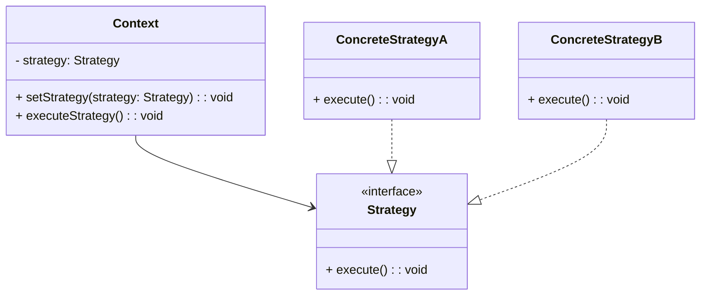
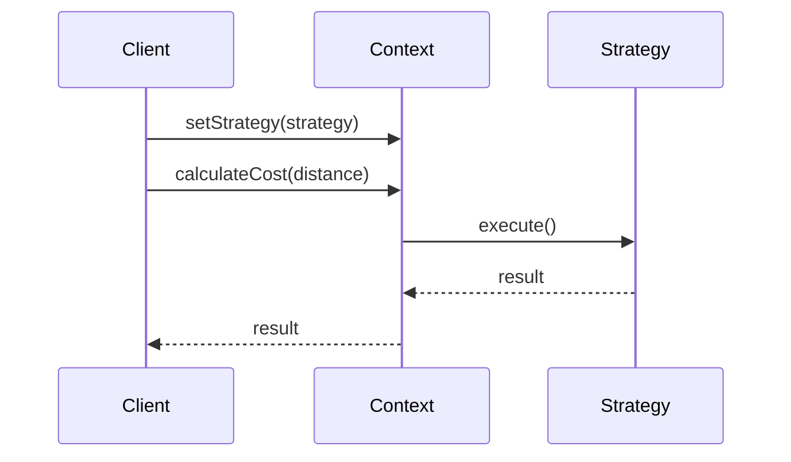

## 6.9 Strategy Pattern

In the realm of software design, the Strategy Pattern stands out as a beacon of flexibility and adaptability. It allows developers to define a family of algorithms, encapsulate each one, and make them interchangeable, thereby enabling clients to choose an algorithm at runtime. This pattern is particularly useful in scenarios where multiple algorithms are applicable to a problem, and the choice of algorithm might change based on the context.

### Understanding the Strategy Pattern

The Strategy Pattern is a behavioral design pattern that defines a set of algorithms, encapsulates each algorithm, and makes them interchangeable. The key idea is to separate the algorithm from the host class, allowing the algorithm to be selected and changed independently of the host class. This separation of concerns promotes flexibility and adheres to the Open/Closed Principle, which states that software entities should be open for extension but closed for modification.

#### Intent of the Strategy Pattern

The primary intent of the Strategy Pattern is to enable the selection of an algorithm at runtime. By encapsulating algorithms in separate classes, the Strategy Pattern allows for easy swapping of algorithms without altering the client code. This design pattern is particularly beneficial in scenarios where different algorithms are needed based on varying conditions or inputs.

### Problems Solved by the Strategy Pattern

The Strategy Pattern addresses several common software design challenges:

1. **Avoiding Conditional Statements**: In many applications, the choice of algorithm is determined by a series of conditional statements. This can lead to complex and hard-to-maintain code. The Strategy Pattern eliminates the need for these conditionals by encapsulating each algorithm in its own class.

2. **Enhancing Flexibility**: By encapsulating algorithms, the Strategy Pattern allows for easy addition of new algorithms without modifying existing code. This promotes flexibility and scalability in software design.

3. **Adhering to the Open/Closed Principle**: The Strategy Pattern enables software entities to be open for extension (by adding new strategies) but closed for modification (existing strategies remain unchanged).

### Key Components of the Strategy Pattern

To fully grasp the Strategy Pattern, it's essential to understand its key components:

- **Strategy**: This is an interface that defines the algorithm. It provides a common interface for all concrete strategies, allowing them to be interchangeable.

- **ConcreteStrategy**: These are classes that implement the Strategy interface. Each ConcreteStrategy class encapsulates a specific algorithm.

- **Context**: This is a class that maintains a reference to a Strategy object. The Context class delegates the execution of the algorithm to the Strategy object.

Below is a diagram illustrating the relationships between these components:



### Implementing the Strategy Pattern in TypeScript

Let's delve into a practical example to illustrate the Strategy Pattern in TypeScript. We'll create a simple application that calculates the cost of a trip using different transportation strategies.

#### Step 1: Define the Strategy Interface

First, we define the `Strategy` interface. This interface declares a method for calculating the cost of a trip.

```typescript
// Strategy.ts
export interface Strategy {
    calculateCost(distance: number): number;
}
```

#### Step 2: Implement Concrete Strategies

Next, we implement the `ConcreteStrategy` classes. Each class provides a specific algorithm for calculating the cost based on the mode of transportation.

```typescript
// CarStrategy.ts
import { Strategy } from './Strategy';

export class CarStrategy implements Strategy {
    calculateCost(distance: number): number {
        const costPerMile = 0.5;
        return distance * costPerMile;
    }
}

// TrainStrategy.ts
import { Strategy } from './Strategy';

export class TrainStrategy implements Strategy {
    calculateCost(distance: number): number {
        const costPerMile = 0.3;
        return distance * costPerMile;
    }
}

// PlaneStrategy.ts
import { Strategy } from './Strategy';

export class PlaneStrategy implements Strategy {
    calculateCost(distance: number): number {
        const costPerMile = 1.0;
        return distance * costPerMile;
    }
}
```

#### Step 3: Create the Context Class

The `Context` class maintains a reference to a `Strategy` object and delegates the execution of the algorithm to the Strategy object.

```typescript
// TravelContext.ts
import { Strategy } from './Strategy';

export class TravelContext {
    private strategy: Strategy;

    constructor(strategy: Strategy) {
        this.strategy = strategy;
    }

    setStrategy(strategy: Strategy): void {
        this.strategy = strategy;
    }

    calculateCost(distance: number): number {
        return this.strategy.calculateCost(distance);
    }
}
```

#### Step 4: Use the Strategy Pattern

Finally, we can use the Strategy Pattern to calculate the cost of a trip using different strategies.

```typescript
// main.ts
import { TravelContext } from './TravelContext';
import { CarStrategy } from './CarStrategy';
import { TrainStrategy } from './TrainStrategy';
import { PlaneStrategy } from './PlaneStrategy';

const distance = 100; // Distance in miles

const carStrategy = new CarStrategy();
const trainStrategy = new TrainStrategy();
const planeStrategy = new PlaneStrategy();

const travelContext = new TravelContext(carStrategy);
console.log(`Car travel cost: $${travelContext.calculateCost(distance)}`);

travelContext.setStrategy(trainStrategy);
console.log(`Train travel cost: $${travelContext.calculateCost(distance)}`);

travelContext.setStrategy(planeStrategy);
console.log(`Plane travel cost: $${travelContext.calculateCost(distance)}`);
```

### Promoting Flexibility and Adherence to the Open/Closed Principle

The Strategy Pattern promotes flexibility by allowing algorithms to be selected and changed at runtime. This flexibility is achieved by encapsulating algorithms in separate classes, making them interchangeable. Moreover, the Strategy Pattern adheres to the Open/Closed Principle by enabling the addition of new strategies without modifying existing code.

### Visualizing the Strategy Pattern

To further enhance our understanding, let's visualize the flow of the Strategy Pattern using a sequence diagram:



### Try It Yourself

To gain a deeper understanding of the Strategy Pattern, try modifying the code examples provided. Here are a few suggestions:

- **Add a New Strategy**: Implement a new strategy, such as `BicycleStrategy`, and integrate it into the existing code.
- **Modify the Cost Calculation**: Change the cost calculation logic in one of the strategies and observe the impact on the output.
- **Experiment with Different Distances**: Test the application with different distances to see how the cost varies.

### Knowledge Check

Before moving on, let's reinforce our understanding with a few questions:

- What is the primary intent of the Strategy Pattern?
- How does the Strategy Pattern promote flexibility in software design?
- What are the key components of the Strategy Pattern?

### Embrace the Journey

Remember, mastering design patterns is a journey. As you continue to explore and experiment with the Strategy Pattern, you'll gain a deeper understanding of its benefits and applications. Keep experimenting, stay curious, and enjoy the journey!

### References and Links

For further reading on the Strategy Pattern and design patterns in general, consider exploring the following resources:

- [Design Patterns: Elements of Reusable Object-Oriented Software](https://en.wikipedia.org/wiki/Design_Patterns) by Erich Gamma, Richard Helm, Ralph Johnson, and John Vlissides.
- [MDN Web Docs: JavaScript Design Patterns](https://developer.mozilla.org/en-US/docs/Web/JavaScript/Guide/Design_Patterns)
- [Refactoring Guru: Strategy Pattern](https://refactoring.guru/design-patterns/strategy)

## Quiz Time!



### What is the primary intent of the Strategy Pattern?

- [x] To enable the selection of an algorithm at runtime.
- [ ] To encapsulate data within a class.
- [ ] To provide a simplified interface to a complex subsystem.
- [ ] To manage object creation.

> **Explanation:** The Strategy Pattern allows for the selection of an algorithm at runtime by encapsulating algorithms in separate classes.

### How does the Strategy Pattern promote flexibility?

- [x] By allowing algorithms to be selected and changed at runtime.
- [ ] By providing a single interface for multiple implementations.
- [ ] By reducing the number of classes in a system.
- [ ] By enforcing a strict hierarchy of classes.

> **Explanation:** The Strategy Pattern promotes flexibility by enabling algorithms to be selected and changed at runtime, allowing for easy extension and modification.

### What are the key components of the Strategy Pattern?

- [x] Strategy, ConcreteStrategy, Context
- [ ] Singleton, Factory, Adapter
- [ ] Observer, Subject, Event
- [ ] Facade, Subsystem, Client

> **Explanation:** The key components of the Strategy Pattern are the Strategy interface, ConcreteStrategy classes, and the Context class.

### Which principle does the Strategy Pattern adhere to?

- [x] Open/Closed Principle
- [ ] Single Responsibility Principle
- [ ] Liskov Substitution Principle
- [ ] Interface Segregation Principle

> **Explanation:** The Strategy Pattern adheres to the Open/Closed Principle by allowing new strategies to be added without modifying existing code.

### What is the role of the Context class in the Strategy Pattern?

- [x] To maintain a reference to a Strategy object and delegate execution.
- [ ] To define the algorithm interface.
- [ ] To implement specific algorithms.
- [ ] To manage object creation.

> **Explanation:** The Context class maintains a reference to a Strategy object and delegates the execution of the algorithm to the Strategy object.

### How can new algorithms be added in the Strategy Pattern?

- [x] By implementing new ConcreteStrategy classes.
- [ ] By modifying the Context class.
- [ ] By adding new methods to the Strategy interface.
- [ ] By creating new subclasses of the Context class.

> **Explanation:** New algorithms can be added by implementing new ConcreteStrategy classes that adhere to the Strategy interface.

### What problem does the Strategy Pattern solve in terms of conditional statements?

- [x] It eliminates the need for complex conditional statements to select algorithms.
- [ ] It simplifies the creation of new objects.
- [ ] It reduces the number of classes in a system.
- [ ] It provides a single interface for multiple implementations.

> **Explanation:** The Strategy Pattern eliminates the need for complex conditional statements by encapsulating each algorithm in its own class.

### How does the Strategy Pattern adhere to the Open/Closed Principle?

- [x] By allowing new strategies to be added without modifying existing code.
- [ ] By enforcing a strict hierarchy of classes.
- [ ] By providing a single interface for multiple implementations.
- [ ] By reducing the number of classes in a system.

> **Explanation:** The Strategy Pattern adheres to the Open/Closed Principle by enabling the addition of new strategies without modifying existing code.

### What is the benefit of encapsulating algorithms in separate classes?

- [x] It allows for easy swapping and extension of algorithms.
- [ ] It reduces the number of classes in a system.
- [ ] It simplifies the creation of new objects.
- [ ] It provides a single interface for multiple implementations.

> **Explanation:** Encapsulating algorithms in separate classes allows for easy swapping and extension of algorithms, promoting flexibility and scalability.

### True or False: The Strategy Pattern is a structural design pattern.

- [ ] True
- [x] False

> **Explanation:** The Strategy Pattern is a behavioral design pattern, not a structural one.


