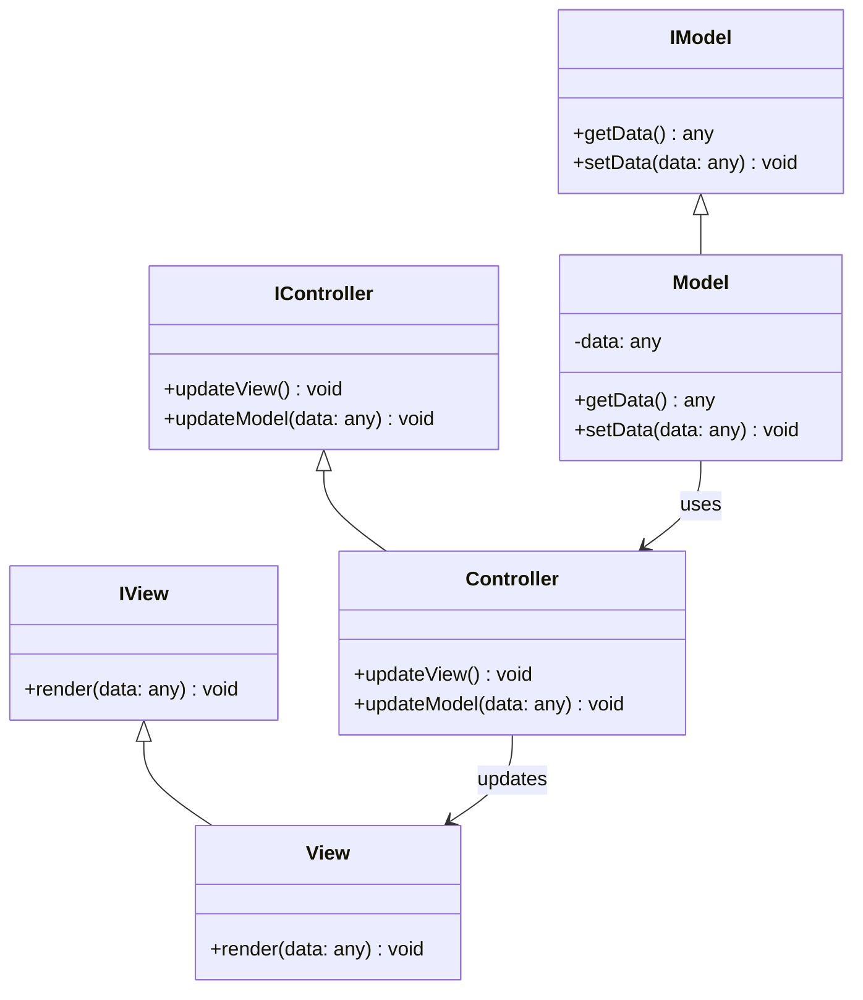

## 7.1.2 Separating Concerns

In the realm of software engineering, the principle of **Separation of Concerns (SoC)** is a fundamental concept that advocates for dividing a program into distinct sections, each addressing a separate concern. This principle is particularly vital in the **Model-View-Controller (MVC)** architecture, where it plays a crucial role in enhancing modularity, facilitating collaborative development, and improving code maintainability. In this section, we will delve into the intricacies of SoC within the MVC framework, explore its benefits, and demonstrate how to effectively implement it using TypeScript.

### Understanding Separation of Concerns

Separation of Concerns is about organizing code in such a way that each part of the application addresses a specific aspect of the functionality. In MVC, this translates to dividing the application into three interconnected components:

- **Model**: Manages the data and business logic.
- **View**: Handles the presentation layer and user interface.
- **Controller**: Acts as an intermediary, processing user input and updating the Model and View accordingly.

By clearly delineating these components, developers can work on different parts of the application simultaneously without stepping on each other's toes, thereby reducing the risk of conflicts and enhancing productivity.

### Benefits of Separation of Concerns

#### Modularity and Maintainability

One of the primary advantages of SoC is increased modularity. By isolating different concerns, each module can be developed, tested, and maintained independently. This modularity simplifies the process of updating or replacing parts of the application without affecting others, thereby enhancing maintainability.

#### Parallel Development

In a collaborative environment, SoC allows multiple developers to work on different components concurrently. For instance, while one developer focuses on the Model, another can work on the View, and yet another on the Controller. This parallelism accelerates development and reduces bottlenecks.

#### Enhanced Readability

A well-structured application with clear boundaries between components is easier to read and understand. This clarity is crucial for onboarding new team members and for long-term maintenance.

#### Improved Testing

With concerns separated, testing becomes more straightforward. Each component can be tested in isolation, ensuring that individual parts function correctly before integrating them into the whole system. This isolation also facilitates the use of mock objects and stubs, making unit testing more effective.

### Implementing Separation of Concerns in TypeScript

TypeScript, with its robust type system and object-oriented features, provides several tools to enforce SoC in MVC applications. Let's explore some techniques and best practices for achieving this separation.

#### Using Interfaces

Interfaces in TypeScript define contracts that classes must adhere to, ensuring consistency across components. By defining interfaces for the Model, View, and Controller, we can enforce clear boundaries and facilitate communication between components.

```typescript
// Define an interface for the Model
interface IModel {
  data: any;
  getData(): any;
  setData(data: any): void;
}

// Define an interface for the View
interface IView {
  render(data: any): void;
}

// Define an interface for the Controller
interface IController {
  updateView(): void;
  updateModel(data: any): void;
}
```

These interfaces ensure that each component adheres to a predefined structure, making it easier to swap implementations without affecting other parts of the application.

#### Strict Access Modifiers

TypeScript's access modifiers (`public`, `private`, `protected`) help encapsulate the internal state of components, preventing unauthorized access and modifications. By using these modifiers judiciously, we can enforce separation and protect the integrity of each component.

```typescript
class Model implements IModel {
  private data: any;

  getData(): any {
    return this.data;
  }

  setData(data: any): void {
    this.data = data;
  }
}
```

In this example, the `data` property is private, ensuring that it can only be accessed and modified through the `getData` and `setData` methods.

### Potential Issues with Poor Separation

Failing to adequately separate concerns can lead to several issues, including:

- **Tight Coupling**: When components are too dependent on each other, changes in one part can ripple through the entire application, making it fragile and difficult to maintain.
- **Code Duplication**: Without clear boundaries, similar logic may be implemented in multiple places, leading to redundancy and inconsistencies.
- **Complexity**: Mixing concerns can result in complex, monolithic code that is hard to understand and modify.

### Techniques for Enforcing Separation

To maintain clear boundaries between components, consider the following techniques:

- **Use Dependency Injection**: Inject dependencies into components rather than hard-coding them. This approach decouples components and makes them easier to test and maintain.
- **Apply the Single Responsibility Principle (SRP)**: Ensure that each component has a single responsibility, making it easier to manage and understand.
- **Leverage Design Patterns**: Patterns like Observer, Strategy, and Factory can help organize code and enforce separation.

### Testing with Separation of Concerns

Testing is a critical aspect of software development, and SoC makes it more manageable. By isolating components, we can create focused tests that verify the functionality of each part independently.

#### Unit Testing Example

Consider a simple unit test for the Model component:

```typescript
import { Model } from './Model';

describe('Model', () => {
  it('should store and retrieve data', () => {
    const model = new Model();
    model.setData('test data');
    expect(model.getData()).toBe('test data');
  });
});
```

This test verifies that the Model can store and retrieve data correctly, independent of the View and Controller.

### Maintaining Clear Boundaries in Complex Applications

As applications grow in complexity, maintaining clear boundaries between components becomes increasingly challenging. Here are some strategies to help:

- **Regular Code Reviews**: Conduct regular reviews to ensure that components adhere to their responsibilities and that boundaries are respected.
- **Refactor Regularly**: Refactor code to improve structure and maintain separation. Use tools like linters to enforce coding standards.
- **Document Interfaces**: Clearly document the interfaces and contracts between components to prevent misunderstandings and misuse.

### Try It Yourself

To solidify your understanding of SoC in MVC, try modifying the code examples provided. Experiment with adding new methods to the interfaces, implementing additional components, or refactoring existing code to improve separation. This hands-on approach will deepen your comprehension and prepare you for real-world applications.

### Visualizing Separation of Concerns

To better understand how SoC works in MVC, let's visualize the interaction between components using a class diagram.



This diagram illustrates the relationships between the Model, View, and Controller, highlighting how they interact while maintaining clear boundaries.

### References and Further Reading

For more information on Separation of Concerns and MVC architecture, consider exploring the following resources:

- [MDN Web Docs on MVC](https://developer.mozilla.org/en-US/docs/Glossary/MVC)
- [TypeScript Handbook](https://www.typescriptlang.org/docs/handbook/intro.html)
- [Design Patterns: Elements of Reusable Object-Oriented Software](https://en.wikipedia.org/wiki/Design_Patterns)

### Knowledge Check

Before moving on, consider these questions to test your understanding:

1. What are the primary components of the MVC architecture?
2. How does Separation of Concerns enhance modularity?
3. Why is it important to use interfaces in TypeScript for enforcing SoC?
4. What are some potential issues that arise from poor separation of concerns?
5. How does SoC facilitate testing in software development?

### Embrace the Journey

Remember, mastering the principle of Separation of Concerns is a journey. As you continue to apply these concepts in your projects, you'll find that your code becomes more organized, maintainable, and scalable. Keep experimenting, stay curious, and enjoy the process of becoming a more proficient software engineer!

## Quiz Time!



### What is the primary goal of Separation of Concerns in MVC architecture?

- [x] To divide the application into distinct sections for modularity
- [ ] To increase the complexity of the application
- [ ] To reduce the number of components
- [ ] To eliminate the need for testing

> **Explanation:** Separation of Concerns aims to divide the application into distinct sections, each addressing a separate concern, to enhance modularity and maintainability.

### Which component in MVC architecture is responsible for managing data and business logic?

- [x] Model
- [ ] View
- [ ] Controller
- [ ] Router

> **Explanation:** The Model component is responsible for managing the data and business logic of the application.

### How does Separation of Concerns facilitate parallel development?

- [x] By allowing developers to work on different components simultaneously
- [ ] By reducing the number of developers needed
- [ ] By merging all components into one
- [ ] By eliminating the need for interfaces

> **Explanation:** Separation of Concerns allows developers to work on different components simultaneously without causing conflicts, facilitating parallel development.

### What is a potential issue that arises from poor separation of concerns?

- [x] Tight coupling between components
- [ ] Increased modularity
- [ ] Easier testing
- [ ] Simplified code

> **Explanation:** Poor separation of concerns can lead to tight coupling between components, making the application fragile and difficult to maintain.

### Which TypeScript feature helps enforce separation by defining contracts for components?

- [x] Interfaces
- [ ] Classes
- [ ] Variables
- [ ] Functions

> **Explanation:** Interfaces in TypeScript define contracts that classes must adhere to, ensuring consistency and enforcing separation between components.

### How does SoC aid in testing?

- [x] By allowing components to be tested in isolation
- [ ] By eliminating the need for tests
- [ ] By merging test cases
- [ ] By increasing test complexity

> **Explanation:** Separation of Concerns allows components to be tested in isolation, ensuring that individual parts function correctly before integrating them into the whole system.

### What is a technique for maintaining clear boundaries between components?

- [x] Using Dependency Injection
- [ ] Hard-coding dependencies
- [ ] Merging all components
- [ ] Ignoring access modifiers

> **Explanation:** Using Dependency Injection decouples components and makes them easier to test and maintain, helping to maintain clear boundaries.

### What does the Single Responsibility Principle (SRP) ensure in the context of SoC?

- [x] Each component has a single responsibility
- [ ] Each component has multiple responsibilities
- [ ] Components are tightly coupled
- [ ] Components are merged into one

> **Explanation:** The Single Responsibility Principle ensures that each component has a single responsibility, making it easier to manage and understand.

### What is the role of the Controller in MVC architecture?

- [x] Acts as an intermediary, processing user input and updating the Model and View
- [ ] Manages the data and business logic
- [ ] Handles the presentation layer
- [ ] Eliminates the need for a Model

> **Explanation:** The Controller acts as an intermediary, processing user input and updating the Model and View accordingly.

### True or False: Separation of Concerns reduces code readability.

- [ ] True
- [x] False

> **Explanation:** Separation of Concerns enhances code readability by organizing the code into distinct sections, each addressing a specific aspect of the functionality.


