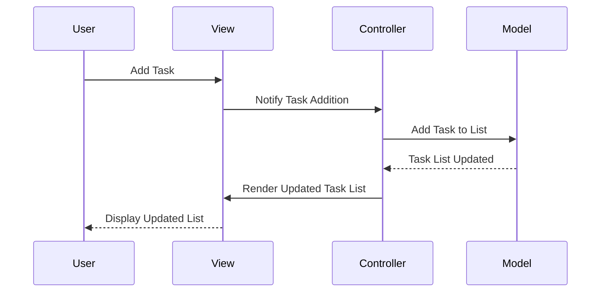

## 7.1.3 Use Cases and Examples

The Model-View-Controller (MVC) pattern is a cornerstone in software architecture, particularly in web development. It provides a structured approach to building applications by separating concerns into three interconnected components: Model, View, and Controller. This separation facilitates scalability, maintainability, and testability, making MVC an ideal choice for complex web applications and single-page applications (SPAs). In this section, we'll explore real-world scenarios where MVC is effectively applied, discuss its advantages, and provide examples and case studies to illustrate its impact.

### Understanding MVC in Modern Web Development

Before diving into specific use cases, let's briefly revisit the MVC pattern's core components:

- **Model**: Represents the application's data and business logic. It is responsible for managing the data, responding to requests for information, and updating the data based on instructions from the Controller.
- **View**: Displays the data to the user. It is the user interface of the application, rendering the Model's data in a format suitable for interaction.
- **Controller**: Acts as an intermediary between the Model and the View. It processes user input, interacts with the Model, and updates the View accordingly.

The MVC pattern's primary advantage is its ability to separate concerns, allowing developers to work on different components independently. This separation is particularly beneficial in modern web development, where applications are becoming increasingly complex and data-intensive.

### Use Cases for MVC in Web Applications

#### 1. Traditional Web Applications

Traditional web applications, where each user interaction results in a new page being loaded from the server, can benefit significantly from the MVC pattern. In such applications, the MVC architecture helps manage the complexity of handling multiple user interactions and data updates.

**Example**: An e-commerce website with features like product browsing, shopping cart management, and order processing can leverage MVC to separate the concerns of data management (Model), user interface (View), and user interaction (Controller). This separation allows developers to update the user interface without affecting the underlying data logic and vice versa.

#### 2. Single-Page Applications (SPAs)

Single-page applications (SPAs) are web applications that load a single HTML page and dynamically update the content as the user interacts with the app. SPAs are known for providing a seamless user experience, similar to desktop applications.

**Example**: A social media platform where users can post updates, comment, and like posts without reloading the page can utilize the MVC pattern to manage the complexity of real-time data updates and user interactions. The Controller can handle user actions, such as posting a comment, by updating the Model, which in turn updates the View to reflect the new data.

#### 3. Data-Intensive Applications

Applications that handle large volumes of data or require complex data manipulation can benefit from the MVC pattern's ability to separate data management from the user interface.

**Example**: A financial dashboard that displays real-time stock market data can use MVC to manage the data flow and ensure that the user interface remains responsive. The Model can handle data fetching and processing, while the View updates the charts and graphs based on the processed data.

### Case Studies: MVC in Action

#### Case Study 1: E-commerce Platform

An e-commerce company faced challenges with their monolithic application, which was difficult to maintain and scale. By adopting the MVC pattern, they were able to separate the product catalog (Model), the user interface (View), and the business logic for processing orders (Controller). This separation allowed the development team to work on different components simultaneously, improving the application's scalability and maintainability.

#### Case Study 2: Real-Time Collaboration Tool

A startup developing a real-time collaboration tool for remote teams implemented the MVC pattern to manage the complexity of real-time data updates and user interactions. The Controller handled user actions such as editing a document, while the Model managed the document's data. The View updated in real-time to reflect changes made by multiple users, providing a seamless collaboration experience.

### Comparing MVC with Other Architectural Patterns

While MVC is a powerful architectural pattern, it's essential to consider other patterns and their suitability for specific use cases. Let's compare MVC with a few other popular patterns:

#### 1. Model-View-ViewModel (MVVM)

MVVM is similar to MVC but introduces the ViewModel, which acts as an intermediary between the View and the Model. MVVM is particularly useful in applications that require complex data binding, such as desktop applications or SPAs with rich user interfaces.

**When to Choose MVC**: MVC is a better choice when you need a clear separation between the user interface and business logic, and when data binding is not a primary concern.

#### 2. Flux and Redux

Flux and Redux are architectural patterns used primarily in JavaScript applications to manage state. They provide a unidirectional data flow, which can simplify state management in complex applications.

**When to Choose MVC**: MVC is more suitable for applications where the separation of concerns is more critical than state management. It provides a more straightforward approach to managing user interactions and data updates.

#### 3. Microservices Architecture

Microservices architecture divides an application into small, independent services that communicate over a network. This pattern is ideal for large-scale applications that require high scalability and flexibility.

**When to Choose MVC**: MVC is more appropriate for applications where the primary focus is on separating the user interface from the business logic, rather than dividing the application into independent services.

### Encouraging MVC in TypeScript Projects

For TypeScript developers, the MVC pattern offers several advantages, including improved scalability, maintainability, and testability. By separating concerns, developers can focus on specific components without worrying about the impact on other parts of the application. This separation also facilitates collaboration, as different team members can work on the Model, View, and Controller simultaneously.

When dealing with complex user interfaces and data-intensive applications, consider adopting the MVC pattern in your TypeScript projects. Its ability to manage complexity and improve code organization makes it an excellent choice for modern web development.

### Try It Yourself: Implementing MVC in TypeScript

Let's explore a simple example of implementing the MVC pattern in a TypeScript application. We'll create a basic to-do list application with the following components:

- **Model**: Manages the list of tasks.
- **View**: Displays the tasks to the user.
- **Controller**: Handles user interactions and updates the Model and View.

```typescript
// Model
class TaskModel {
  private tasks: string[] = [];

  addTask(task: string): void {
    this.tasks.push(task);
  }

  removeTask(index: number): void {
    this.tasks.splice(index, 1);
  }

  getTasks(): string[] {
    return this.tasks;
  }
}

// View
class TaskView {
  private taskListElement: HTMLElement;

  constructor(taskListElementId: string) {
    this.taskListElement = document.getElementById(taskListElementId)!;
  }

  render(tasks: string[]): void {
    this.taskListElement.innerHTML = tasks
      .map((task, index) => `<li>${task} <button data-index="${index}">Remove</button></li>`)
      .join('');
  }
}

// Controller
class TaskController {
  private model: TaskModel;
  private view: TaskView;

  constructor(model: TaskModel, view: TaskView) {
    this.model = model;
    this.view = view;

    this.view.render(this.model.getTasks());
    this.bindEvents();
  }

  private bindEvents(): void {
    document.getElementById('addTaskButton')!.addEventListener('click', () => {
      const taskInput = document.getElementById('taskInput') as HTMLInputElement;
      if (taskInput.value) {
        this.model.addTask(taskInput.value);
        this.view.render(this.model.getTasks());
        taskInput.value = '';
      }
    });

    this.view.taskListElement.addEventListener('click', (event: Event) => {
      const target = event.target as HTMLElement;
      if (target.tagName === 'BUTTON') {
        const index = parseInt(target.getAttribute('data-index')!, 10);
        this.model.removeTask(index);
        this.view.render(this.model.getTasks());
      }
    });
  }
}

// Usage
const model = new TaskModel();
const view = new TaskView('taskList');
const controller = new TaskController(model, view);
```

### Visualizing MVC in a To-Do List Application

To better understand how the MVC components interact, let's visualize the flow of data and control in our to-do list application.



In this sequence diagram, we see how user interactions flow through the View to the Controller, which updates the Model and then instructs the View to render the updated data.

### Knowledge Check

- How does the MVC pattern help manage complexity in web applications?
- What are the primary components of the MVC pattern, and what are their responsibilities?
- How does the MVC pattern differ from MVVM and Flux/Redux?
- Why is the MVC pattern particularly suitable for SPAs?
- How can TypeScript developers benefit from using the MVC pattern in their projects?

### Conclusion

The MVC pattern is a powerful architectural tool for managing complexity in modern web applications. By separating concerns into Model, View, and Controller, developers can build scalable, maintainable, and testable applications. Whether you're developing a traditional web application, a single-page application, or a data-intensive application, consider adopting the MVC pattern to improve your project's organization and efficiency.

Remember, this is just the beginning. As you progress, you'll build more complex and interactive applications. Keep experimenting, stay curious, and enjoy the journey!

## Quiz Time!



### What are the main components of the MVC pattern?

- [x] Model, View, Controller
- [ ] Model, View, Component
- [ ] Model, View, Connector
- [ ] Model, View, Compiler

> **Explanation:** The MVC pattern consists of three main components: Model, View, and Controller.

### Which component of the MVC pattern is responsible for handling user input?

- [ ] Model
- [ ] View
- [x] Controller
- [ ] Compiler

> **Explanation:** The Controller is responsible for handling user input and updating the Model and View accordingly.

### In which type of application is the MVC pattern particularly beneficial?

- [x] Single-Page Applications (SPAs)
- [ ] Command-Line Applications
- [ ] Static Websites
- [ ] Desktop Applications

> **Explanation:** The MVC pattern is particularly beneficial in Single-Page Applications (SPAs) due to its ability to manage complex user interactions and data updates.

### How does the MVC pattern improve code maintainability?

- [x] By separating concerns into Model, View, and Controller
- [ ] By using a single file for all code
- [ ] By avoiding the use of classes
- [ ] By minimizing the use of functions

> **Explanation:** The MVC pattern improves code maintainability by separating concerns into Model, View, and Controller, allowing developers to work on different components independently.

### Which architectural pattern is similar to MVC but introduces a ViewModel?

- [ ] Flux
- [ ] Microservices
- [x] Model-View-ViewModel (MVVM)
- [ ] Event-Driven Architecture

> **Explanation:** Model-View-ViewModel (MVVM) is similar to MVC but introduces a ViewModel to act as an intermediary between the View and the Model.

### What is the primary advantage of using MVC in data-intensive applications?

- [x] Separation of data management from the user interface
- [ ] Simplification of database queries
- [ ] Reduction of code size
- [ ] Elimination of bugs

> **Explanation:** The primary advantage of using MVC in data-intensive applications is the separation of data management from the user interface, allowing for better organization and scalability.

### How does the MVC pattern facilitate collaboration among developers?

- [x] By allowing different team members to work on Model, View, and Controller simultaneously
- [ ] By requiring all developers to work on a single file
- [ ] By eliminating the need for version control
- [ ] By using a proprietary programming language

> **Explanation:** The MVC pattern facilitates collaboration by allowing different team members to work on the Model, View, and Controller simultaneously, reducing dependencies and conflicts.

### What is a key difference between MVC and Flux/Redux?

- [ ] MVC focuses on state management, while Flux/Redux focuses on separating concerns
- [x] MVC separates concerns, while Flux/Redux focuses on state management
- [ ] MVC is used for desktop applications, while Flux/Redux is used for web applications
- [ ] MVC is more suitable for small projects, while Flux/Redux is for large projects

> **Explanation:** A key difference is that MVC focuses on separating concerns, while Flux/Redux focuses on managing state in applications.

### Which component of the MVC pattern is responsible for displaying data to the user?

- [ ] Model
- [x] View
- [ ] Controller
- [ ] Compiler

> **Explanation:** The View component is responsible for displaying data to the user in the MVC pattern.

### True or False: The MVC pattern is only suitable for web applications.

- [ ] True
- [x] False

> **Explanation:** False. While the MVC pattern is commonly used in web applications, it can be applied to other types of applications, including desktop and mobile applications, where separation of concerns is beneficial.


