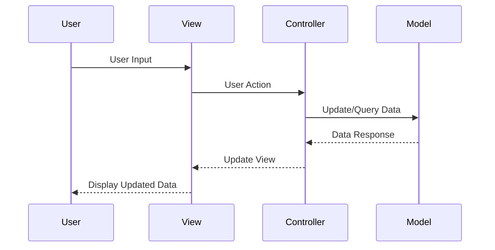
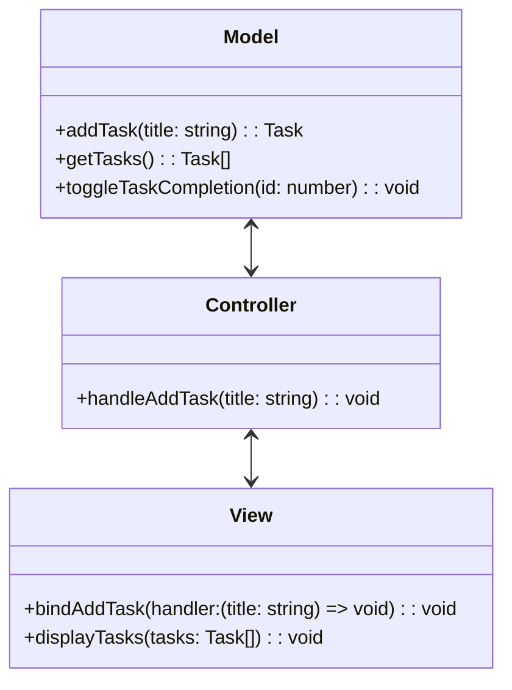

## 7.1 Model-View-Controller (MVC) Pattern

The Model-View-Controller (MVC) pattern is a fundamental architectural design pattern that divides an application into three interconnected components: Model, View, and Controller. This separation of concerns enhances modularity, facilitates parallel development, and improves maintainability and scalability. In this section, we will delve into the MVC pattern, explore its components, and demonstrate how it can be implemented in TypeScript.

### Understanding the MVC Pattern

The MVC pattern is designed to separate an application into three main components:

1. **Model**: The Model represents the data and the business logic of the application. It is responsible for managing the data, responding to requests for information about its state, and responding to instructions to change state. The Model is independent of the user interface, allowing it to be reused across different views.

2. **View**: The View is the user interface of the application. It displays data from the Model to the user and sends user commands to the Controller. The View is responsible for rendering the data and providing a way for the user to interact with the application.

3. **Controller**: The Controller acts as an intermediary between the Model and the View. It listens to the input from the View, processes it (often by updating the Model), and returns the output display to the View. The Controller interprets the user input and makes calls to model objects to retrieve data or change the state.

### Separation of Concerns

The MVC pattern promotes the separation of concerns by dividing responsibilities among the Model, View, and Controller components. This separation allows developers to focus on one aspect of the application at a time, making it easier to manage complexity and maintain the codebase. It also enables parallel development, as different team members can work on different components simultaneously without interfering with each other.

### Data and Control Flow in MVC

The flow of data and control within the MVC architecture can be visualized as follows:



In this flow:

- The user interacts with the View, which sends user input to the Controller.
- The Controller processes the input, often by making changes to the Model.
- The Model updates its state and notifies the Controller of any changes.
- The Controller updates the View with the new data from the Model.
- The View renders the updated data to the user.

### Benefits of MVC

The MVC pattern offers several benefits:

- **Improved Maintainability**: By separating concerns, MVC makes it easier to manage and maintain the codebase. Changes to one component can be made independently of others.
- **Scalability**: MVC supports the development of large-scale applications by organizing code into manageable components.
- **Multiple Views**: The same data can be presented in different ways by creating multiple views, without changing the underlying model.
- **Parallel Development**: Teams can work on different components simultaneously, speeding up the development process.

### Implementing MVC in TypeScript

Let's explore how MVC can be implemented in TypeScript with a simple example of a Todo application.

#### Model

The Model represents the data and business logic. In our Todo application, the Model will manage a list of tasks.

```typescript
// Model.ts
export interface Task {
  id: number;
  title: string;
  completed: boolean;
}

export class TodoModel {
  private tasks: Task[] = [];
  private nextId: number = 1;

  addTask(title: string): Task {
    const newTask: Task = { id: this.nextId++, title, completed: false };
    this.tasks.push(newTask);
    return newTask;
  }

  getTasks(): Task[] {
    return this.tasks;
  }

  toggleTaskCompletion(id: number): void {
    const task = this.tasks.find(task => task.id === id);
    if (task) {
      task.completed = !task.completed;
    }
  }
}
```

In this example, the `TodoModel` class manages a list of tasks, allowing tasks to be added and toggled between completed and not completed.

#### View

The View is responsible for rendering the user interface and capturing user input.

```typescript
// View.ts
export class TodoView {
  private app: HTMLElement;
  private input: HTMLInputElement;
  private taskList: HTMLElement;

  constructor() {
    this.app = document.getElementById('app')!;
    this.input = document.createElement('input');
    this.taskList = document.createElement('ul');
    this.app.append(this.input, this.taskList);
  }

  bindAddTask(handler: (title: string) => void): void {
    this.input.addEventListener('keypress', event => {
      if (event.key === 'Enter' && this.input.value) {
        handler(this.input.value);
        this.input.value = '';
      }
    });
  }

  displayTasks(tasks: Task[]): void {
    this.taskList.innerHTML = '';
    tasks.forEach(task => {
      const li = document.createElement('li');
      li.textContent = task.title;
      this.taskList.appendChild(li);
    });
  }
}
```

The `TodoView` class creates the UI elements and provides methods to bind user actions and display tasks.

#### Controller

The Controller connects the Model and the View, handling user input and updating the Model.

```typescript
// Controller.ts
import { TodoModel, Task } from './Model';
import { TodoView } from './View';

export class TodoController {
  private model: TodoModel;
  private view: TodoView;

  constructor(model: TodoModel, view: TodoView) {
    this.model = model;
    this.view = view;

    this.view.bindAddTask(this.handleAddTask.bind(this));
    this.view.displayTasks(this.model.getTasks());
  }

  handleAddTask(title: string): void {
    this.model.addTask(title);
    this.view.displayTasks(this.model.getTasks());
  }
}
```

The `TodoController` class initializes the Model and View, binds user actions, and updates the View when the Model changes.

### Challenges and Best Practices

Implementing MVC in TypeScript comes with its own set of challenges and best practices:

- **Complexity Management**: As applications grow, managing dependencies and interactions between components can become complex. Use dependency injection and interfaces to decouple components.
- **State Management**: Ensure that the Model accurately reflects the application's state. Consider using state management libraries for complex applications.
- **Testing**: Write unit tests for each component to ensure they work independently. Use mocking frameworks to isolate components during testing.
- **Type Safety**: Leverage TypeScript's static typing to enforce contracts between components and catch errors early.

### Try It Yourself

Experiment with the provided code examples by:

- Adding a method to remove tasks from the Model and updating the View accordingly.
- Implementing a feature to mark tasks as completed in the View.
- Extending the application with additional features, such as task filtering or sorting.

### Visualizing MVC Architecture

To better understand the MVC architecture, let's visualize the interaction between components:



This diagram illustrates the relationships between the Model, View, and Controller components, highlighting the flow of data and control.

### Conclusion

The Model-View-Controller (MVC) pattern is a powerful architectural pattern that promotes separation of concerns, improves maintainability, and supports scalable application development. By implementing MVC in TypeScript, developers can leverage TypeScript's features to create robust and type-safe applications. Remember, this is just the beginning. As you progress, you'll build more complex and interactive applications. Keep experimenting, stay curious, and enjoy the journey!

## Quiz Time!



### What is the primary purpose of the MVC pattern?

- [x] To separate an application into three interconnected components for better modularity.
- [ ] To combine all application logic into a single component.
- [ ] To improve the visual design of an application.
- [ ] To eliminate the need for a user interface.

> **Explanation:** The MVC pattern separates an application into Model, View, and Controller components to enhance modularity and maintainability.

### Which component of the MVC pattern is responsible for managing the data and business logic?

- [x] Model
- [ ] View
- [ ] Controller
- [ ] User Interface

> **Explanation:** The Model is responsible for managing the data and business logic of the application.

### In the MVC pattern, which component acts as an intermediary between the Model and the View?

- [ ] Model
- [ ] View
- [x] Controller
- [ ] User Interface

> **Explanation:** The Controller acts as an intermediary between the Model and the View, processing user input and updating the Model.

### What is one of the key benefits of using the MVC pattern?

- [x] Improved code maintainability
- [ ] Reduced application size
- [ ] Faster development time
- [ ] Enhanced visual design

> **Explanation:** The MVC pattern improves code maintainability by separating concerns and organizing code into manageable components.

### How does the MVC pattern facilitate parallel development?

- [x] By allowing different team members to work on different components simultaneously.
- [ ] By combining all components into a single module.
- [ ] By eliminating the need for a user interface.
- [ ] By reducing the number of components in the application.

> **Explanation:** The MVC pattern allows different team members to work on the Model, View, and Controller components simultaneously, facilitating parallel development.

### Which TypeScript feature is particularly useful in implementing the MVC pattern?

- [x] Static typing
- [ ] Dynamic typing
- [ ] Inline styles
- [ ] Global variables

> **Explanation:** TypeScript's static typing is useful in implementing the MVC pattern as it enforces contracts between components and catches errors early.

### What is a common challenge when implementing MVC in TypeScript?

- [x] Managing dependencies and interactions between components
- [ ] Writing inline styles
- [ ] Using global variables
- [ ] Eliminating all user input

> **Explanation:** Managing dependencies and interactions between components can become complex as applications grow, making it a common challenge when implementing MVC.

### What is the role of the View component in the MVC pattern?

- [ ] To manage the data and business logic
- [x] To display data and capture user input
- [ ] To act as an intermediary between the Model and the Controller
- [ ] To eliminate the need for a user interface

> **Explanation:** The View component is responsible for displaying data and capturing user input in the MVC pattern.

### What is a best practice when testing MVC components in TypeScript?

- [x] Write unit tests for each component to ensure they work independently.
- [ ] Combine all components into a single test case.
- [ ] Use global variables for all tests.
- [ ] Avoid testing the Model component.

> **Explanation:** Writing unit tests for each component ensures they work independently and helps catch errors early.

### The MVC pattern allows for multiple views of the same data. True or False?

- [x] True
- [ ] False

> **Explanation:** The MVC pattern allows for multiple views of the same data by separating the Model from the View, enabling different presentations of the same data.


