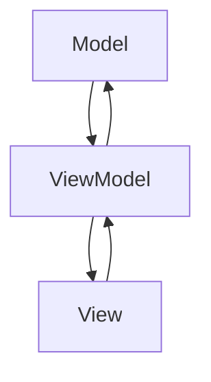

## 7.2.1 Implementing MVVM in TypeScript

The Model-View-ViewModel (MVVM) pattern is a powerful architectural pattern that separates the development of the graphical user interface from the business logic and data. This separation enhances testability, maintainability, and scalability of applications. In this section, we'll explore how to implement the MVVM pattern in TypeScript using Angular, a popular framework that naturally supports MVVM architecture.

### Understanding MVVM

Before diving into implementation, let's briefly revisit the core components of the MVVM pattern:

- **Model**: Represents the data and business logic of the application. It is responsible for managing the data and ensuring its integrity.
- **View**: The user interface that displays the data. It is typically a visual representation of the model.
- **ViewModel**: Acts as an intermediary between the View and the Model. It retrieves data from the Model and formats it for the View. The ViewModel also handles user input and updates the Model accordingly.

### Setting Up an MVVM Architecture in Angular

Angular is a TypeScript-based framework that provides robust support for the MVVM pattern. It offers features like two-way data binding, dependency injection, and component-based architecture, which align well with MVVM principles.

#### Step 1: Setting Up Your Angular Project

To get started, ensure you have Node.js and Angular CLI installed. You can create a new Angular project using the following command:

```bash
ng new mvvm-example
cd mvvm-example
```

This command sets up a new Angular project with a default structure.

#### Step 2: Defining the Model

In Angular, models are typically simple TypeScript classes or interfaces. They define the shape and structure of the data. Here's an example of a `User` model:

```typescript
export interface User {
  id: number;
  name: string;
  email: string;
}
```

#### Step 3: Creating the View

The View in Angular is defined using HTML templates. Angular's data binding capabilities allow you to bind data from the ViewModel to the View seamlessly. Here's an example of a simple user list view:

```html
<!-- user-list.component.html -->
<div *ngFor="let user of users">
  <h3>{{ user.name }}</h3>
  <p>{{ user.email }}</p>
</div>
```

#### Step 4: Implementing the ViewModel

The ViewModel in Angular is typically implemented as a component class. It manages the data and logic for the view. Here's an example of a `UserListComponent`:

```typescript
// user-list.component.ts
import { Component, OnInit } from '@angular/core';
import { User } from './user.model';
import { UserService } from './user.service';

@Component({
  selector: 'app-user-list',
  templateUrl: './user-list.component.html',
  styleUrls: ['./user-list.component.css']
})
export class UserListComponent implements OnInit {
  users: User[] = [];

  constructor(private userService: UserService) {}

  ngOnInit(): void {
    this.userService.getUsers().subscribe(users => this.users = users);
  }
}
```

In this example, `UserListComponent` acts as the ViewModel. It retrieves data from a `UserService` and exposes it to the view.

### Leveraging TypeScript Features

TypeScript enhances MVVM implementation with features like strong typing and decorators. Let's explore how these features can be utilized:

#### Strong Typing

TypeScript's static typing helps catch errors at compile time, making your code more robust. By defining interfaces for your models, you ensure that your components use data correctly.

#### Decorators

Angular uses decorators extensively to define components, services, and other constructs. Decorators provide metadata that Angular uses to configure and instantiate these constructs. For example, the `@Component` decorator is used to define a component:

```typescript
@Component({
  selector: 'app-user-list',
  templateUrl: './user-list.component.html',
  styleUrls: ['./user-list.component.css']
})
```

### Data Binding and Dependency Injection

Angular's two-way data binding and dependency injection are key features that support MVVM architecture.

#### Two-Way Data Binding

Two-way data binding allows for automatic synchronization between the View and the ViewModel. This means that changes in the View are reflected in the ViewModel and vice versa. Angular achieves this through its `[(ngModel)]` directive.

#### Dependency Injection

Angular's dependency injection system allows you to inject services into your components. This promotes loose coupling and enhances testability. For example, the `UserService` is injected into the `UserListComponent`:

```typescript
constructor(private userService: UserService) {}
```

### Handling Component Lifecycle and State Management

Angular components have a lifecycle that consists of various hooks, such as `ngOnInit`, `ngOnChanges`, and `ngOnDestroy`. These hooks allow you to manage component state and perform actions at specific points in the component's lifecycle.

#### Managing State in the ViewModel

State management is crucial in MVVM architecture. The ViewModel should manage the state of the application and ensure that the View is updated whenever the state changes. In Angular, you can use services or state management libraries like NgRx to manage state.

### Structuring Your MVVM Project

A well-structured project enhances maintainability and scalability. Here's a suggested folder structure for an Angular MVVM project:

```
src/
  app/
    models/
      user.model.ts
    services/
      user.service.ts
    components/
      user-list/
        user-list.component.ts
        user-list.component.html
        user-list.component.css
```

### Testing MVVM Components

Testing is an integral part of software development. In MVVM architecture, you should focus on testing the ViewModel and services. Angular provides tools like Jasmine and Karma for unit testing.

#### Unit Testing the ViewModel

Here's an example of a unit test for the `UserListComponent`:

```typescript
import { TestBed, ComponentFixture } from '@angular/core/testing';
import { UserListComponent } from './user-list.component';
import { UserService } from './user.service';
import { of } from 'rxjs';

describe('UserListComponent', () => {
  let component: UserListComponent;
  let fixture: ComponentFixture<UserListComponent>;
  let userService: jasmine.SpyObj<UserService>;

  beforeEach(() => {
    const userServiceSpy = jasmine.createSpyObj('UserService', ['getUsers']);

    TestBed.configureTestingModule({
      declarations: [UserListComponent],
      providers: [{ provide: UserService, useValue: userServiceSpy }]
    });

    fixture = TestBed.createComponent(UserListComponent);
    component = fixture.componentInstance;
    userService = TestBed.inject(UserService) as jasmine.SpyObj<UserService>;
  });

  it('should fetch users on init', () => {
    const mockUsers = [{ id: 1, name: 'John Doe', email: 'john@example.com' }];
    userService.getUsers.and.returnValue(of(mockUsers));

    fixture.detectChanges();

    expect(component.users).toEqual(mockUsers);
  });
});
```

### Try It Yourself

Experiment with the code examples provided. Try adding new features, such as editing user details or adding a search functionality. This hands-on approach will deepen your understanding of the MVVM pattern in Angular.

### Visualizing MVVM Architecture

To better understand the flow of data and interaction between components in MVVM, let's visualize the architecture using a diagram.



**Diagram Description**: This diagram illustrates the MVVM architecture. The Model provides data to the ViewModel, which in turn updates the View. The View can send user interactions back to the ViewModel, which then updates the Model.

### Key Takeaways

- The MVVM pattern separates concerns, making applications more maintainable and testable.
- Angular's features like two-way data binding and dependency injection align well with MVVM principles.
- TypeScript enhances MVVM implementation with strong typing and decorators.
- A well-structured project and comprehensive testing are crucial for successful MVVM implementation.

### References and Further Reading

- [Angular Documentation](https://angular.io/docs)
- [TypeScript Handbook](https://www.typescriptlang.org/docs/handbook/intro.html)
- [MVVM Pattern](https://en.wikipedia.org/wiki/Model%E2%80%93view%E2%80%93viewmodel)

### Embrace the Journey

Remember, implementing MVVM in TypeScript with Angular is just the beginning. As you continue to explore and experiment, you'll discover new ways to enhance your applications. Stay curious, keep learning, and enjoy the journey!

## Quiz Time!



### What is the primary role of the ViewModel in MVVM architecture?

- [x] To act as an intermediary between the View and the Model
- [ ] To directly manipulate the DOM
- [ ] To store application state
- [ ] To handle routing in the application

> **Explanation:** The ViewModel acts as an intermediary, managing data and logic for the View and interacting with the Model.

### Which Angular feature supports two-way data binding?

- [x] `[(ngModel)]`
- [ ] `@Input()`
- [ ] `@Output()`
- [ ] `ngIf`

> **Explanation:** The `[(ngModel)]` directive in Angular provides two-way data binding between the View and the ViewModel.

### What TypeScript feature enhances MVVM implementation by catching errors at compile time?

- [x] Strong typing
- [ ] Decorators
- [ ] Interfaces
- [ ] Modules

> **Explanation:** Strong typing in TypeScript helps catch errors at compile time, making the code more robust.

### In Angular, how is dependency injection typically achieved?

- [x] Through constructor parameters
- [ ] Using global variables
- [ ] By directly importing services in components
- [ ] Via the `ngOnInit` lifecycle hook

> **Explanation:** Dependency injection in Angular is typically achieved by injecting services through constructor parameters.

### Which lifecycle hook is commonly used to fetch data when a component initializes?

- [x] `ngOnInit`
- [ ] `ngOnChanges`
- [ ] `ngOnDestroy`
- [ ] `ngAfterViewInit`

> **Explanation:** The `ngOnInit` lifecycle hook is commonly used to perform initialization logic, such as fetching data.

### What is the purpose of the `@Component` decorator in Angular?

- [x] To define metadata for a component
- [ ] To create a service
- [ ] To handle routing
- [ ] To manage state

> **Explanation:** The `@Component` decorator in Angular is used to define metadata for a component, such as its selector and template.

### What is a key benefit of using the MVVM pattern?

- [x] Enhanced testability and maintainability
- [ ] Faster rendering of views
- [ ] Simplified routing
- [ ] Reduced code size

> **Explanation:** The MVVM pattern enhances testability and maintainability by separating concerns between the Model, View, and ViewModel.

### How can you test a ViewModel in Angular?

- [x] Using Jasmine and Karma for unit testing
- [ ] By directly manipulating the DOM
- [ ] Through manual testing in the browser
- [ ] By writing integration tests only

> **Explanation:** Jasmine and Karma are commonly used in Angular for unit testing components, including ViewModels.

### What is a recommended folder structure for an MVVM project in Angular?

- [x] Separate folders for models, services, and components
- [ ] All files in a single folder
- [ ] Grouping by feature
- [ ] Randomly organized

> **Explanation:** A recommended folder structure for an MVVM project in Angular includes separate folders for models, services, and components to enhance organization and maintainability.

### True or False: The ViewModel in MVVM should directly manipulate the DOM.

- [ ] True
- [x] False

> **Explanation:** False. The ViewModel should not directly manipulate the DOM. Instead, it manages data and logic, while the View handles the presentation.


