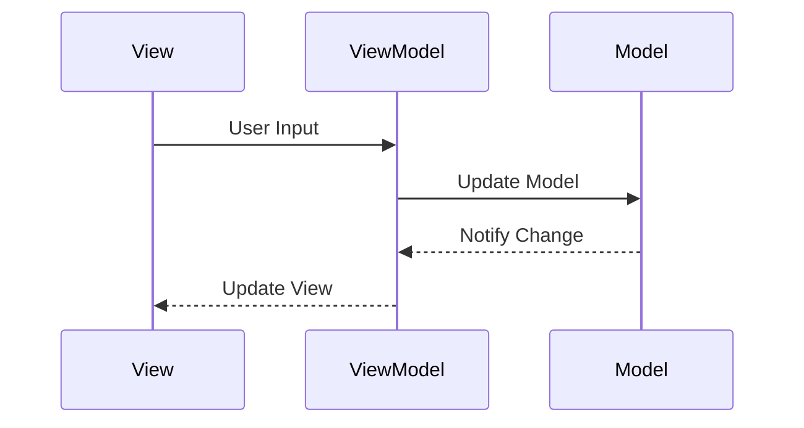

## 7.2.2 Data Binding Techniques

Data binding is a core concept in the Model-View-ViewModel (MVVM) architectural pattern, facilitating the synchronization of data between the View and the ViewModel. This synchronization is crucial for creating responsive and dynamic user interfaces, enhancing the overall user experience. In this section, we will delve into various data binding techniques, including one-way, two-way, and asynchronous data binding, with practical TypeScript examples using frameworks like Angular. We will also explore the role of observables and reactive programming, address performance considerations, and discuss best practices for managing complex data bindings.

### Understanding Data Binding in MVVM

Data binding in MVVM is the process of connecting the user interface (View) to the business logic (ViewModel) so that changes in one are automatically reflected in the other. This connection allows developers to focus on the logic of their applications without worrying about manually updating the UI.

#### Importance of Data Binding

- **Responsiveness**: Automatically updates the UI when the underlying data changes, providing a seamless user experience.
- **Separation of Concerns**: Keeps the ViewModel free from UI-specific code, promoting a clean separation of concerns.
- **Maintainability**: Simplifies code maintenance by reducing boilerplate code required for UI updates.

### Types of Data Binding

#### One-Way Data Binding

One-way data binding is the simplest form of data binding, where data flows in a single direction—from the ViewModel to the View. This is ideal for scenarios where the UI needs to display data that does not require user interaction to modify.

**Example in Angular:**

```typescript
// app.component.ts
import { Component } from '@angular/core';

@Component({
  selector: 'app-root',
  template: `<h1>{{ title }}</h1>`
})
export class AppComponent {
  title = 'Welcome to Data Binding in Angular!';
}
```

In this example, the `title` property in the `AppComponent` is bound to the `<h1>` element in the template. Any change to `title` in the ViewModel will automatically update the View.

#### Two-Way Data Binding

Two-way data binding allows for a bidirectional flow of data between the View and the ViewModel. This is particularly useful for form inputs where user input needs to be reflected back in the ViewModel.

**Example in Angular:**

```typescript
// app.component.ts
import { Component } from '@angular/core';

@Component({
  selector: 'app-root',
  template: `
    <input [(ngModel)]="userInput" placeholder="Enter text">
    <p>You entered: {{ userInput }}</p>
  `
})
export class AppComponent {
  userInput: string = '';
}
```

Here, the `[(ngModel)]` directive enables two-way binding between the `userInput` property and the input field. Changes in the input field update `userInput`, and vice versa.

#### Asynchronous Data Binding

Asynchronous data binding is crucial when dealing with data that is loaded asynchronously, such as data fetched from a server. This technique often involves observables and reactive programming to handle asynchronous data streams.

**Example using Angular and RxJS:**

```typescript
// app.component.ts
import { Component, OnInit } from '@angular/core';
import { Observable, of } from 'rxjs';
import { delay } from 'rxjs/operators';

@Component({
  selector: 'app-root',
  template: `
    <div *ngIf="data$ | async as data">
      <p>Data: {{ data }}</p>
    </div>
  `
})
export class AppComponent implements OnInit {
  data$: Observable<string>;

  ngOnInit() {
    this.data$ = of('Async Data Loaded').pipe(delay(2000));
  }
}
```

In this example, `data$` is an observable that emits a value after a delay, simulating an asynchronous data fetch. The `| async` pipe in the template automatically subscribes to the observable and updates the UI when the data is available.

### Role of Observables and Reactive Programming

Observables, a key feature of the RxJS library, play a significant role in implementing data binding, especially for asynchronous operations. They provide a powerful way to handle data streams and events, allowing for more responsive and interactive applications.

#### Benefits of Using Observables

- **Composability**: Observables can be easily combined and transformed using operators, enabling complex data flows.
- **Asynchronous Handling**: Simplifies handling of asynchronous data, such as HTTP requests or user events.
- **Memory Management**: Automatically manages subscriptions, reducing the risk of memory leaks.

**Example of Observable in Angular:**

```typescript
// data.service.ts
import { Injectable } from '@angular/core';
import { Observable, of } from 'rxjs';

@Injectable({
  providedIn: 'root'
})
export class DataService {
  getData(): Observable<string> {
    return of('Observable Data');
  }
}

// app.component.ts
import { Component, OnInit } from '@angular/core';
import { DataService } from './data.service';

@Component({
  selector: 'app-root',
  template: `<p>{{ data }}</p>`
})
export class AppComponent implements OnInit {
  data: string;

  constructor(private dataService: DataService) {}

  ngOnInit() {
    this.dataService.getData().subscribe(result => this.data = result);
  }
}
```

In this example, `DataService` provides an observable that emits data. The `AppComponent` subscribes to this observable and updates the `data` property when new data is emitted.

### Performance Considerations

When implementing data binding, especially in large applications, performance can become a concern. Here are some strategies to optimize performance:

- **Limit Watchers**: Reduce the number of watchers in Angular by minimizing bindings in templates.
- **Use OnPush Change Detection**: In Angular, use the `OnPush` change detection strategy to limit checks to only when inputs change.
- **Debounce Input Events**: Use debouncing for input events to reduce the frequency of updates and improve performance.

**Example of OnPush Change Detection:**

```typescript
// app.component.ts
import { Component, ChangeDetectionStrategy } from '@angular/core';

@Component({
  selector: 'app-root',
  template: `<p>{{ data }}</p>`,
  changeDetection: ChangeDetectionStrategy.OnPush
})
export class AppComponent {
  data = 'Static Data';
}
```

By setting the `changeDetection` strategy to `OnPush`, Angular will only check for changes when the component's inputs change, reducing unnecessary checks.

### Common Pitfalls and How to Avoid Them

#### Excessive Updates

Excessive updates can occur when bindings are not optimized, leading to performance issues. To avoid this, ensure that bindings are necessary and consider using techniques like debouncing and throttling.

#### Memory Leaks

Memory leaks can occur when subscriptions to observables are not properly managed. Always unsubscribe from observables in Angular components to prevent memory leaks.

**Example of Unsubscribing in Angular:**

```typescript
// app.component.ts
import { Component, OnDestroy, OnInit } from '@angular/core';
import { Subscription } from 'rxjs';
import { DataService } from './data.service';

@Component({
  selector: 'app-root',
  template: `<p>{{ data }}</p>`
})
export class AppComponent implements OnInit, OnDestroy {
  data: string;
  private subscription: Subscription;

  constructor(private dataService: DataService) {}

  ngOnInit() {
    this.subscription = this.dataService.getData().subscribe(result => this.data = result);
  }

  ngOnDestroy() {
    this.subscription.unsubscribe();
  }
}
```

In this example, we use the `Subscription` object to manage the observable subscription and ensure it is unsubscribed when the component is destroyed.

### Best Practices for Managing Complex Data Bindings

- **Use Services for Data Logic**: Keep data logic in services rather than components to promote reusability and separation of concerns.
- **Leverage Reactive Extensions**: Use RxJS operators to manage complex data flows and transformations.
- **Modularize Code**: Break down complex components into smaller, reusable components to simplify data binding management.

### Visualizing Data Binding in MVVM

To better understand the flow of data in MVVM, let's visualize the interaction between the View, ViewModel, and Model using a Mermaid.js diagram.



**Diagram Description**: This sequence diagram illustrates the flow of data in an MVVM architecture. User input is captured by the View and passed to the ViewModel, which updates the Model. The Model then notifies the ViewModel of any changes, prompting the ViewModel to update the View.

### Try It Yourself

Experiment with the provided code examples by modifying the data and observing how changes are reflected in the UI. Try implementing additional features, such as form validation or dynamic lists, to deepen your understanding of data binding in Angular.

### References and Links

- [Angular Documentation on Data Binding](https://angular.io/guide/binding-overview)
- [RxJS Documentation](https://rxjs.dev/guide/overview)
- [MDN Web Docs on Observables](https://developer.mozilla.org/en-US/docs/Web/JavaScript/Reference/Global_Objects/Observable)

### Knowledge Check

To reinforce your understanding of data binding techniques, consider the following questions:

- What are the key differences between one-way and two-way data binding?
- How can observables enhance asynchronous data binding?
- What strategies can be employed to optimize data binding performance?

### Embrace the Journey

Remember, mastering data binding techniques is a journey. As you continue to explore and experiment with these concepts, you'll gain a deeper understanding of how to create responsive and maintainable applications. Keep experimenting, stay curious, and enjoy the journey!

## Quiz Time!



### What is the primary benefit of two-way data binding?

- [x] It allows for bidirectional data flow between the View and ViewModel.
- [ ] It simplifies the ViewModel by removing the need for data updates.
- [ ] It eliminates the need for observables.
- [ ] It enhances performance by reducing data checks.

> **Explanation:** Two-way data binding facilitates a bidirectional flow of data, ensuring that changes in the View are reflected in the ViewModel and vice versa.

### Which Angular directive is used for two-way data binding?

- [x] ngModel
- [ ] ngBind
- [ ] ngIf
- [ ] ngFor

> **Explanation:** The `ngModel` directive is used in Angular for two-way data binding, allowing synchronization between the View and the ViewModel.

### What is the purpose of the `| async` pipe in Angular?

- [x] It automatically subscribes to observables and updates the View when data is available.
- [ ] It converts synchronous data to asynchronous data.
- [ ] It improves performance by caching data.
- [ ] It prevents memory leaks by unsubscribing automatically.

> **Explanation:** The `| async` pipe in Angular is used to automatically subscribe to observables and update the View when the data is available, simplifying asynchronous data handling.

### How can you prevent memory leaks when using observables in Angular?

- [x] By unsubscribing from observables in the `ngOnDestroy` lifecycle hook.
- [ ] By using the `async` pipe.
- [ ] By using two-way data binding.
- [ ] By limiting the number of observables.

> **Explanation:** To prevent memory leaks, it's important to unsubscribe from observables in the `ngOnDestroy` lifecycle hook of Angular components.

### What is a common pitfall of excessive data binding?

- [x] Performance degradation due to excessive updates.
- [ ] Improved responsiveness.
- [ ] Reduced code complexity.
- [ ] Increased memory efficiency.

> **Explanation:** Excessive data binding can lead to performance degradation due to frequent updates, which can strain the application's resources.

### What is the role of observables in data binding?

- [x] They provide a way to handle asynchronous data streams.
- [ ] They eliminate the need for two-way data binding.
- [ ] They simplify the ViewModel by removing data logic.
- [ ] They enhance performance by caching data.

> **Explanation:** Observables play a crucial role in handling asynchronous data streams, making them essential for reactive programming and data binding.

### Which strategy can improve performance in Angular data binding?

- [x] Using the `OnPush` change detection strategy.
- [ ] Increasing the number of watchers.
- [ ] Using only one-way data binding.
- [ ] Avoiding the use of observables.

> **Explanation:** The `OnPush` change detection strategy in Angular improves performance by limiting change detection to when inputs change, reducing unnecessary checks.

### What is the benefit of debouncing input events?

- [x] It reduces the frequency of updates, improving performance.
- [ ] It increases the responsiveness of the application.
- [ ] It simplifies the ViewModel logic.
- [ ] It enhances the user interface design.

> **Explanation:** Debouncing input events reduces the frequency of updates, which can significantly improve performance by minimizing unnecessary processing.

### How can modularizing code help with data binding?

- [x] It simplifies data binding management by breaking down complex components.
- [ ] It eliminates the need for services.
- [ ] It reduces the number of observables.
- [ ] It enhances the user interface design.

> **Explanation:** Modularizing code helps manage data binding by breaking down complex components into smaller, reusable pieces, making it easier to maintain and understand.

### True or False: Observables automatically manage subscriptions to prevent memory leaks.

- [ ] True
- [x] False

> **Explanation:** While observables provide a powerful way to handle data streams, developers must manually manage subscriptions to prevent memory leaks, typically by unsubscribing in the `ngOnDestroy` lifecycle hook.


