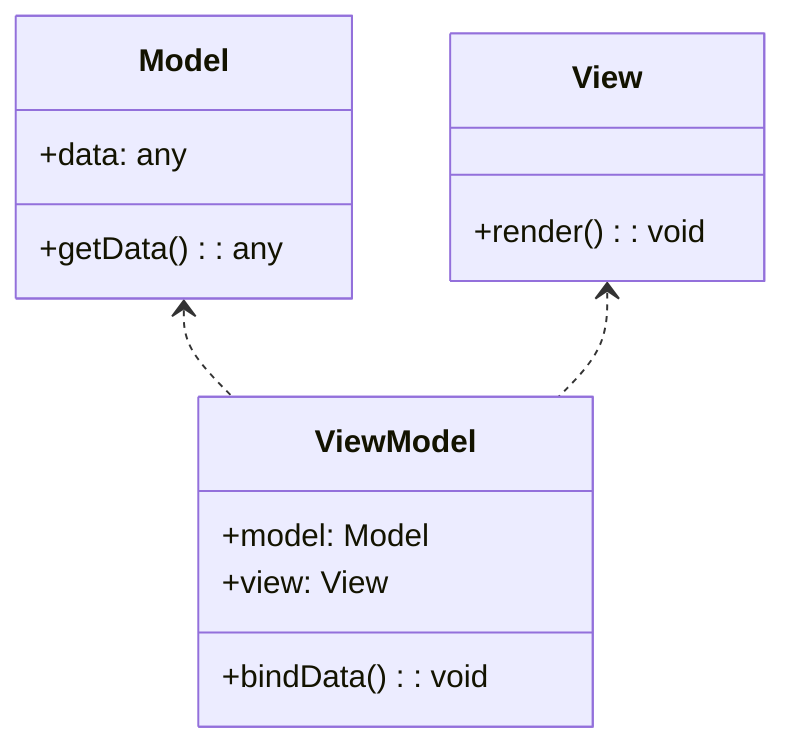

## 7.2.3 Use Cases and Examples

The Model-View-ViewModel (MVVM) pattern is a powerful architectural pattern that facilitates the separation of concerns in modern web applications and UI frameworks. It is particularly beneficial in scenarios where data binding and dynamic user interfaces are crucial. In this section, we will explore various use cases where the MVVM pattern shines, discuss its advantages in enhancing developer productivity and code maintainability, and provide real-world examples and case studies.

### Understanding MVVM

Before diving into specific use cases, let's briefly recap the MVVM pattern. MVVM is an architectural pattern that separates the graphical user interface (GUI) from the business logic or back-end logic (the data model). It consists of three main components:

1. **Model**: Represents the data and business logic of the application. It is responsible for retrieving and processing data, often from a database or an API.

2. **View**: The visual representation of the data, typically the UI components that the user interacts with.

3. **ViewModel**: Acts as an intermediary between the Model and the View. It handles the presentation logic and is responsible for exposing data from the Model to the View, often through data binding.

The MVVM pattern is particularly popular in frameworks like Angular, Knockout.js, and Vue.js, where data binding and reactive programming are core features.

### Use Cases for MVVM

#### 1. Data-Driven Dashboards

**Scenario**: Imagine a real-time analytics dashboard that displays various metrics and KPIs (Key Performance Indicators) for a business. The dashboard needs to update dynamically as new data comes in, providing users with the latest insights without requiring a page refresh.

**How MVVM Helps**: In this scenario, the MVVM pattern is ideal because it allows for seamless data binding between the Model and the View. The ViewModel acts as a bridge, ensuring that any changes in the data are automatically reflected in the UI. This reduces the amount of boilerplate code needed to update the UI manually and ensures that the data displayed is always current.

**Code Example**:

```typescript
// Model
class Metric {
  constructor(public name: string, public value: number) {}
}

// ViewModel
class DashboardViewModel {
  metrics: Metric[] = [];

  constructor() {
    // Simulate fetching data from an API
    setInterval(() => {
      this.metrics = this.fetchMetrics();
    }, 1000);
  }

  fetchMetrics(): Metric[] {
    // Fetch new data
    return [
      new Metric('Sales', Math.random() * 1000),
      new Metric('Visitors', Math.random() * 1000),
      new Metric('Conversions', Math.random() * 1000),
    ];
  }
}

// View (HTML)
const dashboardView = `
  <div id="dashboard">
    <h1>Real-Time Metrics</h1>
    <ul id="metrics-list">
      <!-- Metrics will be dynamically inserted here -->
    </ul>
  </div>
`;

// Function to update the view
function updateView(viewModel: DashboardViewModel) {
  const metricsList = document.getElementById('metrics-list');
  if (metricsList) {
    metricsList.innerHTML = viewModel.metrics
      .map(metric => `<li>${metric.name}: ${metric.value.toFixed(2)}</li>`)
      .join('');
  }
}

// Instantiate ViewModel and set up data binding
const viewModel = new DashboardViewModel();
setInterval(() => updateView(viewModel), 1000);
```

**Try It Yourself**: Modify the `fetchMetrics` method to include additional metrics or change the update interval to see how the dashboard responds.

#### 2. Real-Time Collaboration Tools

**Scenario**: Consider a collaborative document editing tool where multiple users can edit a document simultaneously. The changes made by one user should be reflected in real-time for all other users.

**How MVVM Helps**: The MVVM pattern facilitates real-time updates by allowing the ViewModel to manage the state of the document and propagate changes to the View. This ensures that all users see the most recent version of the document without manual intervention.

**Code Example**:

```typescript
// Model
class Document {
  constructor(public content: string) {}
}

// ViewModel
class DocumentViewModel {
  document: Document;

  constructor() {
    this.document = new Document('');
    // Simulate receiving updates from other users
    setInterval(() => {
      this.document.content += ' New content from another user.';
    }, 2000);
  }

  updateContent(newContent: string) {
    this.document.content = newContent;
    // Simulate sending updates to other users
  }
}

// View (HTML)
const documentView = `
  <div id="document-editor">
    <h1>Collaborative Document</h1>
    <textarea id="document-content"></textarea>
  </div>
`;

// Function to update the view
function updateDocumentView(viewModel: DocumentViewModel) {
  const contentArea = document.getElementById('document-content') as HTMLTextAreaElement;
  if (contentArea) {
    contentArea.value = viewModel.document.content;
  }
}

// Instantiate ViewModel and set up data binding
const documentViewModel = new DocumentViewModel();
setInterval(() => updateDocumentView(documentViewModel), 1000);
```

**Try It Yourself**: Implement a method to handle user input and update the document content in real-time.

#### 3. E-commerce Platforms

**Scenario**: An e-commerce platform where users can browse products, add items to their cart, and proceed to checkout. The platform needs to provide a seamless user experience with dynamic updates as users interact with the site.

**How MVVM Helps**: The MVVM pattern allows for efficient management of the application's state and UI updates. The ViewModel can handle user interactions, such as adding items to the cart, and update the View accordingly. This ensures that the UI remains responsive and reflects the current state of the application.

**Code Example**:

```typescript
// Model
class Product {
  constructor(public id: number, public name: string, public price: number) {}
}

// ViewModel
class CartViewModel {
  cart: Product[] = [];

  addToCart(product: Product) {
    this.cart.push(product);
    this.updateCartView();
  }

  updateCartView() {
    const cartList = document.getElementById('cart-list');
    if (cartList) {
      cartList.innerHTML = this.cart
        .map(item => `<li>${item.name} - $${item.price.toFixed(2)}</li>`)
        .join('');
    }
  }
}

// View (HTML)
const cartView = `
  <div id="cart">
    <h1>Shopping Cart</h1>
    <ul id="cart-list">
      <!-- Cart items will be dynamically inserted here -->
    </ul>
  </div>
`;

// Instantiate ViewModel
const cartViewModel = new CartViewModel();
```

**Try It Yourself**: Add functionality to remove items from the cart and update the total price displayed.

### Enhancing Developer Productivity and Code Maintainability

The MVVM pattern enhances developer productivity and code maintainability in several ways:

- **Separation of Concerns**: By separating the UI logic from the business logic, developers can work on different parts of the application independently. This makes it easier to manage complex applications and reduces the risk of introducing bugs.

- **Reusability**: The ViewModel can be reused across different Views, promoting code reuse and reducing duplication.

- **Testability**: The separation of concerns also makes it easier to write unit tests for the ViewModel, as it can be tested independently of the UI.

- **Scalability**: As applications grow in complexity, the MVVM pattern provides a scalable architecture that can accommodate new features and requirements without significant refactoring.

### Case Studies

#### Case Study 1: Real-Time Analytics Platform

A tech company developed a real-time analytics platform for monitoring server performance. By adopting the MVVM pattern, they were able to create a highly responsive UI that updated in real-time as new data came in. The separation of concerns allowed the development team to work on the data processing logic and UI independently, resulting in faster development cycles and more reliable software.

#### Case Study 2: Collaborative Document Editing Tool

A startup built a collaborative document editing tool using the MVVM pattern. The pattern's ability to handle real-time updates and data binding made it an ideal choice for this application. The development team was able to focus on optimizing the document rendering and editing experience without worrying about the underlying data synchronization logic.

### Comparing MVVM to Other Patterns

While the MVVM pattern is highly effective for applications with dynamic UIs and real-time data updates, it's important to consider other patterns for different project requirements:

- **MVC (Model-View-Controller)**: MVC is a simpler pattern that may be more suitable for applications with less complex UI logic. It separates the application into three components: Model, View, and Controller. However, it may not provide the same level of data binding and reactivity as MVVM.

- **MVP (Model-View-Presenter)**: MVP is similar to MVVM but uses a Presenter instead of a ViewModel. The Presenter handles all UI logic, making it a good choice for applications where the UI logic is complex but the data binding requirements are minimal.

- **Flux/Redux**: These patterns are often used in conjunction with React for managing application state. They provide a unidirectional data flow and are well-suited for applications with complex state management requirements.

### Encouraging MVVM Adoption

When building complex user interfaces with TypeScript, consider adopting the MVVM pattern for its many benefits. Its ability to separate concerns, facilitate data binding, and enhance testability makes it an excellent choice for modern web applications. Whether you're developing a data-driven dashboard, a real-time collaboration tool, or an e-commerce platform, the MVVM pattern can help you create maintainable, scalable, and responsive applications.

### Visualizing MVVM

To better understand the MVVM pattern, let's visualize the interaction between its components using a class diagram:



**Diagram Description**: This diagram illustrates the relationship between the Model, View, and ViewModel in the MVVM pattern. The ViewModel acts as an intermediary, binding data from the Model to the View.

### Knowledge Check

- **Question**: What are the three main components of the MVVM pattern?
- **Question**: How does the MVVM pattern enhance code maintainability?
- **Question**: In what scenarios is the MVVM pattern particularly beneficial?

### Conclusion

The MVVM pattern is a versatile and powerful architectural pattern that excels in scenarios requiring dynamic UIs and real-time data updates. By separating concerns and facilitating data binding, it enhances developer productivity and code maintainability. As you continue your journey in software development, consider the MVVM pattern for your next TypeScript project, and enjoy the benefits of a clean, scalable, and maintainable architecture.

## Quiz Time!



### What are the three main components of the MVVM pattern?

- [x] Model, View, ViewModel
- [ ] Model, View, Controller
- [ ] Model, View, Presenter
- [ ] Model, View, Adapter

> **Explanation:** The MVVM pattern consists of the Model, View, and ViewModel components.

### How does the MVVM pattern enhance code maintainability?

- [x] By separating concerns and facilitating data binding
- [ ] By combining UI and business logic
- [ ] By reducing the number of files in a project
- [ ] By eliminating the need for testing

> **Explanation:** The MVVM pattern separates concerns and facilitates data binding, making code more maintainable.

### In what scenarios is the MVVM pattern particularly beneficial?

- [x] Real-time updates and dynamic UIs
- [ ] Static websites with minimal interaction
- [ ] Command-line applications
- [ ] Batch processing systems

> **Explanation:** The MVVM pattern is beneficial for applications with real-time updates and dynamic UIs.

### Which pattern is often used in conjunction with React for managing application state?

- [ ] MVVM
- [ ] MVC
- [x] Flux/Redux
- [ ] MVP

> **Explanation:** Flux/Redux is often used with React for managing application state.

### What is a key advantage of using the MVVM pattern in collaborative tools?

- [x] Real-time data synchronization
- [ ] Simplified UI design
- [ ] Reduced server load
- [ ] Increased file size

> **Explanation:** The MVVM pattern facilitates real-time data synchronization, which is crucial in collaborative tools.

### Which component in the MVVM pattern acts as an intermediary between the Model and the View?

- [ ] Model
- [ ] View
- [x] ViewModel
- [ ] Controller

> **Explanation:** The ViewModel acts as an intermediary between the Model and the View.

### What is a common use case for the MVVM pattern in e-commerce platforms?

- [x] Managing dynamic cart updates
- [ ] Processing payments
- [ ] Generating static product pages
- [ ] Handling server-side logic

> **Explanation:** The MVVM pattern is used to manage dynamic cart updates in e-commerce platforms.

### How does the MVVM pattern improve testability?

- [x] By allowing the ViewModel to be tested independently of the UI
- [ ] By reducing the number of test cases needed
- [ ] By combining all logic into a single component
- [ ] By eliminating the need for unit tests

> **Explanation:** The MVVM pattern improves testability by allowing the ViewModel to be tested independently of the UI.

### What is a key difference between MVVM and MVC?

- [x] MVVM uses a ViewModel, while MVC uses a Controller
- [ ] MVVM combines UI and business logic, while MVC separates them
- [ ] MVVM is used for server-side applications, while MVC is for client-side
- [ ] MVVM is less suitable for real-time applications than MVC

> **Explanation:** MVVM uses a ViewModel, while MVC uses a Controller.

### True or False: The MVVM pattern is only suitable for web applications.

- [ ] True
- [x] False

> **Explanation:** The MVVM pattern can be used in various types of applications, not just web applications.




