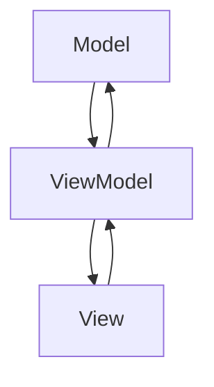

## 7.2 Model-View-ViewModel (MVVM) Pattern

The Model-View-ViewModel (MVVM) pattern is a powerful architectural pattern that facilitates the separation of concerns in software development, particularly in the realm of graphical user interfaces (GUIs). This pattern is especially prevalent in front-end development, where it helps manage the complexities of UI and business logic separation. In this section, we will delve into the components of MVVM, its advantages over other patterns like MVC, and how to implement it using TypeScript.

### Understanding MVVM Components

The MVVM pattern consists of three core components: Model, View, and ViewModel. Each plays a distinct role in the architecture, ensuring a clean separation of concerns.

#### Model

The Model represents the data and business logic of the application. It is responsible for managing the data, rules, and logic that define the behavior of the application. The Model is independent of the user interface, allowing it to be reused across different views.

#### View

The View is the visual representation of the data. It is the user interface of the application, displaying the data to the user and capturing user interactions. The View is typically implemented using HTML and CSS in web applications.

#### ViewModel

The ViewModel acts as an intermediary between the Model and the View. It is responsible for exposing data from the Model to the View and handling user interactions. The ViewModel facilitates data binding, which allows changes in the Model to be automatically reflected in the View and vice versa.

### MVVM vs. MVC: Key Differences

While both MVVM and MVC (Model-View-Controller) aim to separate concerns, they do so in different ways. The key difference lies in how they handle user interactions and data binding.

- **MVC**: In MVC, the Controller handles user input and updates the Model, which in turn updates the View. The Controller is responsible for the flow of data between the Model and the View.
- **MVVM**: In MVVM, the ViewModel handles user input and updates the Model. The ViewModel also facilitates data binding, allowing changes in the Model to automatically update the View without direct intervention.

**Advantages of MVVM**:
- **Data Binding**: MVVM's data binding simplifies UI development by automatically synchronizing the View with the Model.
- **Testability**: The separation of concerns makes it easier to test individual components, particularly the ViewModel.
- **Maintainability**: By decoupling the UI from the business logic, MVVM enhances the maintainability of the codebase.

### Data Binding in MVVM

Data binding is a core feature of the MVVM pattern, enabling automatic synchronization between the View and the Model. This reduces the need for boilerplate code to update the UI in response to changes in the data.

#### Two-Way Data Binding

In two-way data binding, changes in the View are automatically reflected in the Model, and vice versa. This is particularly useful for form inputs, where user changes need to be immediately reflected in the underlying data.

#### One-Way Data Binding

One-way data binding updates the View whenever the Model changes, but not the other way around. This is useful for displaying data that does not require user interaction.

### Implementing MVVM in TypeScript

Let's explore how to implement the MVVM pattern in TypeScript using a simple example. We'll create a basic application that displays and updates a list of tasks.

#### Step 1: Define the Model

First, we'll define the Model, which represents the data structure for our tasks.

```typescript
interface Task {
  id: number;
  title: string;
  completed: boolean;
}

class TaskModel {
  private tasks: Task[] = [];

  addTask(title: string): void {
    const newTask: Task = {
      id: this.tasks.length + 1,
      title,
      completed: false
    };
    this.tasks.push(newTask);
  }

  getTasks(): Task[] {
    return this.tasks;
  }

  toggleTaskCompletion(id: number): void {
    const task = this.tasks.find(t => t.id === id);
    if (task) {
      task.completed = !task.completed;
    }
  }
}
```

#### Step 2: Create the ViewModel

Next, we'll create the ViewModel, which will manage the interaction between the Model and the View.

```typescript
class TaskViewModel {
  private model: TaskModel;

  constructor(model: TaskModel) {
    this.model = model;
  }

  get tasks(): Task[] {
    return this.model.getTasks();
  }

  addTask(title: string): void {
    this.model.addTask(title);
  }

  toggleTaskCompletion(id: number): void {
    this.model.toggleTaskCompletion(id);
  }
}
```

#### Step 3: Implement the View

Finally, we'll implement the View, which will display the tasks and handle user interactions.

```typescript
class TaskView {
  private viewModel: TaskViewModel;

  constructor(viewModel: TaskViewModel) {
    this.viewModel = viewModel;
    this.initialize();
  }

  initialize(): void {
    this.render();
    this.bindEvents();
  }

  render(): void {
    const tasks = this.viewModel.tasks;
    const taskList = document.getElementById('task-list');
    if (taskList) {
      taskList.innerHTML = tasks.map(task => `
        <li>
          <input type="checkbox" ${task.completed ? 'checked' : ''} data-id="${task.id}">
          ${task.title}
        </li>
      `).join('');
    }
  }

  bindEvents(): void {
    const taskList = document.getElementById('task-list');
    if (taskList) {
      taskList.addEventListener('change', (event) => {
        const target = event.target as HTMLInputElement;
        const taskId = parseInt(target.dataset.id || '0', 10);
        this.viewModel.toggleTaskCompletion(taskId);
        this.render();
      });
    }

    const addTaskButton = document.getElementById('add-task');
    if (addTaskButton) {
      addTaskButton.addEventListener('click', () => {
        const taskInput = document.getElementById('task-input') as HTMLInputElement;
        if (taskInput && taskInput.value) {
          this.viewModel.addTask(taskInput.value);
          taskInput.value = '';
          this.render();
        }
      });
    }
  }
}
```

### Visualizing MVVM Architecture

Let's visualize the interaction between the components in the MVVM pattern using a diagram.



**Diagram Explanation**: The diagram illustrates the flow of data and interactions in the MVVM pattern. The Model provides data to the ViewModel, which in turn updates the View. User interactions in the View are handled by the ViewModel, which updates the Model accordingly.

### TypeScript Features Supporting MVVM

TypeScript offers several features that enhance the implementation of the MVVM pattern:

- **Classes and Interfaces**: TypeScript's class-based syntax and interfaces enable a clear definition of Models and ViewModels, promoting strong typing and maintainability.
- **Decorators**: While still experimental, decorators can be used to enhance classes and methods, providing additional functionality such as logging or validation.
- **Modules**: TypeScript's module system allows for the organization of code into reusable components, making it easier to manage large applications.

### Challenges in MVVM

Despite its advantages, MVVM can present certain challenges:

- **State Management**: Managing state across multiple components can become complex, especially in large applications. Using state management libraries like Redux can help mitigate this issue.
- **Asynchronous Operations**: Handling asynchronous operations, such as API calls, requires careful management to ensure data consistency. Promises and async/await are useful tools in this context.

### Best Practices for MVVM in TypeScript

To effectively implement MVVM in TypeScript, consider the following best practices:

- **Keep ViewModels Simple**: Avoid placing too much logic in the ViewModel. It should primarily serve as a mediator between the Model and the View.
- **Use Interfaces for Models**: Define interfaces for your Models to ensure consistency and type safety.
- **Leverage TypeScript's Features**: Utilize TypeScript's strong typing, classes, and modules to create a robust and maintainable codebase.
- **Adopt a Consistent Naming Convention**: Use consistent naming conventions for your components to improve readability and maintainability.

### Try It Yourself

Experiment with the provided code examples by adding new features or modifying existing ones. For instance, try adding a feature to delete tasks or filter tasks based on their completion status. This hands-on approach will deepen your understanding of the MVVM pattern and its implementation in TypeScript.

### Further Reading

For more information on MVVM and related patterns, consider exploring the following resources:

- [MDN Web Docs: JavaScript](https://developer.mozilla.org/en-US/docs/Web/JavaScript)
- [TypeScript Documentation](https://www.typescriptlang.org/docs/)
- [MVVM Pattern on Wikipedia](https://en.wikipedia.org/wiki/Model–view–viewmodel)

## Quiz Time!



### What is the primary role of the ViewModel in the MVVM pattern?

- [x] To act as an intermediary between the Model and the View
- [ ] To directly manipulate the DOM
- [ ] To handle all business logic
- [ ] To store the application's state

> **Explanation:** The ViewModel acts as an intermediary between the Model and the View, facilitating data binding and handling user interactions.

### How does MVVM differ from MVC in terms of data binding?

- [x] MVVM uses data binding to automatically synchronize the View and Model
- [ ] MVC uses data binding to automatically synchronize the View and Model
- [ ] MVVM does not support data binding
- [ ] MVC does not support data binding

> **Explanation:** MVVM uses data binding to automatically synchronize the View and Model, whereas MVC requires manual updates.

### Which TypeScript feature is particularly useful for defining Models in MVVM?

- [x] Interfaces
- [ ] Decorators
- [ ] Generics
- [ ] Mixins

> **Explanation:** Interfaces in TypeScript are useful for defining Models as they ensure consistency and type safety.

### What is a common challenge when implementing MVVM?

- [x] Managing state across components
- [ ] Defining interfaces
- [ ] Using decorators
- [ ] Implementing classes

> **Explanation:** Managing state across components can become complex, especially in large applications.

### What is the benefit of using two-way data binding in MVVM?

- [x] It automatically updates the Model when the View changes
- [ ] It only updates the View when the Model changes
- [ ] It prevents any updates between the View and Model
- [ ] It requires manual updates to synchronize the View and Model

> **Explanation:** Two-way data binding automatically updates the Model when the View changes, and vice versa.

### Which of the following is NOT a component of the MVVM pattern?

- [ ] Model
- [ ] View
- [x] Controller
- [ ] ViewModel

> **Explanation:** The MVVM pattern consists of the Model, View, and ViewModel. The Controller is part of the MVC pattern.

### Why is the ViewModel important for testability in MVVM?

- [x] It separates the UI logic from the business logic
- [ ] It directly manipulates the DOM
- [ ] It stores the application's state
- [ ] It handles all asynchronous operations

> **Explanation:** The ViewModel separates the UI logic from the business logic, making it easier to test individual components.

### What TypeScript feature can enhance classes and methods in MVVM?

- [x] Decorators
- [ ] Mixins
- [ ] Generics
- [ ] Type Guards

> **Explanation:** Decorators can enhance classes and methods by providing additional functionality such as logging or validation.

### What is the role of the Model in MVVM?

- [x] To manage the data and business logic
- [ ] To display the data to the user
- [ ] To handle user interactions
- [ ] To facilitate data binding

> **Explanation:** The Model is responsible for managing the data and business logic of the application.

### True or False: In MVVM, the ViewModel directly manipulates the DOM.

- [ ] True
- [x] False

> **Explanation:** False. In MVVM, the ViewModel does not directly manipulate the DOM; it acts as an intermediary between the Model and the View.


