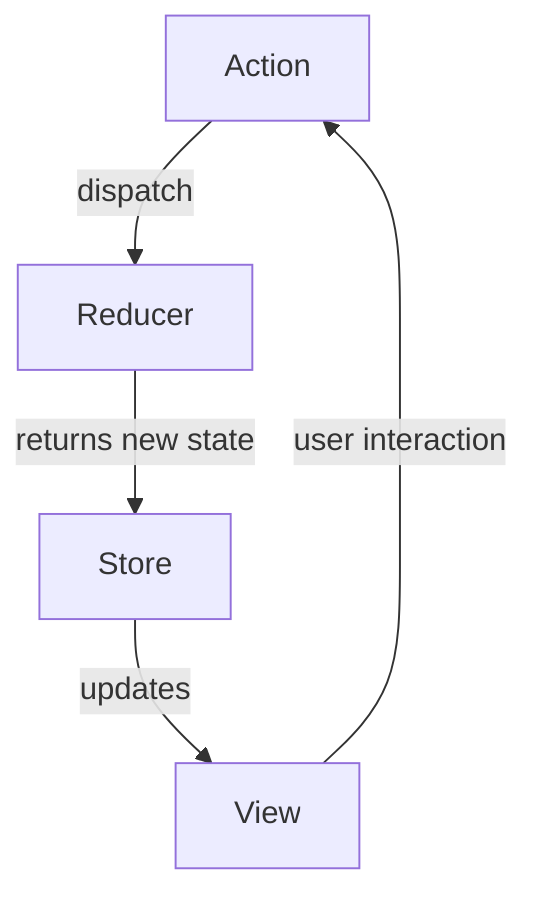

## 7.3.1 Implementing Flux and Redux in TypeScript

In this section, we will delve into the implementation of Redux with TypeScript, a powerful combination for managing state in large-scale applications. Redux, inspired by the Flux architecture, provides a predictable state container for JavaScript apps. When paired with TypeScript, it offers enhanced type safety and developer experience. Let's explore how to set up a Redux store, define actions and reducers with TypeScript interfaces, use middleware, and integrate Redux with React.

### Introduction to Redux and TypeScript

Redux is a state management library that follows the principles of Flux architecture. It centralizes the application's state in a single store, making state changes predictable and easier to debug. TypeScript, with its static typing, complements Redux by providing type safety, reducing runtime errors, and improving code readability.

### Setting Up a Redux Store in TypeScript

To get started with Redux in a TypeScript project, we need to set up a Redux store. This involves installing the necessary packages and configuring the store with reducers and middleware.

#### Step 1: Install Redux and TypeScript

First, ensure you have Node.js and npm installed. Then, create a new TypeScript project and install Redux along with its TypeScript types.

```bash
npm init -y
npm install redux react-redux @reduxjs/toolkit
npm install --save-dev typescript @types/react @types/react-dom @types/redux
```

#### Step 2: Configure TypeScript

Create a `tsconfig.json` file to configure TypeScript.

```json
{
  "compilerOptions": {
    "target": "ES6",
    "module": "commonjs",
    "strict": true,
    "jsx": "react",
    "esModuleInterop": true,
    "skipLibCheck": true
  },
  "include": ["src"]
}
```

#### Step 3: Create the Redux Store

Create a `store.ts` file to configure the Redux store.

```typescript
import { configureStore } from '@reduxjs/toolkit';
import rootReducer from './reducers';

const store = configureStore({
  reducer: rootReducer,
});

export type AppDispatch = typeof store.dispatch;
export type RootState = ReturnType<typeof store.getState>;
export default store;
```

### Defining Actions, Reducers, and State Types

In Redux, actions describe what happened, and reducers specify how the application's state changes in response to actions.

#### Step 1: Define State Types

Use TypeScript interfaces to define the shape of your state.

```typescript
interface CounterState {
  value: number;
}

const initialState: CounterState = {
  value: 0,
};
```

#### Step 2: Define Actions

Actions are plain objects that have a `type` field. Use TypeScript to define action types and action creators.

```typescript
// Action Types
const INCREMENT = 'INCREMENT';
const DECREMENT = 'DECREMENT';

// Action Interfaces
interface IncrementAction {
  type: typeof INCREMENT;
}

interface DecrementAction {
  type: typeof DECREMENT;
}

type CounterActionTypes = IncrementAction | DecrementAction;

// Action Creators
export const increment = (): IncrementAction => ({ type: INCREMENT });
export const decrement = (): DecrementAction => ({ type: DECREMENT });
```

#### Step 3: Create Reducers

Reducers are functions that take the current state and an action, then return a new state.

```typescript
import { CounterState, CounterActionTypes, INCREMENT, DECREMENT } from './actions';

const counterReducer = (state: CounterState = initialState, action: CounterActionTypes): CounterState => {
  switch (action.type) {
    case INCREMENT:
      return { value: state.value + 1 };
    case DECREMENT:
      return { value: state.value - 1 };
    default:
      return state;
  }
};

export default counterReducer;
```

### Using Middleware and Enhancers

Middleware in Redux provides a way to extend Redux with custom functionality, such as logging, crash reporting, or handling asynchronous actions.

#### Applying Middleware

To apply middleware, use the `applyMiddleware` function from Redux. Here, we'll use `redux-thunk` for handling asynchronous actions.

```typescript
import thunk from 'redux-thunk';
import { applyMiddleware, createStore } from 'redux';
import rootReducer from './reducers';

const store = createStore(rootReducer, applyMiddleware(thunk));
```

#### Using Redux Thunk

`redux-thunk` allows you to write action creators that return a function instead of an action. This function can perform asynchronous tasks and dispatch actions.

```typescript
import { ThunkAction } from 'redux-thunk';
import { RootState } from './store';
import { CounterActionTypes, increment } from './actions';

export const incrementAsync = (): ThunkAction<void, RootState, unknown, CounterActionTypes> => async dispatch => {
  setTimeout(() => {
    dispatch(increment());
  }, 1000);
};
```

### Organizing Redux Code

For scalability, it's crucial to organize Redux code effectively. Here are some best practices:

- **Modularize Code**: Divide your Redux code into modules, each containing actions, reducers, and types related to a specific feature.
- **Use `@reduxjs/toolkit`**: This library simplifies Redux setup with utilities like `createSlice` and `createAsyncThunk`.
- **Keep Actions and Reducers Simple**: Avoid complex logic in reducers. Use middleware for side effects.

### Integrating Redux with React

To integrate Redux with React, use the `react-redux` library, which provides hooks and components to connect your React components to the Redux store.

#### Step 1: Set Up React Components

Create a simple React component that connects to the Redux store.

```typescript
import React from 'react';
import { useSelector, useDispatch } from 'react-redux';
import { RootState } from './store';
import { increment, decrement } from './actions';

const Counter: React.FC = () => {
  const count = useSelector((state: RootState) => state.counter.value);
  const dispatch = useDispatch();

  return (
    <div>
      <h1>{count}</h1>
      <button onClick={() => dispatch(increment())}>Increment</button>
      <button onClick={() => dispatch(decrement())}>Decrement</button>
    </div>
  );
};

export default Counter;
```

#### Step 2: Provide the Redux Store

Wrap your application with the `Provider` component to make the Redux store available to all components.

```typescript
import React from 'react';
import ReactDOM from 'react-dom';
import { Provider } from 'react-redux';
import store from './store';
import Counter from './Counter';

ReactDOM.render(
  <Provider store={store}>
    <Counter />
  </Provider>,
  document.getElementById('root')
);
```

### Handling Asynchronous Actions with Redux-Saga

While `redux-thunk` is suitable for simple asynchronous logic, `redux-saga` offers a more powerful way to handle complex side effects using generator functions.

#### Step 1: Install Redux-Saga

```bash
npm install redux-saga
```

#### Step 2: Create a Saga

Define a saga to handle asynchronous actions.

```typescript
import { call, put, takeEvery } from 'redux-saga/effects';
import { increment } from './actions';

function* incrementAsyncSaga() {
  yield call(delay, 1000);
  yield put(increment());
}

function delay(ms: number) {
  return new Promise(resolve => setTimeout(resolve, ms));
}

export function* watchIncrementAsync() {
  yield takeEvery('INCREMENT_ASYNC', incrementAsyncSaga);
}
```

#### Step 3: Run the Saga

Integrate the saga middleware into the Redux store.

```typescript
import createSagaMiddleware from 'redux-saga';
import { applyMiddleware, createStore } from 'redux';
import rootReducer from './reducers';
import { watchIncrementAsync } from './sagas';

const sagaMiddleware = createSagaMiddleware();
const store = createStore(rootReducer, applyMiddleware(sagaMiddleware));

sagaMiddleware.run(watchIncrementAsync);
```

### Common Challenges and Solutions

#### Typing Actions and Reducers

One challenge with Redux in TypeScript is typing actions and reducers. Use TypeScript's union types and interfaces to define action types and ensure type safety.

#### Managing Complex State

For complex state, consider using `@reduxjs/toolkit` to simplify reducer logic and state management.

#### Debugging

Use Redux DevTools to inspect state changes and dispatched actions, making debugging easier.

### Best Practices for Redux with TypeScript

- **Use TypeScript's Type Inference**: Leverage TypeScript's ability to infer types to reduce boilerplate.
- **Keep State Immutable**: Use libraries like `immer` to manage immutable state updates.
- **Use Selectors**: Create reusable selectors to access state, improving code readability and maintainability.

### Try It Yourself

Experiment with the code examples provided. Try adding new actions, reducers, and components. Explore using `redux-saga` for more complex asynchronous logic. Consider integrating Redux with other front-end frameworks like Angular or Vue.js.

### Visualizing Redux Architecture

Below is a diagram illustrating the flow of data in a Redux application:



**Diagram Description**: This diagram shows the unidirectional data flow in a Redux application. Actions are dispatched to reducers, which return a new state to the store. The store updates the view, and user interactions trigger new actions.

### Knowledge Check

- What are the benefits of using TypeScript with Redux?
- How do you define actions and reducers in TypeScript?
- What is the purpose of middleware in Redux?
- How can you handle asynchronous actions in Redux?
- What are some best practices for organizing Redux code?

### Conclusion

Implementing Redux with TypeScript enhances the robustness and maintainability of your applications. By following best practices and leveraging TypeScript's type system, you can create scalable and efficient state management solutions. Remember, this is just the beginning. As you progress, you'll build more complex and interactive applications. Keep experimenting, stay curious, and enjoy the journey!

## Quiz Time!



### What is the primary purpose of Redux in a TypeScript application?

- [x] To manage application state in a predictable way
- [ ] To handle asynchronous operations exclusively
- [ ] To replace TypeScript's type system
- [ ] To provide a UI framework

> **Explanation:** Redux is primarily used to manage application state in a predictable and centralized manner.

### Which package is used to handle asynchronous actions in Redux?

- [ ] redux
- [x] redux-thunk
- [ ] react-redux
- [ ] @reduxjs/toolkit

> **Explanation:** `redux-thunk` is a middleware that allows you to write action creators that return a function instead of an action, enabling asynchronous logic.

### How do you define the shape of the state in a Redux application using TypeScript?

- [ ] Using classes
- [x] Using interfaces
- [ ] Using enums
- [ ] Using functions

> **Explanation:** TypeScript interfaces are used to define the shape of the state in a Redux application.

### What is the role of a reducer in Redux?

- [ ] To dispatch actions
- [ ] To handle asynchronous logic
- [x] To specify how the application's state changes in response to actions
- [ ] To connect React components to the Redux store

> **Explanation:** Reducers specify how the application's state changes in response to dispatched actions.

### Which library simplifies Redux setup with utilities like `createSlice`?

- [ ] redux
- [ ] react-redux
- [x] @reduxjs/toolkit
- [ ] redux-saga

> **Explanation:** `@reduxjs/toolkit` simplifies Redux setup with utilities like `createSlice` and `createAsyncThunk`.

### What is the purpose of the `Provider` component in a React-Redux application?

- [ ] To dispatch actions
- [x] To make the Redux store available to all components
- [ ] To define reducers
- [ ] To handle asynchronous actions

> **Explanation:** The `Provider` component makes the Redux store available to all components in a React application.

### How can you handle complex side effects in a Redux application?

- [ ] Using reducers
- [ ] Using the `Provider` component
- [x] Using `redux-saga`
- [ ] Using `react-redux`

> **Explanation:** `redux-saga` is used to handle complex side effects in a Redux application using generator functions.

### What is a best practice for keeping Redux state immutable?

- [ ] Using classes
- [x] Using libraries like `immer`
- [ ] Using synchronous actions
- [ ] Using `redux-saga`

> **Explanation:** Libraries like `immer` help manage immutable state updates in Redux.

### What is the benefit of using selectors in Redux?

- [ ] To dispatch actions
- [x] To improve code readability and maintainability
- [ ] To handle asynchronous actions
- [ ] To define reducers

> **Explanation:** Selectors improve code readability and maintainability by providing reusable functions to access state.

### True or False: Redux DevTools can be used to inspect state changes and dispatched actions.

- [x] True
- [ ] False

> **Explanation:** Redux DevTools is a powerful tool for inspecting state changes and dispatched actions, aiding in debugging.


