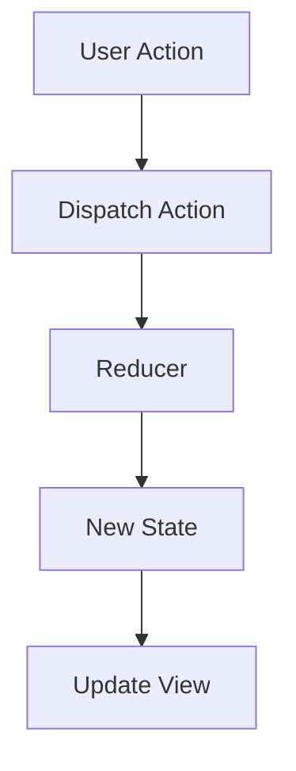

## 7.3.2 Unidirectional Data Flow

In the world of modern web development, managing state effectively is crucial for building scalable and maintainable applications. Unidirectional data flow is a powerful concept that has gained prominence through architectures like Flux and Redux. In this section, we will delve into the intricacies of unidirectional data flow, contrasting it with bidirectional data binding, and explore its benefits in simplifying debugging, state management, and improving application performance.

### Understanding Unidirectional Data Flow

Unidirectional data flow is a design pattern where data moves in a single direction through the application. This approach contrasts with bidirectional data binding, where data can flow in multiple directions, often leading to complex and unpredictable state changes.

#### Key Characteristics of Unidirectional Data Flow

1. **Predictability**: Since data flows in one direction, it's easier to predict how changes in state will affect the application.
2. **Immutability**: State changes are handled immutably, meaning the original state is never modified directly.
3. **Centralized State Management**: All state changes are managed in a single place, making it easier to track and debug.

#### Contrast with Bidirectional Data Binding

Bidirectional data binding, often seen in frameworks like AngularJS, allows data to flow back and forth between the model and the view. While this can simplify initial development, it often leads to issues such as:

- **Complex Debugging**: Changes in one part of the application can have unintended side effects elsewhere.
- **State Mutations**: Directly modifying state can lead to inconsistent application states.
- **Cascading Updates**: Changes can trigger a chain reaction of updates, making it difficult to pinpoint the source of a problem.

### Benefits of Unidirectional Data Flow

#### Simplified Debugging and State Management

Unidirectional data flow simplifies debugging by providing a clear path for data changes. When a state change occurs, it follows a predictable path:

1. **Action**: An action is dispatched to signal a state change.
2. **Reducer**: The reducer processes the action and returns a new state.
3. **View Update**: The view is updated to reflect the new state.

This clear separation of concerns makes it easier to identify where issues arise and how to address them.

#### Actions and Reducers

In unidirectional data flow, actions and reducers play a crucial role in managing state changes.

- **Actions**: Represent state changes in the application. They are plain JavaScript objects that describe what happened.
  
  ```typescript
  interface Action {
    type: string;
    payload?: any;
  }

  const incrementAction: Action = {
    type: 'INCREMENT',
    payload: 1
  };
  ```

- **Reducers**: Pure functions that take the current state and an action as arguments and return a new state. They ensure that state changes are handled immutably.

  ```typescript
  const counterReducer = (state = 0, action: Action) => {
    switch (action.type) {
      case 'INCREMENT':
        return state + action.payload;
      case 'DECREMENT':
        return state - action.payload;
      default:
        return state;
    }
  };
  ```

#### Preventing State Mutations and Cascading Updates

By enforcing immutability and a single source of truth, unidirectional data flow prevents issues like state mutations and cascading updates. This approach ensures that:

- **State is Predictable**: Since reducers return a new state without modifying the existing one, the application state remains consistent.
- **Updates are Controlled**: Changes are processed in a controlled manner, reducing the risk of unintended side effects.

### Impact on Application Performance and Developer Productivity

Unidirectional data flow not only simplifies state management but also positively impacts application performance and developer productivity.

#### Performance Benefits

- **Efficient Rendering**: By knowing exactly when and where state changes occur, the application can efficiently update only the necessary components.
- **Reduced Complexity**: With a clear data flow, the application logic becomes simpler, reducing the overhead of managing complex state interactions.

#### Developer Productivity

- **Easier Debugging**: With a predictable state management pattern, developers can quickly identify and fix issues.
- **Scalability**: As applications grow, unidirectional data flow provides a robust framework for managing increasing complexity.

### Encouraging Adoption in Complex Applications

For complex applications, adopting unidirectional data flow can lead to more maintainable and scalable codebases. By providing a clear structure for managing state, developers can focus on building features rather than wrestling with state management issues.

### Code Example: Implementing Unidirectional Data Flow with Redux

Let's explore a practical example of implementing unidirectional data flow using Redux in a TypeScript application.

#### Setting Up Redux

First, install Redux and its TypeScript bindings:

```bash
npm install redux @types/redux
```

#### Defining Actions

Define actions to represent state changes:

```typescript
// actions.ts
export const INCREMENT = 'INCREMENT';
export const DECREMENT = 'DECREMENT';

export interface IncrementAction {
  type: typeof INCREMENT;
  payload: number;
}

export interface DecrementAction {
  type: typeof DECREMENT;
  payload: number;
}

export type CounterActionTypes = IncrementAction | DecrementAction;

export const increment = (amount: number): IncrementAction => ({
  type: INCREMENT,
  payload: amount
});

export const decrement = (amount: number): DecrementAction => ({
  type: DECREMENT,
  payload: amount
});
```

#### Creating the Reducer

Create a reducer to handle actions and update the state:

```typescript
// reducer.ts
import { CounterActionTypes, INCREMENT, DECREMENT } from './actions';

interface CounterState {
  value: number;
}

const initialState: CounterState = {
  value: 0
};

const counterReducer = (
  state = initialState,
  action: CounterActionTypes
): CounterState => {
  switch (action.type) {
    case INCREMENT:
      return { value: state.value + action.payload };
    case DECREMENT:
      return { value: state.value - action.payload };
    default:
      return state;
  }
};

export default counterReducer;
```

#### Configuring the Store

Set up the Redux store to manage the application state:

```typescript
// store.ts
import { createStore } from 'redux';
import counterReducer from './reducer';

const store = createStore(counterReducer);

export default store;
```

#### Connecting the View

Finally, connect the Redux store to the view to reflect state changes:

```typescript
// index.ts
import store from './store';
import { increment, decrement } from './actions';

// Subscribe to store updates
store.subscribe(() => {
  console.log('State updated:', store.getState());
});

// Dispatch actions
store.dispatch(increment(1));
store.dispatch(decrement(1));
```

### Try It Yourself

To experiment with this example, try the following modifications:

- **Add New Actions**: Create additional actions to handle different state changes, such as resetting the counter.
- **Enhance the Reducer**: Modify the reducer to handle new actions and update the state accordingly.
- **Integrate with a UI**: Connect the Redux store to a UI framework like React to visualize state changes.

### Visualizing Unidirectional Data Flow

To better understand unidirectional data flow, let's visualize the process using a flowchart:



**Description**: This diagram illustrates the unidirectional data flow in a Redux application. A user action triggers an action dispatch, which is processed by the reducer to produce a new state. The view is then updated to reflect the new state.

### References and Further Reading

- [Redux Documentation](https://redux.js.org/)
- [TypeScript Handbook](https://www.typescriptlang.org/docs/handbook/intro.html)
- [MDN Web Docs: JavaScript](https://developer.mozilla.org/en-US/docs/Web/JavaScript)

### Knowledge Check

- **Question**: What are the main benefits of unidirectional data flow?
- **Exercise**: Implement a simple Redux application with a counter and experiment with adding new actions and reducers.

### Embrace the Journey

Remember, mastering unidirectional data flow is a journey. As you continue to build complex applications, you'll find that this approach not only simplifies state management but also enhances your ability to deliver robust and maintainable code. Keep experimenting, stay curious, and enjoy the journey!

## Quiz Time!



### What is a key characteristic of unidirectional data flow?

- [x] Predictability
- [ ] Complexity
- [ ] Bidirectional updates
- [ ] Direct state mutations

> **Explanation:** Unidirectional data flow is predictable because data flows in a single direction, making it easier to track changes.


### How do actions in a unidirectional data flow architecture represent state changes?

- [x] As plain JavaScript objects
- [ ] As complex functions
- [ ] As direct state mutations
- [ ] As asynchronous events

> **Explanation:** Actions are plain JavaScript objects that describe what happened in the application, signaling state changes.


### What role do reducers play in unidirectional data flow?

- [x] They process actions and return a new state
- [ ] They directly modify the current state
- [ ] They dispatch actions
- [ ] They handle asynchronous events

> **Explanation:** Reducers are pure functions that take the current state and an action as arguments and return a new state.


### What is a disadvantage of bidirectional data binding compared to unidirectional data flow?

- [x] Complex debugging
- [ ] Simplified state management
- [ ] Predictable state changes
- [ ] Centralized state management

> **Explanation:** Bidirectional data binding can lead to complex debugging due to unpredictable state changes.


### How does unidirectional data flow impact application performance?

- [x] It improves performance by efficiently updating only necessary components
- [ ] It decreases performance by increasing complexity
- [ ] It has no impact on performance
- [ ] It requires more resources

> **Explanation:** Unidirectional data flow improves performance by ensuring that only necessary components are updated, reducing unnecessary re-renders.


### What is a benefit of immutability in unidirectional data flow?

- [x] State is predictable and consistent
- [ ] State can be modified directly
- [ ] State changes are complex
- [ ] State is difficult to track

> **Explanation:** Immutability ensures that state is predictable and consistent, as the original state is never modified directly.


### How can developers benefit from adopting unidirectional data flow in complex applications?

- [x] It leads to more maintainable and scalable codebases
- [ ] It complicates state management
- [ ] It increases debugging time
- [ ] It reduces developer productivity

> **Explanation:** Unidirectional data flow provides a clear structure for managing state, leading to more maintainable and scalable codebases.


### What is the first step in the unidirectional data flow process?

- [x] Dispatching an action
- [ ] Updating the view
- [ ] Processing the reducer
- [ ] Modifying the state directly

> **Explanation:** The first step in the unidirectional data flow process is dispatching an action to signal a state change.


### How does unidirectional data flow prevent cascading updates?

- [x] By controlling changes in a predictable manner
- [ ] By allowing direct state mutations
- [ ] By using bidirectional data binding
- [ ] By increasing complexity

> **Explanation:** Unidirectional data flow controls changes in a predictable manner, reducing the risk of cascading updates.


### True or False: Unidirectional data flow is less efficient than bidirectional data binding.

- [ ] True
- [x] False

> **Explanation:** Unidirectional data flow is more efficient because it provides a clear and predictable path for data changes, reducing unnecessary updates.


