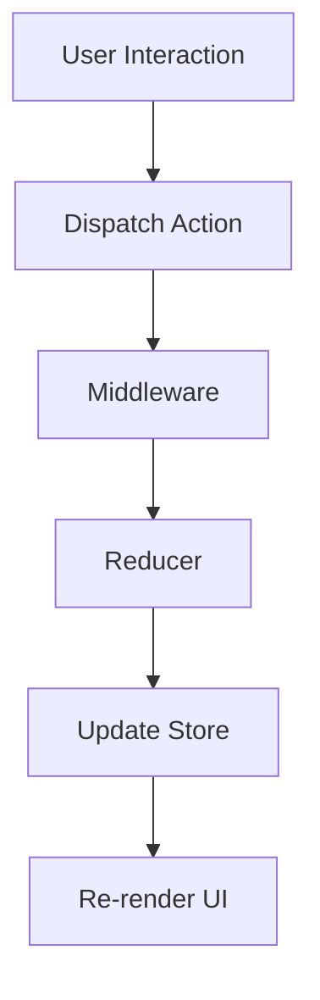

## 7.3.3 Use Cases and Examples

In the realm of modern web development, managing state efficiently is crucial, especially in large-scale applications. Flux and Redux architectures have emerged as powerful solutions for handling complex state management challenges. In this section, we will explore various use cases and examples where Flux and Redux have been effectively applied, particularly in TypeScript projects. We will delve into how these architectures facilitate collaboration in large teams, scale with application complexity, and streamline data flow.

### Understanding Flux and Redux

Before diving into specific use cases, let's briefly revisit what Flux and Redux are and why they are so effective in managing state.

**Flux** is an architectural pattern introduced by Facebook to address the complexities of state management in web applications. It emphasizes unidirectional data flow, which simplifies the process of tracking changes and debugging.

**Redux**, inspired by Flux, is a predictable state container for JavaScript applications. It provides a centralized store for state management, making it easier to manage and debug state changes. Redux is particularly popular in the React ecosystem but can be used with any JavaScript framework.

### Key Concepts of Redux

- **Store**: The single source of truth for the application's state.
- **Actions**: Plain JavaScript objects that describe what happened.
- **Reducers**: Pure functions that specify how the application's state changes in response to actions.
- **Middleware**: Provides a way to extend Redux with custom functionality.

### Use Cases for Flux and Redux

#### 1. Social Media Platforms

Social media platforms are prime examples of applications that benefit from Redux's state management capabilities. These platforms often have complex data flows, with real-time updates, notifications, and user interactions occurring simultaneously.

**Example: Facebook**

Facebook, the birthplace of Flux, utilizes this architecture to manage the vast amount of data flowing through its platform. With millions of users interacting with posts, comments, likes, and shares, maintaining a consistent state across the application is critical. Redux's unidirectional data flow ensures that state changes are predictable and traceable, making it easier to manage and debug.

**Code Example: Managing Notifications**

```typescript
// Action Types
const ADD_NOTIFICATION = 'ADD_NOTIFICATION';
const REMOVE_NOTIFICATION = 'REMOVE_NOTIFICATION';

// Action Creators
function addNotification(message: string) {
  return { type: ADD_NOTIFICATION, payload: message };
}

function removeNotification(id: number) {
  return { type: REMOVE_NOTIFICATION, payload: id };
}

// Reducer
interface NotificationState {
  notifications: { id: number; message: string }[];
}

const initialState: NotificationState = { notifications: [] };

function notificationReducer(state = initialState, action: any): NotificationState {
  switch (action.type) {
    case ADD_NOTIFICATION:
      return {
        ...state,
        notifications: [...state.notifications, { id: Date.now(), message: action.payload }],
      };
    case REMOVE_NOTIFICATION:
      return {
        ...state,
        notifications: state.notifications.filter(notification => notification.id !== action.payload),
      };
    default:
      return state;
  }
}
```

#### 2. E-commerce Platforms

E-commerce sites, with their dynamic product listings, shopping carts, and user accounts, require robust state management to ensure a seamless user experience.

**Example: Amazon**

Amazon's platform handles vast amounts of data, from product details to user preferences and shopping cart contents. Redux helps manage this data efficiently, ensuring that users see the most up-to-date information without unnecessary reloads.

**Code Example: Shopping Cart Management**

```typescript
// Action Types
const ADD_TO_CART = 'ADD_TO_CART';
const REMOVE_FROM_CART = 'REMOVE_FROM_CART';

// Action Creators
function addToCart(productId: number) {
  return { type: ADD_TO_CART, payload: productId };
}

function removeFromCart(productId: number) {
  return { type: REMOVE_FROM_CART, payload: productId };
}

// Reducer
interface CartState {
  items: number[];
}

const initialCartState: CartState = { items: [] };

function cartReducer(state = initialCartState, action: any): CartState {
  switch (action.type) {
    case ADD_TO_CART:
      return { ...state, items: [...state.items, action.payload] };
    case REMOVE_FROM_CART:
      return { ...state, items: state.items.filter(id => id !== action.payload) };
    default:
      return state;
  }
}
```

#### 3. Real-Time Collaboration Tools

Applications like Google Docs or Slack, which require real-time collaboration, benefit significantly from Redux's predictable state management.

**Example: Slack**

Slack uses Redux to manage the state of its chat application, ensuring that messages, notifications, and user statuses are consistent across all clients. Redux's middleware capabilities allow for efficient handling of asynchronous actions, such as fetching messages from a server.

**Code Example: Chat Message Handling**

```typescript
// Action Types
const SEND_MESSAGE = 'SEND_MESSAGE';
const RECEIVE_MESSAGE = 'RECEIVE_MESSAGE';

// Action Creators
function sendMessage(content: string) {
  return { type: SEND_MESSAGE, payload: content };
}

function receiveMessage(content: string) {
  return { type: RECEIVE_MESSAGE, payload: content };
}

// Reducer
interface ChatState {
  messages: string[];
}

const initialChatState: ChatState = { messages: [] };

function chatReducer(state = initialChatState, action: any): ChatState {
  switch (action.type) {
    case SEND_MESSAGE:
      return { ...state, messages: [...state.messages, action.payload] };
    case RECEIVE_MESSAGE:
      return { ...state, messages: [...state.messages, action.payload] };
    default:
      return state;
  }
}
```

### Case Studies in TypeScript Projects

#### Case Study 1: A Large-Scale E-commerce Platform

A large e-commerce company decided to revamp its platform using TypeScript and Redux. The goal was to improve performance and maintainability while providing a seamless user experience. By implementing Redux, the development team was able to:

- **Centralize State Management**: All application state was stored in a single Redux store, making it easier to track and manage.
- **Improve Performance**: By using Redux middleware, the team optimized data fetching and reduced unnecessary re-renders.
- **Enhance Collaboration**: With a clear state management pattern, team members could work on different parts of the application without conflicts.

**Outcome**: The platform saw a significant reduction in bugs related to state management and an improvement in overall performance.

#### Case Study 2: A Real-Time Analytics Dashboard

A tech startup developed a real-time analytics dashboard using TypeScript and Redux. The dashboard needed to handle large volumes of data and provide real-time updates to users. Redux was chosen for its ability to manage complex state efficiently.

- **Scalable Architecture**: Redux's architecture allowed the team to scale the application easily as new features were added.
- **Real-Time Updates**: By leveraging Redux's middleware, the team implemented efficient data polling and real-time updates.
- **Maintainable Codebase**: The use of TypeScript and Redux resulted in a type-safe and maintainable codebase.

**Outcome**: The dashboard was able to handle increasing data loads without performance degradation, and the development team could add new features quickly.

### How Redux Facilitates Collaboration

In large development teams, maintaining consistency and avoiding conflicts can be challenging. Redux provides a clear and predictable state management pattern that facilitates collaboration in several ways:

- **Single Source of Truth**: With all state stored in a single Redux store, team members have a consistent view of the application's state.
- **Predictable State Changes**: Redux's unidirectional data flow ensures that state changes are predictable and traceable, reducing the likelihood of conflicts.
- **Clear Separation of Concerns**: By separating actions, reducers, and components, Redux encourages a modular approach to development, making it easier for team members to work on different parts of the application independently.

### Scaling with Application Complexity

As applications grow in complexity, managing state becomes increasingly challenging. Redux scales effectively with application complexity due to its:

- **Middleware Support**: Redux's middleware allows for the extension of its capabilities, enabling efficient handling of asynchronous actions and side effects.
- **DevTools Integration**: Redux DevTools provide powerful debugging capabilities, allowing developers to track state changes and time-travel through the application's state history.
- **Community and Ecosystem**: Redux has a large and active community, with numerous libraries and tools available to extend its functionality and simplify common tasks.

### Encouraging the Use of Flux and Redux

When facing state management challenges in TypeScript applications, consider using Flux or Redux for their:

- **Predictable State Management**: Unidirectional data flow and centralized state management make it easier to track and debug state changes.
- **Scalability**: Redux's architecture scales well with application complexity, making it suitable for large-scale applications.
- **Collaboration**: Clear separation of concerns and a single source of truth facilitate collaboration in large development teams.

### Try It Yourself

To get hands-on experience with Redux in TypeScript, try modifying the code examples provided in this section. Experiment with adding new actions, reducers, and middleware to see how they affect the application's state management. Consider building a small application, such as a to-do list or a simple chat app, to practice implementing Redux from scratch.

### Visualizing Redux Architecture

To better understand how Redux manages state, let's visualize the architecture using a flowchart.



**Diagram Description**: This flowchart illustrates the Redux data flow. User interactions dispatch actions, which pass through middleware before reaching reducers. Reducers update the store, triggering a UI re-render.

### Knowledge Check

- **Question**: How does Redux's unidirectional data flow simplify state management?
- **Challenge**: Implement a feature in a Redux-based application that requires asynchronous data fetching. Use middleware to handle the asynchronous actions.

### Conclusion

Flux and Redux architectures provide powerful solutions for managing complex state in large-scale applications. By centralizing state management and enforcing unidirectional data flow, these architectures simplify the development process, enhance collaboration, and scale with application complexity. As you continue your journey in TypeScript development, consider leveraging Flux or Redux to tackle state management challenges effectively.

## Quiz Time!



### What is the primary benefit of using Redux in large-scale applications?

- [x] Centralized state management
- [ ] Increased code complexity
- [ ] Reduced code readability
- [ ] Unpredictable state changes

> **Explanation:** Redux centralizes state management, making it easier to track and manage state changes in large-scale applications.

### Which component in Redux is responsible for describing what happened in the application?

- [ ] Store
- [x] Actions
- [ ] Reducers
- [ ] Middleware

> **Explanation:** Actions are plain JavaScript objects that describe what happened in the application.

### How does Redux facilitate collaboration in large development teams?

- [x] By providing a single source of truth for the application's state
- [ ] By increasing code complexity
- [ ] By reducing code readability
- [ ] By making state changes unpredictable

> **Explanation:** Redux provides a single source of truth for the application's state, facilitating collaboration by ensuring consistency.

### What is the role of middleware in Redux?

- [x] To extend Redux with custom functionality
- [ ] To store the application's state
- [ ] To describe what happened in the application
- [ ] To specify how the application's state changes

> **Explanation:** Middleware provides a way to extend Redux with custom functionality, such as handling asynchronous actions.

### In which type of applications is Redux particularly beneficial?

- [x] Applications with complex state management requirements
- [ ] Simple static websites
- [ ] Applications with minimal user interaction
- [ ] Applications with no state management needs

> **Explanation:** Redux is beneficial in applications with complex state management requirements, where centralized state management is crucial.

### What is the main advantage of Redux's unidirectional data flow?

- [x] Predictable state changes
- [ ] Increased code complexity
- [ ] Reduced code readability
- [ ] Unpredictable state changes

> **Explanation:** Redux's unidirectional data flow ensures predictable state changes, making it easier to track and debug.

### How does Redux scale with application complexity?

- [x] By providing middleware support and a large ecosystem
- [ ] By increasing code complexity
- [ ] By reducing code readability
- [ ] By making state changes unpredictable

> **Explanation:** Redux scales with application complexity by providing middleware support and a large ecosystem of tools and libraries.

### What is a common use case for Redux in real-time applications?

- [x] Managing chat messages and notifications
- [ ] Storing static content
- [ ] Minimizing user interaction
- [ ] Reducing application complexity

> **Explanation:** Redux is commonly used in real-time applications to manage chat messages and notifications, ensuring consistency across clients.

### Which architectural pattern inspired Redux?

- [x] Flux
- [ ] MVC
- [ ] MVVM
- [ ] SOA

> **Explanation:** Redux was inspired by the Flux architectural pattern, which emphasizes unidirectional data flow.

### True or False: Redux is only suitable for use with React applications.

- [ ] True
- [x] False

> **Explanation:** False. While Redux is popular in the React ecosystem, it can be used with any JavaScript framework.


