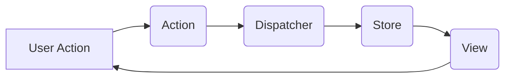

## 7.3 Flux and Redux Architecture

In modern web development, managing application state efficiently and predictably is crucial. As applications grow in complexity, maintaining a clear flow of data becomes challenging. This is where architectural patterns like Flux and Redux come into play. They provide a structured approach to state management, emphasizing unidirectional data flow, which simplifies debugging and enhances maintainability.

### Understanding Flux Architecture

Flux is an architectural pattern introduced by Facebook to address the challenges of state management in complex applications. It proposes a unidirectional data flow, which is a departure from the traditional Model-View-Controller (MVC) pattern. Let's explore the core components of Flux:

#### Components of Flux

1. **Action**: Actions are payloads of information that send data from your application to the dispatcher. They are triggered by user interactions or other events.

2. **Dispatcher**: The dispatcher is a central hub that manages all data flow in a Flux application. It receives actions and dispatches them to the appropriate stores.

3. **Store**: Stores contain the application state and logic. They register with the dispatcher and respond to actions. Stores update their state based on the actions received and notify views of changes.

4. **View**: Views are the components that render the user interface. They listen to changes in the stores and re-render themselves accordingly.

#### Interaction in Flux

The interaction between these components can be visualized as follows:



**Description**: This diagram illustrates the unidirectional data flow in Flux, where user actions trigger actions, which are dispatched to stores, updating the view.

### Introducing Redux: A Popular Implementation of Flux

Redux is a predictable state container for JavaScript applications, inspired by Flux. It simplifies the Flux architecture by introducing a single store and using pure functions to manage state transitions.

#### Key Features of Redux

- **Single Source of Truth**: The entire state of the application is stored in a single object tree within a single store.
- **State is Read-Only**: The only way to change the state is to emit an action, ensuring that changes are predictable.
- **Changes are Made with Pure Functions**: Reducers are pure functions that take the previous state and an action, returning the next state.

#### Benefits of Redux

- **Predictable State Management**: With a single source of truth and immutable state updates, Redux makes state changes predictable and easier to debug.
- **Time Travel Debugging**: Redux DevTools allow developers to inspect every state and action, making it possible to "time travel" through state changes.
- **Ease of Testing**: Pure functions and a clear separation of concerns make Redux applications easier to test.

### Unidirectional Data Flow

Unidirectional data flow is a core principle of both Flux and Redux. It ensures that data flows in a single direction, making the application logic easier to understand and debug.

#### Advantages Over Traditional MVC

- **Simplified Data Flow**: Unlike MVC, where data can flow in multiple directions, unidirectional flow reduces complexity.
- **Improved Debugging**: With a clear path of data flow, tracking down bugs becomes more straightforward.
- **Enhanced Maintainability**: The separation of concerns and predictable state transitions make the codebase easier to maintain.

### Implementing Flux and Redux in TypeScript

TypeScript enhances the implementation of Flux and Redux by providing static typing, which helps catch errors early and improves code readability.

#### Setting Up a Redux Store in TypeScript

Let's walk through setting up a Redux store using TypeScript.

1. **Define Action Types**

```typescript
// Define action types
enum ActionType {
  INCREMENT = 'INCREMENT',
  DECREMENT = 'DECREMENT'
}
```

2. **Create Action Interfaces**

```typescript
// Define action interfaces
interface IncrementAction {
  type: ActionType.INCREMENT;
}

interface DecrementAction {
  type: ActionType.DECREMENT;
}

type Action = IncrementAction | DecrementAction;
```

3. **Define the State Interface**

```typescript
// Define the state interface
interface CounterState {
  count: number;
}
```

4. **Implement Reducers**

Reducers are pure functions that take the current state and an action, returning the new state.

```typescript
// Implement the reducer
const counterReducer = (state: CounterState = { count: 0 }, action: Action): CounterState => {
  switch (action.type) {
    case ActionType.INCREMENT:
      return { count: state.count + 1 };
    case ActionType.DECREMENT:
      return { count: state.count - 1 };
    default:
      return state;
  }
};
```

5. **Create the Redux Store**

```typescript
import { createStore } from 'redux';

// Create the Redux store
const store = createStore(counterReducer);

// Log the initial state
console.log(store.getState());

// Dispatch some actions
store.dispatch({ type: ActionType.INCREMENT });
store.dispatch({ type: ActionType.DECREMENT });

// Log the updated state
console.log(store.getState());
```

**Try It Yourself**: Modify the `counterReducer` to handle a RESET action that sets the count back to zero. Observe how the state changes with each action.

### The Role of Immutability and Pure Functions in Redux

Immutability is a key concept in Redux. By ensuring that state is never mutated directly, Redux enables time travel debugging and ensures that state changes are predictable.

#### Benefits of Immutability

- **Predictability**: Immutable state ensures that data changes are explicit and predictable.
- **Debugging**: With immutable state, developers can easily track changes and identify bugs.
- **Performance**: Immutable data structures can be optimized for performance, reducing unnecessary re-renders.

#### Pure Functions in Redux

Reducers in Redux are pure functions, meaning they do not produce side effects and always return the same output for the same input. This makes them easy to test and reason about.

### Enhancing Flux and Redux with TypeScript's Type System

TypeScript's type system adds an extra layer of safety and clarity to Flux and Redux implementations. By defining types for actions, state, and reducers, developers can catch errors early and ensure that their code is robust.

#### Type Safety in Actions and Reducers

By using TypeScript's union types and enums, we can define a clear contract for actions and ensure that reducers handle all possible action types.

```typescript
// Define a union type for actions
type Action = IncrementAction | DecrementAction;

// Ensure reducers handle all action types
const counterReducer = (state: CounterState = { count: 0 }, action: Action): CounterState => {
  switch (action.type) {
    case ActionType.INCREMENT:
      return { count: state.count + 1 };
    case ActionType.DECREMENT:
      return { count: state.count - 1 };
    default:
      return state;
  }
};
```

### Conclusion

Flux and Redux provide a powerful architecture for managing state in complex applications. By emphasizing unidirectional data flow and leveraging TypeScript's type system, developers can create applications that are predictable, maintainable, and easy to debug. As you continue to explore these patterns, remember to experiment with different implementations and adapt them to your specific needs.

## Quiz Time!



### What is the primary advantage of unidirectional data flow in Flux and Redux?

- [x] Simplifies debugging and enhances maintainability
- [ ] Allows data to flow in multiple directions
- [ ] Increases complexity of the application
- [ ] Makes state changes unpredictable

> **Explanation:** Unidirectional data flow simplifies debugging and enhances maintainability by providing a clear path for data flow.

### In Redux, what is the role of a reducer?

- [x] To take the current state and an action, returning the new state
- [ ] To dispatch actions to the store
- [ ] To render the user interface
- [ ] To manage side effects

> **Explanation:** Reducers are pure functions that take the current state and an action, returning the new state.

### How does TypeScript enhance the implementation of Flux and Redux?

- [x] By providing static typing that catches errors early
- [ ] By allowing dynamic typing
- [ ] By making state changes unpredictable
- [ ] By increasing code complexity

> **Explanation:** TypeScript's static typing helps catch errors early and improves code readability.

### What is a key feature of Redux that distinguishes it from Flux?

- [x] Single source of truth
- [ ] Multiple stores
- [ ] Bidirectional data flow
- [ ] Lack of predictability

> **Explanation:** Redux uses a single store as the single source of truth, unlike Flux which can have multiple stores.

### Which of the following is NOT a component of the Flux architecture?

- [ ] Action
- [ ] Dispatcher
- [x] Reducer
- [ ] Store

> **Explanation:** Reducer is a component of Redux, not Flux. Flux consists of Actions, Dispatcher, Store, and View.

### What is the benefit of immutability in Redux?

- [x] Ensures that state changes are explicit and predictable
- [ ] Allows direct mutation of state
- [ ] Makes debugging more difficult
- [ ] Increases the complexity of state management

> **Explanation:** Immutability ensures that state changes are explicit and predictable, aiding in debugging and maintainability.

### How does Redux achieve predictable state management?

- [x] By using a single source of truth and immutable state updates
- [ ] By allowing multiple sources of truth
- [ ] By using mutable state updates
- [ ] By not using actions

> **Explanation:** Redux achieves predictable state management by using a single source of truth and immutable state updates.

### What is the purpose of the dispatcher in Flux?

- [x] To manage all data flow in a Flux application
- [ ] To directly update the view
- [ ] To render the user interface
- [ ] To create actions

> **Explanation:** The dispatcher manages all data flow in a Flux application, receiving actions and dispatching them to stores.

### In the context of Redux, what is a pure function?

- [x] A function that does not produce side effects and always returns the same output for the same input
- [ ] A function that can mutate state directly
- [ ] A function that produces side effects
- [ ] A function that returns different outputs for the same input

> **Explanation:** A pure function does not produce side effects and always returns the same output for the same input, making it ideal for use in reducers.

### True or False: Redux allows state to be mutated directly.

- [ ] True
- [x] False

> **Explanation:** False. In Redux, state is read-only and can only be changed by emitting an action, ensuring predictability.


