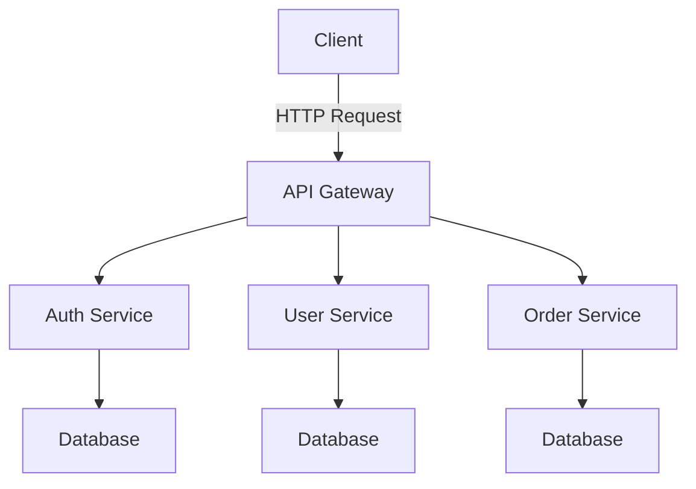

## 7.4.1 Implementing Microservices with TypeScript

Microservices architecture has become a cornerstone in building scalable, maintainable, and robust applications. By breaking down applications into smaller, independent services, developers can focus on specific functionalities, leading to more manageable and flexible systems. In this guide, we will explore how to implement microservices using TypeScript and Node.js, covering everything from setting up a microservice to best practices in error handling, logging, and security.

### Setting Up a Microservice with TypeScript and Node.js

To begin, let's set up a basic microservice using Node.js and TypeScript. We'll use Express, a popular web framework for Node.js, to create a RESTful API.

#### Step 1: Initialize the Project

First, create a new directory for your microservice and initialize a Node.js project.

```bash
mkdir my-microservice
cd my-microservice
npm init -y
```

#### Step 2: Install Required Packages

Install TypeScript, Express, and other necessary packages.

```bash
npm install express
npm install typescript ts-node @types/node @types/express --save-dev
```

- **express**: The web framework for building APIs.
- **typescript**: The TypeScript compiler.
- **ts-node**: Allows us to run TypeScript files directly.
- **@types/node** and **@types/express**: Type definitions for Node.js and Express.

#### Step 3: Configure TypeScript

Create a `tsconfig.json` file to configure the TypeScript compiler.

```json
{
  "compilerOptions": {
    "target": "ES6",
    "module": "commonjs",
    "outDir": "./dist",
    "rootDir": "./src",
    "strict": true,
    "esModuleInterop": true
  },
  "include": ["src/**/*"]
}
```

#### Step 4: Create the Application Structure

Organize your code into a structured directory layout.

```plaintext
my-microservice/
│
├── src/
│   ├── controllers/
│   ├── models/
│   ├── routes/
│   ├── services/
│   ├── app.ts
│
├── package.json
├── tsconfig.json
```

- **controllers/**: Handle incoming requests and responses.
- **models/**: Define data models.
- **routes/**: Define API routes.
- **services/**: Business logic and interactions with data sources.
- **app.ts**: Entry point of the application.

#### Step 5: Implement a Basic RESTful API

Create a simple API endpoint in `src/app.ts`.

```typescript
import express, { Request, Response } from 'express';

const app = express();
const port = process.env.PORT || 3000;

app.use(express.json());

app.get('/', (req: Request, res: Response) => {
  res.send('Hello, World!');
});

app.listen(port, () => {
  console.log(`Microservice running on port ${port}`);
});
```

Run the application using `ts-node`.

```bash
npx ts-node src/app.ts
```

### Structuring Code, Managing Dependencies, and Handling Configurations

A well-structured codebase is crucial for maintainability and scalability. Let's delve into how to organize your code, manage dependencies, and handle configurations effectively.

#### Code Structure

- **Controllers**: Handle HTTP requests and responses. They should be thin, delegating business logic to services.
- **Services**: Contain business logic and interact with data sources. They should be reusable and testable.
- **Models**: Define the shape of data objects, often using libraries like Mongoose for MongoDB.
- **Routes**: Define the API endpoints and map them to controller methods.

#### Managing Dependencies

Use a package manager like npm or yarn to manage dependencies. Keep your `package.json` organized and regularly update dependencies to patch vulnerabilities.

#### Handling Configurations

Use environment variables for configuration settings such as database connections and API keys. Libraries like `dotenv` can help manage these settings.

```bash
npm install dotenv
```

Create a `.env` file for your environment variables.

```plaintext
PORT=3000
DB_CONNECTION_STRING=mongodb://localhost:27017/mydb
```

Load these variables in your application.

```typescript
import dotenv from 'dotenv';

dotenv.config();

const port = process.env.PORT || 3000;
const dbConnectionString = process.env.DB_CONNECTION_STRING;
```

### Implementing Inter-Service Communication

Microservices need to communicate with each other, which can be done synchronously or asynchronously.

#### Synchronous Communication

RESTful APIs are a common method for synchronous communication. Use HTTP requests to interact with other services.

```typescript
import axios from 'axios';

// Example of making a request to another microservice
async function fetchData() {
  try {
    const response = await axios.get('http://other-service/api/data');
    console.log(response.data);
  } catch (error) {
    console.error('Error fetching data:', error);
  }
}
```

#### Asynchronous Communication

For asynchronous communication, consider using message brokers like RabbitMQ or Kafka.

```typescript
import amqp from 'amqplib/callback_api';

amqp.connect('amqp://localhost', (error, connection) => {
  if (error) {
    throw error;
  }
  connection.createChannel((error, channel) => {
    if (error) {
      throw error;
    }
    const queue = 'task_queue';

    channel.assertQueue(queue, {
      durable: true
    });

    channel.sendToQueue(queue, Buffer.from('Hello World'), {
      persistent: true
    });

    console.log(" [x] Sent 'Hello World'");
  });
});
```

### Handling Data Storage and Databases

Data management in microservices can be challenging due to distributed data storage. Each microservice should manage its own database to ensure loose coupling.

#### Choosing a Database

Select a database that fits the needs of your microservice. Common choices include:

- **MongoDB**: A NoSQL database suitable for flexible schemas.
- **PostgreSQL**: A relational database with strong ACID compliance.

#### Connecting to a Database

Use an ORM (Object-Relational Mapping) library like TypeORM or Mongoose to interact with your database.

```typescript
import mongoose from 'mongoose';

mongoose.connect(process.env.DB_CONNECTION_STRING, {
  useNewUrlParser: true,
  useUnifiedTopology: true
}).then(() => {
  console.log('Connected to MongoDB');
}).catch(error => {
  console.error('Error connecting to MongoDB:', error);
});
```

### Best Practices for Error Handling, Logging, and Security

Implementing best practices in error handling, logging, and security is crucial for building reliable microservices.

#### Error Handling

Use middleware to handle errors globally in your application.

```typescript
app.use((err: Error, req: Request, res: Response, next: Function) => {
  console.error(err.stack);
  res.status(500).send('Something broke!');
});
```

#### Logging

Implement logging to monitor your microservices. Libraries like `winston` or `pino` can help.

```typescript
import winston from 'winston';

const logger = winston.createLogger({
  level: 'info',
  format: winston.format.json(),
  transports: [
    new winston.transports.Console()
  ]
});

logger.info('Microservice started');
```

#### Security

Secure your microservices by implementing:

- **Authentication and Authorization**: Use JWT (JSON Web Tokens) for secure authentication.
- **Input Validation**: Validate all incoming data to prevent injection attacks.
- **HTTPS**: Ensure all communications are encrypted.

### Testing Strategies for Microservices

Testing is essential to ensure the reliability of microservices. Implement various testing strategies:

#### Unit Testing

Test individual components in isolation. Use frameworks like Jest or Mocha.

```typescript
import { sum } from './math';
import { expect } from 'chai';

describe('sum', () => {
  it('should return the sum of two numbers', () => {
    expect(sum(1, 2)).to.equal(3);
  });
});
```

#### Integration Testing

Test interactions between components or services. Use tools like Postman or Supertest for API testing.

```typescript
import request from 'supertest';
import app from '../src/app';

describe('GET /', () => {
  it('should return Hello, World!', async () => {
    const response = await request(app).get('/');
    expect(response.text).to.equal('Hello, World!');
  });
});
```

#### End-to-End Testing

Simulate real-world scenarios to test the entire application flow. Tools like Cypress or Selenium can be used.

```typescript
// Example Cypress test
describe('My First Test', () => {
  it('Visits the app root url', () => {
    cy.visit('/');
    cy.contains('Hello, World!');
  });
});
```

### Try It Yourself

Now that we've covered the basics, try modifying the code examples to:

- Add new endpoints and test them.
- Implement a new service and set up inter-service communication.
- Experiment with different databases and ORM libraries.
- Enhance error handling and logging mechanisms.

### Visualizing Microservices Architecture

To better understand how microservices interact, let's visualize a typical microservices architecture using Mermaid.js.



**Diagram Description**: This diagram represents a simple microservices architecture where a client interacts with an API Gateway. The gateway routes requests to various services such as Auth, User, and Order services, each managing its own database.

### References and Links

- [Node.js Documentation](https://nodejs.org/en/docs/)
- [TypeScript Documentation](https://www.typescriptlang.org/docs/)
- [Express Documentation](https://expressjs.com/)
- [Mongoose Documentation](https://mongoosejs.com/)
- [TypeORM Documentation](https://typeorm.io/)

### Knowledge Check

- What are the benefits of using microservices architecture?
- How can you handle inter-service communication in microservices?
- What are some best practices for error handling in microservices?

### Embrace the Journey

Remember, building microservices is a journey. As you progress, you'll encounter challenges that will enhance your skills and understanding. Keep experimenting, stay curious, and enjoy the process of creating scalable and efficient systems!

## Quiz Time!



### What is the primary advantage of using microservices architecture?

- [x] Scalability and flexibility
- [ ] Simplified deployment
- [ ] Reduced development time
- [ ] Easier debugging

> **Explanation:** Microservices architecture allows for scalability and flexibility by breaking down applications into smaller, independent services.

### Which library is commonly used for building RESTful APIs in Node.js?

- [x] Express
- [ ] React
- [ ] Angular
- [ ] Vue

> **Explanation:** Express is a popular web framework for building RESTful APIs in Node.js.

### How can you manage configurations in a microservice?

- [x] Use environment variables
- [ ] Hardcode values in the code
- [ ] Store configurations in a database
- [ ] Use JSON files only

> **Explanation:** Environment variables are a common way to manage configurations in microservices, allowing for flexibility and security.

### What is a common method for synchronous inter-service communication?

- [x] RESTful APIs
- [ ] Message queues
- [ ] WebSockets
- [ ] File transfers

> **Explanation:** RESTful APIs are commonly used for synchronous inter-service communication.

### Which of the following is a best practice for error handling in microservices?

- [x] Use middleware for global error handling
- [ ] Ignore errors to prevent crashes
- [ ] Log errors to the console only
- [ ] Rely on client-side error handling

> **Explanation:** Using middleware for global error handling is a best practice to ensure consistent and centralized error management.

### What is the purpose of using JWT in microservices?

- [x] Secure authentication
- [ ] Data storage
- [ ] Logging
- [ ] Performance optimization

> **Explanation:** JWT (JSON Web Tokens) are used for secure authentication in microservices.

### Which testing strategy involves testing the entire application flow?

- [x] End-to-End Testing
- [ ] Unit Testing
- [ ] Integration Testing
- [ ] Load Testing

> **Explanation:** End-to-End Testing simulates real-world scenarios to test the entire application flow.

### What is a common tool for managing asynchronous inter-service communication?

- [x] RabbitMQ
- [ ] Express
- [ ] Mocha
- [ ] Cypress

> **Explanation:** RabbitMQ is a message broker commonly used for managing asynchronous inter-service communication.

### How can you ensure secure communication between microservices?

- [x] Use HTTPS
- [ ] Use HTTP
- [ ] Disable encryption
- [ ] Use plain text communication

> **Explanation:** Using HTTPS ensures secure communication between microservices by encrypting data in transit.

### True or False: Each microservice should manage its own database.

- [x] True
- [ ] False

> **Explanation:** In microservices architecture, each microservice should manage its own database to ensure loose coupling and independence.


