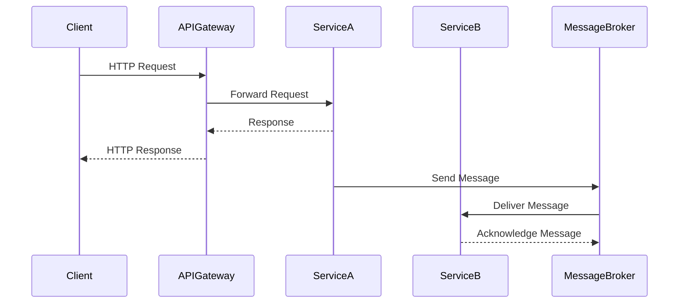

## 7.4.2 Communication Between Services

In the world of microservices architecture, communication between services is a fundamental aspect that determines the efficiency, scalability, and reliability of the entire system. In this section, we will delve into the various methods of communication between microservices, focusing on RESTful APIs for synchronous communication and message brokers for asynchronous communication. We will also explore practical examples of implementing these methods in TypeScript, discuss considerations for data consistency, idempotency, and transaction management, and highlight patterns like API Gateway and Service Discovery. Additionally, we will address the impact of network latency and failures on service communication and offer best practices for designing robust communication protocols.

### RESTful APIs for Synchronous Communication

RESTful APIs are a popular choice for synchronous communication between microservices due to their simplicity and stateless nature. They use HTTP protocols to enable services to communicate over a network, making them accessible and easy to implement.

#### Implementing RESTful APIs in TypeScript

To implement a RESTful API in TypeScript, we can use frameworks like Express.js, which provides a robust set of features for building web and mobile applications. Here's a simple example of a RESTful API using Express.js in TypeScript:

```typescript
import express, { Request, Response } from 'express';

const app = express();
const port = 3000;

// Middleware to parse JSON requests
app.use(express.json());

// Define a simple GET endpoint
app.get('/api/service', (req: Request, res: Response) => {
    res.json({ message: 'Hello from Service A!' });
});

// Define a POST endpoint
app.post('/api/service', (req: Request, res: Response) => {
    const data = req.body;
    res.json({ message: 'Data received', data });
});

// Start the server
app.listen(port, () => {
    console.log(`Service A running at http://localhost:${port}`);
});
```

In this example, we define two endpoints: a GET endpoint that returns a simple message and a POST endpoint that echoes back the data it receives. This setup allows for straightforward communication between services using HTTP requests.

#### Considerations for RESTful APIs

When using RESTful APIs for communication, consider the following:

- **Data Consistency**: Ensure that data remains consistent across services. Implement mechanisms like versioning and validation to handle changes in data structures.
- **Idempotency**: Design APIs to be idempotent, meaning that repeated requests have the same effect as a single request. This is crucial for operations like creating or updating resources.
- **Transaction Management**: Handle transactions carefully, especially when multiple services are involved. Consider using distributed transaction patterns like Saga to manage complex workflows.

### Message Brokers for Asynchronous Communication

For asynchronous communication, message brokers like RabbitMQ and Kafka are commonly used. These systems allow services to communicate by sending messages to a broker, which then routes the messages to the appropriate recipients.

#### Implementing Message Brokers in TypeScript

Let's explore how to implement a simple message broker using RabbitMQ in TypeScript. We'll create a producer service that sends messages and a consumer service that receives them.

**Producer Service:**

```typescript
import amqp from 'amqplib/callback_api';

const queue = 'task_queue';
const message = 'Hello, RabbitMQ!';

// Connect to RabbitMQ server
amqp.connect('amqp://localhost', (error0, connection) => {
    if (error0) {
        throw error0;
    }
    // Create a channel
    connection.createChannel((error1, channel) => {
        if (error1) {
            throw error1;
        }
        // Assert a queue
        channel.assertQueue(queue, {
            durable: true
        });
        // Send a message to the queue
        channel.sendToQueue(queue, Buffer.from(message), {
            persistent: true
        });
        console.log(`Sent: ${message}`);
    });
});
```

**Consumer Service:**

```typescript
import amqp from 'amqplib/callback_api';

const queue = 'task_queue';

// Connect to RabbitMQ server
amqp.connect('amqp://localhost', (error0, connection) => {
    if (error0) {
        throw error0;
    }
    // Create a channel
    connection.createChannel((error1, channel) => {
        if (error1) {
            throw error1;
        }
        // Assert a queue
        channel.assertQueue(queue, {
            durable: true
        });
        // Consume messages from the queue
        channel.consume(queue, (msg) => {
            if (msg !== null) {
                console.log(`Received: ${msg.content.toString()}`);
                channel.ack(msg);
            }
        }, {
            noAck: false
        });
    });
});
```

In this setup, the producer sends messages to a queue, and the consumer listens for messages on the same queue. This decouples the services, allowing them to operate independently.

#### Considerations for Message Brokers

When using message brokers, consider the following:

- **Data Consistency**: Ensure that messages are processed in the correct order and that no messages are lost. Implement mechanisms like message acknowledgments and retries.
- **Idempotency**: Design consumers to handle duplicate messages gracefully, ensuring that processing a message multiple times does not lead to inconsistent states.
- **Transaction Management**: Use transactions to ensure that message processing is atomic, particularly when multiple operations are involved.

### Patterns for Inter-Service Communication

#### API Gateway

An API Gateway acts as a single entry point for all client requests, routing them to the appropriate services. It provides a unified interface and can handle cross-cutting concerns like authentication, logging, and rate limiting.

**Benefits of API Gateway:**

- Simplifies client interactions by providing a single endpoint.
- Centralizes authentication and authorization.
- Enables request transformation and protocol translation.

#### Service Discovery

Service Discovery is a mechanism that allows services to find each other dynamically. It eliminates the need for hardcoding service addresses, enabling services to scale and evolve independently.

**Benefits of Service Discovery:**

- Facilitates load balancing by distributing requests across multiple instances.
- Supports dynamic scaling by automatically detecting new instances.
- Enhances fault tolerance by rerouting requests when services fail.

### Impact of Network Latency and Failures

Network latency and failures can significantly impact service communication. To mitigate these issues, consider the following strategies:

- **Retry Mechanisms**: Implement retry logic with exponential backoff to handle transient failures.
- **Circuit Breaker Pattern**: Use circuit breakers to prevent cascading failures by temporarily halting requests to a failing service.
- **Timeouts**: Set appropriate timeouts for requests to avoid hanging operations.

### Best Practices for Designing Robust Communication Protocols

- **Use Standard Protocols**: Leverage widely adopted protocols like HTTP/HTTPS for RESTful APIs and AMQP for message brokers.
- **Ensure Security**: Implement security measures like TLS for data encryption and OAuth for authentication.
- **Monitor and Log**: Continuously monitor service interactions and log relevant data for troubleshooting and optimization.
- **Design for Scalability**: Architect services to handle increased load by distributing requests and scaling horizontally.

### Visualizing Communication Between Services

Below is a sequence diagram illustrating the interaction between a client, an API Gateway, and two microservices using both RESTful APIs and message brokers:



This diagram illustrates how a client interacts with an API Gateway, which forwards requests to Service A. Service A then communicates asynchronously with Service B through a message broker.

### Try It Yourself

To deepen your understanding, try modifying the code examples provided:

- **Experiment with Different Endpoints**: Add more endpoints to the RESTful API and observe how they interact with each other.
- **Implement Additional Message Queues**: Set up multiple queues and explore how messages can be routed between different services.
- **Integrate API Gateway and Service Discovery**: Implement a simple API Gateway and explore how it can be used to route requests to different services dynamically.

### Knowledge Check

- **What are the key differences between synchronous and asynchronous communication in microservices?**
- **How can you ensure data consistency when using RESTful APIs?**
- **What role does an API Gateway play in microservices architecture?**
- **Why is idempotency important in inter-service communication?**
- **How can network latency impact service communication, and what strategies can mitigate it?**

### Embrace the Journey

Remember, mastering communication between services is a journey. As you progress, you'll build more resilient and scalable systems. Keep experimenting, stay curious, and enjoy the journey!

## Quiz Time!



### What is the primary purpose of using RESTful APIs in microservices communication?

- [x] To enable synchronous communication between services
- [ ] To handle asynchronous message processing
- [ ] To manage distributed transactions
- [ ] To perform load balancing

> **Explanation:** RESTful APIs are used for synchronous communication, allowing services to interact in real-time over HTTP.

### Which of the following is a benefit of using an API Gateway?

- [x] Centralizes authentication and authorization
- [ ] Increases network latency
- [ ] Hardcodes service addresses
- [ ] Eliminates the need for message brokers

> **Explanation:** An API Gateway centralizes authentication and authorization, simplifying client interactions with services.

### What is a key consideration when using message brokers for communication?

- [x] Ensuring message processing is idempotent
- [ ] Hardcoding service addresses
- [ ] Increasing network latency
- [ ] Eliminating the need for retries

> **Explanation:** Idempotency ensures that processing a message multiple times does not lead to inconsistent states.

### How can network latency impact microservices communication?

- [x] It can cause delays in request processing
- [ ] It eliminates the need for retries
- [ ] It increases the speed of message delivery
- [ ] It simplifies service discovery

> **Explanation:** Network latency can cause delays, impacting the performance and responsiveness of microservices.

### What is the role of Service Discovery in microservices?

- [x] Facilitates dynamic service location and load balancing
- [ ] Increases network latency
- [ ] Hardcodes service addresses
- [ ] Eliminates the need for message brokers

> **Explanation:** Service Discovery allows services to find each other dynamically, supporting load balancing and scaling.

### Why is idempotency important in RESTful API design?

- [x] To ensure repeated requests have the same effect
- [ ] To increase network latency
- [ ] To eliminate the need for retries
- [ ] To hardcode service addresses

> **Explanation:** Idempotency ensures that repeated requests do not cause unintended side effects, maintaining data consistency.

### What strategy can mitigate the impact of network failures on service communication?

- [x] Implementing retry mechanisms with exponential backoff
- [ ] Hardcoding service addresses
- [ ] Increasing network latency
- [ ] Eliminating the need for message brokers

> **Explanation:** Retry mechanisms with exponential backoff help handle transient failures, improving resilience.

### How does an API Gateway simplify client interactions?

- [x] By providing a single entry point for all requests
- [ ] By increasing network latency
- [ ] By hardcoding service addresses
- [ ] By eliminating the need for retries

> **Explanation:** An API Gateway provides a unified interface, simplifying how clients interact with multiple services.

### What is a benefit of using message brokers like RabbitMQ?

- [x] Decouples services, allowing independent operation
- [ ] Increases network latency
- [ ] Hardcodes service addresses
- [ ] Eliminates the need for retries

> **Explanation:** Message brokers decouple services, enabling them to communicate asynchronously and independently.

### True or False: Service Discovery eliminates the need for load balancing.

- [ ] True
- [x] False

> **Explanation:** Service Discovery facilitates load balancing by dynamically locating services, but does not eliminate the need for it.


