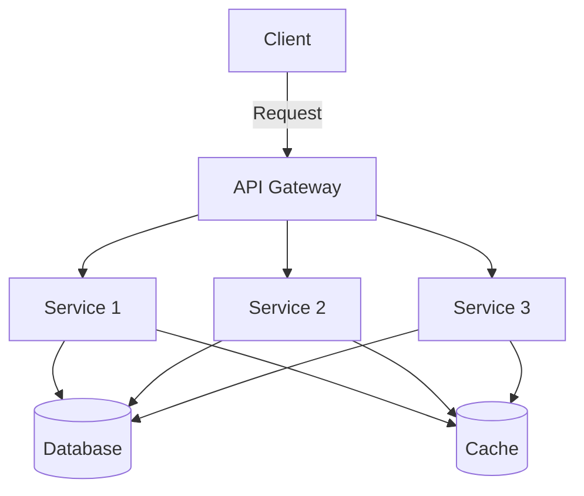

## 7.4.3 Use Cases and Examples

Microservices architecture has become a cornerstone of modern software development, especially for organizations aiming to build scalable, flexible, and resilient systems. In this section, we'll explore real-world use cases and examples where microservices architecture has been successfully implemented. We'll also delve into the benefits and challenges associated with this architectural style, providing insights into how TypeScript can be leveraged in building microservices.

### Real-World Examples of Microservices Adoption

#### 1. Netflix

Netflix is often cited as a pioneer in adopting microservices architecture. Initially, Netflix operated on a monolithic architecture, which became increasingly difficult to manage as the company scaled. By transitioning to microservices, Netflix was able to:

- **Scale Independently**: Each microservice can be scaled independently based on its specific load and performance requirements.
- **Deploy Continuously**: Teams can deploy updates to individual microservices without affecting the entire system.
- **Enhance Resilience**: If one microservice fails, it doesn't bring down the entire application, improving overall system reliability.

Netflix's success with microservices has inspired many other organizations to follow suit, demonstrating the architecture's potential for scalability and resilience.

#### 2. Amazon

Amazon's e-commerce platform is another prime example of microservices in action. By breaking down its monolithic application into microservices, Amazon achieved:

- **Decentralized Development**: Teams can work on different services independently, fostering innovation and reducing bottlenecks.
- **Technology Diversity**: Different microservices can be developed using the most suitable technology stack, allowing for greater flexibility and optimization.
- **Fault Isolation**: Issues in one service do not affect others, which is crucial for maintaining uptime in a global e-commerce platform.

Amazon's use of microservices has enabled it to handle massive traffic and transaction volumes efficiently.

### Applications Benefiting from Microservices

Microservices architecture is particularly beneficial for the following types of applications:

#### 1. Large-Scale Web Platforms

Web platforms that serve millions of users, such as social media sites or content delivery networks, can greatly benefit from microservices. The architecture allows these platforms to:

- **Scale Horizontally**: Services can be replicated across multiple servers to handle increased load.
- **Optimize Resource Usage**: Different services can be allocated resources based on their specific needs, improving overall efficiency.
- **Enhance User Experience**: Faster deployment cycles enable quicker updates and feature releases, enhancing user satisfaction.

#### 2. Software as a Service (SaaS) Products

SaaS products often require frequent updates and feature additions. Microservices architecture supports this by:

- **Facilitating Continuous Integration and Deployment**: Teams can deploy updates to individual services without downtime.
- **Supporting Multi-Tenancy**: Services can be designed to support multiple clients with varying requirements.
- **Enabling Customization**: Clients can have customized features without affecting the core application.

### Benefits of Microservices Architecture

#### 1. Scalability

Microservices allow for independent scaling of services. This means that you can allocate resources to services that require more processing power or bandwidth without impacting others. This is particularly useful in applications with varying load patterns.

#### 2. Fault Isolation

In a microservices architecture, the failure of one service does not necessarily lead to the failure of the entire system. This isolation enhances the resilience of the application, as issues can be contained and addressed without widespread disruption.

#### 3. Technology Diversity

Microservices enable the use of different technologies for different services. This allows developers to choose the best tools and frameworks for each service, optimizing performance and development speed.

#### 4. Independent Development and Deployment

Teams can develop, test, and deploy their services independently. This autonomy reduces dependencies and accelerates the development process, allowing for more frequent and reliable releases.

### Challenges and Solutions

While microservices offer numerous benefits, they also introduce certain challenges:

#### 1. Complexity in Managing Distributed Systems

Managing a distributed system with numerous microservices can be complex. To overcome this, consider:

- **Implementing Service Discovery**: Use tools like Consul or Eureka to manage service instances and enable dynamic discovery.
- **Adopting Containerization**: Use Docker to package services, ensuring consistency across environments.
- **Utilizing Orchestration Tools**: Employ Kubernetes to manage containerized applications, providing automated deployment, scaling, and management.

#### 2. Data Management

Data consistency and management can be challenging in a microservices architecture. Solutions include:

- **Event Sourcing**: Capture all changes as events, allowing for rebuilding state and ensuring consistency.
- **CQRS (Command Query Responsibility Segregation)**: Separate read and write operations to optimize performance and scalability.

#### 3. Network Latency and Security

Increased network communication between services can lead to latency and security concerns. Address these by:

- **Implementing API Gateways**: Use an API gateway to manage requests, enforce security policies, and reduce latency.
- **Employing Circuit Breakers**: Use patterns like the Circuit Breaker to handle failures gracefully and prevent cascading failures.

### Leveraging TypeScript in Microservices

TypeScript can play a crucial role in building microservices by providing:

- **Type Safety**: Ensure that data structures and interfaces are consistent across services, reducing runtime errors.
- **Code Maintainability**: TypeScript's static typing and modern syntax improve code readability and maintainability.
- **Integration with Node.js**: TypeScript works seamlessly with Node.js, a popular choice for building microservices due to its non-blocking I/O and scalability.

### Try It Yourself

To get hands-on experience with microservices in TypeScript, try building a simple application with the following steps:

1. **Set Up a Basic Microservice**: Create a new Node.js project with TypeScript and express a simple REST API.
2. **Implement Service Communication**: Use HTTP or gRPC for communication between services.
3. **Add a Database**: Integrate a database like MongoDB or PostgreSQL, and use TypeScript to define data models.
4. **Containerize the Service**: Use Docker to create a container image of your service.
5. **Deploy and Scale**: Deploy your service using Kubernetes, and experiment with scaling it up and down.

### Visualizing Microservices Architecture

To better understand the structure of a microservices architecture, consider the following diagram:

**Diagram Description**: This diagram illustrates a typical microservices architecture where a client interacts with an API gateway, which routes requests to various services. Each service can independently access a shared database or cache, enabling scalability and fault tolerance.

### Conclusion

Microservices architecture offers a robust framework for building scalable, flexible, and resilient applications. By leveraging TypeScript, developers can enhance type safety and maintainability, making it an excellent choice for microservices development. While challenges exist, they can be effectively managed with the right tools and practices. As you consider adopting microservices, remember that the journey involves continuous learning and adaptation, but the rewards in terms of scalability and agility are well worth the effort.

## Quiz Time!



### Which company is often cited as a pioneer in adopting microservices architecture?

- [x] Netflix
- [ ] Google
- [ ] Microsoft
- [ ] IBM

> **Explanation:** Netflix is widely recognized for its successful transition from a monolithic architecture to microservices, which has inspired many other organizations.

### What is a key benefit of microservices architecture in terms of deployment?

- [x] Independent development and deployment cycles
- [ ] Centralized deployment
- [ ] Single point of failure
- [ ] Monolithic updates

> **Explanation:** Microservices allow teams to develop and deploy services independently, reducing dependencies and accelerating release cycles.

### How does microservices architecture enhance fault isolation?

- [x] By containing failures within individual services
- [ ] By centralizing error handling
- [ ] By using a single database
- [ ] By deploying all services together

> **Explanation:** In microservices architecture, the failure of one service does not affect others, allowing for better fault isolation.

### What tool can be used for service discovery in a microservices architecture?

- [x] Consul
- [ ] Docker
- [ ] TypeScript
- [ ] Node.js

> **Explanation:** Consul is a tool that helps manage service instances and enables dynamic discovery in a microservices environment.

### Which pattern can help manage data consistency in microservices?

- [x] Event Sourcing
- [ ] Singleton
- [ ] Factory Method
- [ ] Adapter

> **Explanation:** Event Sourcing captures all changes as events, allowing for consistent state rebuilding across services.

### What is a common challenge when implementing microservices?

- [x] Managing distributed systems complexity
- [ ] Lack of scalability
- [ ] Centralized development
- [ ] Single technology stack

> **Explanation:** Managing distributed systems complexity is a common challenge in microservices, requiring tools and practices to handle it effectively.

### How can TypeScript enhance microservices development?

- [x] By providing type safety and maintainability
- [ ] By enforcing runtime checks
- [ ] By limiting technology choices
- [ ] By centralizing code

> **Explanation:** TypeScript's static typing and modern syntax improve code readability, maintainability, and type safety in microservices development.

### What role does an API gateway play in microservices architecture?

- [x] It routes requests to various services
- [ ] It stores data for all services
- [ ] It directly communicates with clients
- [ ] It replaces individual services

> **Explanation:** An API gateway acts as an entry point for client requests, routing them to the appropriate services.

### Which of the following is a benefit of using Docker in microservices?

- [x] Consistent environment across deployments
- [ ] Centralized service management
- [ ] Single point of failure
- [ ] Monolithic architecture

> **Explanation:** Docker provides a consistent environment for deploying services, ensuring that they run the same way in different environments.

### True or False: Microservices architecture allows for technology diversity across different services.

- [x] True
- [ ] False

> **Explanation:** Microservices architecture enables the use of different technologies for different services, allowing developers to choose the best tools for each service.


