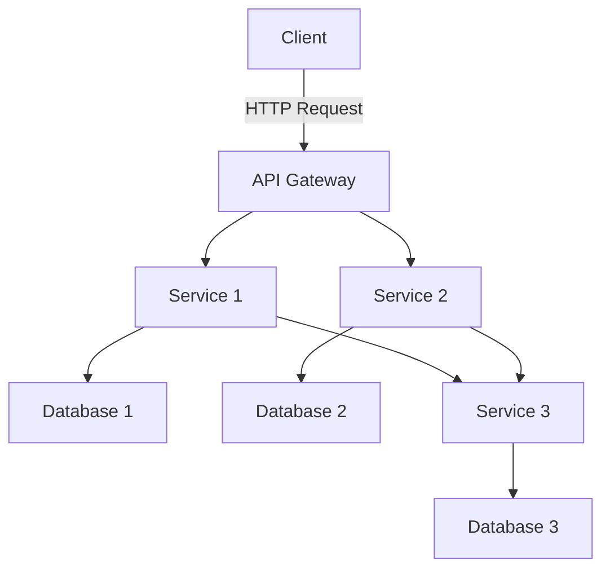

## 7.4 Microservices Architecture

In the rapidly evolving landscape of software development, the microservices architecture has emerged as a powerful paradigm for building scalable and maintainable applications. This section delves into the principles of microservices, contrasts them with monolithic architectures, and explores their implementation using TypeScript and Node.js. We will also discuss the role of APIs, deployment strategies, and scaling considerations.

### Understanding Microservices Architecture

Microservices architecture is an approach to software development where an application is composed of small, independent services that communicate over a network. Each service is designed to perform a specific business function and can be developed, deployed, and scaled independently.

#### Principles of Microservices

1. **Single Responsibility**: Each microservice is responsible for a specific business capability, adhering to the principle of single responsibility.
2. **Independence**: Microservices are independently deployable and scalable, allowing for greater flexibility and resilience.
3. **Decentralized Data Management**: Each service manages its own data, promoting autonomy and reducing dependencies.
4. **Communication via APIs**: Services communicate through well-defined APIs, often using HTTP/REST or messaging protocols.
5. **Polyglot Programming**: Different services can be developed using different programming languages and technologies, best suited for their specific needs.

#### Benefits of Microservices

- **Scalability**: Services can be scaled independently based on demand.
- **Resilience**: Failure in one service does not impact the entire system.
- **Flexibility**: Teams can work on different services simultaneously, using the best tools and technologies for each.
- **Faster Deployment**: Smaller, independent services enable more frequent and faster deployments.

### Microservices vs. Monolithic Architecture

In a monolithic architecture, an application is built as a single, unified unit. While this approach can simplify development and deployment initially, it often leads to challenges as the application grows.

#### Key Differences

- **Deployment**: Monolithic applications require the entire system to be redeployed for any change, whereas microservices allow for independent deployment of services.
- **Scalability**: Scaling a monolithic application often means scaling the entire system, while microservices can be scaled individually.
- **Complexity**: Microservices introduce complexity in terms of inter-service communication and data consistency, which must be managed effectively.

### Challenges of Microservices

While microservices offer numerous advantages, they also come with challenges:

1. **Communication Complexity**: Managing communication between services can become complex, requiring robust API design and message handling.
2. **Data Consistency**: Ensuring data consistency across distributed services is challenging, often requiring eventual consistency models.
3. **Deployment and Monitoring**: Deploying and monitoring multiple services can be complex, necessitating sophisticated tooling and practices.
4. **Security**: Each service must be secured independently, increasing the overall security management effort.

### Building Microservices with TypeScript and Node.js

TypeScript and Node.js provide a robust platform for building microservices, offering strong typing, asynchronous programming capabilities, and a rich ecosystem of libraries.

#### Setting Up a Basic Microservice

Let's walk through setting up a simple microservice using TypeScript and Node.js.

```typescript
// Import necessary modules
import express from 'express';

// Create an instance of Express
const app = express();

// Define a simple route
app.get('/api/hello', (req, res) => {
  res.json({ message: 'Hello from Microservice!' });
});

// Start the server
const PORT = process.env.PORT || 3000;
app.listen(PORT, () => {
  console.log(`Microservice running on port ${PORT}`);
});
```

This code sets up a basic HTTP server using Express, a popular Node.js framework. The service listens on a specified port and responds to requests at the `/api/hello` endpoint.

#### Designing Effective APIs

APIs are the backbone of microservices, enabling communication between services. Effective API design is crucial for the success of a microservices architecture.

1. **RESTful Principles**: Design APIs following RESTful principles, using HTTP methods (GET, POST, PUT, DELETE) appropriately.
2. **Versioning**: Implement API versioning to manage changes without breaking existing clients.
3. **Documentation**: Provide comprehensive documentation using tools like Swagger or OpenAPI.
4. **Security**: Secure APIs using authentication and authorization mechanisms such as OAuth2 or JWT.

#### Example: Creating a RESTful API

```typescript
// Import necessary modules
import express from 'express';
import bodyParser from 'body-parser';

// Create an instance of Express
const app = express();
app.use(bodyParser.json());

// Define a simple in-memory data store
let items: { id: number; name: string }[] = [];

// Create an item
app.post('/api/items', (req, res) => {
  const newItem = { id: items.length + 1, name: req.body.name };
  items.push(newItem);
  res.status(201).json(newItem);
});

// Get all items
app.get('/api/items', (req, res) => {
  res.json(items);
});

// Get a specific item
app.get('/api/items/:id', (req, res) => {
  const item = items.find(i => i.id === parseInt(req.params.id));
  if (item) {
    res.json(item);
  } else {
    res.status(404).json({ message: 'Item not found' });
  }
});

// Update an item
app.put('/api/items/:id', (req, res) => {
  const item = items.find(i => i.id === parseInt(req.params.id));
  if (item) {
    item.name = req.body.name;
    res.json(item);
  } else {
    res.status(404).json({ message: 'Item not found' });
  }
});

// Delete an item
app.delete('/api/items/:id', (req, res) => {
  const index = items.findIndex(i => i.id === parseInt(req.params.id));
  if (index !== -1) {
    items.splice(index, 1);
    res.status(204).send();
  } else {
    res.status(404).json({ message: 'Item not found' });
  }
});

// Start the server
const PORT = process.env.PORT || 3000;
app.listen(PORT, () => {
  console.log(`API running on port ${PORT}`);
});
```

This example demonstrates a simple RESTful API for managing items. It includes endpoints for creating, retrieving, updating, and deleting items.

### Deployment and Monitoring

Deploying and monitoring microservices require careful consideration to ensure reliability and performance.

#### Deployment Strategies

1. **Containerization**: Use Docker to containerize services, ensuring consistency across environments.
2. **Orchestration**: Employ Kubernetes or Docker Swarm to manage service deployment, scaling, and load balancing.
3. **Continuous Integration/Continuous Deployment (CI/CD)**: Implement CI/CD pipelines to automate testing and deployment.

#### Monitoring and Logging

1. **Centralized Logging**: Use tools like ELK Stack (Elasticsearch, Logstash, Kibana) to aggregate and analyze logs.
2. **Monitoring Tools**: Implement monitoring solutions like Prometheus and Grafana to track service health and performance.
3. **Alerting**: Set up alerting mechanisms to notify teams of issues in real-time.

### Scaling Microservices

Scaling microservices involves adjusting resources to meet demand, ensuring optimal performance and cost-efficiency.

#### Horizontal vs. Vertical Scaling

- **Horizontal Scaling**: Add more instances of a service to distribute load. This is often more cost-effective and resilient.
- **Vertical Scaling**: Increase resources (CPU, RAM) for existing instances. This can be limited by hardware constraints.

#### Auto-Scaling

Implement auto-scaling to automatically adjust the number of service instances based on demand. This can be achieved using cloud provider services like AWS Auto Scaling or Kubernetes Horizontal Pod Autoscaler.

### Try It Yourself

Experiment with the provided code examples by:

- Modifying the API to include additional endpoints or data fields.
- Implementing authentication mechanisms to secure the API.
- Deploying the service using Docker and Kubernetes.
- Setting up monitoring and logging for the deployed service.

### Visualizing Microservices Architecture

Below is a diagram illustrating a typical microservices architecture, highlighting the interaction between services, APIs, and data stores.



**Diagram Description**: This diagram shows a client interacting with an API Gateway, which routes requests to various services. Each service manages its own database, and services can communicate with each other as needed.

### References and Further Reading

- [Microservices - A Definition of this New Architectural Term](https://martinfowler.com/articles/microservices.html) by Martin Fowler
- [Node.js Microservices Architecture](https://nodejs.org/en/docs/guides/) - Node.js Official Documentation
- [Building Microservices with TypeScript](https://www.typescriptlang.org/docs/handbook/migrating-from-javascript.html) - TypeScript Handbook

### Knowledge Check

1. What are the core principles of microservices architecture?
2. How do microservices differ from monolithic architectures?
3. What are some common challenges associated with microservices?
4. How can TypeScript and Node.js be used to build microservices?
5. What are some best practices for designing APIs in a microservices architecture?

### Embrace the Journey

Remember, transitioning to a microservices architecture is a journey. It requires careful planning, execution, and continuous improvement. As you progress, you'll gain insights into optimizing your architecture for scalability, resilience, and performance. Keep experimenting, stay curious, and enjoy the journey!

## Quiz Time!



### What is a key benefit of microservices architecture?

- [x] Scalability
- [ ] Increased complexity
- [ ] Monolithic deployment
- [ ] Centralized data management

> **Explanation:** Microservices architecture allows for independent scaling of services, enhancing scalability.

### Which of the following is a challenge associated with microservices?

- [x] Communication complexity
- [ ] Simplified deployment
- [ ] Reduced flexibility
- [ ] Centralized logging

> **Explanation:** Microservices introduce complexity in managing communication between services.

### How do microservices differ from monolithic architectures?

- [x] Microservices are independently deployable.
- [ ] Microservices require the entire system to be redeployed for any change.
- [ ] Monolithic architectures allow for individual service scaling.
- [ ] Microservices centralize data management.

> **Explanation:** Microservices allow for independent deployment and scaling of services.

### What is a common strategy for deploying microservices?

- [x] Containerization
- [ ] Manual deployment
- [ ] Single server deployment
- [ ] Centralized deployment

> **Explanation:** Containerization using tools like Docker is a common strategy for deploying microservices.

### What role do APIs play in microservices architecture?

- [x] Enable communication between services
- [ ] Centralize data management
- [ ] Simplify deployment
- [ ] Increase monolithic structure

> **Explanation:** APIs are crucial for enabling communication between microservices.

### Which tool is commonly used for monitoring microservices?

- [x] Prometheus
- [ ] Docker
- [ ] Node.js
- [ ] TypeScript

> **Explanation:** Prometheus is a popular monitoring tool for microservices.

### What is horizontal scaling in the context of microservices?

- [x] Adding more instances of a service
- [ ] Increasing resources for existing instances
- [ ] Reducing the number of services
- [ ] Centralizing service management

> **Explanation:** Horizontal scaling involves adding more instances of a service to distribute load.

### What is a benefit of using TypeScript for building microservices?

- [x] Strong typing
- [ ] Increased complexity
- [ ] Reduced flexibility
- [ ] Centralized data management

> **Explanation:** TypeScript provides strong typing, which enhances code reliability and maintainability.

### Which of the following is a principle of microservices architecture?

- [x] Single responsibility
- [ ] Centralized deployment
- [ ] Monolithic design
- [ ] Reduced scalability

> **Explanation:** Each microservice is responsible for a specific business capability, adhering to the single responsibility principle.

### True or False: Microservices allow for polyglot programming.

- [x] True
- [ ] False

> **Explanation:** Microservices architecture supports polyglot programming, allowing different services to be developed using different programming languages.


