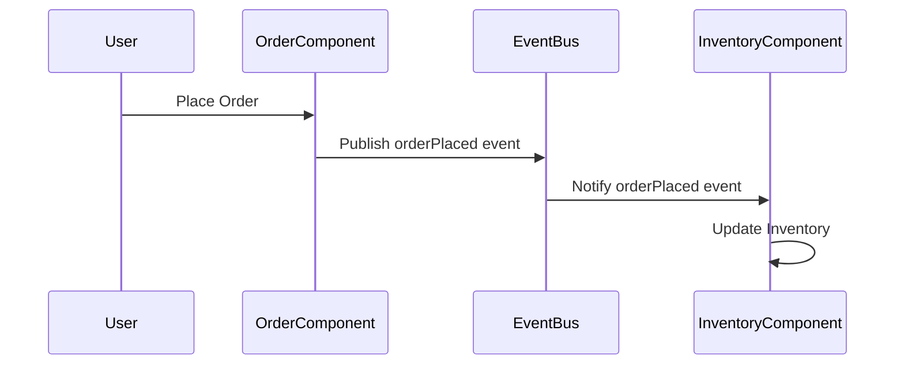

## 7.5.2 Asynchronous Communication

Asynchronous communication is a cornerstone of event-driven architecture, enabling components to interact without waiting for each other to complete tasks. This approach contrasts with synchronous communication, where components must wait for a response before proceeding. In this section, we will explore the concept of asynchronous communication, its benefits, and its implementation in TypeScript applications. We will also discuss the challenges it presents and how to address them effectively.

### Understanding Asynchronous vs. Synchronous Communication

**Synchronous Communication** requires a component to wait for a response from another component before continuing its execution. This can lead to bottlenecks, especially in systems with high latency or complex operations. For example, a function call in a synchronous system will block the caller until the callee finishes processing and returns a result.

**Asynchronous Communication**, on the other hand, allows a component to continue executing without waiting for a response. This is achieved by sending messages or events that can be processed independently. Asynchronous communication is particularly beneficial in distributed systems, where components may reside on different servers or networks.

### Key Characteristics of Asynchronous Communication

- **Non-blocking**: Components do not wait for each other to complete tasks.
- **Decoupled**: Components communicate via messages or events, reducing direct dependencies.
- **Scalable**: Systems can handle more requests by processing them independently.
- **Flexible**: Components can be added, removed, or modified without affecting others.

### Events and Loose Coupling

In event-driven architecture, events are the primary mechanism for enabling loose coupling between components. An event is a message that indicates a change in state or the occurrence of an action. Components can publish events when they perform certain actions and subscribe to events they are interested in.

#### Example: Event Publishing and Subscribing

Consider a simple e-commerce application where different components handle user actions, inventory updates, and order processing. Here's how asynchronous communication can be implemented using events:

```typescript
// Event types
interface Event {
  type: string;
  payload: any;
}

// Event bus
class EventBus {
  private listeners: { [key: string]: Function[] } = {};

  // Subscribe to an event
  subscribe(eventType: string, listener: Function) {
    if (!this.listeners[eventType]) {
      this.listeners[eventType] = [];
    }
    this.listeners[eventType].push(listener);
  }

  // Publish an event
  publish(event: Event) {
    const listeners = this.listeners[event.type];
    if (listeners) {
      listeners.forEach(listener => listener(event.payload));
    }
  }
}

// Example usage
const eventBus = new EventBus();

// Inventory component subscribes to order events
eventBus.subscribe('orderPlaced', (order) => {
  console.log(`Inventory updated for order: ${order.id}`);
});

// Order component publishes an order event
eventBus.publish({ type: 'orderPlaced', payload: { id: 123, items: ['item1', 'item2'] } });
```

In this example, the `EventBus` class facilitates communication between components without them having direct knowledge of each other. The inventory component subscribes to `orderPlaced` events, and the order component publishes such events when an order is placed.

### Impact on Scalability and Flexibility

Asynchronous communication enhances scalability by allowing systems to handle more requests concurrently. Since components do not block each other, they can process multiple events simultaneously. This is particularly useful in cloud-based applications where resources can be dynamically allocated based on demand.

Flexibility is another significant advantage. As components communicate through events, they can be developed, tested, and deployed independently. This modularity allows teams to work on different parts of a system without affecting others, facilitating continuous integration and deployment.

### Challenges in Asynchronous Communication

Despite its benefits, asynchronous communication introduces challenges that need to be addressed:

- **Eventual Consistency**: In distributed systems, data may not be immediately consistent across all components. Systems must be designed to handle temporary inconsistencies and ensure eventual consistency.
- **Failure Handling**: Asynchronous systems must be resilient to failures, such as message loss or processing errors. Implementing retries, dead-letter queues, and monitoring can help manage failures.
- **Complexity**: Asynchronous communication can increase system complexity, making it harder to understand and debug. Proper documentation, logging, and tracing are essential to manage this complexity.

### Designing Efficient Asynchronous Systems

To design systems that handle asynchronous communication efficiently, consider the following best practices:

1. **Use Message Brokers**: Implement message brokers like RabbitMQ or Kafka to manage event distribution and persistence. These tools provide reliable message delivery and support various messaging patterns.

2. **Implement Idempotency**: Ensure that event handlers are idempotent, meaning they can process the same event multiple times without adverse effects. This is crucial for handling retries and ensuring data consistency.

3. **Monitor and Trace Events**: Use monitoring and tracing tools to track event flow and detect issues. Tools like Prometheus, Grafana, and Jaeger can provide insights into system performance and help identify bottlenecks.

4. **Design for Scalability**: Architect systems to scale horizontally by adding more instances of components as needed. Use load balancers to distribute requests evenly across instances.

5. **Plan for Failure**: Implement strategies for handling failures, such as circuit breakers, retries, and fallback mechanisms. These strategies can help maintain system availability and prevent cascading failures.

### Code Example: Asynchronous Order Processing

Let's expand our e-commerce example to include asynchronous order processing using a message broker:

```typescript
// Simulated message broker
class MessageBroker {
  private queues: { [key: string]: Function[] } = {};

  // Subscribe to a queue
  subscribe(queue: string, listener: Function) {
    if (!this.queues[queue]) {
      this.queues[queue] = [];
    }
    this.queues[queue].push(listener);
  }

  // Publish a message to a queue
  publish(queue: string, message: any) {
    const listeners = this.queues[queue];
    if (listeners) {
      listeners.forEach(listener => listener(message));
    }
  }
}

// Order processing component
class OrderProcessor {
  constructor(private broker: MessageBroker) {
    this.broker.subscribe('orderQueue', this.processOrder.bind(this));
  }

  // Process an order
  processOrder(order: any) {
    console.log(`Processing order: ${order.id}`);
    // Simulate order processing logic
    setTimeout(() => {
      console.log(`Order processed: ${order.id}`);
      this.broker.publish('inventoryQueue', { orderId: order.id });
    }, 1000);
  }
}

// Inventory component
class InventoryManager {
  constructor(private broker: MessageBroker) {
    this.broker.subscribe('inventoryQueue', this.updateInventory.bind(this));
  }

  // Update inventory
  updateInventory(message: any) {
    console.log(`Updating inventory for order: ${message.orderId}`);
    // Simulate inventory update logic
  }
}

// Example usage
const broker = new MessageBroker();
const orderProcessor = new OrderProcessor(broker);
const inventoryManager = new InventoryManager(broker);

// Publish an order to the order queue
broker.publish('orderQueue', { id: 123, items: ['item1', 'item2'] });
```

In this example, the `MessageBroker` class simulates a message broker that manages queues for different components. The `OrderProcessor` subscribes to the `orderQueue` and processes orders asynchronously. Once an order is processed, it publishes a message to the `inventoryQueue`, which the `InventoryManager` listens to for updating inventory.

### Visualizing Asynchronous Communication

To better understand the flow of asynchronous communication, let's visualize the interaction between components using a sequence diagram:



**Diagram Description**: This sequence diagram illustrates the asynchronous communication flow in our e-commerce example. The user places an order, which the `OrderComponent` processes and publishes an `orderPlaced` event to the `EventBus`. The `InventoryComponent` listens for this event and updates the inventory accordingly.

### Try It Yourself

To deepen your understanding of asynchronous communication, try modifying the code examples provided:

- **Add a new component** that listens for order events and sends a confirmation email to the user.
- **Implement error handling** in the `OrderProcessor` to simulate a failure and retry logic.
- **Experiment with different message brokers** or libraries, such as `amqplib` for RabbitMQ or `kafkajs` for Kafka, to see how they handle message distribution.

### References and Further Reading

- [MDN Web Docs: Asynchronous JavaScript](https://developer.mozilla.org/en-US/docs/Learn/JavaScript/Asynchronous)
- [RabbitMQ Documentation](https://www.rabbitmq.com/documentation.html)
- [Apache Kafka Documentation](https://kafka.apache.org/documentation/)
- [Prometheus Monitoring](https://prometheus.io/docs/introduction/overview/)
- [Grafana Documentation](https://grafana.com/docs/grafana/latest/)

### Knowledge Check

Before moving on, let's review what we've covered:

- **Asynchronous communication** allows components to interact without waiting for each other, enhancing scalability and flexibility.
- **Events** are used to facilitate loose coupling between components, enabling them to publish and subscribe without direct knowledge of each other.
- **Challenges** such as eventual consistency and failure handling must be addressed to ensure system reliability.
- **Designing efficient systems** involves using message brokers, implementing idempotency, monitoring events, and planning for failures.

Remember, mastering asynchronous communication is a journey. Keep experimenting, stay curious, and enjoy the process of building scalable and flexible systems!

## Quiz Time!



### What is a key characteristic of asynchronous communication?

- [x] Non-blocking
- [ ] Blocking
- [ ] Synchronous
- [ ] Sequential

> **Explanation:** Asynchronous communication is non-blocking, allowing components to continue executing without waiting for a response.

### How do events facilitate loose coupling between components?

- [x] By allowing components to publish and subscribe without direct knowledge of each other
- [ ] By requiring components to call each other directly
- [ ] By enforcing synchronous communication
- [ ] By using shared memory

> **Explanation:** Events enable components to communicate indirectly, reducing dependencies and facilitating loose coupling.

### What is a common challenge in asynchronous communication?

- [x] Eventual consistency
- [ ] Immediate consistency
- [ ] Synchronous execution
- [ ] Direct coupling

> **Explanation:** Asynchronous communication can lead to eventual consistency, where data may not be immediately consistent across components.

### Which tool can be used to manage event distribution and persistence?

- [x] Message brokers like RabbitMQ or Kafka
- [ ] HTTP requests
- [ ] File systems
- [ ] Databases

> **Explanation:** Message brokers like RabbitMQ or Kafka are designed to handle event distribution and persistence efficiently.

### Why is idempotency important in asynchronous systems?

- [x] To ensure that event handlers can process the same event multiple times without adverse effects
- [ ] To increase system complexity
- [ ] To enforce synchronous communication
- [ ] To reduce scalability

> **Explanation:** Idempotency ensures that processing the same event multiple times does not lead to inconsistent states, which is crucial for retries and consistency.

### What is a benefit of using asynchronous communication in distributed systems?

- [x] Enhanced scalability
- [ ] Reduced flexibility
- [ ] Increased blocking
- [ ] Direct dependencies

> **Explanation:** Asynchronous communication enhances scalability by allowing systems to handle more requests concurrently.

### How can failures be managed in asynchronous systems?

- [x] By implementing retries, dead-letter queues, and monitoring
- [ ] By ignoring them
- [ ] By using synchronous communication
- [ ] By increasing complexity

> **Explanation:** Implementing retries, dead-letter queues, and monitoring helps manage failures and maintain system reliability.

### What is the role of a message broker in asynchronous communication?

- [x] To manage event distribution and persistence
- [ ] To enforce synchronous communication
- [ ] To increase system complexity
- [ ] To reduce scalability

> **Explanation:** A message broker manages event distribution and persistence, ensuring reliable communication between components.

### Which of the following is NOT a characteristic of asynchronous communication?

- [ ] Non-blocking
- [ ] Decoupled
- [x] Synchronous
- [ ] Scalable

> **Explanation:** Asynchronous communication is non-blocking, decoupled, and scalable, but not synchronous.

### True or False: Asynchronous communication can lead to increased system complexity.

- [x] True
- [ ] False

> **Explanation:** Asynchronous communication can increase system complexity due to the need for managing events, eventual consistency, and failure handling.


