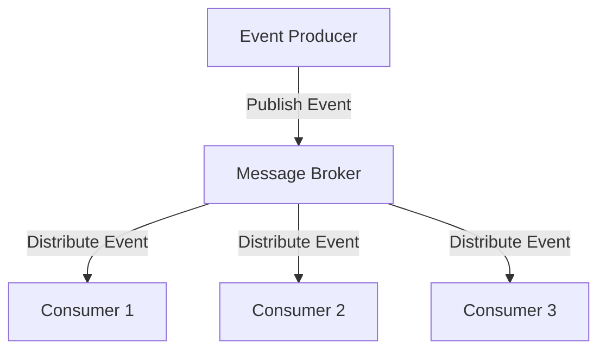

## 7.5.3 Use Cases and Examples

In the realm of modern software development, event-driven architecture (EDA) stands out as a powerful paradigm, particularly suited for applications requiring high responsiveness, scalability, and flexibility. This section delves into practical scenarios where EDA shines, such as real-time data streaming applications, Internet of Things (IoT) systems, and microservices architectures. We will explore how EDA addresses the unique needs of these applications and discuss its inherent benefits.

### Real-Time Data Streaming Applications

Real-time data streaming applications are designed to process and analyze data as it is generated, providing immediate insights and actions. Examples include stock tickers, social media feeds, and live sports updates. These applications benefit immensely from event-driven architecture due to its ability to handle high volumes of data with low latency.

#### Stock Tickers

Stock tickers are quintessential real-time applications that require immediate data processing and dissemination. In an EDA setup, each stock price update is treated as an event. These events are published to a message broker, such as Kafka or RabbitMQ, and consumed by various services that update user interfaces, trigger alerts, or execute trades.

```typescript
// Stock ticker event interface
interface StockEvent {
  symbol: string;
  price: number;
  timestamp: Date;
}

// Event producer: Simulating stock price updates
function produceStockEvent(symbol: string, price: number): StockEvent {
  return {
    symbol,
    price,
    timestamp: new Date(),
  };
}

// Event consumer: Reacting to stock price updates
function consumeStockEvent(event: StockEvent) {
  console.log(`Stock: ${event.symbol}, Price: ${event.price}, Time: ${event.timestamp}`);
}

// Simulating event-driven stock ticker
const stockEvent = produceStockEvent('AAPL', 150.25);
consumeStockEvent(stockEvent);
```

**Benefits**: EDA allows stock tickers to scale horizontally, handling increased data loads by adding more consumers. It also decouples the data producers from consumers, enabling independent scaling and maintenance.

#### Social Media Feeds

Social media platforms like Twitter and Facebook rely on EDA to manage the massive influx of posts, comments, and likes. Each user interaction generates an event that is processed to update feeds, notify users, and analyze trends.

```typescript
// Social media event interface
interface SocialMediaEvent {
  userId: string;
  action: 'post' | 'like' | 'comment';
  content: string;
  timestamp: Date;
}

// Event producer: User action
function produceSocialMediaEvent(userId: string, action: 'post' | 'like' | 'comment', content: string): SocialMediaEvent {
  return {
    userId,
    action,
    content,
    timestamp: new Date(),
  };
}

// Event consumer: Updating feed
function consumeSocialMediaEvent(event: SocialMediaEvent) {
  console.log(`User: ${event.userId}, Action: ${event.action}, Content: ${event.content}`);
}

// Simulating event-driven social media feed
const socialEvent = produceSocialMediaEvent('user123', 'post', 'Hello, world!');
consumeSocialMediaEvent(socialEvent);
```

**Benefits**: EDA supports real-time updates and notifications, ensuring users receive the latest interactions instantly. It also facilitates the integration of analytics services that process events to derive insights.

### Internet of Things (IoT) Systems

IoT systems consist of interconnected devices that communicate asynchronously with servers and each other. EDA is ideal for IoT due to its ability to handle asynchronous communication and dynamic scaling.

#### Smart Home Devices

In a smart home setup, devices such as thermostats, lights, and security cameras generate events based on user actions or environmental changes. These events are processed to automate responses, such as adjusting temperature or sending alerts.

```typescript
// IoT event interface
interface IoTEvent {
  deviceId: string;
  type: 'temperature' | 'motion' | 'light';
  value: number;
  timestamp: Date;
}

// Event producer: Device data
function produceIoTEvent(deviceId: string, type: 'temperature' | 'motion' | 'light', value: number): IoTEvent {
  return {
    deviceId,
    type,
    value,
    timestamp: new Date(),
  };
}

// Event consumer: Automating response
function consumeIoTEvent(event: IoTEvent) {
  if (event.type === 'temperature' && event.value > 25) {
    console.log(`Device: ${event.deviceId}, Action: Turn on AC`);
  }
}

// Simulating event-driven IoT system
const iotEvent = produceIoTEvent('thermostat1', 'temperature', 28);
consumeIoTEvent(iotEvent);
```

**Benefits**: EDA enables seamless integration of new devices and services, enhancing the extensibility of IoT systems. It also supports real-time processing and decision-making, crucial for automation.

### Microservices Architecture

Microservices architecture involves building applications as a suite of small, independently deployable services. EDA enhances microservices by enabling them to communicate via events, reacting to changes in other services.

#### Order Processing System

Consider an e-commerce platform where an order processing system is implemented using microservices. Each step, such as order creation, payment, and shipping, generates events consumed by relevant services.

```typescript
// Order event interface
interface OrderEvent {
  orderId: string;
  status: 'created' | 'paid' | 'shipped';
  timestamp: Date;
}

// Event producer: Order status update
function produceOrderEvent(orderId: string, status: 'created' | 'paid' | 'shipped'): OrderEvent {
  return {
    orderId,
    status,
    timestamp: new Date(),
  };
}

// Event consumer: Handling order status
function consumeOrderEvent(event: OrderEvent) {
  console.log(`Order: ${event.orderId}, Status: ${event.status}`);
}

// Simulating event-driven order processing
const orderEvent = produceOrderEvent('order123', 'created');
consumeOrderEvent(orderEvent);
```

**Benefits**: EDA facilitates loose coupling between services, allowing them to evolve independently. It also supports asynchronous processing, improving system responsiveness and scalability.

### Benefits of Event-Driven Architecture

EDA offers several advantages that make it suitable for the aforementioned applications:

1. **Responsiveness**: EDA enables real-time processing and immediate reactions to events, crucial for applications like stock tickers and social media feeds.

2. **Scalability**: By decoupling producers and consumers, EDA allows systems to scale horizontally, handling increased loads by adding more consumers.

3. **Extensibility**: EDA supports the seamless integration of new components and services, enhancing the flexibility of systems like IoT and microservices.

4. **Decoupling**: EDA reduces dependencies between components, allowing them to evolve independently and improving maintainability.

### Visualizing Event-Driven Architecture

The following diagram illustrates a typical event-driven architecture setup, showcasing the interaction between producers, a message broker, and consumers.



**Diagram Description**: This diagram represents an event-driven architecture where events are published by producers to a message broker, which then distributes them to various consumers. Each consumer can independently process the events based on its specific logic.

### Encouraging Adoption of Event-Driven Architecture

When building systems that require real-time data processing or high decoupling, consider adopting event-driven architecture. Its benefits in terms of responsiveness, scalability, and extensibility make it an ideal choice for modern applications. By leveraging EDA, you can create systems that are not only efficient but also adaptable to changing requirements and technologies.

### Try It Yourself

To deepen your understanding of event-driven architecture, try modifying the provided code examples. Experiment with adding new event types, implementing additional consumers, or integrating a message broker like Kafka or RabbitMQ. This hands-on approach will help solidify your grasp of EDA concepts and their practical applications.

### Key Takeaways

- Event-driven architecture is well-suited for real-time applications, IoT systems, and microservices.
- EDA enhances responsiveness, scalability, extensibility, and decoupling.
- Practical examples include stock tickers, social media feeds, smart home devices, and order processing systems.
- Visualizing EDA helps understand the flow of events between producers, brokers, and consumers.

## Quiz Time!



### What is a key benefit of event-driven architecture in real-time applications?

- [x] Responsiveness
- [ ] Complexity
- [ ] High latency
- [ ] Tight coupling

> **Explanation:** Event-driven architecture enhances responsiveness by enabling real-time processing and immediate reactions to events.


### Which of the following is an example of a real-time data streaming application?

- [x] Stock ticker
- [ ] Batch processing system
- [ ] Static website
- [ ] Offline data analysis

> **Explanation:** Stock tickers are real-time applications that require immediate data processing and dissemination.


### How does event-driven architecture benefit IoT systems?

- [x] Supports asynchronous communication
- [ ] Increases device cost
- [ ] Requires centralized control
- [ ] Reduces device functionality

> **Explanation:** EDA supports asynchronous communication, which is crucial for IoT systems where devices communicate asynchronously with servers and other devices.


### In a microservices architecture, how do services typically communicate in an event-driven setup?

- [x] Via events
- [ ] Direct method calls
- [ ] Shared databases
- [ ] Hardcoded connections

> **Explanation:** In an event-driven setup, microservices communicate via events, allowing them to react to changes in other services.


### What is a common tool used as a message broker in event-driven architectures?

- [x] Kafka
- [ ] MySQL
- [ ] Apache HTTP Server
- [ ] Redis

> **Explanation:** Kafka is a popular message broker used in event-driven architectures to handle event distribution.


### What is the role of a message broker in an event-driven architecture?

- [x] Distribute events to consumers
- [ ] Generate events
- [ ] Store events permanently
- [ ] Execute business logic

> **Explanation:** A message broker distributes events to consumers, allowing them to process events independently.


### Which of the following best describes the decoupling benefit of event-driven architecture?

- [x] Reduces dependencies between components
- [ ] Increases code complexity
- [ ] Requires synchronous processing
- [ ] Centralizes control

> **Explanation:** Event-driven architecture reduces dependencies between components, allowing them to evolve independently and improving maintainability.


### What is a potential use case for event-driven architecture in social media platforms?

- [x] Real-time feed updates
- [ ] Static content delivery
- [ ] Scheduled batch processing
- [ ] Manual data entry

> **Explanation:** Event-driven architecture supports real-time feed updates, ensuring users receive the latest interactions instantly.


### How does event-driven architecture enhance scalability?

- [x] Allows horizontal scaling by adding more consumers
- [ ] Requires vertical scaling of a single server
- [ ] Centralizes processing on one node
- [ ] Limits the number of events processed

> **Explanation:** EDA allows systems to scale horizontally, handling increased loads by adding more consumers.


### True or False: Event-driven architecture is suitable for applications requiring high decoupling.

- [x] True
- [ ] False

> **Explanation:** True. Event-driven architecture is suitable for applications requiring high decoupling due to its ability to reduce dependencies between components.


