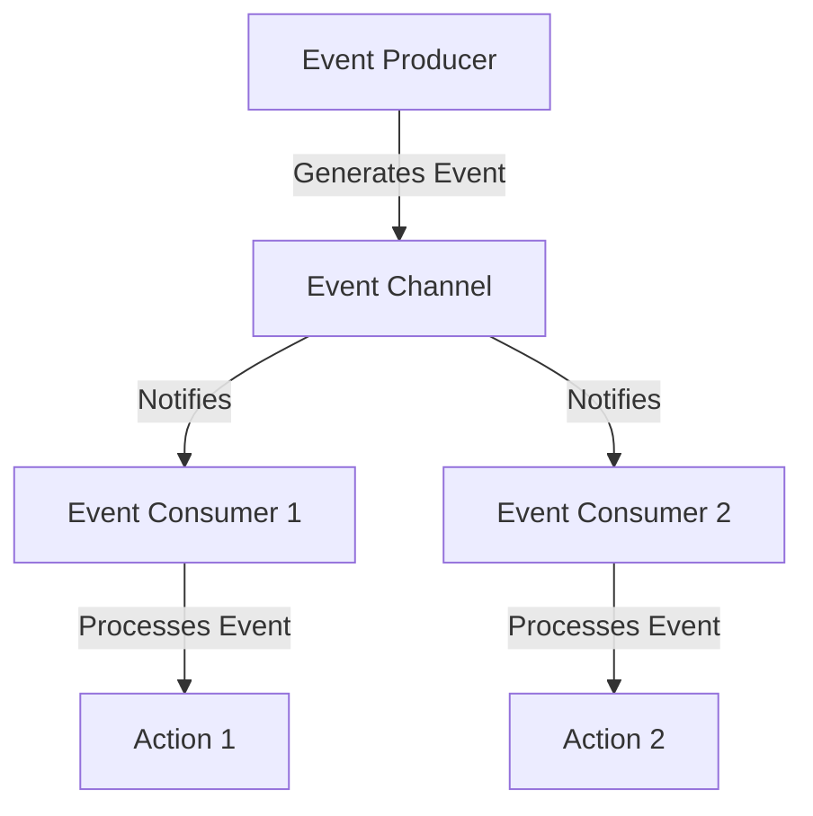

## 7.5 Event-Driven Architecture

In the realm of software engineering, **Event-Driven Architecture (EDA)** stands as a paradigm that focuses on the production, detection, and reaction to events. This architecture style is particularly effective in systems where responsiveness, scalability, and decoupling are paramount. In this section, we will delve into the principles of EDA, explore its benefits and challenges, and provide practical examples of implementing event-driven patterns using TypeScript.

### Understanding Event-Driven Architecture

**Event-Driven Architecture** is a design pattern in which the flow of the program is determined by events, which are significant changes in state. These events can originate from user actions, sensor outputs, or messages from other programs or threads. The architecture is composed of event producers, event consumers, and an event channel that connects them.

#### Key Principles of Event-Driven Architecture

1. **Event Producers**: These are components that generate events. They can be anything from user interfaces to backend services that detect changes in data.

2. **Event Consumers**: These components listen for events and react accordingly. They can perform actions like updating a database, sending notifications, or triggering other processes.

3. **Event Channels**: These are the pathways through which events travel from producers to consumers. They can be implemented using message brokers, event buses, or simple in-memory queues.

4. **Event Processing**: This involves the detection and handling of events. It can be done synchronously or asynchronously, depending on the system's requirements.

### How Events are Managed in EDA

In an event-driven system, events are the primary means of communication. Here's how they are typically managed:

- **Generation**: Events are generated by producers when a significant change occurs. For example, a user clicking a button or a sensor detecting a temperature change.

- **Publishing**: Once generated, events are published to an event channel. This can be a message broker like RabbitMQ or Kafka, or a simpler in-memory event bus.

- **Detection**: Consumers subscribe to specific events they are interested in. When an event is published, the event channel notifies all subscribed consumers.

- **Reaction**: Upon receiving an event, consumers execute predefined actions. This could involve updating the user interface, processing data, or triggering further events.

### Benefits of Event-Driven Systems

Event-driven systems offer several advantages:

- **Scalability**: By decoupling producers and consumers, systems can scale independently. This is particularly beneficial in cloud environments where resources can be dynamically allocated.

- **Responsiveness**: Events allow systems to react in real-time to changes, providing a more responsive user experience.

- **Decoupling**: Components in an event-driven system are loosely coupled, which enhances maintainability and flexibility. Changes in one component do not necessarily affect others.

- **Fault Tolerance**: Systems can be designed to handle failures gracefully. For instance, if a consumer fails, the event can be retried or redirected to another consumer.

### Challenges of Event-Driven Systems

Despite their benefits, event-driven systems also pose challenges:

- **Complexity**: Managing events, especially in large systems, can become complex. It requires careful design to ensure that events are handled correctly.

- **Debugging**: Tracing the flow of events can be difficult, especially when events are asynchronous and distributed across multiple services.

- **Race Conditions**: Events may arrive out of order or be processed simultaneously, leading to race conditions. This requires careful synchronization and state management.

### Implementing Event-Driven Patterns in TypeScript

TypeScript, with its strong typing and support for asynchronous programming, is well-suited for implementing event-driven architectures. Let's explore some TypeScript features and patterns that facilitate event handling.

#### Using TypeScript for Event Handling

TypeScript provides several features that make it easier to work with events:

- **Interfaces**: Define contracts for event producers and consumers, ensuring that they adhere to expected behaviors.

- **Generics**: Create reusable event handling components that can work with different types of events.

- **Async/Await**: Simplify asynchronous event processing, making code easier to read and maintain.

- **Promises**: Handle asynchronous operations and ensure that events are processed in the correct order.

#### Example: Simple Event Emitter in TypeScript

Let's start by implementing a simple event emitter in TypeScript. This will serve as the foundation for more complex event-driven systems.

```typescript
// Define an interface for event listeners
interface EventListener {
  (event: string, data?: any): void;
}

// Simple EventEmitter class
class EventEmitter {
  private events: { [key: string]: EventListener[] } = {};

  // Method to register an event listener
  on(event: string, listener: EventListener): void {
    if (!this.events[event]) {
      this.events[event] = [];
    }
    this.events[event].push(listener);
  }

  // Method to emit an event
  emit(event: string, data?: any): void {
    const listeners = this.events[event];
    if (listeners) {
      listeners.forEach(listener => listener(event, data));
    }
  }

  // Method to remove an event listener
  off(event: string, listener: EventListener): void {
    const listeners = this.events[event];
    if (listeners) {
      this.events[event] = listeners.filter(l => l !== listener);
    }
  }
}

// Example usage
const emitter = new EventEmitter();

const logEvent = (event: string, data?: any) => {
  console.log(`Event: ${event}, Data: ${data}`);
};

// Register an event listener
emitter.on('dataReceived', logEvent);

// Emit an event
emitter.emit('dataReceived', { message: 'Hello, World!' });

// Remove the event listener
emitter.off('dataReceived', logEvent);
```

In this example, we define an `EventEmitter` class that allows us to register, emit, and remove event listeners. The `on` method registers a listener for a specific event, while the `emit` method triggers the event, notifying all registered listeners.

### Advanced Event-Driven Patterns

As systems grow in complexity, more advanced patterns are needed to manage events effectively. Let's explore some of these patterns and how to implement them in TypeScript.

#### Event Sourcing

**Event Sourcing** is a pattern where all changes to the application's state are stored as a sequence of events. This allows the system to reconstruct the state at any point in time by replaying the events.

```typescript
// Define an interface for events
interface Event {
  type: string;
  payload: any;
}

// Event store to keep track of all events
class EventStore {
  private events: Event[] = [];

  // Add an event to the store
  addEvent(event: Event): void {
    this.events.push(event);
  }

  // Get all events
  getEvents(): Event[] {
    return this.events;
  }
}

// Example usage
const eventStore = new EventStore();

// Add events
eventStore.addEvent({ type: 'UserCreated', payload: { userId: 1, name: 'Alice' } });
eventStore.addEvent({ type: 'UserUpdated', payload: { userId: 1, name: 'Alice Smith' } });

// Retrieve and process events
const events = eventStore.getEvents();
events.forEach(event => {
  console.log(`Processing event: ${event.type}, Payload: ${JSON.stringify(event.payload)}`);
});
```

In this example, we implement a simple `EventStore` class that stores events. We can add events to the store and retrieve them for processing. This pattern is particularly useful in systems where auditability and traceability are important.

#### CQRS (Command Query Responsibility Segregation)

**CQRS** is a pattern that separates the read and write operations of a system. In an event-driven context, commands trigger events that update the state, while queries read the state without modifying it.

```typescript
// Define a command interface
interface Command {
  execute(): void;
}

// Command to create a user
class CreateUserCommand implements Command {
  constructor(private userId: number, private name: string) {}

  execute(): void {
    console.log(`User created: ${this.userId}, Name: ${this.name}`);
    // Emit an event or update the state
  }
}

// Command to update a user
class UpdateUserCommand implements Command {
  constructor(private userId: number, private name: string) {}

  execute(): void {
    console.log(`User updated: ${this.userId}, Name: ${this.name}`);
    // Emit an event or update the state
  }
}

// Example usage
const createUser = new CreateUserCommand(1, 'Alice');
createUser.execute();

const updateUser = new UpdateUserCommand(1, 'Alice Smith');
updateUser.execute();
```

In this example, we define a `Command` interface and implement it with specific commands like `CreateUserCommand` and `UpdateUserCommand`. Each command encapsulates the logic for a specific operation, allowing us to separate the concerns of command execution and state management.

### Visualizing Event-Driven Architecture

To better understand how events flow through a system, let's visualize a simple event-driven architecture using Mermaid.js.



**Diagram Explanation**: This diagram illustrates a basic event-driven architecture. An event producer generates an event, which is published to an event channel. The event channel notifies all subscribed event consumers, which then process the event and perform specific actions.

### TypeScript Features Supporting Event-Driven Architecture

TypeScript offers several features that enhance the implementation of event-driven architectures:

- **Static Typing**: Ensures that events and their handlers adhere to defined interfaces, reducing runtime errors.

- **Async/Await**: Simplifies asynchronous event processing, making code more readable and maintainable.

- **Promises**: Facilitate the handling of asynchronous operations, ensuring that events are processed in the correct order.

- **Generics**: Allow for the creation of reusable components that can handle different types of events.

### Try It Yourself

To deepen your understanding of event-driven architecture, try modifying the code examples provided:

- **Extend the EventEmitter**: Add support for once-only event listeners that are automatically removed after being triggered.

- **Enhance the Event Store**: Implement a method to replay events and reconstruct the system's state.

- **Experiment with CQRS**: Create additional commands and queries to manage a simple inventory system.

### Knowledge Check

Before we conclude, let's summarize the key takeaways:

- Event-driven architecture focuses on the production, detection, and reaction to events.
- It offers benefits like scalability, responsiveness, and decoupling but also poses challenges such as complexity and debugging difficulty.
- TypeScript provides features like interfaces, async/await, and generics that support event-driven patterns.
- Advanced patterns like Event Sourcing and CQRS can enhance the capabilities of event-driven systems.

### Embrace the Journey

Remember, mastering event-driven architecture is a journey. As you continue to explore and experiment, you'll gain a deeper understanding of how to design systems that are responsive, scalable, and maintainable. Keep pushing the boundaries, stay curious, and enjoy the process!

## Quiz Time!



### What is a key benefit of event-driven architecture?

- [x] Scalability
- [ ] Increased coupling
- [ ] Synchronous processing
- [ ] Reduced responsiveness

> **Explanation:** Event-driven architecture allows systems to scale independently by decoupling producers and consumers.

### Which TypeScript feature simplifies asynchronous event processing?

- [x] Async/Await
- [ ] Interfaces
- [ ] Static Typing
- [ ] Generics

> **Explanation:** Async/Await simplifies asynchronous operations, making code easier to read and maintain.

### What is the role of an event consumer in an event-driven system?

- [x] To listen for and react to events
- [ ] To generate events
- [ ] To publish events
- [ ] To store events

> **Explanation:** Event consumers listen for events and execute predefined actions when an event is received.

### What challenge is associated with event-driven architecture?

- [x] Complexity in debugging
- [ ] Lack of scalability
- [ ] Tight coupling
- [ ] Synchronous processing

> **Explanation:** Event-driven systems can be complex to debug due to asynchronous and distributed event flows.

### Which pattern involves storing all changes as a sequence of events?

- [x] Event Sourcing
- [ ] CQRS
- [ ] Observer
- [ ] Singleton

> **Explanation:** Event Sourcing stores all changes as events, allowing the system to reconstruct the state by replaying them.

### What does CQRS stand for?

- [x] Command Query Responsibility Segregation
- [ ] Command Queue Resource System
- [ ] Central Query Response System
- [ ] Command Query Relay Service

> **Explanation:** CQRS stands for Command Query Responsibility Segregation, separating read and write operations.

### What is a potential issue with events arriving out of order?

- [x] Race conditions
- [ ] Increased coupling
- [ ] Reduced scalability
- [ ] Synchronous processing

> **Explanation:** Events arriving out of order can lead to race conditions, requiring careful synchronization.

### Which TypeScript feature allows for reusable event handling components?

- [x] Generics
- [ ] Static Typing
- [ ] Interfaces
- [ ] Promises

> **Explanation:** Generics enable the creation of reusable components that can handle different types of events.

### What is the purpose of an event channel in an event-driven system?

- [x] To connect event producers and consumers
- [ ] To generate events
- [ ] To store events
- [ ] To process events

> **Explanation:** An event channel connects producers and consumers, facilitating the flow of events between them.

### True or False: Event-driven architecture inherently reduces system coupling.

- [x] True
- [ ] False

> **Explanation:** Event-driven architecture reduces coupling by allowing components to communicate through events rather than direct calls.


