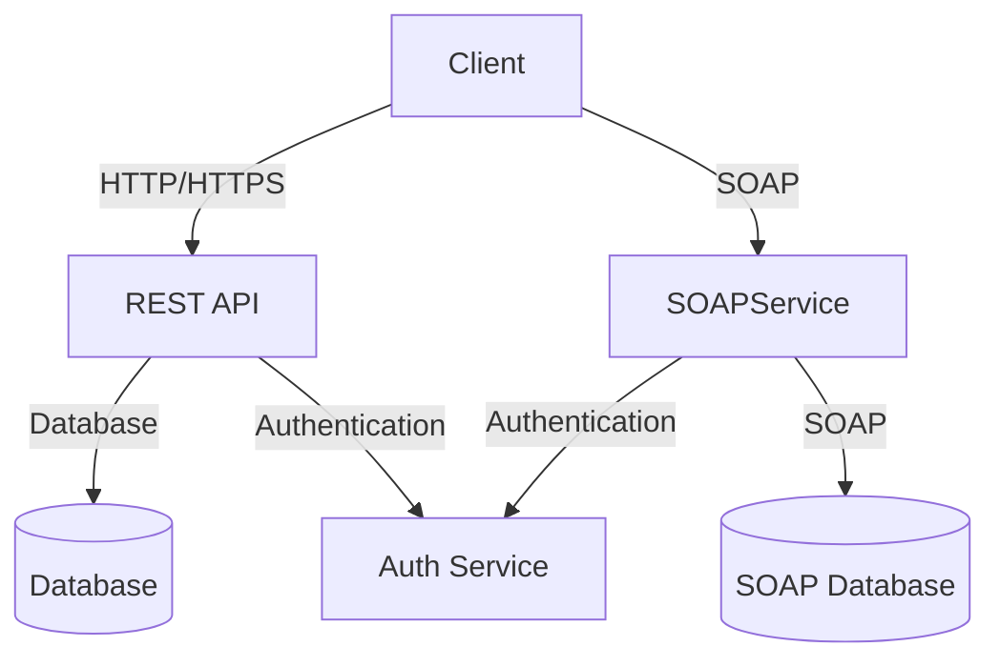

## 7.6.1 Implementing SOA in TypeScript

Service-Oriented Architecture (SOA) is a design pattern that enables services to communicate over a network, providing a flexible and scalable way to build distributed systems. In this section, we will explore how to implement SOA using TypeScript, focusing on defining service contracts, implementing services, consuming external services, and addressing security and testing considerations.

### Defining Service Contracts with TypeScript

In SOA, a service contract defines the operations a service provides and the data it requires. TypeScript's strong typing and interface capabilities make it an excellent choice for defining these contracts.

#### Using TypeScript Interfaces

TypeScript interfaces allow us to define the shape of objects, making them ideal for specifying service contracts.

```typescript
interface UserService {
  getUser(id: string): Promise<User>;
  createUser(user: User): Promise<User>;
}

interface User {
  id: string;
  name: string;
  email: string;
}
```

In this example, `UserService` defines two operations: `getUser` and `createUser`. Each operation returns a `Promise`, indicating asynchronous behavior typical in service operations.

#### Using TypeScript Classes

While interfaces define the structure, classes can provide implementations. However, in the context of service contracts, interfaces are preferred for defining the contract, while classes are used to implement the service logic.

```typescript
class UserServiceImpl implements UserService {
  async getUser(id: string): Promise<User> {
    // Implementation logic to retrieve a user
  }

  async createUser(user: User): Promise<User> {
    // Implementation logic to create a user
  }
}
```

### Implementing Services with TypeScript

Once we have defined our service contracts, the next step is to implement these services. In SOA, services are typically exposed over protocols like HTTP/HTTPS or SOAP.

#### Exposing APIs over HTTP/HTTPS

Using Node.js and Express, we can easily create HTTP/HTTPS services in TypeScript.

```typescript
import express, { Request, Response } from 'express';

const app = express();
app.use(express.json());

app.get('/user/:id', async (req: Request, res: Response) => {
  const userId = req.params.id;
  // Logic to get user
  res.json({ id: userId, name: 'John Doe', email: 'john.doe@example.com' });
});

app.post('/user', async (req: Request, res: Response) => {
  const user = req.body;
  // Logic to create user
  res.status(201).json(user);
});

app.listen(3000, () => {
  console.log('Service running on port 3000');
});
```

In this example, we define two endpoints: one for retrieving a user and another for creating a user. The service listens on port 3000.

#### Implementing SOAP Services

SOAP is another protocol used in SOA, though less common in modern web services. Libraries like `soap` in Node.js can be used to implement SOAP services.

```typescript
import soap from 'soap';
import http from 'http';

const service = {
  UserService: {
    UserServiceSoap: {
      getUser(args: { id: string }) {
        return { id: args.id, name: 'John Doe', email: 'john.doe@example.com' };
      },
      createUser(args: { user: User }) {
        return args.user;
      }
    }
  }
};

const xml = require('fs').readFileSync('user.wsdl', 'utf8');

const server = http.createServer((req, res) => {
  res.end('404: Not Found: ' + req.url);
});

server.listen(8000);
soap.listen(server, '/wsdl', service, xml);
```

Here, we define a SOAP service with operations `getUser` and `createUser`, using a WSDL file to describe the service.

### Consuming External Services with TypeScript

Consuming services is an integral part of SOA. TypeScript, with its type safety, ensures that we handle responses and errors effectively.

#### Handling HTTP/HTTPS Services

Using libraries like `axios`, we can consume RESTful services.

```typescript
import axios from 'axios';

async function fetchUser(id: string): Promise<User> {
  try {
    const response = await axios.get<User>(`http://localhost:3000/user/${id}`);
    return response.data;
  } catch (error) {
    console.error('Error fetching user:', error);
    throw error;
  }
}
```

In this example, `axios` is used to make a GET request to the user service. The response is typed as `User`, ensuring type safety.

#### Handling SOAP Services

For SOAP services, the `soap` library can be used to create clients.

```typescript
import soap from 'soap';

async function fetchUserSOAP(id: string): Promise<User> {
  const url = 'http://localhost:8000/wsdl?wsdl';
  const client = await soap.createClientAsync(url);
  const result = await client.getUserAsync({ id });
  return result[0];
}
```

This example demonstrates how to create a SOAP client and call the `getUser` operation.

### Using Tools for Service Documentation and Client Generation

Tools like Swagger and OpenAPI are invaluable for documenting services and generating client code.

#### Swagger and OpenAPI

Swagger and OpenAPI provide a standard way to describe RESTful APIs. Using these tools, we can generate interactive documentation and client SDKs.

```yaml
openapi: 3.0.0
info:
  title: User Service
  version: 1.0.0
paths:
  /user/{id}:
    get:
      summary: Get a user by ID
      parameters:
        - name: id
          in: path
          required: true
          schema:
            type: string
      responses:
        '200':
          description: A user object
          content:
            application/json:
              schema:
                $ref: '#/components/schemas/User'
components:
  schemas:
    User:
      type: object
      properties:
        id:
          type: string
        name:
          type: string
        email:
          type: string
```

This OpenAPI specification describes the `getUser` endpoint. Tools like Swagger UI can render this specification into interactive documentation.

### Security Considerations in SOA

Security is paramount in SOA, especially when services are exposed over the internet.

#### Authentication and Authorization

Implementing authentication and authorization ensures that only authorized users can access services.

```typescript
import jwt from 'jsonwebtoken';

const secret = 'your-secret-key';

function authenticateToken(req: Request, res: Response, next: NextFunction) {
  const token = req.headers['authorization'];
  if (!token) return res.sendStatus(401);

  jwt.verify(token, secret, (err, user) => {
    if (err) return res.sendStatus(403);
    req.user = user;
    next();
  });
}

app.get('/user/:id', authenticateToken, async (req: Request, res: Response) => {
  // Logic to get user
});
```

In this example, JSON Web Tokens (JWT) are used for authentication. The `authenticateToken` middleware verifies the token before allowing access to the `getUser` endpoint.

### Testing Services in SOA

Testing is crucial to ensure the reliability of services in SOA. Both unit and integration tests are important.

#### Unit Testing

Unit tests focus on individual components of the service.

```typescript
import { expect } from 'chai';
import { UserServiceImpl } from './UserServiceImpl';

describe('UserService', () => {
  it('should create a user', async () => {
    const service = new UserServiceImpl();
    const user = await service.createUser({ id: '1', name: 'John Doe', email: 'john.doe@example.com' });
    expect(user).to.have.property('id', '1');
  });
});
```

Here, we use `chai` for assertions and test the `createUser` method.

#### Integration Testing

Integration tests ensure that different components work together as expected.

```typescript
import request from 'supertest';
import { app } from './app';

describe('User API', () => {
  it('should return a user', async () => {
    const response = await request(app).get('/user/1');
    expect(response.status).to.equal(200);
    expect(response.body).to.have.property('id', '1');
  });
});
```

Using `supertest`, we test the `/user/:id` endpoint to ensure it returns the expected user.

### Managing Dependencies and Configurations

In an SOA environment, managing dependencies and configurations is critical for maintaining service reliability and scalability.

#### Dependency Management

Tools like `npm` and `yarn` help manage dependencies in TypeScript projects.

```json
{
  "dependencies": {
    "express": "^4.17.1",
    "axios": "^0.21.1",
    "soap": "^0.31.0",
    "jsonwebtoken": "^8.5.1"
  }
}
```

Keeping dependencies up-to-date and managing versions is essential to avoid compatibility issues.

#### Configuration Management

Configuration management tools and practices ensure that services can be configured consistently across environments.

```typescript
import dotenv from 'dotenv';

dotenv.config();

const port = process.env.PORT || 3000;
const dbConnectionString = process.env.DB_CONNECTION_STRING;
```

Using `dotenv`, we load environment variables from a `.env` file, allowing us to configure services without hardcoding values.

### Try It Yourself

To solidify your understanding, try modifying the examples provided:

- **Add a new endpoint** to the HTTP service that updates a user's information.
- **Implement error handling** in the SOAP service to return meaningful error messages.
- **Secure the SOAP service** using a different authentication mechanism, such as OAuth2.
- **Write additional tests** for edge cases in the `UserServiceImpl`.

### Visualizing SOA in TypeScript

To better understand how the components of an SOA system interact, let's visualize a simple architecture using Mermaid.js.



**Diagram Description**: This diagram illustrates a basic SOA architecture where clients interact with REST and SOAP services. Both services connect to their respective databases and use an authentication service for security.

### References and Further Reading

- [TypeScript Documentation](https://www.typescriptlang.org/docs/)
- [Express.js Guide](https://expressjs.com/en/starter/installing.html)
- [Node.js SOAP Module](https://www.npmjs.com/package/soap)
- [OpenAPI Specification](https://swagger.io/specification/)
- [JWT Authentication](https://jwt.io/introduction/)

### Key Takeaways

- **Service Contracts**: Define clear service contracts using TypeScript interfaces.
- **API Implementation**: Use Express for HTTP services and libraries like `soap` for SOAP services.
- **Security**: Implement robust authentication and authorization mechanisms.
- **Testing**: Perform both unit and integration testing to ensure service reliability.
- **Configuration**: Manage dependencies and configurations effectively using tools like `dotenv`.

Remember, implementing SOA in TypeScript is a journey. Keep experimenting, stay curious, and enjoy the process of building scalable and maintainable services!

## Quiz Time!



### What is the primary purpose of a service contract in SOA?

- [x] To define the operations and data requirements of a service
- [ ] To implement the business logic of a service
- [ ] To handle errors and exceptions in a service
- [ ] To manage the deployment of a service

> **Explanation:** A service contract defines the operations a service provides and the data it requires, serving as a blueprint for service interaction.

### Which TypeScript feature is best suited for defining service contracts?

- [x] Interfaces
- [ ] Classes
- [ ] Enums
- [ ] Modules

> **Explanation:** TypeScript interfaces are ideal for defining the shape of objects and specifying service contracts.

### What library is commonly used in Node.js to create HTTP/HTTPS services?

- [x] Express
- [ ] Axios
- [ ] Soap
- [ ] Jest

> **Explanation:** Express is a popular library for creating HTTP/HTTPS services in Node.js.

### How can you consume a SOAP service in TypeScript?

- [x] Using the `soap` library to create a client
- [ ] Using the `axios` library for HTTP requests
- [ ] Using the `express` library for routing
- [ ] Using the `jwt` library for authentication

> **Explanation:** The `soap` library is used to create clients for consuming SOAP services in TypeScript.

### What tool can be used to document RESTful APIs and generate client SDKs?

- [x] Swagger/OpenAPI
- [ ] Postman
- [ ] GraphQL
- [ ] Docker

> **Explanation:** Swagger/OpenAPI provides a standard way to describe RESTful APIs, enabling documentation and client SDK generation.

### Which authentication method is demonstrated in the article for securing services?

- [x] JSON Web Tokens (JWT)
- [ ] OAuth2
- [ ] Basic Authentication
- [ ] API Keys

> **Explanation:** The article demonstrates using JSON Web Tokens (JWT) for authentication in services.

### What testing framework is used in the article for unit testing?

- [x] Chai
- [ ] Mocha
- [ ] Jasmine
- [ ] Jest

> **Explanation:** The article uses `chai` for assertions in unit testing examples.

### What is the purpose of the `dotenv` library in TypeScript projects?

- [x] To load environment variables from a `.env` file
- [ ] To manage dependencies
- [ ] To handle HTTP requests
- [ ] To perform unit testing

> **Explanation:** The `dotenv` library is used to load environment variables from a `.env` file, facilitating configuration management.

### Which of the following is a key takeaway from implementing SOA in TypeScript?

- [x] Define clear service contracts using TypeScript interfaces
- [ ] Avoid using TypeScript for service implementation
- [ ] Use SOAP exclusively for all services
- [ ] Ignore security considerations

> **Explanation:** Defining clear service contracts using TypeScript interfaces is a key takeaway for implementing SOA in TypeScript.

### True or False: In SOA, services should be tightly coupled to ensure efficient communication.

- [ ] True
- [x] False

> **Explanation:** In SOA, services should be loosely coupled to ensure flexibility and scalability in communication.


