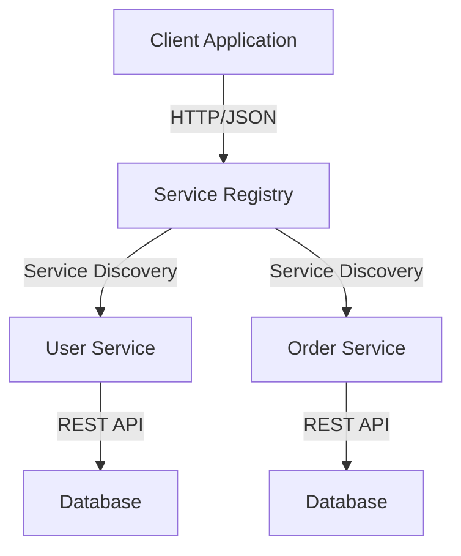

## 7.6.2 Interoperability and Reusability

Service-Oriented Architecture (SOA) is a paradigm that aims to achieve loose coupling among interacting software agents. A key feature of SOA is its ability to facilitate interoperability and reusability of services across different applications or systems. This section delves into how SOA achieves these goals, the techniques involved, and the impact on organizational structures.

### Understanding Interoperability in SOA

Interoperability refers to the ability of different systems, applications, or components to communicate and work together effectively. In the context of SOA, interoperability is achieved through standardized service interfaces that allow different applications to communicate seamlessly. These interfaces are typically defined using open standards such as HTTP, SOAP, REST, and data formats like JSON, XML, or protocol buffers.

#### Standardized Service Interfaces

Standardized service interfaces ensure that services can be accessed and consumed by different applications, regardless of the underlying technology stack. This is achieved by defining clear contracts that specify how services should be invoked, the data they expect, and the responses they return.

**Example: RESTful Service Interface**

```typescript
// TypeScript example of a RESTful service interface using Express.js

import express, { Request, Response } from 'express';

const app = express();
app.use(express.json());

app.get('/api/users/:id', (req: Request, res: Response) => {
  const userId = req.params.id;
  // Fetch user data from database or service
  res.json({ id: userId, name: 'John Doe' });
});

app.listen(3000, () => {
  console.log('Service is running on port 3000');
});
```

In this example, a RESTful service interface is defined using Express.js, a popular Node.js framework. The service exposes an endpoint `/api/users/:id` that clients can use to retrieve user information. The use of JSON as the data format ensures that the service can be consumed by a wide variety of clients, including web browsers, mobile apps, and other services.

#### Techniques for Designing Reusable Services

Designing services that are reusable and technology-agnostic is crucial for maximizing the benefits of SOA. Here are some techniques to achieve this:

1. **Loose Coupling**: Ensure that services are loosely coupled with their consumers. This means that changes to a service should not require changes to the consumers, and vice versa.

2. **Service Abstraction**: Abstract the implementation details of a service behind a well-defined interface. This allows the service to evolve independently of its consumers.

3. **Statelessness**: Design services to be stateless, meaning that each request from a consumer should contain all the information needed to process the request. This improves scalability and reusability.

4. **Idempotency**: Ensure that service operations are idempotent, meaning that repeated invocations of the same operation with the same parameters produce the same result. This is particularly important for operations that modify state.

5. **Versioning**: Implement versioning strategies to manage changes to service interfaces without breaking existing consumers.

**Example: Stateless Service Design**

```typescript
// TypeScript example of a stateless service using Express.js

app.post('/api/orders', (req: Request, res: Response) => {
  const orderData = req.body;
  // Process order
  res.status(201).json({ message: 'Order created successfully' });
});
```

In this example, the service processes an order based on the data provided in the request body. The service does not maintain any session state between requests, making it stateless and more scalable.

### Data Formats for Interoperability

Data formats play a crucial role in achieving interoperability in SOA. Common data formats include JSON, XML, and protocol buffers. Each format has its advantages and trade-offs, and the choice of format depends on the specific requirements of the application.

#### JSON

JSON (JavaScript Object Notation) is a lightweight data interchange format that is easy for humans to read and write and easy for machines to parse and generate. It is widely used in web services due to its simplicity and compatibility with JavaScript.

**Example: JSON Data Format**

```json
{
  "id": "123",
  "name": "John Doe",
  "email": "john.doe@example.com"
}
```

#### XML

XML (Extensible Markup Language) is a flexible, structured data format that is widely used in enterprise applications. It is more verbose than JSON but offers greater flexibility in defining complex data structures.

**Example: XML Data Format**

```xml
<User>
  <Id>123</Id>
  <Name>John Doe</Name>
  <Email>john.doe@example.com</Email>
</User>
```

#### Protocol Buffers

Protocol buffers are a language-neutral, platform-neutral, extensible mechanism for serializing structured data, developed by Google. They are more efficient in terms of size and speed compared to JSON and XML, making them suitable for high-performance applications.

**Example: Protocol Buffers Definition**

```protobuf
syntax = "proto3";

message User {
  string id = 1;
  string name = 2;
  string email = 3;
}
```

### Backward Compatibility and Versioning

Backward compatibility is essential in SOA to ensure that existing consumers can continue to use a service even after it has been updated. This is achieved through careful versioning of service interfaces.

#### Versioning Strategies

1. **URL Versioning**: Include the version number in the URL of the service endpoint.

   **Example:**

   ```plaintext
   /api/v1/users
   /api/v2/users
   ```

2. **Header Versioning**: Use HTTP headers to specify the version of the service.

   **Example:**

   ```plaintext
   GET /api/users
   Accept: application/vnd.example.v1+json
   ```

3. **Query Parameter Versioning**: Include the version number as a query parameter in the request URL.

   **Example:**

   ```plaintext
   /api/users?version=1
   ```

Implementing a robust versioning strategy ensures that services can evolve without breaking existing consumers, thereby enhancing reusability.

### Service Registries and Discovery Mechanisms

Service registries and discovery mechanisms play a vital role in SOA by enabling services to be discovered and consumed dynamically. A service registry is a centralized directory where services are registered and can be looked up by consumers.

#### Benefits of Service Registries

- **Dynamic Discovery**: Consumers can discover services at runtime, allowing for greater flexibility and scalability.
- **Load Balancing**: Service registries can provide load balancing by distributing requests among multiple instances of a service.
- **Failover**: In the event of a service failure, consumers can be redirected to alternative instances.

**Example: Service Registry with Consul**

Consul is a popular service registry and discovery tool that provides features such as health checking, key/value storage, and multi-datacenter support.

```plaintext
consul services register -name=my-service -address=127.0.0.1 -port=8080
```

### Impact of SOA on Organizational Structure and Team Collaboration

The adoption of SOA has a significant impact on organizational structure and team collaboration. By promoting the development of independent, reusable services, SOA encourages a more modular approach to software development.

#### Organizational Benefits

- **Decentralized Teams**: Teams can be organized around services, allowing for greater autonomy and faster decision-making.
- **Improved Collaboration**: Clear service boundaries and contracts facilitate collaboration between teams, as each team can focus on its own service without worrying about the implementation details of other services.
- **Scalability**: Organizations can scale development efforts by adding new teams to work on new services without affecting existing services.

### Visualizing SOA Interoperability and Reusability

Below is a diagram that illustrates the interaction between different services in an SOA environment, highlighting the role of service registries and standardized interfaces.



**Diagram Description**: This diagram shows a client application interacting with a service registry to discover available services (User Service and Order Service). The services communicate with their respective databases using REST APIs.

### Try It Yourself

Experiment with the code examples provided in this section. Try modifying the RESTful service interface to include additional endpoints or change the data format from JSON to XML. Implement a simple service registry using a tool like Consul and register your services with it. Observe how the client application can dynamically discover and consume services.

### Knowledge Check

- Explain how standardized service interfaces enable interoperability in SOA.
- Discuss the benefits of using JSON over XML for data interchange in web services.
- Describe the role of service registries in an SOA environment.
- Provide an example of a versioning strategy for service interfaces.
- Discuss the impact of SOA on team collaboration and organizational structure.

### Conclusion

Interoperability and reusability are fundamental principles of Service-Oriented Architecture. By leveraging standardized interfaces, data formats, and service registries, SOA enables seamless communication between different applications and systems. The adoption of SOA not only enhances technical capabilities but also fosters a more collaborative and scalable organizational structure. As you continue to explore SOA, remember to focus on designing services that are loosely coupled, stateless, and versioned appropriately to maximize their reusability and interoperability.

## Quiz Time!



### What is a key feature of Service-Oriented Architecture (SOA)?

- [x] Loose coupling among interacting software agents
- [ ] Tight integration of services
- [ ] Monolithic application design
- [ ] Single language dependency

> **Explanation:** SOA aims to achieve loose coupling among interacting software agents, allowing for greater flexibility and scalability.

### Which data format is known for its simplicity and compatibility with JavaScript?

- [x] JSON
- [ ] XML
- [ ] Protocol Buffers
- [ ] YAML

> **Explanation:** JSON (JavaScript Object Notation) is known for its simplicity and compatibility with JavaScript, making it a popular choice for web services.

### What is the purpose of a service registry in SOA?

- [x] To enable dynamic discovery and consumption of services
- [ ] To store application data
- [ ] To compile code
- [ ] To manage user authentication

> **Explanation:** A service registry enables dynamic discovery and consumption of services, allowing clients to find and use services at runtime.

### Which versioning strategy involves including the version number in the URL of the service endpoint?

- [x] URL Versioning
- [ ] Header Versioning
- [ ] Query Parameter Versioning
- [ ] Semantic Versioning

> **Explanation:** URL Versioning involves including the version number in the URL of the service endpoint, making it easy to manage different versions of a service.

### What is a benefit of designing stateless services in SOA?

- [x] Improved scalability and reusability
- [ ] Increased complexity
- [ ] Dependency on client state
- [ ] Reduced performance

> **Explanation:** Stateless services improve scalability and reusability by ensuring that each request contains all the information needed to process it, without relying on server-side session state.

### Which tool is commonly used for service registry and discovery in SOA?

- [x] Consul
- [ ] Git
- [ ] Docker
- [ ] Jenkins

> **Explanation:** Consul is a popular tool for service registry and discovery, providing features such as health checking and key/value storage.

### What is a common characteristic of reusable services in SOA?

- [x] Loose coupling and abstraction
- [ ] Tight coupling and direct access
- [ ] Dependency on specific technologies
- [ ] Single-use design

> **Explanation:** Reusable services in SOA are characterized by loose coupling and abstraction, allowing them to be used across different applications and systems.

### How does SOA impact team collaboration?

- [x] It encourages decentralized teams and improved collaboration
- [ ] It centralizes all decision-making
- [ ] It reduces team autonomy
- [ ] It complicates communication

> **Explanation:** SOA encourages decentralized teams and improved collaboration by promoting the development of independent, reusable services.

### What is the role of standardized service interfaces in SOA?

- [x] They enable seamless communication between different applications
- [ ] They enforce a single technology stack
- [ ] They limit service reusability
- [ ] They increase service complexity

> **Explanation:** Standardized service interfaces enable seamless communication between different applications, regardless of the underlying technology stack.

### True or False: Protocol buffers are more efficient in terms of size and speed compared to JSON and XML.

- [x] True
- [ ] False

> **Explanation:** Protocol buffers are more efficient in terms of size and speed compared to JSON and XML, making them suitable for high-performance applications.


