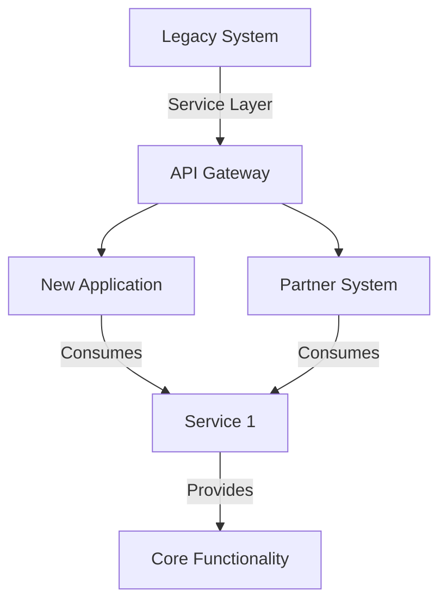

## 7.6.3 Use Cases and Examples

Service-Oriented Architecture (SOA) is a design pattern that enables the creation of modular and reusable software components, known as services, which can be easily integrated and scaled across various applications and platforms. In this section, we will explore the practical applications of SOA, particularly in enterprise environments, and discuss how it addresses the complexities of modern software development.

### Understanding SOA

Before diving into specific use cases, let's briefly revisit what SOA entails. SOA is an architectural pattern where software components are designed as services that communicate over a network. These services are loosely coupled, meaning they can be developed, deployed, and maintained independently. This approach promotes flexibility, scalability, and reusability, making it ideal for complex, distributed systems.

### Key Characteristics of SOA

- **Loose Coupling**: Services are designed to interact with each other with minimal dependencies, allowing for independent updates and modifications.
- **Interoperability**: Services can communicate across different platforms and technologies, often using standard protocols like HTTP, SOAP, or REST.
- **Reusability**: Services are designed to be reused across different applications, reducing redundancy and development time.
- **Scalability**: SOA allows for the scaling of individual services based on demand, improving resource utilization and performance.

### Use Case 1: Integrating Legacy Systems with New Applications

#### Scenario

Large enterprises often have a mix of legacy systems and new applications that need to work together. These legacy systems might be critical to business operations but lack the flexibility to integrate with modern technologies.

#### SOA Solution

SOA provides a way to wrap legacy systems as services, exposing their functionality through APIs. This allows new applications to interact with legacy systems without needing to understand their internal workings.

#### Example

Consider a financial institution with an old mainframe system for processing transactions. By creating a service layer around the mainframe, the institution can expose transaction processing as a service. New applications, such as mobile banking apps, can then consume this service to perform transactions, ensuring seamless integration without altering the mainframe's core logic.

```typescript
// Example of a service interface for a legacy transaction system
interface TransactionService {
  processTransaction(transactionId: string, amount: number): Promise<TransactionResult>;
}

// Implementation of the service that interacts with the legacy system
class LegacyTransactionService implements TransactionService {
  async processTransaction(transactionId: string, amount: number): Promise<TransactionResult> {
    // Logic to interact with the legacy mainframe system
    return { success: true, message: "Transaction processed successfully" };
  }
}
```

### Use Case 2: Offering Services to Partners or Customers via APIs

#### Scenario

Organizations often need to provide external partners or customers with access to their systems. This could be for data sharing, collaboration, or enabling third-party applications to leverage their services.

#### SOA Solution

By exposing core functionalities as services through APIs, organizations can offer controlled access to their systems. This not only enhances collaboration but also opens up new business opportunities through partnerships.

#### Example

A logistics company might expose its tracking system as a service. Partners, such as e-commerce platforms, can integrate this service into their systems to provide real-time tracking information to customers.

```typescript
// Example of an API service for tracking shipments
interface TrackingService {
  trackShipment(shipmentId: string): Promise<TrackingInfo>;
}

// Implementation of the tracking service
class ShipmentTrackingService implements TrackingService {
  async trackShipment(shipmentId: string): Promise<TrackingInfo> {
    // Logic to retrieve tracking information from the logistics system
    return { status: "In Transit", estimatedDelivery: new Date() };
  }
}
```

### Use Case 3: Modular Applications with Core Functionality as Reusable Services

#### Scenario

In large-scale applications, it's crucial to design systems that are modular and maintainable. Core functionalities should be reusable across different parts of the application or even across different applications.

#### SOA Solution

SOA encourages the development of modular services that encapsulate core functionalities. These services can be reused across various applications, reducing duplication and improving maintainability.

#### Example

An e-commerce platform might have a service for handling user authentication and authorization. This service can be reused across different applications, such as the main website, mobile app, and admin portal, ensuring consistent authentication logic.

```typescript
// Example of an authentication service
interface AuthService {
  authenticate(username: string, password: string): Promise<AuthResult>;
  authorize(userId: string, resource: string): Promise<boolean>;
}

// Implementation of the authentication service
class UserAuthService implements AuthService {
  async authenticate(username: string, password: string): Promise<AuthResult> {
    // Logic to authenticate the user
    return { userId: "12345", token: "abcde" };
  }

  async authorize(userId: string, resource: string): Promise<boolean> {
    // Logic to authorize the user for a specific resource
    return true;
  }
}
```

### Challenges in Implementing SOA

While SOA offers numerous benefits, it also presents certain challenges that need to be addressed:

- **Service Dependencies**: Managing dependencies between services can become complex, especially in large systems. It's essential to design services with clear interfaces and minimal dependencies.
- **Performance**: Network latency and overhead can impact performance, particularly when services are distributed across different locations. Optimizing service communication and using caching strategies can mitigate these issues.
- **Security**: Exposing services over a network introduces security risks. Implementing robust authentication, authorization, and encryption mechanisms is crucial to protect sensitive data.

### Visualizing SOA Integration

To better understand how SOA facilitates integration, let's visualize a typical SOA setup in an enterprise environment:



**Diagram Description**: This diagram illustrates how a legacy system is wrapped with a service layer, exposing its functionality through an API gateway. New applications and partner systems consume these services to access core functionalities.

### Encouraging SOA Adoption

When building applications that require integration across different systems or platforms, consider adopting SOA for its flexibility and reusability. By designing services that are loosely coupled and reusable, you can create systems that are easier to maintain and scale.

### Try It Yourself

To gain hands-on experience with SOA, try implementing a simple service in TypeScript. Start by defining a service interface and then create a class that implements this interface. Experiment with exposing this service through an API and consuming it from a client application. Consider adding features like authentication or caching to enhance your service.

### Knowledge Check

- What are the key characteristics of SOA?
- How does SOA facilitate the integration of legacy systems?
- What are some challenges associated with implementing SOA?
- How can SOA improve modularity and reusability in applications?

### Conclusion

Service-Oriented Architecture is a powerful design pattern that addresses the complexities of modern software development. By promoting loose coupling, interoperability, and reusability, SOA enables organizations to build flexible and scalable systems. As you continue your journey in software architecture, consider how SOA can be applied to your projects to enhance integration and modularity.

## Quiz Time!



### What is a primary benefit of using SOA in enterprise applications?

- [x] Flexibility and reusability of services
- [ ] Increased complexity and dependencies
- [ ] Reduced need for network communication
- [ ] Decreased modularity

> **Explanation:** SOA promotes flexibility and reusability by allowing services to be developed and maintained independently.

### How does SOA help integrate legacy systems with new applications?

- [x] By wrapping legacy systems as services
- [ ] By rewriting legacy systems in modern languages
- [ ] By eliminating the need for legacy systems
- [ ] By using direct database access

> **Explanation:** SOA wraps legacy systems as services, exposing their functionality through APIs for integration with new applications.

### What is a common challenge when implementing SOA?

- [x] Managing service dependencies
- [ ] Lack of scalability
- [ ] Inability to support multiple platforms
- [ ] Difficulty in creating user interfaces

> **Explanation:** Managing service dependencies can become complex, especially in large systems, and requires careful design.

### Which protocol is commonly used for service communication in SOA?

- [x] HTTP
- [ ] FTP
- [ ] SMTP
- [ ] POP3

> **Explanation:** HTTP is a standard protocol used for service communication in SOA, often in RESTful APIs.

### What is a key characteristic of services in SOA?

- [x] Loose coupling
- [ ] Tight integration
- [ ] High redundancy
- [ ] Platform dependency

> **Explanation:** Services in SOA are loosely coupled, allowing them to interact with minimal dependencies.

### How can SOA improve modularity in applications?

- [x] By designing services that encapsulate core functionalities
- [ ] By increasing code duplication
- [ ] By centralizing all logic in a single service
- [ ] By reducing the number of services

> **Explanation:** SOA improves modularity by designing services that encapsulate core functionalities, which can be reused across applications.

### What is a potential security risk in SOA?

- [x] Exposing services over a network
- [ ] Lack of service interfaces
- [ ] Inability to scale services
- [ ] Difficulty in updating services

> **Explanation:** Exposing services over a network introduces security risks, making robust authentication and encryption essential.

### How does SOA promote interoperability?

- [x] By allowing services to communicate across different platforms
- [ ] By requiring all services to use the same technology stack
- [ ] By eliminating the need for APIs
- [ ] By reducing the number of services

> **Explanation:** SOA promotes interoperability by allowing services to communicate across different platforms and technologies.

### What is an example of a service in an e-commerce platform?

- [x] User authentication service
- [ ] Product listing page
- [ ] Shopping cart UI
- [ ] Static HTML content

> **Explanation:** A user authentication service is an example of a reusable service in an e-commerce platform.

### SOA is only suitable for large enterprises.

- [ ] True
- [x] False

> **Explanation:** While SOA is beneficial for large enterprises, it can also be applied to smaller systems that require integration and modularity.


