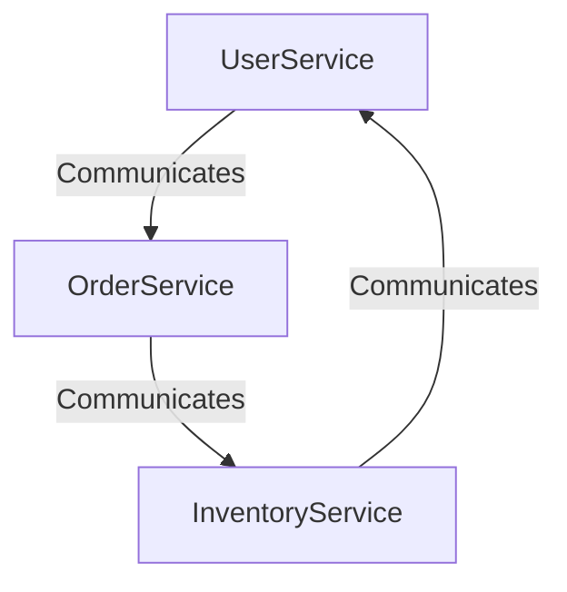

## 7.6 Service-Oriented Architecture (SOA)

Service-Oriented Architecture (SOA) is a design pattern that structures applications as a collection of reusable services. This architectural style emphasizes reusability, interoperability, and loose coupling, making it a popular choice for building scalable and maintainable systems. In this section, we will explore the key principles of SOA, compare it with microservices, and demonstrate how to implement SOA using TypeScript.

### Understanding Service-Oriented Architecture

Service-Oriented Architecture is a method of designing software systems that enables different services to communicate with each other over a network. Each service is a discrete unit of functionality that can be independently developed, deployed, and maintained. Here are some key principles of SOA:

- **Reusability**: Services are designed to be reused across different applications and contexts.
- **Interoperability**: Services can communicate with each other regardless of the underlying technology stack.
- **Loose Coupling**: Services are loosely coupled, meaning changes in one service do not require changes in others.
- **Standardized Service Contracts**: Services communicate through well-defined interfaces and protocols.

### Benefits of SOA

SOA offers several benefits that make it an attractive choice for modern software development:

- **Scalability**: Services can be scaled independently to meet demand.
- **Flexibility**: New services can be added without disrupting existing ones.
- **Maintainability**: Services can be updated or replaced without affecting the entire system.
- **Cost-Effectiveness**: Reusing services reduces development time and costs.

### SOA vs. Microservices

While SOA and microservices share similarities, they are distinct architectural styles. Both emphasize modularity and service-based architecture, but they differ in scope and implementation:

- **Granularity**: Microservices are typically smaller and more focused than services in SOA.
- **Communication**: SOA often uses enterprise service buses (ESBs) for communication, while microservices use lightweight protocols like HTTP/REST.
- **Governance**: SOA involves more centralized governance, whereas microservices favor decentralized governance.

### Implementing SOA in TypeScript

TypeScript is a powerful language for building services due to its static typing, interfaces, and support for modern JavaScript features. Let's explore how to implement SOA using TypeScript.

#### Building a Service

To build a service in TypeScript, we define a service interface and implement it in a class. Here's an example of a simple user service:

```typescript
// Define a service interface
interface UserService {
  getUser(id: string): Promise<User>;
  createUser(user: User): Promise<void>;
}

// Implement the service
class UserServiceImpl implements UserService {
  private users: Map<string, User> = new Map();

  async getUser(id: string): Promise<User> {
    const user = this.users.get(id);
    if (!user) {
      throw new Error('User not found');
    }
    return user;
  }

  async createUser(user: User): Promise<void> {
    if (this.users.has(user.id)) {
      throw new Error('User already exists');
    }
    this.users.set(user.id, user);
  }
}

// Define a User type
type User = {
  id: string;
  name: string;
  email: string;
};
```

#### Consuming a Service

To consume a service, we can use dependency injection to pass the service implementation to a client. Here's an example:

```typescript
class UserClient {
  constructor(private userService: UserService) {}

  async displayUser(id: string): Promise<void> {
    try {
      const user = await this.userService.getUser(id);
      console.log(`User: ${user.name}, Email: ${user.email}`);
    } catch (error) {
      console.error(error.message);
    }
  }
}

// Usage
const userService = new UserServiceImpl();
const userClient = new UserClient(userService);

userService.createUser({ id: '1', name: 'Alice', email: 'alice@example.com' });
userClient.displayUser('1');
```

### Challenges in SOA

Implementing SOA comes with its own set of challenges:

- **Service Governance**: Managing and enforcing policies across services can be complex.
- **Versioning**: Maintaining backward compatibility while updating services requires careful planning.
- **Scalability**: Ensuring services can scale to meet demand without degrading performance.

### Best Practices for Designing Services in TypeScript

To effectively design services in TypeScript, consider the following best practices:

- **Use Interfaces**: Define service contracts using interfaces to ensure consistency and flexibility.
- **Leverage TypeScript Features**: Utilize TypeScript's static typing, generics, and decorators to enhance service design.
- **Implement Error Handling**: Use try/catch blocks and custom error types to handle errors gracefully.
- **Focus on Reusability**: Design services with reusability in mind to maximize their value.

### Visualizing SOA

To better understand the structure of SOA, let's visualize a simple SOA system with three services: UserService, OrderService, and InventoryService.



**Diagram Description**: This diagram illustrates a basic SOA system where the UserService, OrderService, and InventoryService communicate with each other. Each service is independent and can be developed, deployed, and maintained separately.

### Try It Yourself

Experiment with the provided TypeScript examples by modifying the service implementation. Try adding new methods to the `UserService` or creating additional services such as `OrderService` and `InventoryService`. Observe how the system behaves when you introduce new services or modify existing ones.

### Knowledge Check

- What are the key principles of SOA?
- How does SOA differ from microservices?
- What are the benefits of using SOA in software development?
- How can TypeScript features enhance service design?
- What challenges might you face when implementing SOA?

### Summary

Service-Oriented Architecture is a powerful design pattern that promotes reusability, interoperability, and loose coupling. By structuring applications around reusable services, developers can create scalable and maintainable systems. TypeScript's features make it an excellent choice for implementing SOA, enabling developers to build robust and flexible services.

## Quiz Time!



### What is a key principle of Service-Oriented Architecture (SOA)?

- [x] Loose coupling
- [ ] Tight integration
- [ ] Monolithic design
- [ ] High dependency

> **Explanation:** Loose coupling is a fundamental principle of SOA, allowing services to be independent and easily replaceable.

### How does SOA differ from microservices?

- [x] SOA often uses enterprise service buses (ESBs) for communication, while microservices use lightweight protocols.
- [ ] SOA is always smaller in scope than microservices.
- [ ] SOA requires decentralized governance, unlike microservices.
- [ ] SOA and microservices are identical in implementation.

> **Explanation:** SOA typically involves ESBs for communication, whereas microservices favor lightweight protocols like HTTP/REST.

### What is a benefit of using SOA?

- [x] Reusability of services
- [ ] Increased complexity
- [ ] Tight coupling
- [ ] Reduced flexibility

> **Explanation:** SOA promotes the reusability of services, allowing them to be used across different applications.

### In TypeScript, how can services be defined?

- [x] Using interfaces and classes
- [ ] Using only functions
- [ ] Using global variables
- [ ] Using inline scripts

> **Explanation:** Services in TypeScript are typically defined using interfaces and classes to ensure structure and reusability.

### What challenge might you face with SOA?

- [x] Service governance
- [ ] Lack of modularity
- [ ] Inability to scale
- [ ] High coupling

> **Explanation:** Service governance is a challenge in SOA, involving the management and enforcement of policies across services.

### Which TypeScript feature enhances service design?

- [x] Static typing
- [ ] Dynamic typing
- [ ] Global variables
- [ ] Inline scripts

> **Explanation:** Static typing in TypeScript enhances service design by providing type safety and reducing runtime errors.

### What is the role of standardized service contracts in SOA?

- [x] To define clear interfaces for communication between services
- [ ] To increase dependency between services
- [ ] To create monolithic applications
- [ ] To eliminate the need for documentation

> **Explanation:** Standardized service contracts define clear interfaces for communication, ensuring consistency and interoperability.

### What is a common tool used in SOA for communication?

- [x] Enterprise Service Bus (ESB)
- [ ] WebSockets
- [ ] Direct database access
- [ ] Local file storage

> **Explanation:** An Enterprise Service Bus (ESB) is commonly used in SOA for communication between services.

### What is a best practice for designing services in TypeScript?

- [x] Use interfaces to define service contracts
- [ ] Use global variables for service state
- [ ] Avoid error handling
- [ ] Hard-code service dependencies

> **Explanation:** Using interfaces to define service contracts is a best practice, ensuring flexibility and consistency.

### True or False: SOA and microservices are identical in their approach to service design.

- [ ] True
- [x] False

> **Explanation:** SOA and microservices are not identical; they differ in scope, communication methods, and governance.


