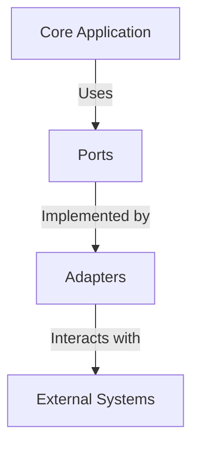

## 7.7.1 Implementing Hexagonal Architecture in TypeScript

Hexagonal Architecture, also known as Ports and Adapters, is a software design pattern that aims to create loosely coupled application components that can be easily tested and maintained. This architecture emphasizes the separation of concerns, allowing the core application logic to remain independent of external systems like databases, user interfaces, or third-party services. In this section, we will explore how to implement Hexagonal Architecture in TypeScript, focusing on setting up a project, defining Ports, implementing Adapters, and ensuring testability and flexibility.

### Introduction to Hexagonal Architecture

Hexagonal Architecture was introduced by Alistair Cockburn to address the challenges of traditional layered architectures, which often lead to tightly coupled systems. The key idea is to separate the core logic of the application from the external systems it interacts with, using Ports and Adapters to facilitate communication.

- **Ports**: These are interfaces that define the inputs and outputs of the core application. They represent the services the application offers and the data it requires.
- **Adapters**: These are implementations that connect the core application to external systems. They translate the data and operations between the external systems and the core application.

This architecture promotes testability by allowing the core logic to be tested independently of the external systems, using mocks or stubs for the Adapters.

### Setting Up a TypeScript Project

Before diving into Hexagonal Architecture, let's set up a basic TypeScript project. This will serve as the foundation for our implementation.

1. **Initialize a TypeScript Project**: Start by creating a new directory for your project and initializing a TypeScript project.

   ```bash
   mkdir hexagonal-architecture-ts
   cd hexagonal-architecture-ts
   npm init -y
   npm install typescript --save-dev
   npx tsc --init
   ```

2. **Configure TypeScript**: Open the `tsconfig.json` file and configure it according to your project needs. Ensure that `strict` mode is enabled for better type safety.

   ```json
   {
     "compilerOptions": {
       "target": "ES6",
       "module": "commonjs",
       "strict": true,
       "esModuleInterop": true,
       "outDir": "./dist",
       "rootDir": "./src"
     },
     "include": ["src"]
   }
   ```

3. **Project Structure**: Create a basic directory structure to organize your code.

   ```
   hexagonal-architecture-ts/
   ├── src/
   │   ├── core/
   │   ├── ports/
   │   ├── adapters/
   │   └── index.ts
   └── tsconfig.json
   ```

### Defining Ports as TypeScript Interfaces

Ports are the interfaces that define the services offered by the core application. They act as a contract between the core logic and the external systems.

1. **Create a Port Interface**: Let's define a simple port for a user service. This port will define the operations related to user management.

   ```typescript
   // src/ports/UserServicePort.ts
   export interface UserServicePort {
     createUser(name: string, email: string): Promise<void>;
     getUserById(id: string): Promise<User | null>;
   }

   export interface User {
     id: string;
     name: string;
     email: string;
   }
   ```

2. **Explain the Port Interface**: The `UserServicePort` interface defines two methods: `createUser` and `getUserById`. These methods represent the operations that the core application can perform related to users.

### Implementing Adapters

Adapters are responsible for connecting the core application to external systems. They implement the Ports and handle the interaction with databases, APIs, or other external services.

1. **Create an Adapter**: Let's implement an adapter that interacts with a mock database.

   ```typescript
   // src/adapters/MockUserServiceAdapter.ts
   import { UserServicePort, User } from '../ports/UserServicePort';

   export class MockUserServiceAdapter implements UserServicePort {
     private users: Map<string, User> = new Map();

     async createUser(name: string, email: string): Promise<void> {
       const id = Math.random().toString(36).substr(2, 9);
       this.users.set(id, { id, name, email });
     }

     async getUserById(id: string): Promise<User | null> {
       return this.users.get(id) || null;
     }
   }
   ```

2. **Explain the Adapter**: The `MockUserServiceAdapter` class implements the `UserServicePort` interface. It uses an in-memory map to store user data, simulating a database.

### Core Application Logic

The core application logic uses the Ports to interact with external systems, without any knowledge of the Adapters.

1. **Implement Core Logic**: Let's create a simple service that uses the `UserServicePort`.

   ```typescript
   // src/core/UserService.ts
   import { UserServicePort } from '../ports/UserServicePort';

   export class UserService {
     constructor(private userServicePort: UserServicePort) {}

     async registerUser(name: string, email: string): Promise<void> {
       await this.userServicePort.createUser(name, email);
     }

     async findUser(id: string): Promise<void> {
       const user = await this.userServicePort.getUserById(id);
       if (user) {
         console.log(`User found: ${user.name} (${user.email})`);
       } else {
         console.log('User not found');
       }
     }
   }
   ```

2. **Explain Core Logic**: The `UserService` class uses the `UserServicePort` to perform operations related to user management. It does not know about the specific implementation of the port, making it flexible and testable.

### Dependency Injection and Inversion of Control

Dependency Injection (DI) and Inversion of Control (IoC) are key concepts in Hexagonal Architecture, allowing the core application to remain decoupled from the Adapters.

1. **Implement Dependency Injection**: Use constructor injection to pass the adapter to the core service.

   ```typescript
   // src/index.ts
   import { UserService } from './core/UserService';
   import { MockUserServiceAdapter } from './adapters/MockUserServiceAdapter';

   const userServicePort = new MockUserServiceAdapter();
   const userService = new UserService(userServicePort);

   async function main() {
     await userService.registerUser('Alice', 'alice@example.com');
     await userService.findUser('1');
   }

   main();
   ```

2. **Explain Dependency Injection**: The `UserService` class receives the `UserServicePort` implementation through its constructor. This allows us to easily swap the adapter with a different implementation, such as a real database adapter.

### Facilitating Unit Testing

Hexagonal Architecture makes unit testing straightforward by allowing the use of mocks or stubs for Adapters.

1. **Create a Mock Adapter for Testing**: Implement a mock adapter to simulate external interactions during testing.

   ```typescript
   // src/adapters/MockUserServiceAdapter.test.ts
   import { UserService } from '../core/UserService';
   import { UserServicePort } from '../ports/UserServicePort';

   class MockUserServiceAdapter implements UserServicePort {
     private users: Map<string, User> = new Map();

     async createUser(name: string, email: string): Promise<void> {
       const id = '1'; // Fixed ID for testing
       this.users.set(id, { id, name, email });
     }

     async getUserById(id: string): Promise<User | null> {
       return this.users.get(id) || null;
     }
   }

   test('UserService should register and find a user', async () => {
     const mockAdapter = new MockUserServiceAdapter();
     const userService = new UserService(mockAdapter);

     await userService.registerUser('Bob', 'bob@example.com');
     const user = await mockAdapter.getUserById('1');

     expect(user).not.toBeNull();
     expect(user?.name).toBe('Bob');
   });
   ```

2. **Explain Unit Testing**: By using a mock adapter, we can test the `UserService` class without relying on a real database. This makes the tests fast and reliable.

### Best Practices for Organizing Code

1. **Separation of Concerns**: Keep the core logic, ports, and adapters in separate directories to maintain a clear separation of concerns.

2. **Interface-Driven Design**: Define clear interfaces for ports to ensure that the core logic remains decoupled from the adapters.

3. **Dependency Management**: Use dependency injection to manage dependencies and facilitate testing.

4. **Testability**: Write unit tests for the core logic using mock adapters to ensure that the application behaves as expected.

5. **Flexibility**: Design adapters to be easily replaceable, allowing the application to adapt to changes in external systems.

### Visualizing Hexagonal Architecture

To better understand Hexagonal Architecture, let's visualize the relationship between the core application, ports, and adapters.



**Diagram Explanation**: The core application interacts with the Ports, which are implemented by Adapters. The Adapters handle the communication with external systems, allowing the core application to remain independent and testable.

### Try It Yourself

Now that we've covered the basics of implementing Hexagonal Architecture in TypeScript, it's time to experiment with the code. Here are some suggestions:

- **Add a New Adapter**: Implement an adapter that interacts with a real database, such as MongoDB or PostgreSQL.
- **Extend the Port Interface**: Add new methods to the `UserServicePort` interface and update the core logic and adapters accordingly.
- **Refactor for Scalability**: Consider how you might refactor the code to support additional features or services.

### Conclusion

Implementing Hexagonal Architecture in TypeScript provides a robust framework for building flexible and testable applications. By separating the core logic from external systems using Ports and Adapters, we can create systems that are easier to maintain and extend. Remember, this is just the beginning. As you continue to explore and implement Hexagonal Architecture, you'll discover new ways to enhance your applications' scalability and testability.

## Quiz Time!



### What is the primary goal of Hexagonal Architecture?

- [x] To separate the core application logic from external systems.
- [ ] To increase the speed of application development.
- [ ] To reduce the number of lines of code.
- [ ] To ensure all components are tightly coupled.

> **Explanation:** Hexagonal Architecture aims to separate the core application logic from external systems, enhancing testability and flexibility.

### What are Ports in Hexagonal Architecture?

- [x] Interfaces that define the inputs and outputs of the core application.
- [ ] Classes that implement the core logic.
- [ ] External systems that interact with the application.
- [ ] Methods that handle user input.

> **Explanation:** Ports are interfaces that define the inputs and outputs of the core application, acting as a contract between the core logic and external systems.

### What role do Adapters play in Hexagonal Architecture?

- [x] They connect the core application to external systems.
- [ ] They define the core application logic.
- [ ] They act as the main entry point for user interactions.
- [ ] They store application data.

> **Explanation:** Adapters implement the Ports and handle the interaction with external systems, translating data and operations between them and the core application.

### How does Dependency Injection facilitate Hexagonal Architecture?

- [x] By allowing the core application to remain decoupled from the Adapters.
- [ ] By increasing the complexity of the application.
- [ ] By reducing the number of classes needed.
- [ ] By ensuring all components are tightly coupled.

> **Explanation:** Dependency Injection allows the core application to remain decoupled from the Adapters, facilitating easy swapping of implementations and enhancing testability.

### What is a key benefit of using Hexagonal Architecture?

- [x] Improved testability by allowing the use of mocks or stubs for Adapters.
- [ ] Faster execution of code.
- [ ] Reduced need for documentation.
- [ ] Increased number of dependencies.

> **Explanation:** Hexagonal Architecture improves testability by allowing the use of mocks or stubs for Adapters, enabling the core logic to be tested independently of external systems.

### Which of the following is a best practice for organizing code in Hexagonal Architecture?

- [x] Keep the core logic, ports, and adapters in separate directories.
- [ ] Combine all code into a single file for simplicity.
- [ ] Use global variables to manage dependencies.
- [ ] Avoid using interfaces to reduce complexity.

> **Explanation:** Keeping the core logic, ports, and adapters in separate directories helps maintain a clear separation of concerns and enhances code organization.

### What is the purpose of using a mock adapter in unit testing?

- [x] To simulate external interactions without relying on real systems.
- [ ] To increase the complexity of tests.
- [ ] To ensure tests run slower.
- [ ] To reduce the number of test cases needed.

> **Explanation:** Using a mock adapter allows us to simulate external interactions during testing, making tests fast and reliable without relying on real systems.

### How does Hexagonal Architecture enhance flexibility?

- [x] By allowing adapters to be easily replaceable.
- [ ] By reducing the number of classes in the application.
- [ ] By enforcing a single implementation for all components.
- [ ] By increasing the number of dependencies.

> **Explanation:** Hexagonal Architecture enhances flexibility by allowing adapters to be easily replaceable, enabling the application to adapt to changes in external systems.

### What is the relationship between Ports and Adapters in Hexagonal Architecture?

- [x] Adapters implement Ports to connect the core application to external systems.
- [ ] Ports implement Adapters to connect external systems to the core application.
- [ ] Ports and Adapters are unrelated components.
- [ ] Adapters define the core application logic.

> **Explanation:** Adapters implement Ports to connect the core application to external systems, translating data and operations between them.

### True or False: Hexagonal Architecture makes it difficult to test the core application logic.

- [ ] True
- [x] False

> **Explanation:** Hexagonal Architecture makes it easier to test the core application logic by separating it from external systems and allowing the use of mocks or stubs for Adapters.


