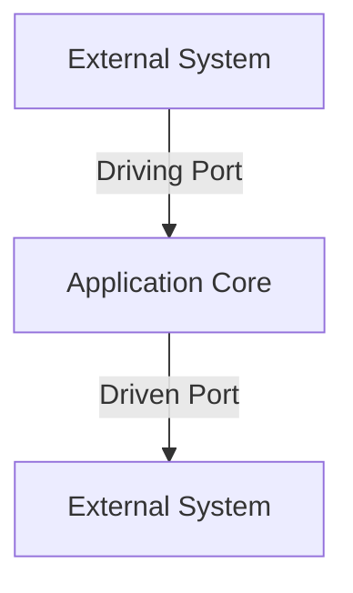

## 7.7.2 Ports and Adapters Explained

In the world of software architecture, the Ports and Adapters pattern, also known as Hexagonal Architecture, stands out as a powerful approach for creating systems that are both flexible and maintainable. This pattern is designed to decouple the core business logic of an application from the external systems it interacts with, such as databases, user interfaces, and external services. By doing so, it allows developers to build applications that are easier to test, extend, and modify.

### Understanding the Core Concepts

Hexagonal Architecture is built around three main components: the application core, ports, and adapters. Let's delve into each of these components to understand their roles and how they interact with each other.

#### The Application Core

The application core is the heart of the system. It contains the business logic that defines the application's primary functionality. The core is designed to be independent of any external systems, meaning it does not directly interact with databases, user interfaces, or external services. Instead, it relies on abstractions, known as ports, to communicate with the outside world.

**Key Characteristics of the Application Core:**

- **Independence:** The core is isolated from external systems, making it easier to test and modify without affecting other parts of the application.
- **Focus on Business Logic:** It contains only the business rules and logic, ensuring that the core remains focused and uncluttered by external concerns.
- **Reusability:** By being independent, the core can be reused in different contexts or applications.

#### Ports

Ports are abstractions that define the boundaries of the application core. They represent the interfaces through which the core interacts with the external world. There are two types of ports:

1. **Driving Ports (Incoming Ports):** These ports represent the entry points into the application core. They define how external systems, such as user interfaces or external services, can interact with the core. Examples include HTTP controllers or message handlers.

2. **Driven Ports (Outgoing Ports):** These ports represent the exit points from the application core. They define how the core can interact with external systems, such as databases or external APIs. Examples include repository interfaces or service interfaces.

**Diagram: Visualizing Ports in Hexagonal Architecture**



*In this diagram, the application core interacts with external systems through defined ports, ensuring a clear separation of concerns.*

#### Adapters

Adapters are the components that implement the ports. They are responsible for translating the interactions between the application core and the external systems. Each port can have multiple adapters, allowing the application to interact with different external systems without changing the core logic.

**Types of Adapters:**

- **Primary Adapters:** These implement the driving ports and handle incoming requests to the application core. Examples include HTTP controllers or CLI handlers.
- **Secondary Adapters:** These implement the driven ports and handle outgoing requests from the application core. Examples include database repositories or external API clients.

**Example: Implementing Adapters in TypeScript**

Let's consider a simple example where we have an application that manages user accounts. We'll define a driving port for creating a user and a driven port for storing user data.

**Driving Port Interface:**

```typescript
// Driving port for user creation
interface UserCreationPort {
    createUser(username: string, password: string): Promise<void>;
}
```

**Driven Port Interface:**

```typescript
// Driven port for user repository
interface UserRepositoryPort {
    saveUser(user: User): Promise<void>;
}
```

**Primary Adapter Implementation:**

```typescript
// HTTP controller implementing the driving port
class UserController implements UserCreationPort {
    constructor(private userService: UserService) {}

    async createUser(username: string, password: string): Promise<void> {
        await this.userService.registerUser(username, password);
    }
}
```

**Secondary Adapter Implementation:**

```typescript
// Database repository implementing the driven port
class UserRepository implements UserRepositoryPort {
    async saveUser(user: User): Promise<void> {
        // Logic to save user to the database
    }
}
```

### Benefits of Ports and Adapters

The Ports and Adapters pattern offers several advantages that contribute to building robust and maintainable applications:

1. **Modularity:** By separating the application core from external systems, developers can modify or replace adapters without affecting the core logic.

2. **Testability:** The core can be tested in isolation using mock implementations of the ports, leading to more reliable and faster tests.

3. **Flexibility:** The pattern allows for easy integration with new external systems by simply adding new adapters.

4. **Maintainability:** The clear separation of concerns makes the codebase easier to understand and maintain over time.

### Common Ports and Adapters

In practice, there are several common types of ports and adapters that developers frequently encounter:

- **Repositories:** Driven ports that define how the core interacts with data storage systems. Adapters could be implementations for SQL databases, NoSQL databases, or in-memory storage.

- **Services:** Driven ports that define how the core interacts with external services. Adapters could be implementations for REST APIs, SOAP services, or third-party libraries.

- **Controllers:** Driving ports that define how external systems interact with the core. Adapters could be implementations for HTTP endpoints, WebSocket handlers, or command-line interfaces.

### Considerations for Implementation

While the Ports and Adapters pattern offers many benefits, there are some considerations to keep in mind:

- **Avoid Over-Engineering:** It's important to strike a balance between abstraction and simplicity. Over-complicating the architecture with too many layers can lead to unnecessary complexity.

- **Consistency:** Ensure that all interactions with external systems are routed through the appropriate ports and adapters to maintain consistency and avoid bypassing the architecture.

- **Documentation:** Clearly document the purpose and responsibilities of each port and adapter to aid in understanding and maintaining the system.

### Try It Yourself

To get a better understanding of the Ports and Adapters pattern, try modifying the example code to add a new adapter for a different type of database or external service. Experiment with creating mock implementations of the ports for testing purposes.

### Conclusion

The Ports and Adapters pattern is a powerful tool for building modular, flexible, and maintainable applications. By abstracting external dependencies and focusing on the core business logic, developers can create systems that are easier to test, extend, and adapt to changing requirements. As you continue to explore this pattern, remember to keep the architecture simple and focused on the needs of your application.

## Quiz Time!



### What is the primary goal of the Ports and Adapters pattern?

- [x] To decouple the application core from external systems
- [ ] To increase the complexity of the application
- [ ] To reduce the number of external dependencies
- [ ] To simplify the user interface

> **Explanation:** The primary goal of the Ports and Adapters pattern is to decouple the application core from external systems, allowing for greater flexibility and maintainability.

### What are driving ports in the context of Ports and Adapters?

- [x] Entry points into the application core
- [ ] Exit points from the application core
- [ ] Interfaces for external services
- [ ] Implementations of adapters

> **Explanation:** Driving ports are entry points into the application core, defining how external systems can interact with it.

### What role do adapters play in the Ports and Adapters pattern?

- [x] They implement ports to connect the application core with external systems
- [ ] They define the business logic of the application
- [ ] They act as the main entry point for user interactions
- [ ] They store data in the database

> **Explanation:** Adapters implement ports to connect the application core with external systems, translating interactions between them.

### Which of the following is a benefit of using the Ports and Adapters pattern?

- [x] Improved testability
- [ ] Increased code complexity
- [ ] Reduced modularity
- [ ] Decreased flexibility

> **Explanation:** The Ports and Adapters pattern improves testability by allowing the application core to be tested in isolation using mock implementations of the ports.

### What is a common type of driven port in the Ports and Adapters pattern?

- [x] Repository
- [ ] Controller
- [ ] User interface
- [ ] Command-line interface

> **Explanation:** A repository is a common type of driven port, defining how the core interacts with data storage systems.

### How can the Ports and Adapters pattern contribute to maintainability?

- [x] By providing a clear separation of concerns
- [ ] By increasing the number of dependencies
- [ ] By making the codebase more complex
- [ ] By reducing the number of tests

> **Explanation:** The Ports and Adapters pattern contributes to maintainability by providing a clear separation of concerns, making the codebase easier to understand and maintain.

### What is a potential downside of over-engineering the Ports and Adapters pattern?

- [x] Unnecessary complexity
- [ ] Improved performance
- [ ] Increased flexibility
- [ ] Enhanced modularity

> **Explanation:** Over-engineering the Ports and Adapters pattern can lead to unnecessary complexity, making the system harder to understand and maintain.

### In the Ports and Adapters pattern, what is the role of the application core?

- [x] To contain the business logic independent of external systems
- [ ] To handle all interactions with external systems
- [ ] To implement the user interface
- [ ] To store data in the database

> **Explanation:** The application core contains the business logic independent of external systems, focusing on the primary functionality of the application.

### Which of the following is an example of a primary adapter?

- [x] HTTP controller
- [ ] Database repository
- [ ] External API client
- [ ] In-memory storage

> **Explanation:** An HTTP controller is an example of a primary adapter, implementing a driving port to handle incoming requests to the application core.

### True or False: The Ports and Adapters pattern is also known as Hexagonal Architecture.

- [x] True
- [ ] False

> **Explanation:** True. The Ports and Adapters pattern is also known as Hexagonal Architecture, emphasizing the separation of the application core from external systems.


