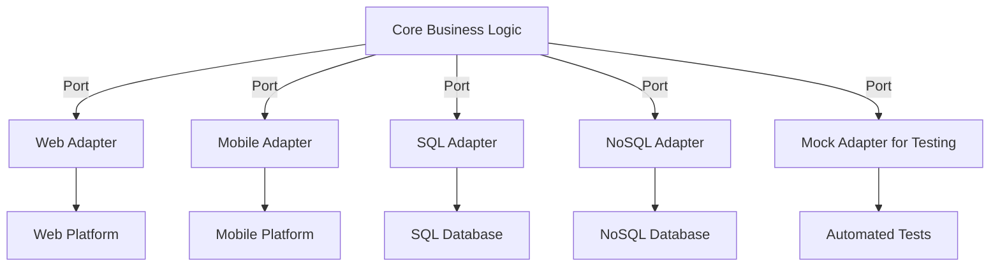

## 7.7.3 Use Cases and Examples

Hexagonal Architecture, also known as Ports and Adapters, is a powerful architectural pattern that promotes a clean separation between the core business logic and the external systems interacting with it. This pattern is especially beneficial in applications where decoupling, testability, and flexibility are paramount. In this section, we will explore several use cases where Hexagonal Architecture shines, providing examples and discussing its advantages in TypeScript applications.

### Building Platform-Agnostic Applications

#### Concept

In today's rapidly evolving technological landscape, applications often need to be platform-agnostic, meaning they should operate seamlessly across different environments without being tied to specific platforms or technologies. Hexagonal Architecture facilitates this by ensuring that the core business logic remains isolated from platform-specific concerns.

#### Example: Multi-Platform E-commerce Application

Consider an e-commerce application that needs to support both web and mobile platforms. The business logic, such as product catalog management, order processing, and inventory updates, should remain consistent across platforms. Hexagonal Architecture allows us to achieve this by defining a common set of interfaces (ports) for these operations, with specific implementations (adapters) for each platform.

```typescript
// Define a port for product catalog operations
interface ProductCatalogPort {
  getProductDetails(productId: string): Promise<Product>;
  listAllProducts(): Promise<Product[]>;
}

// Core business logic
class ProductCatalogService implements ProductCatalogPort {
  constructor(private productRepository: ProductRepository) {}

  async getProductDetails(productId: string): Promise<Product> {
    return this.productRepository.findById(productId);
  }

  async listAllProducts(): Promise<Product[]> {
    return this.productRepository.findAll();
  }
}

// Web adapter
class WebProductCatalogAdapter implements ProductCatalogPort {
  constructor(private webApi: WebApi) {}

  async getProductDetails(productId: string): Promise<Product> {
    return this.webApi.fetchProductDetails(productId);
  }

  async listAllProducts(): Promise<Product[]> {
    return this.webApi.fetchAllProducts();
  }
}

// Mobile adapter
class MobileProductCatalogAdapter implements ProductCatalogPort {
  constructor(private mobileApi: MobileApi) {}

  async getProductDetails(productId: string): Promise<Product> {
    return this.mobileApi.getProductDetails(productId);
  }

  async listAllProducts(): Promise<Product[]> {
    return this.mobileApi.getAllProducts();
  }
}
```

In this example, the `ProductCatalogService` encapsulates the business logic, while the `WebProductCatalogAdapter` and `MobileProductCatalogAdapter` provide platform-specific implementations. This separation ensures that changes to the platform do not affect the core logic.

#### Benefits

- **Flexibility**: Easily switch between different platforms without altering the core logic.
- **Maintainability**: Platform-specific changes are isolated in adapters, reducing the risk of introducing bugs into the business logic.
- **Testability**: Core logic can be tested independently of the platform, ensuring consistent behavior across environments.

### Switching Databases or External Services

#### Concept

Applications often need to switch databases or integrate with different external services over time. Hexagonal Architecture supports this by decoupling the business logic from the data storage or external service layers, allowing for seamless transitions.

#### Example: Switching from SQL to NoSQL Database

Imagine a scenario where an application initially uses a SQL database but later needs to switch to a NoSQL database for scalability reasons. By using Hexagonal Architecture, the transition can be handled smoothly without impacting the core business logic.

```typescript
// Define a port for data access
interface UserRepositoryPort {
  findById(userId: string): Promise<User>;
  save(user: User): Promise<void>;
}

// Core business logic
class UserService {
  constructor(private userRepository: UserRepositoryPort) {}

  async getUser(userId: string): Promise<User> {
    return this.userRepository.findById(userId);
  }

  async createUser(user: User): Promise<void> {
    await this.userRepository.save(user);
  }
}

// SQL adapter
class SqlUserRepositoryAdapter implements UserRepositoryPort {
  constructor(private sqlDatabase: SqlDatabase) {}

  async findById(userId: string): Promise<User> {
    return this.sqlDatabase.query(`SELECT * FROM users WHERE id = ?`, [userId]);
  }

  async save(user: User): Promise<void> {
    await this.sqlDatabase.execute(`INSERT INTO users SET ?`, user);
  }
}

// NoSQL adapter
class NoSqlUserRepositoryAdapter implements UserRepositoryPort {
  constructor(private noSqlDatabase: NoSqlDatabase) {}

  async findById(userId: string): Promise<User> {
    return this.noSqlDatabase.find({ id: userId });
  }

  async save(user: User): Promise<void> {
    await this.noSqlDatabase.insert(user);
  }
}
```

In this example, the `UserService` uses a `UserRepositoryPort` to interact with the data layer, allowing the underlying database technology to be swapped without affecting the service logic.

#### Benefits

- **Adaptability**: Easily switch databases or services as requirements change.
- **Reduced Risk**: Minimize the impact of changes on the core business logic.
- **Scalability**: Choose the best technology for each use case without rewriting the core logic.

### Extensive Automated Testing

#### Concept

Automated testing is crucial for maintaining high-quality software, especially in complex applications. Hexagonal Architecture enhances testability by isolating the business logic from external dependencies, making it easier to write unit tests.

#### Example: Testing Business Logic in Isolation

Consider a payment processing system where the business logic needs to be tested independently of the payment gateway.

```typescript
// Define a port for payment processing
interface PaymentGatewayPort {
  processPayment(amount: number, accountId: string): Promise<boolean>;
}

// Core business logic
class PaymentService {
  constructor(private paymentGateway: PaymentGatewayPort) {}

  async makePayment(amount: number, accountId: string): Promise<boolean> {
    if (amount <= 0) {
      throw new Error("Invalid payment amount");
    }
    return this.paymentGateway.processPayment(amount, accountId);
  }
}

// Mock adapter for testing
class MockPaymentGatewayAdapter implements PaymentGatewayPort {
  async processPayment(amount: number, accountId: string): Promise<boolean> {
    return true; // Simulate successful payment
  }
}

// Unit test
describe('PaymentService', () => {
  let paymentService: PaymentService;
  let mockPaymentGateway: MockPaymentGatewayAdapter;

  beforeEach(() => {
    mockPaymentGateway = new MockPaymentGatewayAdapter();
    paymentService = new PaymentService(mockPaymentGateway);
  });

  it('should process payment successfully', async () => {
    const result = await paymentService.makePayment(100, 'account123');
    expect(result).toBe(true);
  });

  it('should throw error for invalid payment amount', async () => {
    await expect(paymentService.makePayment(-100, 'account123')).rejects.toThrow("Invalid payment amount");
  });
});
```

In this example, the `PaymentService` is tested using a `MockPaymentGatewayAdapter`, allowing the business logic to be verified independently of the actual payment gateway.

#### Benefits

- **Testability**: Isolate and test business logic without external dependencies.
- **Reliability**: Ensure consistent behavior through comprehensive testing.
- **Efficiency**: Write tests that focus on core logic, reducing complexity and maintenance overhead.

### Encouraging Decoupling and Testability

Hexagonal Architecture is particularly beneficial in applications where decoupling and testability are priorities. By separating the core business logic from external systems, developers can create applications that are easier to maintain, extend, and test.

#### Use Case: Developing a Modular Application

In a modular application, different components or modules need to interact with each other without being tightly coupled. Hexagonal Architecture facilitates this by defining clear interfaces for communication between modules.

```typescript
// Define a port for module interaction
interface NotificationPort {
  sendNotification(message: string, userId: string): Promise<void>;
}

// Core business logic
class NotificationService {
  constructor(private notificationPort: NotificationPort) {}

  async notifyUser(message: string, userId: string): Promise<void> {
    await this.notificationPort.sendNotification(message, userId);
  }
}

// Email adapter
class EmailNotificationAdapter implements NotificationPort {
  async sendNotification(message: string, userId: string): Promise<void> {
    // Send email notification
  }
}

// SMS adapter
class SmsNotificationAdapter implements NotificationPort {
  async sendNotification(message: string, userId: string): Promise<void> {
    // Send SMS notification
  }
}
```

In this example, the `NotificationService` interacts with different notification channels through a `NotificationPort`, allowing the notification method to be switched without affecting the service logic.

#### Benefits

- **Decoupling**: Separate modules can evolve independently, reducing dependencies.
- **Extensibility**: Easily add new modules or features without disrupting existing functionality.
- **Maintainability**: Clear interfaces and separation of concerns simplify maintenance and updates.

### Visualizing Hexagonal Architecture

To better understand how Hexagonal Architecture facilitates these use cases, let's visualize the architecture using a Mermaid.js diagram.



**Diagram Description**: This diagram illustrates the core business logic interacting with various adapters through defined ports. Each adapter connects to a specific external system, such as a platform, database, or testing environment, showcasing the flexibility and decoupling provided by Hexagonal Architecture.

### Try It Yourself

To deepen your understanding of Hexagonal Architecture, try modifying the code examples provided:

- **Experiment with New Adapters**: Create a new adapter for a different platform or service and integrate it with the existing business logic.
- **Enhance Test Coverage**: Write additional unit tests for the business logic using mock adapters.
- **Refactor Existing Code**: Identify parts of your existing applications that could benefit from Hexagonal Architecture and refactor them accordingly.

### Conclusion

Hexagonal Architecture offers a robust framework for building applications that prioritize decoupling, testability, and flexibility. By isolating the core business logic from external systems, developers can create maintainable and adaptable applications that can easily evolve with changing requirements. As you continue to explore and implement this architecture, remember that the journey of mastering design patterns is ongoing. Keep experimenting, stay curious, and embrace the challenges and opportunities that come your way.

## Quiz Time!



### Which architectural pattern is also known as Ports and Adapters?

- [x] Hexagonal Architecture
- [ ] Layered Architecture
- [ ] Microservices Architecture
- [ ] Event-Driven Architecture

> **Explanation:** Hexagonal Architecture is commonly referred to as Ports and Adapters due to its design of separating core logic from external systems through defined interfaces (ports) and implementations (adapters).

### What is a key benefit of using Hexagonal Architecture in applications?

- [x] Enhanced testability
- [ ] Increased code duplication
- [ ] Reduced flexibility
- [ ] Tighter coupling

> **Explanation:** Hexagonal Architecture enhances testability by isolating the core business logic from external dependencies, allowing for independent testing.

### In Hexagonal Architecture, what role do ports play?

- [x] Define interfaces for core logic interaction
- [ ] Store application data
- [ ] Handle user authentication
- [ ] Manage network requests

> **Explanation:** Ports define the interfaces through which the core business logic interacts with external systems, ensuring decoupling and flexibility.

### How does Hexagonal Architecture facilitate switching databases?

- [x] By using adapters to handle specific database implementations
- [ ] By embedding database logic in the core business logic
- [ ] By hardcoding database queries
- [ ] By using a single database type

> **Explanation:** Hexagonal Architecture uses adapters to handle specific database implementations, allowing for seamless switching without affecting the core logic.

### What is the primary focus of Hexagonal Architecture?

- [x] Separation of concerns
- [ ] Maximizing code complexity
- [ ] Reducing code readability
- [ ] Increasing dependency on external systems

> **Explanation:** The primary focus of Hexagonal Architecture is the separation of concerns, ensuring that core logic is decoupled from external systems.

### Which of the following is a common use case for Hexagonal Architecture?

- [x] Developing platform-agnostic applications
- [ ] Writing monolithic applications
- [ ] Creating tightly coupled systems
- [ ] Embedding all logic in a single module

> **Explanation:** Hexagonal Architecture is commonly used for developing platform-agnostic applications due to its decoupling of core logic from platform-specific concerns.

### What does an adapter do in Hexagonal Architecture?

- [x] Implements the interface defined by a port
- [ ] Stores user data
- [ ] Manages application state
- [ ] Handles user input

> **Explanation:** An adapter implements the interface defined by a port, connecting the core business logic to specific external systems.

### How can Hexagonal Architecture improve maintainability?

- [x] By isolating changes to specific adapters
- [ ] By increasing code duplication
- [ ] By embedding all logic in a single class
- [ ] By reducing code readability

> **Explanation:** Hexagonal Architecture improves maintainability by isolating changes to specific adapters, minimizing the impact on the core business logic.

### What is a benefit of using mock adapters in testing?

- [x] They allow testing of core logic without external dependencies
- [ ] They increase test complexity
- [ ] They require real-time data
- [ ] They reduce test coverage

> **Explanation:** Mock adapters allow testing of core logic without external dependencies, ensuring reliable and independent tests.

### True or False: Hexagonal Architecture is suitable for applications requiring strong separation of concerns.

- [x] True
- [ ] False

> **Explanation:** True. Hexagonal Architecture is designed to provide strong separation of concerns, making it suitable for applications where decoupling is a priority.


