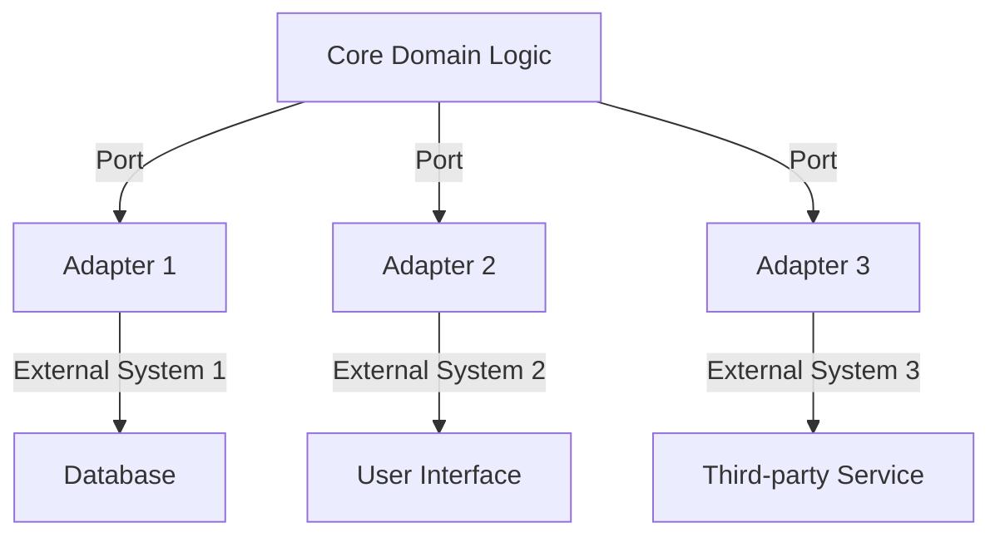

## 7.7 Hexagonal Architecture (Ports and Adapters)

Hexagonal Architecture, also known as Ports and Adapters, is a software design pattern that aims to isolate an application's core logic from external factors, such as databases, user interfaces, and third-party services. This separation enhances testability, flexibility, and maintainability, allowing developers to adapt to changing technologies with minimal impact on the core business logic.

### Understanding Hexagonal Architecture

Hexagonal Architecture was introduced by Alistair Cockburn to address the challenges of traditional layered architectures, where dependencies often flow inward, making it difficult to test and modify the core logic independently. In Hexagonal Architecture, the core application logic is surrounded by ports and adapters, which act as intermediaries between the core and external systems.

#### Core Concepts

- **Core Domain Logic**: The heart of the application, containing business rules and logic, independent of external systems.
- **Ports**: Define the boundaries of the core logic. They are interfaces that specify how the core interacts with the outside world.
- **Adapters**: Implement the ports to connect the core logic with external systems. They translate external requests into a format the core can understand and vice versa.

### Principles of Hexagonal Architecture

Hexagonal Architecture is built on several key principles:

1. **Separation of Concerns**: Isolate the core logic from external systems to ensure that changes in technology do not affect the business rules.
2. **Interchangeability**: Allow different implementations of ports (adapters) to be swapped without affecting the core logic.
3. **Testability**: Enable testing of the core logic in isolation by using mock implementations of ports.
4. **Flexibility**: Facilitate changes in external systems or technologies without modifying the core logic.

### Structure of Hexagonal Architecture

The architecture can be visualized as a hexagon with the core logic at the center, surrounded by ports and adapters.



**Diagram Description**: The hexagon represents the core domain logic, with ports defining the boundaries. Adapters connect the core to various external systems, such as databases, user interfaces, and third-party services.

### Implementing Hexagonal Architecture in TypeScript

Let's explore how to implement Hexagonal Architecture in TypeScript by creating a simple application that manages user accounts. We'll define the core logic, ports, and adapters, demonstrating how TypeScript's features support this architecture.

#### Step 1: Define the Core Domain Logic

The core domain logic contains the business rules for managing user accounts. We'll create a `UserService` class that handles user-related operations.

```typescript
// core/UserService.ts
export interface User {
  id: string;
  name: string;
  email: string;
}

export class UserService {
  private users: User[] = [];

  addUser(user: User): void {
    this.users.push(user);
  }

  getUserById(id: string): User | undefined {
    return this.users.find(user => user.id === id);
  }

  getAllUsers(): User[] {
    return this.users;
  }
}
```

**Code Explanation**: The `UserService` class manages user accounts, providing methods to add users, retrieve a user by ID, and get all users. This class is independent of any external systems.

#### Step 2: Define Ports

Ports are interfaces that define how the core logic interacts with external systems. We'll create a `UserRepository` interface to specify the operations required for user data persistence.

```typescript
// ports/UserRepository.ts
import { User } from '../core/UserService';

export interface UserRepository {
  save(user: User): void;
  findById(id: string): User | undefined;
  findAll(): User[];
}
```

**Code Explanation**: The `UserRepository` interface defines methods for saving a user, finding a user by ID, and retrieving all users. It acts as a contract between the core logic and external data storage systems.

#### Step 3: Implement Adapters

Adapters implement the ports to connect the core logic with external systems. We'll create a `DatabaseUserRepository` adapter that interacts with a mock database.

```typescript
// adapters/DatabaseUserRepository.ts
import { UserRepository } from '../ports/UserRepository';
import { User } from '../core/UserService';

export class DatabaseUserRepository implements UserRepository {
  private database: Map<string, User> = new Map();

  save(user: User): void {
    this.database.set(user.id, user);
  }

  findById(id: string): User | undefined {
    return this.database.get(id);
  }

  findAll(): User[] {
    return Array.from(this.database.values());
  }
}
```

**Code Explanation**: The `DatabaseUserRepository` class implements the `UserRepository` interface, using a `Map` to simulate a database. It provides methods to save users, find a user by ID, and retrieve all users.

#### Step 4: Integrate the Components

Now, let's integrate the core logic, ports, and adapters to create a functional application.

```typescript
// app.ts
import { UserService } from './core/UserService';
import { DatabaseUserRepository } from './adapters/DatabaseUserRepository';

const userRepository = new DatabaseUserRepository();
const userService = new UserService();

// Add a user
const newUser = { id: '1', name: 'Alice', email: 'alice@example.com' };
userRepository.save(newUser);
userService.addUser(newUser);

// Retrieve and display users
console.log('All Users:', userService.getAllUsers());
console.log('User by ID:', userService.getUserById('1'));
```

**Code Explanation**: In `app.ts`, we create instances of `DatabaseUserRepository` and `UserService`, add a user, and display all users and a user by ID. The core logic interacts with the adapter through the port interface, ensuring separation of concerns.

### Benefits of Hexagonal Architecture

Hexagonal Architecture offers several benefits:

- **Ease of Testing**: The core logic can be tested independently using mock implementations of ports, enabling unit testing without external dependencies.
- **Flexibility**: Adapters can be swapped or modified without affecting the core logic, allowing for easy integration with new technologies.
- **Improved Maintainability**: The separation of concerns makes it easier to understand and modify the application, reducing the risk of introducing bugs.

### TypeScript Features Supporting Hexagonal Architecture

TypeScript provides several features that support Hexagonal Architecture:

- **Interfaces**: Define contracts between the core logic and external systems, ensuring consistent interaction.
- **Dependency Injection**: Facilitate the injection of adapters into the core logic, promoting loose coupling and testability.
- **Type Safety**: Ensure that the core logic and adapters adhere to the defined interfaces, reducing runtime errors.

### Challenges and Best Practices

While Hexagonal Architecture offers many benefits, it also presents challenges:

- **Complexity**: The architecture can introduce additional complexity, especially in small projects where the overhead may not be justified.
- **Over-Engineering**: It's essential to balance the architecture's benefits with the project's needs, avoiding unnecessary complexity.

**Best Practices**:

- **Start Simple**: Begin with a straightforward implementation and evolve the architecture as the project grows.
- **Focus on Core Logic**: Prioritize the separation of core logic from external systems to maximize the architecture's benefits.
- **Use Dependency Injection**: Leverage dependency injection frameworks to manage adapter instances and promote testability.

### Try It Yourself

Experiment with the provided code examples by modifying the `UserService` class to include additional user-related operations, such as updating or deleting users. Implement new adapters for different data storage systems, like a file-based repository or a REST API client, to see how easily the architecture adapts to changes.

### Conclusion

Hexagonal Architecture, or Ports and Adapters, offers a robust approach to designing applications that are flexible, maintainable, and testable. By isolating the core logic from external systems, developers can adapt to changing technologies with minimal impact on the application's business rules. TypeScript's features, such as interfaces and dependency injection, further enhance the architecture's effectiveness, making it an excellent choice for modern software development.

## Quiz Time!



### What is the primary goal of Hexagonal Architecture?

- [x] To isolate the core domain logic from external systems
- [ ] To increase the number of dependencies in a project
- [ ] To make code more complex and harder to maintain
- [ ] To reduce the need for testing

> **Explanation:** Hexagonal Architecture aims to isolate the core domain logic from external systems, enhancing testability and flexibility.

### What do ports represent in Hexagonal Architecture?

- [x] Interfaces defining boundaries between core logic and external systems
- [ ] Concrete implementations of external systems
- [ ] The main entry point of the application
- [ ] A type of database connection

> **Explanation:** Ports are interfaces that define how the core logic interacts with the outside world, acting as boundaries.

### How do adapters function in Hexagonal Architecture?

- [x] They implement ports to connect the core logic with external systems
- [ ] They are the main logic of the application
- [ ] They replace the need for ports
- [ ] They are used only for testing purposes

> **Explanation:** Adapters implement ports to connect the core logic with external systems, translating requests and responses.

### Which TypeScript feature is crucial for defining ports?

- [x] Interfaces
- [ ] Classes
- [ ] Enums
- [ ] Decorators

> **Explanation:** Interfaces in TypeScript are crucial for defining ports, as they specify the contract between core logic and external systems.

### What is a key benefit of using Hexagonal Architecture?

- [x] Improved testability and flexibility
- [ ] Increased complexity and dependencies
- [ ] Reduced need for documentation
- [ ] Faster development time for small projects

> **Explanation:** Hexagonal Architecture improves testability and flexibility by separating core logic from external systems.

### Which of the following is a challenge of Hexagonal Architecture?

- [x] Increased complexity in small projects
- [ ] Lack of flexibility
- [ ] Difficulty in testing
- [ ] Limited scalability

> **Explanation:** Hexagonal Architecture can introduce complexity, especially in small projects where the overhead may not be justified.

### How does dependency injection support Hexagonal Architecture?

- [x] By promoting loose coupling and testability
- [ ] By increasing the number of dependencies
- [ ] By making the code more complex
- [ ] By reducing the need for interfaces

> **Explanation:** Dependency injection supports Hexagonal Architecture by promoting loose coupling and testability, allowing easy swapping of adapters.

### What is a best practice when implementing Hexagonal Architecture?

- [x] Start simple and evolve the architecture as needed
- [ ] Implement all possible adapters from the start
- [ ] Avoid using interfaces for ports
- [ ] Focus solely on external systems

> **Explanation:** A best practice is to start simple and evolve the architecture as needed, focusing on the separation of core logic from external systems.

### True or False: Hexagonal Architecture is only suitable for large projects.

- [ ] True
- [x] False

> **Explanation:** Hexagonal Architecture can be applied to projects of any size, but its benefits are more pronounced in larger projects with complex interactions.

### Which of the following is NOT a component of Hexagonal Architecture?

- [ ] Core Domain Logic
- [ ] Ports
- [ ] Adapters
- [x] Middleware

> **Explanation:** Middleware is not a component of Hexagonal Architecture. The architecture consists of core domain logic, ports, and adapters.


