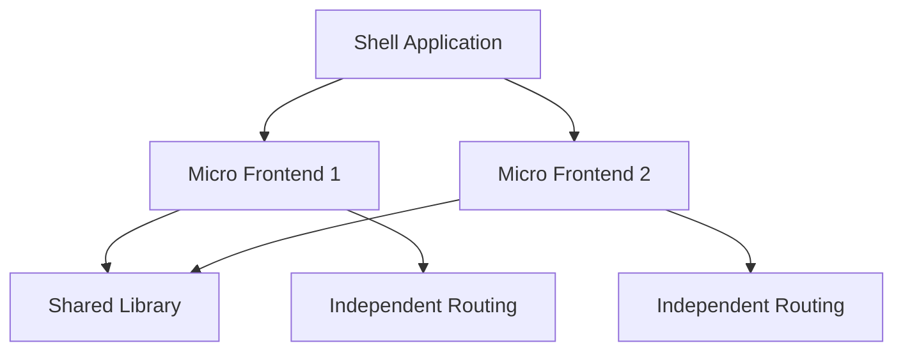

## 7.8.1 Implementing Micro Frontends with TypeScript

In the ever-evolving landscape of web development, the concept of Micro Frontends has emerged as a powerful architectural pattern. It allows developers to break down a monolithic front-end application into smaller, manageable, and independently deployable pieces. This approach not only enhances scalability but also facilitates parallel development, enabling teams to work on different parts of an application simultaneously. In this section, we will explore how to implement Micro Frontends using TypeScript, leveraging its strong typing and modern features to build robust and maintainable applications.

### Understanding Micro Frontends

Micro Frontends extend the principles of microservices to the front-end world. The core idea is to split a web application into smaller, self-contained units that can be developed, tested, and deployed independently. Each Micro Frontend is responsible for a specific feature or section of the application, and they communicate with each other to form a cohesive user experience.

#### Key Benefits of Micro Frontends

- **Scalability**: By dividing the application into smaller pieces, teams can scale individual components without affecting the entire system.
- **Independent Deployment**: Each Micro Frontend can be deployed independently, reducing the risk of breaking changes and enabling faster release cycles.
- **Technology Agnostic**: Teams can choose different technologies or frameworks for each Micro Frontend, allowing for flexibility and innovation.
- **Parallel Development**: Multiple teams can work on different Micro Frontends simultaneously, improving productivity and reducing time-to-market.

### Structuring Micro Frontend Projects

When structuring Micro Frontend projects, it's essential to establish a clear separation of concerns. Each Micro Frontend should be treated as an independent application with its own codebase, build process, and deployment pipeline.

#### Project Structure

A typical Micro Frontend project might look like this:

```
/micro-frontend-app
  /micro-frontend-1
    /src
    /public
    /tests
    package.json
    tsconfig.json
  /micro-frontend-2
    /src
    /public
    /tests
    package.json
    tsconfig.json
  /shell
    /src
    /public
    /tests
    package.json
    tsconfig.json
```

- **Micro Frontend 1 & 2**: These are individual Micro Frontend applications, each with its own source code, assets, and configuration files.
- **Shell**: The shell application acts as the host, orchestrating the loading and rendering of different Micro Frontends.

### Setting Up Independent Front-End Applications with TypeScript

To set up independent front-end applications using TypeScript, we can use popular frameworks like React, Angular, or Vue.js. Let's explore how to create a simple Micro Frontend using React and TypeScript.

#### Step-by-Step Guide

1. **Initialize the Project**: Start by creating a new React application using Create React App with TypeScript support.

   ```bash
   npx create-react-app micro-frontend-1 --template typescript
   ```

2. **Configure TypeScript**: Ensure that your `tsconfig.json` is set up correctly for your project needs. For example:

   ```json
   {
     "compilerOptions": {
       "target": "es5",
       "module": "esnext",
       "strict": true,
       "jsx": "react",
       "esModuleInterop": true
     }
   }
   ```

3. **Develop the Micro Frontend**: Build your application as you would any other React app. Use TypeScript's strong typing to define interfaces and types for your components.

   ```tsx
   // src/components/HelloWorld.tsx
   import React from 'react';

   interface HelloWorldProps {
     name: string;
   }

   const HelloWorld: React.FC<HelloWorldProps> = ({ name }) => {
     return <h1>Hello, {name}!</h1>;
   };

   export default HelloWorld;
   ```

4. **Build and Deploy**: Configure your build process to output static assets that can be served by the shell application. Use tools like Webpack or Parcel for bundling.

### Sharing Code, Types, and Assets Across Micro Frontends

One of the challenges in a Micro Frontend architecture is sharing code, types, and assets efficiently. Here are some strategies to achieve this:

#### Strategies for Code Sharing

- **Shared Libraries**: Create a shared library for common utilities, components, and types. Publish this library to a private npm registry or a shared repository.

  ```bash
  npm install @my-org/shared-library
  ```

- **Module Federation**: Use Webpack's Module Federation plugin to dynamically load shared modules at runtime. This approach reduces duplication and ensures that all Micro Frontends use the same version of shared code.

#### Example of Module Federation

```javascript
// webpack.config.js for Micro Frontend 1
const ModuleFederationPlugin = require('webpack/lib/container/ModuleFederationPlugin');

module.exports = {
  plugins: [
    new ModuleFederationPlugin({
      name: 'microFrontend1',
      filename: 'remoteEntry.js',
      exposes: {
        './HelloWorld': './src/components/HelloWorld',
      },
      shared: ['react', 'react-dom'],
    }),
  ],
};
```

### Handling Routing and Navigation

Routing and navigation between Micro Frontends can be complex, especially when each Micro Frontend has its own routing logic. Here are some approaches to manage routing effectively:

#### Centralized Routing

- **Shell Application**: Use the shell application to manage global routing. Each Micro Frontend registers its routes with the shell, which handles navigation between them.

  ```tsx
  // shell/src/App.tsx
  import React from 'react';
  import { BrowserRouter as Router, Route, Switch } from 'react-router-dom';
  import MicroFrontend1 from './MicroFrontend1';
  import MicroFrontend2 from './MicroFrontend2';

  const App: React.FC = () => (
    <Router>
      <Switch>
        <Route path="/mf1" component={MicroFrontend1} />
        <Route path="/mf2" component={MicroFrontend2} />
      </Switch>
    </Router>
  );

  export default App;
  ```

#### Decentralized Routing

- **Independent Routing**: Allow each Micro Frontend to manage its own routing. This approach requires careful coordination to ensure consistent user experience.

### Managing Dependencies and Avoiding Conflicts

Managing dependencies in a Micro Frontend architecture is crucial to avoid conflicts and ensure smooth operation. Here are some best practices:

#### Dependency Management

- **Version Control**: Use semantic versioning for shared libraries to manage compatibility between Micro Frontends.
- **Peer Dependencies**: Define shared dependencies as peer dependencies to ensure that only one version is loaded at runtime.

  ```json
  // package.json
  "peerDependencies": {
    "react": "^17.0.0",
    "react-dom": "^17.0.0"
  }
  ```

- **Isolation**: Use iframes or web components to isolate Micro Frontends and prevent dependency conflicts.

### Consistent Styling and Theming

Consistent styling and theming across Micro Frontends are essential for a unified user experience. Here are some strategies to achieve this:

#### Styling Strategies

- **CSS Variables**: Use CSS variables for theming, allowing each Micro Frontend to inherit global styles.

  ```css
  :root {
    --primary-color: #3498db;
    --secondary-color: #2ecc71;
  }
  ```

- **Shared Style Guide**: Develop a shared style guide or design system that all Micro Frontends adhere to. This can be implemented as a shared CSS or SCSS library.

- **CSS-in-JS**: Use libraries like styled-components or Emotion to encapsulate styles within components, reducing the risk of style conflicts.

### Deploying and Updating Micro Frontends Independently

One of the main advantages of Micro Frontends is the ability to deploy and update them independently. Here are some best practices for managing deployments:

#### Deployment Strategies

- **CI/CD Pipelines**: Set up continuous integration and continuous deployment (CI/CD) pipelines for each Micro Frontend. This allows for automated testing and deployment, reducing the risk of human error.

- **Versioning and Rollbacks**: Implement versioning for each Micro Frontend to track changes and enable rollbacks if necessary.

- **Feature Flags**: Use feature flags to control the release of new features, allowing for gradual rollouts and testing in production environments.

### Best Practices for Micro Frontends with TypeScript

- **Strong Typing**: Leverage TypeScript's strong typing to define clear interfaces and contracts between Micro Frontends.
- **Code Quality**: Use tools like ESLint and Prettier to maintain code quality and consistency across all Micro Frontends.
- **Documentation**: Document shared libraries, APIs, and interfaces to ensure that all teams have a clear understanding of how to integrate and use them.

### Visualizing Micro Frontend Architecture

To better understand the architecture of Micro Frontends, let's visualize the interaction between the shell and individual Micro Frontends.



*Diagram: Interaction between the shell and individual Micro Frontends, highlighting shared libraries and independent routing.*

### Try It Yourself

To get hands-on experience with Micro Frontends, try modifying the example code to add a new Micro Frontend. Experiment with different routing strategies and see how they affect the user experience. Consider using different frameworks for each Micro Frontend to explore the flexibility of this architecture.

### Knowledge Check

- How would you handle shared state between Micro Frontends?
- What are the benefits of using Module Federation in a Micro Frontend architecture?
- How can CSS variables be used to maintain consistent theming across Micro Frontends?

### Embrace the Journey

Implementing Micro Frontends with TypeScript is a journey that requires careful planning and execution. Remember, this is just the beginning. As you progress, you'll discover new ways to optimize and enhance your applications. Keep experimenting, stay curious, and enjoy the journey!

## Quiz Time!



### What is a key benefit of Micro Frontends?

- [x] Independent deployment
- [ ] Increased complexity
- [ ] Single technology stack
- [ ] Centralized development

> **Explanation:** Micro Frontends allow for independent deployment, enabling faster release cycles and reducing the risk of breaking changes.

### Which tool can be used for sharing code between Micro Frontends?

- [x] Module Federation
- [ ] CSS Variables
- [ ] React Router
- [ ] TypeScript Compiler

> **Explanation:** Module Federation is a Webpack feature that allows for dynamic loading of shared modules, reducing duplication and ensuring consistency.

### How can routing be managed in a Micro Frontend architecture?

- [x] Centralized routing in the shell application
- [ ] Using only client-side routing
- [ ] No routing is needed
- [ ] Hardcoding routes in each Micro Frontend

> **Explanation:** Centralized routing in the shell application allows for consistent navigation between Micro Frontends.

### What is a strategy for managing dependencies in Micro Frontends?

- [x] Use peer dependencies
- [ ] Ignore version conflicts
- [ ] Use only local dependencies
- [ ] Hardcode dependency versions

> **Explanation:** Peer dependencies help ensure that only one version of a shared dependency is loaded at runtime, avoiding conflicts.

### How can consistent styling be achieved across Micro Frontends?

- [x] Use CSS variables
- [ ] Use inline styles
- [ ] Avoid styling
- [ ] Use different styles for each Micro Frontend

> **Explanation:** CSS variables allow for consistent theming and styling across different Micro Frontends.

### What is a benefit of using TypeScript in Micro Frontends?

- [x] Strong typing and clear interfaces
- [ ] Faster runtime performance
- [ ] Reduced code size
- [ ] Automatic styling

> **Explanation:** TypeScript provides strong typing and clear interfaces, which help in defining contracts between Micro Frontends.

### What is a best practice for deploying Micro Frontends?

- [x] Use CI/CD pipelines
- [ ] Deploy manually
- [ ] Avoid versioning
- [ ] Deploy all Micro Frontends together

> **Explanation:** CI/CD pipelines automate testing and deployment, reducing the risk of errors and enabling faster releases.

### How can feature flags be used in Micro Frontends?

- [x] To control the release of new features
- [ ] To replace routing
- [ ] To manage dependencies
- [ ] To style components

> **Explanation:** Feature flags allow for gradual rollouts and testing of new features in production environments.

### What is a challenge in Micro Frontend architecture?

- [x] Managing shared state
- [ ] Increased monolithic structure
- [ ] Single deployment pipeline
- [ ] Limited technology choices

> **Explanation:** Managing shared state between independently deployed Micro Frontends can be challenging and requires careful planning.

### True or False: Micro Frontends require a single technology stack.

- [ ] True
- [x] False

> **Explanation:** Micro Frontends allow for different technologies or frameworks to be used for each part of the application, providing flexibility and innovation.


