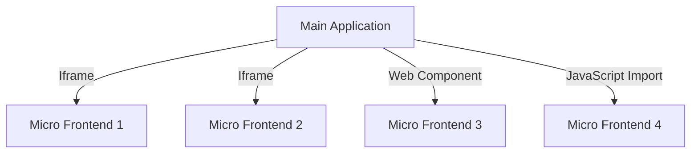

## 7.8.2 Integration Techniques

In the realm of modern web development, Micro Frontends have emerged as a powerful architectural style that allows teams to build and deploy frontend applications in a modular fashion. This approach enables independent teams to develop, test, and deploy their parts of an application without interfering with each other. However, integrating these micro frontend components into a cohesive user experience can be challenging. In this section, we will explore various integration techniques, such as using iframes, Web Components, and JavaScript imports, and discuss their pros and cons. We will also address considerations for performance, security, inter-Micro Frontend communication, and how to handle shared dependencies and versioning.

### Understanding Micro Frontends

Before diving into integration techniques, let's briefly revisit what Micro Frontends are. Micro Frontends extend the concept of microservices to the frontend world, allowing developers to break down a monolithic frontend application into smaller, manageable pieces. Each piece, or micro frontend, is an independent application that can be developed, tested, and deployed separately.

### Integration Techniques Overview

Integrating Micro Frontends involves combining these independent applications into a single, seamless user interface. The primary techniques for integration include:

- **Iframes**: A traditional method that provides strong isolation between components.
- **Web Components**: A modern approach that allows encapsulation and reuse of components.
- **JavaScript Imports/Module Federation**: A flexible method that leverages ES6 modules for integration.

Let's explore each of these techniques in detail.

### Iframes: Isolation and Limitations

Iframes have been a staple in web development for decades, offering a straightforward way to embed one HTML document within another. They provide excellent isolation between Micro Frontends, as each iframe runs in its own browsing context.

#### Pros of Using Iframes

- **Isolation**: Each iframe operates independently, which means that styles, scripts, and even JavaScript errors in one iframe do not affect others.
- **Security**: The same-origin policy restricts scripts running in one iframe from accessing data in another, enhancing security.
- **Legacy Support**: Iframes are well-supported across all browsers, making them a reliable choice for embedding content.

#### Cons of Using Iframes

- **Performance**: Iframes can be slow to load, as each one requires a separate HTTP request and rendering process.
- **Communication**: Inter-iframe communication is complex and often requires postMessage, which can be cumbersome to implement.
- **SEO and Accessibility**: Content within iframes is not easily accessible to search engines or assistive technologies.

#### Example: Using Iframes for Micro Frontends

```html
<!DOCTYPE html>
<html lang="en">
<head>
    <meta charset="UTF-8">
    <title>Micro Frontend with Iframes</title>
</head>
<body>
    <!-- Embedding a micro frontend using an iframe -->
    <iframe src="https://example.com/micro-frontend1" width="100%" height="500px"></iframe>
    <iframe src="https://example.com/micro-frontend2" width="100%" height="500px"></iframe>
</body>
</html>
```

In this example, two micro frontends are embedded using iframes. While this setup provides isolation, it also highlights the challenges of communication and performance.

### Web Components: Encapsulation and Reusability

Web Components are a suite of technologies that allow developers to create reusable and encapsulated HTML tags. They consist of three main technologies: Custom Elements, Shadow DOM, and HTML Templates.

#### Pros of Using Web Components

- **Encapsulation**: Web Components encapsulate styles and behavior, preventing conflicts with other components.
- **Reusability**: Once created, Web Components can be reused across different parts of an application or even in different projects.
- **Interoperability**: Web Components are supported by all modern browsers and can be used with any JavaScript framework.

#### Cons of Using Web Components

- **Complexity**: Creating Web Components can be more complex than using traditional HTML elements.
- **Browser Support**: While modern browsers support Web Components, older browsers may require polyfills.
- **Learning Curve**: Developers need to learn new APIs and concepts to effectively use Web Components.

#### Example: Creating a Web Component for a Micro Frontend

```typescript
// Define a new custom element
class MyMicroFrontend extends HTMLElement {
    constructor() {
        super();
        // Attach a shadow root to the element
        const shadow = this.attachShadow({ mode: 'open' });

        // Create a div element
        const container = document.createElement('div');
        container.textContent = 'Hello from Micro Frontend!';

        // Append the div to the shadow root
        shadow.appendChild(container);
    }
}

// Register the custom element
customElements.define('my-micro-frontend', MyMicroFrontend);
```

In this example, we define a simple Web Component that encapsulates its content within a shadow DOM, ensuring that styles and scripts do not leak out or affect other parts of the application.

### JavaScript Imports and Module Federation

JavaScript imports, especially when combined with module federation, offer a flexible way to integrate Micro Frontends. This approach leverages ES6 modules to dynamically load and share code between different parts of an application.

#### Pros of JavaScript Imports and Module Federation

- **Dynamic Loading**: Modules can be loaded on demand, improving performance by reducing initial load times.
- **Shared Dependencies**: Module federation allows sharing of dependencies between Micro Frontends, reducing duplication.
- **Flexibility**: This approach works well with modern JavaScript frameworks and build tools.

#### Cons of JavaScript Imports and Module Federation

- **Complexity**: Setting up module federation can be complex, requiring configuration of build tools like Webpack.
- **Versioning**: Managing shared dependencies and ensuring compatibility can be challenging.
- **Browser Support**: While modern browsers support ES6 modules, older browsers may require transpilation or polyfills.

#### Example: Using JavaScript Imports for Micro Frontends

```javascript
// Importing a module from another micro frontend
import { greet } from 'micro-frontend-module';

greet('Hello from the main application!');
```

In this example, we import a function from another micro frontend module, demonstrating how JavaScript imports can facilitate integration and code sharing.

### Considerations for Performance, Security, and Communication

When integrating Micro Frontends, it's crucial to consider performance, security, and communication between components.

#### Performance

- **Lazy Loading**: Load Micro Frontends only when needed to reduce initial load times.
- **Code Splitting**: Use techniques like code splitting to optimize loading of shared dependencies.
- **Caching**: Implement caching strategies to reduce redundant network requests.

#### Security

- **Content Security Policy (CSP)**: Use CSP headers to prevent cross-site scripting (XSS) attacks.
- **Sandboxing**: If using iframes, apply sandbox attributes to restrict capabilities.
- **Authentication and Authorization**: Ensure that each Micro Frontend handles authentication and authorization appropriately.

#### Communication

- **Event Bus**: Use an event bus or message broker to facilitate communication between Micro Frontends.
- **Shared State**: Consider using a shared state management solution, such as Redux, to synchronize state across components.
- **API Gateway**: Implement an API gateway to centralize communication with backend services.

### Handling Shared Dependencies and Versioning

Managing shared dependencies and versioning is a critical aspect of integrating Micro Frontends.

- **Dependency Management**: Use tools like npm or Yarn to manage dependencies and ensure compatibility.
- **Versioning Strategy**: Adopt a versioning strategy that allows for backward compatibility and smooth upgrades.
- **Module Federation**: Leverage module federation to share common dependencies and reduce duplication.

### Recommendations for Selecting Integration Methods

Choosing the right integration method depends on the specific needs and constraints of your project. Here are some recommendations:

- **Use Iframes** if you need strong isolation and security, and performance is not a primary concern.
- **Opt for Web Components** if you require encapsulation and reusability, and your team is comfortable with the learning curve.
- **Choose JavaScript Imports/Module Federation** if you need flexibility, dynamic loading, and efficient dependency management.

### Try It Yourself

Experiment with the code examples provided in this section. Try modifying the Web Component example to include styles or additional functionality. Explore how module federation can be configured in a Webpack project to share dependencies between Micro Frontends.

### Visualizing Integration Techniques

To better understand the integration techniques, let's visualize how these components interact:



**Diagram Description**: This diagram illustrates how a main application integrates multiple Micro Frontends using different techniques: iframes, Web Components, and JavaScript imports.

### Conclusion

Integrating Micro Frontends is a complex but rewarding endeavor that allows for modular and scalable frontend architectures. By understanding the pros and cons of different integration techniques, you can make informed decisions that align with your project's goals and constraints. Remember, the key to successful integration lies in balancing performance, security, and communication, while effectively managing shared dependencies and versioning.

## Quiz Time!



### Which integration technique provides the strongest isolation between Micro Frontends?

- [x] Iframes
- [ ] Web Components
- [ ] JavaScript Imports
- [ ] Module Federation

> **Explanation:** Iframes provide the strongest isolation as each runs in its own browsing context, preventing interference between components.

### What is a major drawback of using iframes for Micro Frontends?

- [ ] Strong isolation
- [x] Performance issues
- [ ] Security enhancements
- [ ] Easy communication

> **Explanation:** Iframes can lead to performance issues due to separate HTTP requests and rendering processes for each iframe.

### Which technology allows encapsulation and reuse of HTML tags?

- [ ] Iframes
- [x] Web Components
- [ ] JavaScript Imports
- [ ] Module Federation

> **Explanation:** Web Components allow encapsulation and reuse of HTML tags, providing a modern approach to building reusable components.

### What is a key benefit of using JavaScript Imports/Module Federation?

- [ ] Strong isolation
- [ ] Easy communication
- [x] Dynamic loading
- [ ] SEO optimization

> **Explanation:** JavaScript Imports/Module Federation allows for dynamic loading of modules, improving performance by reducing initial load times.

### Which integration technique is best suited for legacy browser support?

- [x] Iframes
- [ ] Web Components
- [ ] JavaScript Imports
- [ ] Module Federation

> **Explanation:** Iframes are well-supported across all browsers, making them suitable for legacy support.

### What should be used to prevent cross-site scripting (XSS) attacks?

- [ ] Iframes
- [ ] Web Components
- [x] Content Security Policy (CSP)
- [ ] JavaScript Imports

> **Explanation:** Content Security Policy (CSP) headers are used to prevent cross-site scripting (XSS) attacks.

### Which integration technique requires learning new APIs and concepts?

- [ ] Iframes
- [x] Web Components
- [ ] JavaScript Imports
- [ ] Module Federation

> **Explanation:** Web Components require learning new APIs and concepts, such as Custom Elements and Shadow DOM.

### What is a common method for inter-Micro Frontend communication?

- [ ] Iframes
- [ ] Web Components
- [ ] JavaScript Imports
- [x] Event Bus

> **Explanation:** An event bus or message broker is commonly used to facilitate communication between Micro Frontends.

### Which strategy is recommended for managing shared dependencies?

- [ ] Use Iframes
- [ ] Use Web Components
- [ ] Use JavaScript Imports
- [x] Use Module Federation

> **Explanation:** Module Federation is recommended for sharing common dependencies and reducing duplication.

### True or False: Web Components are supported by all modern browsers.

- [x] True
- [ ] False

> **Explanation:** Web Components are supported by all modern browsers, though older browsers may require polyfills.


