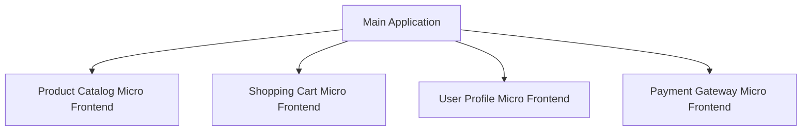

## 7.8.3 Use Cases and Examples

Micro Frontends have emerged as a powerful architectural pattern for building large-scale front-end applications. By breaking down a monolithic front-end into smaller, manageable pieces, Micro Frontends enable teams to work independently, improve scalability, and enhance maintainability. In this section, we will explore various scenarios where Micro Frontends are effectively applied, such as large e-commerce platforms, enterprise dashboards, and applications requiring frequent updates. We will also discuss the challenges and potential drawbacks of this approach.

### Understanding Micro Frontends

Before diving into specific use cases, let's briefly revisit what Micro Frontends are. Micro Frontends extend the concept of microservices to the front-end world. Instead of having a single, monolithic front-end application, the application is divided into smaller, self-contained units. Each unit, or micro frontend, is responsible for a specific feature or section of the application and can be developed, deployed, and maintained independently.

#### Key Benefits of Micro Frontends

- **Team Autonomy**: Different teams can work on different parts of the application without stepping on each other's toes.
- **Scalability**: As the application grows, new features can be added as separate micro frontends without affecting the existing system.
- **Independent Deployment**: Each micro frontend can be deployed independently, allowing for faster updates and rollbacks.
- **Technology Agnostic**: Teams can choose the best tools and frameworks for their specific micro frontend.

### Use Case 1: Large E-commerce Platforms

Large e-commerce platforms are prime candidates for Micro Frontends. These platforms often have various sections such as product catalogs, shopping carts, user profiles, and payment gateways, each requiring specialized expertise and frequent updates.

#### Example: An E-commerce Giant

Imagine an e-commerce giant like Amazon. The platform consists of numerous features, each managed by different teams:

- **Product Catalog**: Managed by a team focused on search and filtering capabilities.
- **Shopping Cart**: Handled by a team ensuring seamless user experience during the checkout process.
- **User Profiles**: Developed by a team focusing on user data and personalization.
- **Payment Gateway**: Managed by a team specializing in secure transactions.

By adopting Micro Frontends, each team can develop and deploy their section independently. This autonomy allows for rapid iteration and innovation, as teams are not constrained by a monolithic release cycle.

#### Addressing Challenges

- **Team Scalability**: As the platform grows, new teams can be formed to handle new features without disrupting existing workflows.
- **Feature Isolation**: Bugs or issues in one micro frontend do not affect the entire application, reducing the risk of downtime.

#### Potential Drawbacks

- **Increased Complexity**: Managing multiple micro frontends can complicate the deployment pipeline and require robust orchestration.
- **Consistent User Experience**: Ensuring a consistent look and feel across different micro frontends can be challenging.

### Use Case 2: Enterprise Dashboards

Enterprise dashboards often integrate data from various sources and require modularity to accommodate different user needs. Micro Frontends can provide the flexibility needed to build such complex systems.

#### Example: A Financial Dashboard

Consider a financial institution providing a dashboard for its clients. The dashboard includes:

- **Market Data**: Displaying real-time stock prices and trends.
- **Portfolio Management**: Allowing users to track their investments.
- **News Feed**: Providing the latest financial news.
- **Analytics Tools**: Offering insights and predictions based on user data.

Each of these features can be developed as a separate micro frontend. This modularity allows the institution to update or replace individual components without affecting the entire dashboard.

#### Addressing Challenges

- **Independent Modules**: Teams can focus on their specific modules, improving efficiency and reducing dependencies.
- **Frequent Updates**: New features or data sources can be integrated seamlessly.

#### Potential Drawbacks

- **Data Consistency**: Ensuring data consistency across different micro frontends can be complex.
- **Inter-module Communication**: Efficient communication between micro frontends is crucial for a cohesive user experience.

### Use Case 3: Applications Requiring Frequent Updates

Some applications, such as news websites or social media platforms, require frequent updates to specific features. Micro Frontends enable these updates without redeploying the entire application.

#### Example: A News Website

A news website might have the following sections:

- **Breaking News**: Updated frequently with the latest stories.
- **Opinion Pieces**: Featuring editorials and guest articles.
- **User Comments**: Allowing readers to engage with the content.
- **Advertisement**: Displaying targeted ads based on user behavior.

By using Micro Frontends, the website can update the breaking news section independently of other features. This flexibility ensures that the website remains current and responsive to user needs.

#### Addressing Challenges

- **Rapid Deployment**: Teams can push updates quickly, keeping the content fresh and relevant.
- **Targeted Development**: Resources can be allocated to the most critical features without affecting the entire site.

#### Potential Drawbacks

- **Integration Testing**: Ensuring that updates to one micro frontend do not break others requires thorough testing.
- **Performance Overhead**: Loading multiple micro frontends can impact performance if not managed properly.

### Implementing Micro Frontends in TypeScript

TypeScript, with its strong typing and modular capabilities, is an excellent choice for implementing Micro Frontends. It provides the tools needed to manage complex applications and ensure type safety across different modules.

#### Example Code: Setting Up a Micro Frontend

Let's look at a simple example of setting up a micro frontend using TypeScript. We'll create a basic structure for a product catalog micro frontend.

```typescript
// productCatalog.ts
export class ProductCatalog {
  private products: Array<{ id: number; name: string; price: number }> = [];

  constructor() {
    this.products = [
      { id: 1, name: 'Laptop', price: 999 },
      { id: 2, name: 'Smartphone', price: 499 },
    ];
  }

  public displayProducts(): void {
    this.products.forEach((product) => {
      console.log(`Product: ${product.name}, Price: $${product.price}`);
    });
  }
}

// main.ts
import { ProductCatalog } from './productCatalog';

const catalog = new ProductCatalog();
catalog.displayProducts();
```

In this example, the `ProductCatalog` class is a standalone module that can be integrated into a larger application. It manages its own state and can be updated independently.

### Visualizing Micro Frontends Architecture

To better understand how Micro Frontends fit together, let's visualize the architecture using a diagram.



This diagram illustrates how different micro frontends connect to the main application. Each micro frontend is an independent unit that can communicate with the main application and other micro frontends as needed.

### Try It Yourself

To get hands-on experience with Micro Frontends, try modifying the example code:

1. **Add a New Product**: Extend the `ProductCatalog` class to allow adding new products.
2. **Implement a Search Feature**: Add a method to search for products by name.
3. **Integrate with Another Micro Frontend**: Create a simple shopping cart micro frontend and integrate it with the product catalog.

### Challenges and Considerations

While Micro Frontends offer numerous benefits, they also come with challenges that need to be addressed:

- **Deployment Complexity**: Managing multiple deployments can be complex and requires a robust CI/CD pipeline.
- **Shared State Management**: Sharing state between micro frontends can be challenging and may require a centralized state management solution.
- **Consistent Styling**: Ensuring a consistent look and feel across different micro frontends requires careful planning and possibly a shared design system.

### Conclusion

Micro Frontends are a powerful tool for building large-scale front-end applications. They provide the flexibility, scalability, and autonomy needed to manage complex systems effectively. By understanding the use cases and potential challenges, developers can make informed decisions about when and how to implement Micro Frontends in their projects.

Remember, this is just the beginning. As you progress, you'll build more complex and interactive applications using Micro Frontends. Keep experimenting, stay curious, and enjoy the journey!

## Quiz Time!



### What is a key benefit of using Micro Frontends in large-scale applications?

- [x] Team autonomy
- [ ] Reduced code complexity
- [ ] Centralized deployment
- [ ] Uniform technology stack

> **Explanation:** Micro Frontends allow different teams to work independently on different parts of the application, enhancing team autonomy.

### Which of the following is a potential drawback of Micro Frontends?

- [x] Increased complexity in deployment pipelines
- [ ] Limited scalability
- [ ] Inflexible architecture
- [ ] Reduced team autonomy

> **Explanation:** Managing multiple micro frontends can complicate the deployment pipeline and require robust orchestration.

### In the context of Micro Frontends, what does "independent deployment" mean?

- [x] Each micro frontend can be deployed separately
- [ ] The entire application is deployed as a single unit
- [ ] Deployment is managed by a central team
- [ ] Only backend services are deployed independently

> **Explanation:** Independent deployment means each micro frontend can be deployed separately, allowing for faster updates and rollbacks.

### How do Micro Frontends address the challenge of team scalability?

- [x] By allowing new teams to handle new features without disrupting existing workflows
- [ ] By centralizing all development efforts
- [ ] By using a single codebase for all features
- [ ] By reducing the number of teams required

> **Explanation:** Micro Frontends enable new teams to handle new features independently, improving team scalability.

### What is a common use case for Micro Frontends in enterprise dashboards?

- [x] Integrating data from various sources
- [ ] Simplifying backend services
- [ ] Reducing the number of front-end developers
- [ ] Centralizing all user interactions

> **Explanation:** Enterprise dashboards often integrate data from various sources, and Micro Frontends provide the modularity needed for such complex systems.

### What is a potential challenge when ensuring consistent styling across Micro Frontends?

- [x] Maintaining a shared design system
- [ ] Using different frameworks for each micro frontend
- [ ] Centralizing all styling decisions
- [ ] Reducing the number of style sheets

> **Explanation:** Ensuring consistent styling requires careful planning and possibly a shared design system across different micro frontends.

### How does TypeScript benefit the implementation of Micro Frontends?

- [x] By providing strong typing and modular capabilities
- [ ] By enforcing a single framework for all micro frontends
- [ ] By simplifying backend integration
- [ ] By reducing the need for testing

> **Explanation:** TypeScript's strong typing and modular capabilities help manage complex applications and ensure type safety across different modules.

### What is a key consideration when managing shared state between Micro Frontends?

- [x] Using a centralized state management solution
- [ ] Avoiding state sharing altogether
- [ ] Centralizing all state in a single micro frontend
- [ ] Reducing the number of state variables

> **Explanation:** Sharing state between micro frontends can be challenging and may require a centralized state management solution.

### Which of the following is a benefit of independent modules in Micro Frontends?

- [x] Improved efficiency and reduced dependencies
- [ ] Centralized control over all features
- [ ] Uniform technology stack
- [ ] Reduced need for testing

> **Explanation:** Independent modules allow teams to focus on their specific areas, improving efficiency and reducing dependencies.

### True or False: Micro Frontends are only suitable for small-scale applications.

- [ ] True
- [x] False

> **Explanation:** Micro Frontends are particularly beneficial for large-scale applications, where they help manage complexity and improve scalability.


