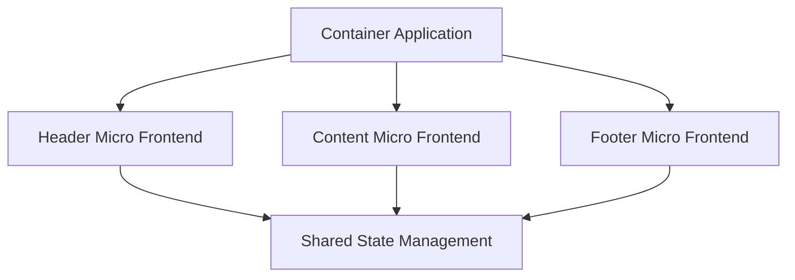

## 7.8 Micro Frontends

In the rapidly evolving world of web development, the demand for scalable, maintainable, and independently deployable applications has led to the rise of Micro Frontends. This architectural style extends the principles of microservices to the front-end world, allowing teams to develop, deploy, and scale front-end features independently. In this section, we will explore the concept of Micro Frontends, their benefits, and how to implement them using TypeScript.

### Understanding Micro Frontends

Micro Frontends is an architectural style where a front-end application is divided into smaller, independent units, each responsible for a specific feature or section of the application. These units, or micro frontends, can be developed, tested, and deployed independently, much like microservices in the back-end world.

#### Principles of Micro Frontends

1. **Independence**: Each micro frontend is an independent unit that can be developed and deployed separately.
2. **Technology Agnostic**: Teams can choose the technology stack that best suits their needs for each micro frontend.
3. **Resilience**: The failure of one micro frontend does not affect the entire application.
4. **Scalability**: Micro frontends can be scaled independently based on demand.
5. **Team Autonomy**: Teams have full control over their micro frontends, allowing for parallel development and faster iterations.

### Benefits of Micro Frontends

Micro Frontends offer several advantages over traditional monolithic front-end architectures:

- **Scalability**: By breaking down the application into smaller units, each micro frontend can be scaled independently, allowing for better resource management.
- **Autonomy**: Teams can work on different micro frontends simultaneously without interfering with each other, leading to faster development cycles.
- **Parallel Development**: Multiple teams can work on different features concurrently, increasing productivity and reducing time-to-market.
- **Improved Deployment Speed**: Micro frontends can be deployed independently, reducing the risk associated with deploying large monolithic applications.
- **Reduced Dependencies**: By decoupling features, teams can reduce dependencies and avoid bottlenecks in the development process.

### Micro Frontends vs. Monolithic Front-End Architectures

In traditional monolithic front-end architectures, the entire application is built as a single unit. This approach can lead to several challenges, especially as the application grows:

- **Complexity**: Managing a large codebase can become cumbersome and error-prone.
- **Deployment Risks**: Deploying changes to a monolithic application can be risky, as a single bug can affect the entire application.
- **Limited Scalability**: Scaling a monolithic application often requires scaling the entire application, leading to inefficient resource usage.
- **Team Coordination**: Multiple teams working on the same codebase can lead to conflicts and slow down development.

Micro Frontends address these challenges by allowing teams to build and deploy features independently, leading to more agile and scalable applications.

### Implementing Micro Frontends with TypeScript

TypeScript, with its strong typing and modern JavaScript features, is an excellent choice for implementing Micro Frontends. Let's explore how to create a simple micro frontend architecture using TypeScript.

#### Setting Up a Basic Micro Frontend

To illustrate the concept, let's create a simple application with two micro frontends: a header and a content section.

```typescript
// header.ts
export class Header {
  render() {
    const headerElement = document.createElement('header');
    headerElement.innerText = 'Welcome to Micro Frontends!';
    document.body.appendChild(headerElement);
  }
}

// content.ts
export class Content {
  render() {
    const contentElement = document.createElement('div');
    contentElement.innerText = 'This is the content section.';
    document.body.appendChild(contentElement);
  }
}

// main.ts
import { Header } from './header';
import { Content } from './content';

const header = new Header();
header.render();

const content = new Content();
content.render();
```

In this example, each micro frontend (header and content) is implemented as a separate module. They can be developed and deployed independently, allowing for greater flexibility and scalability.

#### Integrating Micro Frontends

One of the key challenges in Micro Frontends is integrating multiple units into a cohesive application. This can be achieved through various techniques, such as using a container application or a client-side composition.

##### Client-Side Composition

In client-side composition, each micro frontend is loaded dynamically on the client side. This approach allows for greater flexibility and reduces the need for a central server to manage the composition.

```typescript
// loader.ts
function loadMicroFrontend(url: string, containerId: string) {
  const script = document.createElement('script');
  script.src = url;
  script.onload = () => {
    const container = document.getElementById(containerId);
    if (container) {
      container.innerHTML = 'Micro Frontend Loaded!';
    }
  };
  document.head.appendChild(script);
}

// main.ts
loadMicroFrontend('http://localhost:3000/header.js', 'header-container');
loadMicroFrontend('http://localhost:3001/content.js', 'content-container');
```

In this example, we load each micro frontend dynamically using a simple script loader. This approach allows us to deploy each micro frontend independently and update them without affecting the entire application.

### Challenges in Micro Frontends

While Micro Frontends offer several benefits, they also come with their own set of challenges:

#### Shared State Management

Managing shared state across multiple micro frontends can be challenging. One approach is to use a shared state management library, such as Redux, to manage global state.

#### Routing

Routing in a micro frontend architecture can be complex, as each micro frontend may have its own routing logic. A common approach is to use a central router in the container application to manage routing across micro frontends.

#### Consistent User Experience

Ensuring a consistent user experience across multiple micro frontends can be challenging, especially when different teams use different technology stacks. Establishing design guidelines and shared component libraries can help maintain consistency.

### Best Practices for Micro Frontends

To successfully implement Micro Frontends, consider the following best practices:

- **Define Clear Boundaries**: Clearly define the boundaries of each micro frontend to avoid overlap and ensure independence.
- **Use Shared Libraries**: Use shared libraries for common functionality, such as authentication and state management, to avoid duplication and ensure consistency.
- **Establish Design Guidelines**: Establish design guidelines to ensure a consistent user experience across all micro frontends.
- **Automate Testing and Deployment**: Automate testing and deployment processes to ensure reliability and reduce manual effort.
- **Monitor and Optimize Performance**: Monitor the performance of each micro frontend and optimize as needed to ensure a smooth user experience.

### Visualizing Micro Frontend Architecture

To better understand the architecture of Micro Frontends, let's visualize a typical setup using a Mermaid.js diagram.



This diagram illustrates how a container application can integrate multiple micro frontends, each responsible for a specific part of the application. Shared state management is used to maintain consistency across micro frontends.

### Try It Yourself

To get hands-on experience with Micro Frontends, try modifying the code examples provided. For instance, add a new micro frontend for a footer section, or experiment with different ways to load and integrate micro frontends.

### Conclusion

Micro Frontends offer a powerful way to build scalable, maintainable, and independently deployable front-end applications. By leveraging TypeScript and following best practices, teams can create robust applications that meet the demands of modern web development. Remember, this is just the beginning. As you progress, you'll build more complex and interactive applications. Keep experimenting, stay curious, and enjoy the journey!

## Quiz Time!



### What is a key principle of Micro Frontends?

- [x] Independence
- [ ] Monolithic structure
- [ ] Centralized control
- [ ] Single technology stack

> **Explanation:** Independence is a key principle of Micro Frontends, allowing each unit to be developed and deployed separately.

### What is a benefit of using Micro Frontends?

- [x] Scalability
- [ ] Increased complexity
- [ ] Single point of failure
- [ ] Slower deployment

> **Explanation:** Micro Frontends allow for independent scaling of each unit, improving overall scalability.

### How do Micro Frontends differ from monolithic architectures?

- [x] They allow independent deployment of features.
- [ ] They require a single codebase.
- [ ] They are less scalable.
- [ ] They have a single point of failure.

> **Explanation:** Micro Frontends allow for independent deployment, unlike monolithic architectures which are deployed as a single unit.

### What is a challenge of Micro Frontends?

- [x] Shared state management
- [ ] Reduced team autonomy
- [ ] Limited scalability
- [ ] Increased deployment risk

> **Explanation:** Managing shared state across multiple micro frontends can be challenging.

### Which TypeScript feature is beneficial for implementing Micro Frontends?

- [x] Modules
- [ ] Any type
- [ ] Global variables
- [ ] Implicit typing

> **Explanation:** TypeScript modules help in organizing code and maintaining separation between different micro frontends.

### What is a best practice for ensuring a consistent user experience in Micro Frontends?

- [x] Establish design guidelines
- [ ] Use different technology stacks
- [ ] Avoid shared libraries
- [ ] Implement separate authentication systems

> **Explanation:** Establishing design guidelines helps maintain a consistent user experience across micro frontends.

### How can Micro Frontends improve deployment speed?

- [x] By allowing independent deployment of each unit
- [ ] By requiring a single deployment pipeline
- [ ] By increasing code complexity
- [ ] By centralizing all features

> **Explanation:** Micro Frontends allow each unit to be deployed independently, reducing deployment time and risk.

### What is a common approach to manage routing in Micro Frontends?

- [x] Use a central router in the container application
- [ ] Implement separate routers for each micro frontend
- [ ] Avoid routing altogether
- [ ] Use global variables for routing

> **Explanation:** A central router in the container application helps manage routing across multiple micro frontends.

### What is an advantage of using TypeScript for Micro Frontends?

- [x] Strong typing and modern JavaScript features
- [ ] Lack of type safety
- [ ] Limited support for modules
- [ ] Increased runtime errors

> **Explanation:** TypeScript provides strong typing and modern JavaScript features, making it suitable for Micro Frontends.

### True or False: Micro Frontends can only be implemented using a single technology stack.

- [ ] True
- [x] False

> **Explanation:** Micro Frontends are technology agnostic, allowing teams to choose the stack that best suits their needs.


