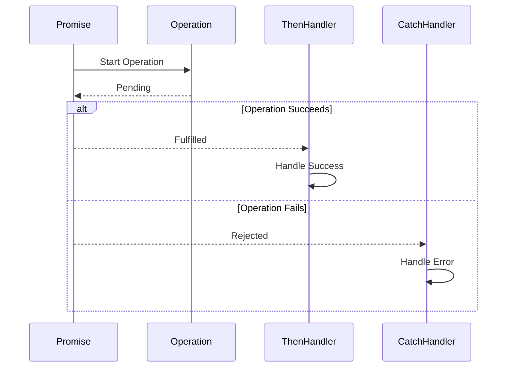

## 8.1.1 Implementing Promises in TypeScript

Asynchronous programming is a cornerstone of modern software development, enabling applications to perform tasks without blocking the main execution thread. In TypeScript, Promises provide a powerful mechanism to handle asynchronous operations in a clean, readable, and maintainable way. This section will guide you through implementing Promises in TypeScript, leveraging its type system to ensure robust and type-safe code.

### Understanding Promises

A Promise in JavaScript is an object representing the eventual completion or failure of an asynchronous operation. It allows you to attach callbacks to handle the result or error once the operation completes. Promises can be in one of three states:

- **Pending**: The initial state, neither fulfilled nor rejected.
- **Fulfilled**: The operation completed successfully.
- **Rejected**: The operation failed.

### Creating a Promise

Let's start by creating a simple Promise. In TypeScript, we can specify the type of the value that the Promise will resolve to using generics. This is crucial for maintaining type safety in our applications.

```typescript
// Creating a Promise that resolves to a string
const myPromise: Promise<string> = new Promise((resolve, reject) => {
  // Simulate an asynchronous operation using setTimeout
  setTimeout(() => {
    const success = true; // Simulate success or failure
    if (success) {
      resolve("Operation was successful!");
    } else {
      reject("Operation failed.");
    }
  }, 1000);
});
```

In this example, `myPromise` is a Promise that will either resolve with a string message or reject with an error message. The `setTimeout` function simulates an asynchronous operation.

### Handling Promise Resolution and Rejection

Once a Promise is created, you can handle its resolution or rejection using the `.then()` and `.catch()` methods.

```typescript
myPromise
  .then((result) => {
    console.log(result); // Output: "Operation was successful!"
  })
  .catch((error) => {
    console.error(error); // Output: "Operation failed."
  });
```

- **`.then()`**: This method is used to handle the resolved value of the Promise. It takes a callback function that receives the resolved value as its argument.
- **`.catch()`**: This method is used to handle any errors or rejections. It takes a callback function that receives the error as its argument.

### Returning Promises for Chaining

One of the key advantages of Promises is their ability to chain operations. By returning a Promise from a function, you allow further chaining of `.then()` and `.catch()` calls.

```typescript
function fetchData(): Promise<string> {
  return new Promise((resolve, reject) => {
    // Simulate fetching data
    setTimeout(() => {
      resolve("Data fetched successfully!");
    }, 1000);
  });
}

fetchData()
  .then((data) => {
    console.log(data); // Output: "Data fetched successfully!"
    return "Processing data...";
  })
  .then((processingMessage) => {
    console.log(processingMessage); // Output: "Processing data..."
  })
  .catch((error) => {
    console.error("Error:", error);
  });
```

In this example, `fetchData` returns a Promise, allowing us to chain additional operations after the data is fetched.

### TypeScript's Type Inference with Promises

TypeScript's type inference works seamlessly with Promises, allowing you to omit explicit type annotations in many cases. However, specifying types can improve code readability and maintainability.

```typescript
function getNumber(): Promise<number> {
  return Promise.resolve(42);
}

getNumber().then((num) => {
  console.log(num); // Output: 42
});
```

Here, TypeScript infers that `num` is of type `number` based on the resolved value of the Promise.

### Best Practices for Using Promises

1. **Always Handle Rejections**: Ensure that every Promise has a `.catch()` block to handle potential errors. Unhandled rejections can lead to silent failures and difficult-to-debug issues.

2. **Avoid Nesting Promises**: Instead of nesting `.then()` calls, use chaining to keep your code clean and readable.

3. **Use `Promise.all` for Concurrent Operations**: When you need to perform multiple asynchronous operations concurrently, use `Promise.all` to wait for all Promises to resolve.

```typescript
const promise1 = Promise.resolve(1);
const promise2 = Promise.resolve(2);
const promise3 = Promise.resolve(3);

Promise.all([promise1, promise2, promise3])
  .then((results) => {
    console.log(results); // Output: [1, 2, 3]
  })
  .catch((error) => {
    console.error("Error in one of the promises:", error);
  });
```

4. **Use `Promise.race` for Competitive Operations**: If you need to perform multiple operations but only care about the first one to complete, use `Promise.race`.

```typescript
const slowPromise = new Promise((resolve) => setTimeout(resolve, 2000, "Slow"));
const fastPromise = new Promise((resolve) => setTimeout(resolve, 1000, "Fast"));

Promise.race([slowPromise, fastPromise])
  .then((result) => {
    console.log(result); // Output: "Fast"
  });
```

### Integrating Promises with Async/Await

TypeScript's `async` and `await` syntax provides a more synchronous-looking way to work with Promises, improving code readability. Here’s a quick preview:

```typescript
async function asyncFunction() {
  try {
    const result = await myPromise;
    console.log(result); // Output: "Operation was successful!"
  } catch (error) {
    console.error(error); // Output: "Operation failed."
  }
}

asyncFunction();
```

In this example, `await` pauses the execution of `asyncFunction` until `myPromise` is resolved or rejected. The `try/catch` block is used for error handling, similar to synchronous code.

### Visualizing Promise States and Flow

To better understand how Promises work, let's visualize their states and flow using a sequence diagram.



This diagram illustrates the lifecycle of a Promise, from initiation to resolution or rejection, and how handlers are invoked accordingly.

### Try It Yourself

Experiment with the code examples provided. Try modifying them to:

- Change the success condition in the Promise to see how `.catch()` handles errors.
- Chain additional `.then()` calls to perform more operations.
- Use `Promise.all` with different Promises and observe the results.

### Knowledge Check

- What are the three states of a Promise?
- How do you handle errors in a Promise chain?
- Why is it important to return Promises from functions?

### Conclusion

Promises are a fundamental part of asynchronous programming in TypeScript. By understanding how to create, handle, and chain Promises, you can write more efficient and maintainable code. As you continue your journey, you'll find that Promises, combined with `async/await`, provide a powerful toolkit for managing asynchronous operations.

Remember, this is just the beginning. Keep experimenting, stay curious, and enjoy the journey!

## Quiz Time!



### What are the three states of a Promise?

- [x] Pending, Fulfilled, Rejected
- [ ] Waiting, Completed, Failed
- [ ] Initialized, Completed, Errored
- [ ] Open, Closed, Error

> **Explanation:** A Promise can be in one of three states: Pending, Fulfilled, or Rejected.

### How do you handle errors in a Promise chain?

- [x] Using the `.catch()` method
- [ ] Using a `try/catch` block
- [ ] Using the `.finally()` method
- [ ] Using the `.then()` method

> **Explanation:** Errors in a Promise chain are handled using the `.catch()` method.

### Why is it important to return Promises from functions?

- [x] To allow chaining of `.then()` and `.catch()` calls
- [ ] To prevent memory leaks
- [ ] To ensure type safety
- [ ] To improve performance

> **Explanation:** Returning Promises from functions allows for chaining of `.then()` and `.catch()` calls, enabling better composition of asynchronous operations.

### What method would you use to perform multiple asynchronous operations concurrently?

- [x] `Promise.all`
- [ ] `Promise.race`
- [ ] `Promise.resolve`
- [ ] `Promise.reject`

> **Explanation:** `Promise.all` is used to perform multiple asynchronous operations concurrently and wait for all of them to resolve.

### Which method is used to handle the resolved value of a Promise?

- [x] `.then()`
- [ ] `.catch()`
- [ ] `.finally()`
- [ ] `.resolve()`

> **Explanation:** The `.then()` method is used to handle the resolved value of a Promise.

### What does the `await` keyword do in an `async` function?

- [x] Pauses execution until the Promise is resolved or rejected
- [ ] Immediately resolves the Promise
- [ ] Converts the Promise to a synchronous operation
- [ ] Cancels the Promise

> **Explanation:** The `await` keyword pauses execution of the `async` function until the Promise is resolved or rejected.

### How can you specify the type of the resolved value in a Promise?

- [x] Using generics, e.g., `Promise<string>`
- [ ] Using type assertions
- [ ] Using the `typeof` operator
- [ ] Using the `instanceof` operator

> **Explanation:** You can specify the type of the resolved value in a Promise using generics, such as `Promise<string>`.

### What is the purpose of the `Promise.race` method?

- [x] To return the result of the first Promise to settle
- [ ] To execute Promises in sequence
- [ ] To handle errors in a Promise chain
- [ ] To resolve all Promises simultaneously

> **Explanation:** `Promise.race` returns the result of the first Promise to settle, whether it is resolved or rejected.

### Which method is used to ensure that a block of code runs regardless of whether a Promise is fulfilled or rejected?

- [x] `.finally()`
- [ ] `.then()`
- [ ] `.catch()`
- [ ] `.resolve()`

> **Explanation:** The `.finally()` method is used to ensure that a block of code runs regardless of whether a Promise is fulfilled or rejected.

### True or False: TypeScript's type inference can automatically determine the type of a resolved Promise value.

- [x] True
- [ ] False

> **Explanation:** TypeScript's type inference can automatically determine the type of a resolved Promise value based on the context in which it is used.


