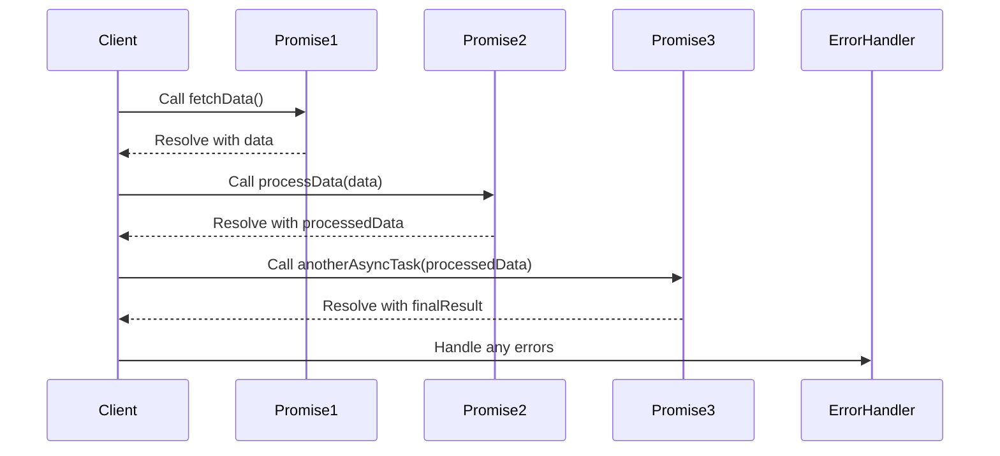

## 8.1.2 Chaining and Error Handling

In modern web development, handling asynchronous operations efficiently is crucial. The Promise pattern in TypeScript offers a powerful way to manage these operations, especially when chaining them together. This section delves into how Promise chaining works, how to handle errors effectively, and the best practices for maintaining readability and maintainability in your code.

### Understanding Promise Chaining

Promise chaining allows you to execute asynchronous operations in sequence, where the output of one operation can be used as the input for the next. This is achieved by returning a Promise from the `.then()` method, which can be chained with another `.then()`.

#### How Promise Chaining Works

When you call `.then()` on a Promise, it returns a new Promise. This new Promise represents the completion of the callback function passed to `.then()`. If the callback returns a value, the new Promise is resolved with that value. If the callback returns a Promise, the new Promise adopts the state of the returned Promise.

Here's a simple example to illustrate Promise chaining:

```typescript
function fetchData(url: string): Promise<string> {
    return new Promise((resolve, reject) => {
        setTimeout(() => {
            if (url) {
                resolve(`Data from ${url}`);
            } else {
                reject('Invalid URL');
            }
        }, 1000);
    });
}

fetchData('https://api.example.com/data')
    .then(data => {
        console.log(data); // Logs: Data from https://api.example.com/data
        return fetchData('https://api.example.com/more-data');
    })
    .then(moreData => {
        console.log(moreData); // Logs: Data from https://api.example.com/more-data
    })
    .catch(error => {
        console.error('Error fetching data:', error);
    });
```

In this example, the first `fetchData` call resolves with a string, which is then logged. The second `fetchData` call is chained, and its result is also logged. If any Promise in the chain is rejected, the `.catch()` method handles the error.

### Returning Values and Promises in `.then()`

The behavior of a Promise chain is influenced by what you return inside `.then()`:

- **Returning a Value**: If you return a value, the next `.then()` receives that value.
- **Returning a Promise**: If you return a Promise, the next `.then()` waits for that Promise to resolve and receives its resolved value.

Consider this example:

```typescript
function processData(data: string): Promise<string> {
    return new Promise((resolve) => {
        setTimeout(() => {
            resolve(`Processed ${data}`);
        }, 1000);
    });
}

fetchData('https://api.example.com/data')
    .then(data => {
        console.log(data);
        return processData(data); // Returns a Promise
    })
    .then(processedData => {
        console.log(processedData); // Logs: Processed Data from https://api.example.com/data
    })
    .catch(error => {
        console.error('Error:', error);
    });
```

Here, `processData` returns a Promise, so the chain waits for it to resolve before proceeding.

### Error Propagation in Promise Chains

Errors in a Promise chain propagate until they are caught by a `.catch()` block. This allows you to handle errors at a specific point in the chain or globally for the entire chain.

#### Structuring Error Handling

To effectively manage errors, you can place `.catch()` blocks at different points in the chain:

- **Global Error Handling**: Place a `.catch()` at the end of the chain to handle any error that occurs in any part of the chain.
- **Specific Error Handling**: Place `.catch()` after specific `.then()` calls to handle errors from specific operations.

Here's an example demonstrating both approaches:

```typescript
fetchData('https://api.example.com/data')
    .then(data => {
        console.log(data);
        return processData(data);
    })
    .catch(error => {
        console.error('Error during processing:', error);
        return 'Default Data'; // Provide a fallback value
    })
    .then(processedData => {
        console.log(processedData);
    })
    .catch(error => {
        console.error('Global Error Handler:', error);
    });
```

In this example, the first `.catch()` handles errors from `processData`, while the second `.catch()` acts as a global error handler.

### Common Mistakes in Promise Chaining

Even experienced developers can make mistakes when working with Promises. Here are some common pitfalls:

- **Forgetting to Return Promises**: Always return a Promise from within `.then()` if you want to chain further operations.
- **Improper Error Handling Placement**: Ensure `.catch()` is placed correctly to handle errors at the desired level.

### Advanced Techniques in Promise Chaining

#### Conditional Chains

You can create conditional chains by returning different Promises based on conditions within `.then()`:

```typescript
fetchData('https://api.example.com/data')
    .then(data => {
        console.log(data);
        if (data.includes('special')) {
            return fetchData('https://api.example.com/special-data');
        } else {
            return fetchData('https://api.example.com/regular-data');
        }
    })
    .then(result => {
        console.log('Conditional result:', result);
    })
    .catch(error => {
        console.error('Error:', error);
    });
```

#### Dynamic Promise Composition

You can dynamically compose Promise chains based on runtime conditions:

```typescript
function getDataSequence(urls: string[]): Promise<void> {
    return urls.reduce((promiseChain, currentUrl) => {
        return promiseChain.then(() => fetchData(currentUrl).then(console.log));
    }, Promise.resolve());
}

getDataSequence(['https://api.example.com/1', 'https://api.example.com/2'])
    .catch(error => {
        console.error('Error in sequence:', error);
    });
```

In this example, `getDataSequence` dynamically creates a chain of Promises for each URL in the array.

### Benefits of Proper Chaining and Error Handling

Proper Promise chaining and error handling improve the readability and maintainability of your code. By structuring your asynchronous operations clearly, you make it easier for others (and yourself) to understand and modify your code.

### Visualizing Promise Chains

To better understand how Promise chains work, let's visualize the flow of a simple chain:



This diagram illustrates the sequential flow of data through a chain of Promises, with an error handler at the end.

### Try It Yourself

Experiment with the code examples provided. Try modifying the URLs, introducing errors, or adding more `.then()` calls to see how the chain behaves. This hands-on approach will deepen your understanding of Promise chaining and error handling.

### References and Further Reading

- [MDN Web Docs: Using Promises](https://developer.mozilla.org/en-US/docs/Web/JavaScript/Guide/Using_promises)
- [TypeScript Handbook: Promises](https://www.typescriptlang.org/docs/handbook/release-notes/typescript-2-1.html#promises)
- [JavaScript.info: Promises](https://javascript.info/promise-basics)

### Knowledge Check

- What happens if you return a non-Promise value inside `.then()`?
- How does error propagation work in a Promise chain?
- What are the benefits of using a global `.catch()` at the end of a chain?

### Embrace the Journey

Remember, mastering Promises and asynchronous patterns is a journey. As you continue to explore and experiment, you'll find new ways to make your code more efficient and maintainable. Keep pushing the boundaries, and enjoy the process of learning and growing as a developer!

## Quiz Time!



### What does returning a value inside `.then()` result in?

- [x] It resolves the next Promise with that value.
- [ ] It rejects the next Promise with that value.
- [ ] It throws an error.
- [ ] It stops the Promise chain.

> **Explanation:** Returning a value inside `.then()` resolves the next Promise with that value, allowing the chain to continue.

### How does error propagation work in a Promise chain?

- [x] Errors propagate until they are caught by a `.catch()`.
- [ ] Errors stop the chain immediately.
- [ ] Errors are ignored if not caught.
- [ ] Errors are logged automatically.

> **Explanation:** Errors in a Promise chain propagate until they are caught by a `.catch()`, allowing centralized error handling.

### What is a common mistake when chaining Promises?

- [x] Forgetting to return a Promise inside `.then()`.
- [ ] Using too many `.then()` calls.
- [ ] Placing `.catch()` at the end.
- [ ] Returning a value inside `.then()`.

> **Explanation:** Forgetting to return a Promise inside `.then()` can break the chain, leading to unexpected behavior.

### What does a `.catch()` block do in a Promise chain?

- [x] It handles any errors that occur in the chain.
- [ ] It stops the chain from executing.
- [ ] It logs errors to the console.
- [ ] It resolves the chain with a default value.

> **Explanation:** A `.catch()` block handles any errors that occur in the chain, allowing for proper error management.

### What happens if you return a Promise inside `.then()`?

- [x] The next `.then()` waits for the Promise to resolve.
- [ ] The next `.then()` is skipped.
- [ ] The Promise chain stops.
- [ ] The Promise is ignored.

> **Explanation:** Returning a Promise inside `.then()` causes the next `.then()` to wait for it to resolve, continuing the chain.

### How can you handle errors specifically for a certain operation in a chain?

- [x] Place a `.catch()` immediately after the operation.
- [ ] Use a global `.catch()` at the end.
- [ ] Ignore the error.
- [ ] Log the error and continue.

> **Explanation:** Placing a `.catch()` immediately after a specific operation allows you to handle errors for that operation only.

### What is the benefit of using a global `.catch()`?

- [x] It handles any errors in the entire chain.
- [ ] It logs all errors to the console.
- [ ] It stops the chain from executing.
- [ ] It resolves the chain with a default value.

> **Explanation:** A global `.catch()` handles any errors that occur in the entire chain, providing centralized error management.

### What is a conditional chain in Promises?

- [x] A chain that executes different Promises based on conditions.
- [ ] A chain that stops if a condition is met.
- [ ] A chain that logs conditions to the console.
- [ ] A chain that ignores conditions.

> **Explanation:** A conditional chain executes different Promises based on conditions, allowing for dynamic flow control.

### How can you dynamically compose Promise chains?

- [x] Use `reduce()` to iterate over an array of Promises.
- [ ] Use `map()` to transform Promises.
- [ ] Use `filter()` to select Promises.
- [ ] Use `forEach()` to execute Promises.

> **Explanation:** Using `reduce()` allows you to dynamically compose Promise chains by iterating over an array of Promises.

### True or False: Proper chaining and error handling improve code readability.

- [x] True
- [ ] False

> **Explanation:** Proper chaining and error handling improve code readability by structuring asynchronous operations clearly and managing errors effectively.


