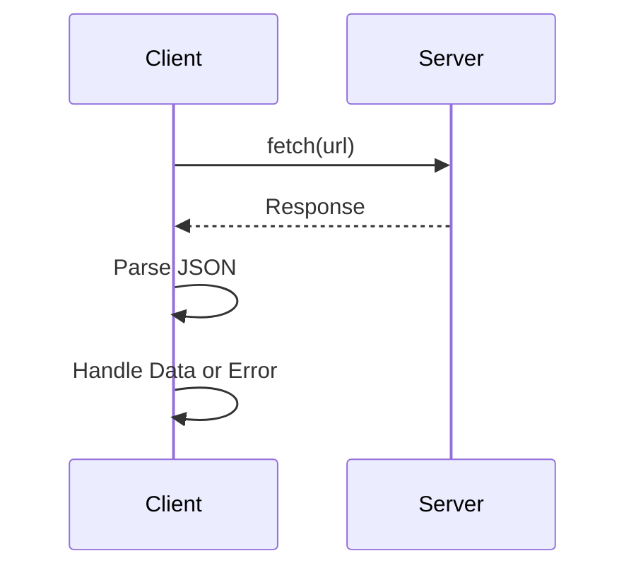

## 8.1.3 Use Cases and Examples

In this section, we delve into the practical applications of Promises in TypeScript, demonstrating how they can be effectively utilized in real-world scenarios. We'll explore making HTTP requests, handling file I/O operations, and managing multiple asynchronous tasks. By understanding these use cases, you'll be better equipped to manage asynchronous workflows in your TypeScript projects.

### Making HTTP Requests with Promises

One of the most common use cases for Promises is handling HTTP requests. In TypeScript, we can use the `fetch` API or libraries like Axios to make these requests. Promises simplify the process by allowing us to handle asynchronous operations in a more readable and maintainable way compared to traditional callbacks.

#### Using the Fetch API

The `fetch` API is a modern way to make HTTP requests and is built into most browsers. It returns a Promise that resolves to the Response object representing the response to the request.

```typescript
async function fetchData(url: string): Promise<any> {
  try {
    const response = await fetch(url);
    if (!response.ok) {
      throw new Error(`HTTP error! status: ${response.status}`);
    }
    const data = await response.json();
    return data;
  } catch (error) {
    console.error("Error fetching data:", error);
    throw error;
  }
}

fetchData('https://api.example.com/data')
  .then(data => console.log(data))
  .catch(error => console.error('Error:', error));
```

**Explanation:**

- **`fetch(url)`**: Initiates a network request and returns a Promise.
- **`await response.json()`**: Parses the JSON response body.
- **Error Handling**: Catches and logs errors if the request fails.

#### Using Axios

Axios is a popular library for making HTTP requests in both browser and Node.js environments. It provides a more robust API than `fetch`, with features like request cancellation and automatic JSON transformation.

```typescript
import axios from 'axios';

async function fetchDataWithAxios(url: string): Promise<any> {
  try {
    const response = await axios.get(url);
    return response.data;
  } catch (error) {
    console.error("Error fetching data with Axios:", error);
    throw error;
  }
}

fetchDataWithAxios('https://api.example.com/data')
  .then(data => console.log(data))
  .catch(error => console.error('Error:', error));
```

**Explanation:**

- **`axios.get(url)`**: Makes a GET request and returns a Promise.
- **`response.data`**: Accesses the data directly from the response.

### File I/O Operations with Promises

In Node.js, file I/O operations are typically asynchronous. The `fs` module provides a Promise-based API for reading and writing files, making it easier to work with these operations in TypeScript.

#### Reading Files

```typescript
import { promises as fs } from 'fs';

async function readFileAsync(filePath: string): Promise<string> {
  try {
    const data = await fs.readFile(filePath, 'utf-8');
    return data;
  } catch (error) {
    console.error("Error reading file:", error);
    throw error;
  }
}

readFileAsync('./example.txt')
  .then(content => console.log(content))
  .catch(error => console.error('Error:', error));
```

**Explanation:**

- **`fs.readFile(filePath, 'utf-8')`**: Reads the file content as a string.
- **Error Handling**: Logs errors if the file read fails.

#### Writing Files

```typescript
async function writeFileAsync(filePath: string, content: string): Promise<void> {
  try {
    await fs.writeFile(filePath, content, 'utf-8');
    console.log("File written successfully");
  } catch (error) {
    console.error("Error writing file:", error);
    throw error;
  }
}

writeFileAsync('./example.txt', 'Hello, World!')
  .catch(error => console.error('Error:', error));
```

**Explanation:**

- **`fs.writeFile(filePath, content, 'utf-8')`**: Writes content to the file.
- **Success Message**: Logs a message upon successful write.

### Simplifying Asynchronous Workflows

Promises simplify asynchronous workflows by providing a more readable structure compared to nested callbacks, often referred to as "callback hell."

#### Callback Hell Example

```typescript
function fetchDataWithCallbacks(url: string, callback: (error: Error | null, data?: any) => void) {
  fetch(url)
    .then(response => response.json())
    .then(data => callback(null, data))
    .catch(error => callback(error));
}

fetchDataWithCallbacks('https://api.example.com/data', (error, data) => {
  if (error) {
    console.error('Error:', error);
  } else {
    console.log(data);
  }
});
```

**Explanation:**

- **Nested Callbacks**: Makes the code harder to read and maintain.
- **Error Handling**: Requires explicit handling in each callback.

#### Promise-Based Equivalent

```typescript
fetchData('https://api.example.com/data')
  .then(data => console.log(data))
  .catch(error => console.error('Error:', error));
```

**Explanation:**

- **Flat Structure**: Easier to read and maintain.
- **Centralized Error Handling**: Handles errors in a single `catch` block.

### Handling Multiple Asynchronous Operations

Promises provide powerful methods like `Promise.all()` and `Promise.race()` to handle multiple asynchronous operations efficiently.

#### Using `Promise.all()`

`Promise.all()` is used to execute multiple Promises in parallel and wait for all of them to complete.

```typescript
async function fetchMultipleUrls(urls: string[]): Promise<any[]> {
  try {
    const promises = urls.map(url => fetch(url).then(response => response.json()));
    const results = await Promise.all(promises);
    return results;
  } catch (error) {
    console.error("Error fetching multiple URLs:", error);
    throw error;
  }
}

fetchMultipleUrls(['https://api.example.com/data1', 'https://api.example.com/data2'])
  .then(results => console.log(results))
  .catch(error => console.error('Error:', error));
```

**Explanation:**

- **`Promise.all(promises)`**: Waits for all Promises to resolve.
- **Error Handling**: Fails fast if any Promise rejects.

#### Using `Promise.race()`

`Promise.race()` returns the result of the first Promise that resolves or rejects.

```typescript
async function fetchFirstSuccessful(urls: string[]): Promise<any> {
  try {
    const promises = urls.map(url => fetch(url).then(response => response.json()));
    const result = await Promise.race(promises);
    return result;
  } catch (error) {
    console.error("Error in Promise race:", error);
    throw error;
  }
}

fetchFirstSuccessful(['https://api.example.com/data1', 'https://api.example.com/data2'])
  .then(result => console.log(result))
  .catch(error => console.error('Error:', error));
```

**Explanation:**

- **`Promise.race(promises)`**: Resolves or rejects with the first completed Promise.
- **Use Case**: Useful for timeout scenarios or getting the fastest response.

### Error Handling and Retries

Handling errors effectively is crucial in asynchronous programming. Promises make it easier to implement retry logic for failed operations.

#### Retrying Failed Requests

```typescript
async function fetchDataWithRetry(url: string, retries: number = 3): Promise<any> {
  for (let i = 0; i < retries; i++) {
    try {
      const response = await fetch(url);
      if (!response.ok) {
        throw new Error(`HTTP error! status: ${response.status}`);
      }
      return await response.json();
    } catch (error) {
      console.error(`Attempt ${i + 1} failed:`, error);
      if (i === retries - 1) {
        throw error;
      }
    }
  }
}

fetchDataWithRetry('https://api.example.com/data')
  .then(data => console.log(data))
  .catch(error => console.error('Error:', error));
```

**Explanation:**

- **Retry Logic**: Attempts the request multiple times before failing.
- **Loop Control**: Uses a loop to manage retries.

### Performance Considerations

While Promises simplify asynchronous code, it's important to consider performance implications, such as minimizing the number of chained Promises.

#### Minimizing Chained Promises

Excessive chaining can lead to performance issues. Group related operations and use `Promise.all()` where possible to improve efficiency.

```typescript
async function processData(urls: string[]): Promise<void> {
  const fetchPromises = urls.map(url => fetch(url).then(response => response.json()));
  const data = await Promise.all(fetchPromises);
  data.forEach(item => {
    // Process each item
    console.log(item);
  });
}

processData(['https://api.example.com/data1', 'https://api.example.com/data2']);
```

**Explanation:**

- **Batch Processing**: Fetches all data in parallel and processes it together.
- **Efficiency**: Reduces the number of Promise chains.

### Integration with Modern Libraries and Frameworks

Promises are integral to many modern libraries and frameworks, providing seamless integration for asynchronous operations.

#### Integration with Angular

In Angular, Promises can be used alongside Observables for handling asynchronous operations, such as HTTP requests.

```typescript
import { HttpClient } from '@angular/common/http';
import { Injectable } from '@angular/core';

@Injectable({
  providedIn: 'root'
})
export class DataService {
  constructor(private http: HttpClient) {}

  fetchData(url: string): Promise<any> {
    return this.http.get(url).toPromise();
  }
}
```

**Explanation:**

- **`HttpClient`**: Angular service for making HTTP requests.
- **`toPromise()`**: Converts an Observable to a Promise.

#### Integration with React

In React, Promises are often used in conjunction with hooks like `useEffect` for managing side effects.

```typescript
import React, { useEffect, useState } from 'react';

function DataFetcher({ url }: { url: string }) {
  const [data, setData] = useState<any>(null);

  useEffect(() => {
    fetch(url)
      .then(response => response.json())
      .then(data => setData(data))
      .catch(error => console.error('Error:', error));
  }, [url]);

  return (
    <div>
      {data ? <pre>{JSON.stringify(data, null, 2)}</pre> : 'Loading...'}
    </div>
  );
}

export default DataFetcher;
```

**Explanation:**

- **`useEffect`**: React hook for performing side effects.
- **State Management**: Updates component state with fetched data.

### Try It Yourself

Encourage experimentation by modifying the provided examples:

- **Change URLs**: Use different APIs to see how the code handles various responses.
- **Add Error Scenarios**: Simulate network failures to test error handling and retry logic.
- **Combine Promises**: Use `Promise.all()` and `Promise.race()` with different sets of Promises.

### Visualizing Promise Flow

To better understand the flow of Promises, let's visualize the process using a sequence diagram.



**Diagram Explanation:**

- **Client**: Initiates the request and processes the response.
- **Server**: Responds to the request.
- **Flow**: Shows the sequence of operations from request to response handling.

### Knowledge Check

Let's reinforce what we've learned with a few questions:

1. **What is the main advantage of using Promises over callbacks?**
   - Promises provide a more readable and maintainable structure for handling asynchronous operations.

2. **How does `Promise.all()` differ from `Promise.race()`?**
   - `Promise.all()` waits for all Promises to resolve, while `Promise.race()` resolves or rejects with the first completed Promise.

3. **Why is error handling important in asynchronous programming?**
   - It ensures that failures are managed gracefully, preventing unhandled exceptions and improving user experience.

### Embrace the Journey

Remember, mastering Promises is just the beginning of your journey in asynchronous programming. As you progress, you'll build more complex and efficient applications. Keep experimenting, stay curious, and enjoy the journey!

## Quiz Time!



### What is the primary benefit of using Promises over callbacks?

- [x] Promises provide a more readable and maintainable structure.
- [ ] Promises are faster than callbacks.
- [ ] Promises are easier to debug.
- [ ] Promises eliminate all asynchronous issues.

> **Explanation:** Promises offer a more readable and maintainable way to handle asynchronous operations compared to nested callbacks.

### How does `Promise.all()` behave when one of the Promises rejects?

- [x] It rejects immediately with the reason of the first rejected Promise.
- [ ] It waits for all Promises to settle before rejecting.
- [ ] It resolves with the results of the successful Promises.
- [ ] It ignores the rejected Promise and continues.

> **Explanation:** `Promise.all()` rejects immediately if any of the Promises reject, with the reason of the first rejection.

### Which method would you use to handle the first resolved Promise among multiple Promises?

- [ ] Promise.all()
- [x] Promise.race()
- [ ] Promise.any()
- [ ] Promise.resolve()

> **Explanation:** `Promise.race()` resolves or rejects with the first completed Promise.

### In the context of Promises, what does "chaining" refer to?

- [x] Linking multiple `.then()` calls to handle a sequence of asynchronous operations.
- [ ] Creating multiple Promises at once.
- [ ] Running Promises in parallel.
- [ ] Handling errors in Promises.

> **Explanation:** Chaining refers to linking multiple `.then()` calls to handle a sequence of asynchronous operations.

### What is the purpose of the `catch` method in a Promise chain?

- [x] To handle errors that occur in the Promise chain.
- [ ] To execute code after all Promises resolve.
- [ ] To transform the resolved value.
- [ ] To create a new Promise.

> **Explanation:** The `catch` method is used to handle errors that occur in the Promise chain.

### How can you convert an Observable to a Promise in Angular?

- [x] Using the `toPromise()` method.
- [ ] Using the `subscribe()` method.
- [ ] Using the `map()` method.
- [ ] Using the `merge()` method.

> **Explanation:** In Angular, you can convert an Observable to a Promise using the `toPromise()` method.

### What is a common use case for `Promise.race()`?

- [x] Handling the fastest response among multiple asynchronous operations.
- [ ] Waiting for all Promises to resolve.
- [ ] Executing Promises in a specific order.
- [ ] Handling errors in Promises.

> **Explanation:** `Promise.race()` is commonly used to handle the fastest response among multiple asynchronous operations.

### What is the advantage of using `Promise.all()` for multiple asynchronous operations?

- [x] It allows you to execute multiple Promises in parallel and wait for all to complete.
- [ ] It ensures only one Promise runs at a time.
- [ ] It handles errors more efficiently.
- [ ] It simplifies the code structure.

> **Explanation:** `Promise.all()` allows you to execute multiple Promises in parallel and wait for all to complete.

### Which of the following is a benefit of using Promises in TypeScript?

- [x] Improved readability and maintainability of asynchronous code.
- [ ] Faster execution of asynchronous operations.
- [ ] Automatic error handling.
- [ ] Elimination of all asynchronous issues.

> **Explanation:** Promises improve the readability and maintainability of asynchronous code, making it easier to manage.

### True or False: Promises can be used in both browser and Node.js environments.

- [x] True
- [ ] False

> **Explanation:** Promises are a standard feature of JavaScript and can be used in both browser and Node.js environments.


