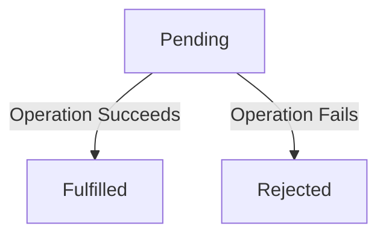
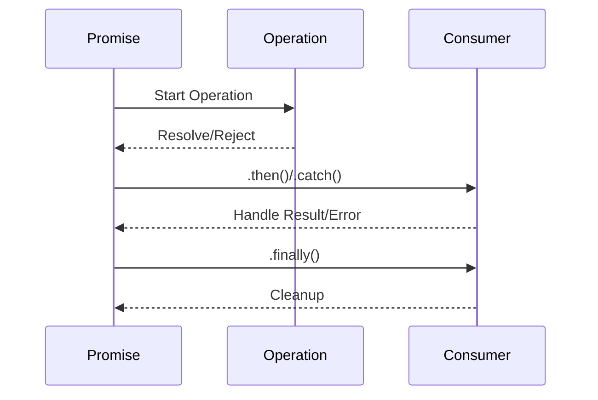

## 8.1 Promise Pattern

In modern web development, handling asynchronous operations efficiently is crucial for creating responsive and performant applications. The Promise pattern in JavaScript and TypeScript offers a robust solution to manage asynchronous tasks, providing a more manageable and predictable way to deal with these operations compared to traditional callback patterns. In this section, we will delve into the intricacies of Promises, exploring their lifecycle, benefits, and how TypeScript enhances their usage with type safety.

### Understanding Promises

A **Promise** is an object representing the eventual completion or failure of an asynchronous operation. It acts as a placeholder for a value that will be available in the future. Promises are a cornerstone of asynchronous programming in JavaScript, offering a cleaner and more intuitive way to work with asynchronous code than callbacks.

#### The Purpose of Promises

Promises were introduced to solve the "callback hell" problem, where nested callbacks make code difficult to read and maintain. By using Promises, we can write asynchronous code that is more linear and easier to follow. Promises also provide better error handling mechanisms, allowing us to catch errors at any point in the asynchronous chain.

### The Three States of a Promise

A Promise can be in one of three states:

1. **Pending**: The initial state, where the Promise is neither fulfilled nor rejected.
2. **Fulfilled**: The state when the operation has completed successfully, and the Promise has a resulting value.
3. **Rejected**: The state when the operation has failed, and the Promise has a reason for the failure.

These states transition in a predictable manner, allowing developers to handle asynchronous results effectively.



*Figure 1: Promise Lifecycle*

### Creating and Consuming Promises

Let's explore how to create and consume Promises in TypeScript with practical examples.

#### Creating a New Promise

To create a new Promise, we use the `Promise` constructor, which takes a function as an argument. This function receives two parameters: `resolve` and `reject`. These are functions that you call to change the state of the Promise.

```typescript
const myPromise = new Promise<number>((resolve, reject) => {
    const success = true; // Simulate an operation outcome
    if (success) {
        resolve(42); // Operation succeeded
    } else {
        reject(new Error("Operation failed")); // Operation failed
    }
});
```

In this example, `myPromise` is a Promise that resolves with the value `42` if the operation succeeds, or rejects with an error if it fails.

#### Consuming Promises

To handle the result of a Promise, we use the `.then()`, `.catch()`, and `.finally()` methods.

- **`.then()`**: Invoked when the Promise is fulfilled.
- **`.catch()`**: Invoked when the Promise is rejected.
- **`.finally()`**: Invoked when the Promise is settled, regardless of its outcome.

```typescript
myPromise
    .then((value) => {
        console.log(`Success: ${value}`);
    })
    .catch((error) => {
        console.error(`Error: ${error.message}`);
    })
    .finally(() => {
        console.log("Operation completed.");
    });
```

In this code, if `myPromise` resolves, the success message is logged. If it rejects, the error message is logged. The `finally` block runs in both cases, providing a place for cleanup operations.

### Chaining Promises

One of the powerful features of Promises is the ability to chain them, allowing for sequential execution of asynchronous operations.

```typescript
const fetchData = (url: string): Promise<string> => {
    return new Promise((resolve, reject) => {
        setTimeout(() => {
            if (url) {
                resolve(`Data from ${url}`);
            } else {
                reject(new Error("Invalid URL"));
            }
        }, 1000);
    });
};

fetchData("https://api.example.com/data")
    .then((data) => {
        console.log(data);
        return fetchData("https://api.example.com/more-data");
    })
    .then((moreData) => {
        console.log(moreData);
    })
    .catch((error) => {
        console.error(`Error: ${error.message}`);
    });
```

In this example, `fetchData` is called twice in sequence. If the first call succeeds, the second call is made. If any call fails, the error is caught in the `catch` block.

### TypeScript and Promises

TypeScript enhances Promises by providing type safety, ensuring that the types of resolved values are known at compile time. This reduces runtime errors and improves code reliability.

#### Type Safety in Promises

When creating a Promise, we can specify the type of the resolved value:

```typescript
const numberPromise: Promise<number> = new Promise((resolve, reject) => {
    resolve(100);
});
```

Here, `numberPromise` is explicitly typed to resolve with a `number`. This ensures that any `.then()` handlers receive a number, catching type mismatches at compile time.

### Advanced Scenarios

#### Wrapping Callback-Based APIs

Many older APIs use callbacks for asynchronous operations. We can wrap these in Promises to modernize the codebase.

```typescript
import { readFile } from 'fs';

const readFilePromise = (filePath: string): Promise<string> => {
    return new Promise((resolve, reject) => {
        readFile(filePath, 'utf8', (err, data) => {
            if (err) {
                reject(err);
            } else {
                resolve(data);
            }
        });
    });
};

readFilePromise('./example.txt')
    .then((content) => {
        console.log(content);
    })
    .catch((error) => {
        console.error(`Error reading file: ${error.message}`);
    });
```

In this example, `readFilePromise` wraps Node.js's `readFile` function, converting it into a Promise-based API.

### Benefits of Using Promises

- **Cleaner Code**: Promises provide a more readable and maintainable way to handle asynchronous operations compared to callbacks.
- **Error Handling**: Promises allow for centralized error handling, making it easier to manage errors in asynchronous code.
- **Chaining**: Promises enable chaining of asynchronous operations, allowing for sequential execution without deeply nested callbacks.

### Potential Pitfalls

While Promises offer many benefits, there are potential pitfalls to be aware of:

- **Unhandled Promise Rejections**: Failing to handle rejections can lead to unhandled errors. Always include a `.catch()` block to manage errors.
- **Complexity in Large Chains**: Long chains of Promises can become difficult to manage. Consider breaking them into smaller functions or using `async/await` for more complex flows.

### Visualizing Promise Flow

Let's visualize the flow of a Promise from creation to resolution or rejection.



*Figure 2: Promise Flow*

### Try It Yourself

Experiment with the provided examples by modifying the URLs, changing the success conditions, or wrapping different callback-based APIs. This hands-on approach will deepen your understanding of Promises and their practical applications.

### Knowledge Check

- What are the three states of a Promise?
- How does TypeScript enhance Promises with type safety?
- What are the benefits of using Promises over callbacks?

### Conclusion

Promises are a fundamental part of modern JavaScript and TypeScript development, offering a powerful way to handle asynchronous operations. By understanding their lifecycle, benefits, and potential pitfalls, you can write cleaner, more maintainable code. Remember, this is just the beginning. As you progress, you'll build more complex and interactive applications. Keep experimenting, stay curious, and enjoy the journey!

## Quiz Time!



### What is a Promise in JavaScript?

- [x] An object representing the eventual completion or failure of an asynchronous operation
- [ ] A function that executes immediately
- [ ] A synchronous operation
- [ ] A data structure for storing values

> **Explanation:** A Promise is an object that represents the eventual result of an asynchronous operation, allowing for more predictable handling of asynchronous tasks.

### What are the three states of a Promise?

- [x] Pending, Fulfilled, Rejected
- [ ] Started, In Progress, Completed
- [ ] Open, Closed, Error
- [ ] Initialized, Running, Stopped

> **Explanation:** A Promise can be in one of three states: Pending (initial state), Fulfilled (operation succeeded), or Rejected (operation failed).

### How does TypeScript enhance Promises?

- [x] By providing type safety for resolved values
- [ ] By making them synchronous
- [ ] By removing the need for `.then()` and `.catch()`
- [ ] By automatically resolving all Promises

> **Explanation:** TypeScript enhances Promises by allowing developers to specify the type of the resolved value, ensuring type safety and reducing runtime errors.

### What method is used to handle a fulfilled Promise?

- [x] `.then()`
- [ ] `.catch()`
- [ ] `.finally()`
- [ ] `.resolve()`

> **Explanation:** The `.then()` method is used to handle the result of a fulfilled Promise.

### Which method is used to handle a rejected Promise?

- [x] `.catch()`
- [ ] `.then()`
- [ ] `.finally()`
- [ ] `.reject()`

> **Explanation:** The `.catch()` method is used to handle errors or rejections in a Promise.

### What is a potential pitfall of using Promises?

- [x] Unhandled Promise rejections
- [ ] Synchronous execution
- [ ] Lack of error handling
- [ ] Complexity in small chains

> **Explanation:** Unhandled Promise rejections can lead to errors that are not caught, making it important to always include a `.catch()` block.

### How can you wrap a callback-based API in a Promise?

- [x] By using the `Promise` constructor and resolving or rejecting based on the callback result
- [ ] By using `.then()` and `.catch()`
- [ ] By converting it to a synchronous function
- [ ] By using `async/await`

> **Explanation:** Wrapping a callback-based API involves using the `Promise` constructor and resolving or rejecting the Promise based on the callback's success or failure.

### What is a benefit of chaining Promises?

- [x] Sequential execution of asynchronous operations
- [ ] Synchronous execution
- [ ] Eliminating the need for error handling
- [ ] Making code less readable

> **Explanation:** Chaining Promises allows for the sequential execution of asynchronous operations, making the code more linear and easier to follow.

### What does the `.finally()` method do in a Promise chain?

- [x] Executes code after the Promise is settled, regardless of its outcome
- [ ] Handles only fulfilled Promises
- [ ] Handles only rejected Promises
- [ ] Cancels the Promise

> **Explanation:** The `.finally()` method is used to execute code after a Promise is settled, whether it is fulfilled or rejected, often for cleanup purposes.

### True or False: Promises can only be used in TypeScript.

- [ ] True
- [x] False

> **Explanation:** Promises are a feature of JavaScript and can be used in any JavaScript environment, including TypeScript, which is a superset of JavaScript.


