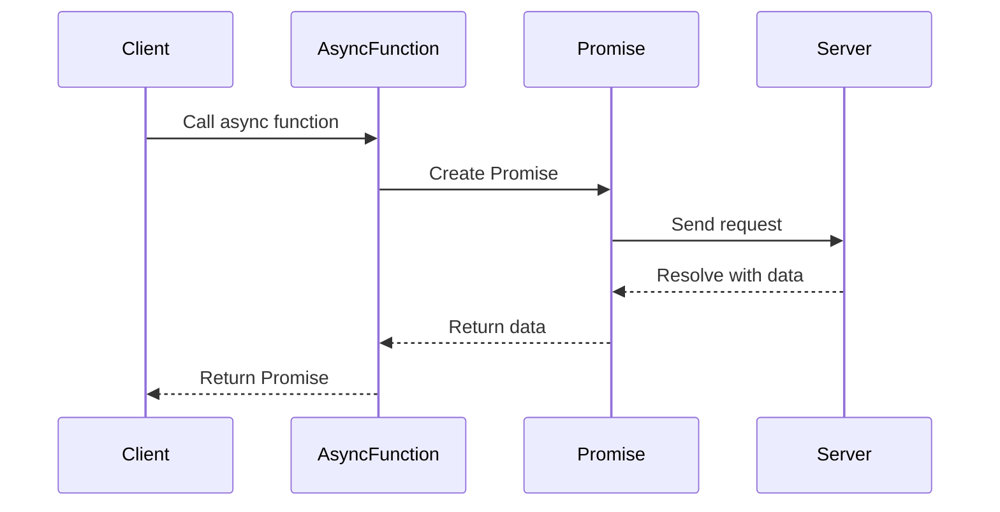

## 8.2.1 Implementing Async/Await in TypeScript

Asynchronous programming is a cornerstone of modern software development, especially in environments like web development where non-blocking operations are crucial. TypeScript, with its robust type system, provides excellent support for asynchronous patterns through the `async` and `await` keywords. In this section, we'll explore how to implement `async`/`await` in TypeScript, making your asynchronous code cleaner, more readable, and maintainable.

### Understanding Async/Await

Before diving into implementation, let's briefly understand what `async` and `await` are:

- **`async` Function**: A function declared with the `async` keyword returns a Promise. It allows the use of `await` within its body.
- **`await` Expression**: Used inside an `async` function to pause execution until a Promise is resolved or rejected.

### Declaring Async Functions

To declare an `async` function in TypeScript, simply prefix the function definition with the `async` keyword. This transforms the function to return a Promise, even if it doesn't explicitly return one.

```typescript
async function fetchData(url: string): Promise<Response> {
    const response = await fetch(url);
    return response;
}
```

**Key Points:**
- The function `fetchData` is an `async` function that returns a Promise of type `Response`.
- The `await` keyword pauses the function execution until the `fetch` Promise resolves.

### Using Await to Pause Execution

The `await` keyword is used to pause the execution of an `async` function until the Promise is resolved. This allows you to write asynchronous code that looks synchronous, improving readability.

```typescript
async function getUserData(userId: string): Promise<User> {
    try {
        const response = await fetch(`https://api.example.com/users/${userId}`);
        const userData = await response.json();
        return userData;
    } catch (error) {
        console.error("Error fetching user data:", error);
        throw error;
    }
}
```

**Explanation:**
- The `await` keyword is used twice: first to wait for the HTTP request to complete, and then to parse the JSON response.
- The `try/catch` block is used to handle any errors that may occur during the asynchronous operations.

### Handling Multiple Asynchronous Operations

#### Sequential Execution

When you have multiple asynchronous operations that need to be executed in sequence, `await` makes it straightforward.

```typescript
async function processUserOrders(userId: string): Promise<void> {
    const user = await getUserData(userId);
    const orders = await fetchOrders(user.id);
    console.log("User Orders:", orders);
}
```

**Sequential Execution Flow:**
1. Fetch user data.
2. Fetch orders based on user data.
3. Log the orders.

#### Parallel Execution

For operations that can run concurrently, use `Promise.all` to execute them in parallel.

```typescript
async function fetchUserAndOrders(userId: string): Promise<[User, Order[]]> {
    const [user, orders] = await Promise.all([
        getUserData(userId),
        fetchOrders(userId)
    ]);
    return [user, orders];
}
```

**Parallel Execution Flow:**
- Both `getUserData` and `fetchOrders` are initiated simultaneously.
- Execution continues once both Promises resolve.

### Typing Async Functions

TypeScript's type system allows you to specify the return type of an `async` function, which is always a Promise of a specific type.

```typescript
async function fetchProduct(productId: string): Promise<Product> {
    const response = await fetch(`https://api.example.com/products/${productId}`);
    const product = await response.json();
    return product;
}
```

**Key Considerations:**
- The return type `Promise<Product>` indicates that the function returns a Promise that resolves to a `Product` object.

### Error Handling in Async Functions

Handling errors in asynchronous code is crucial. The `try/catch` block is your primary tool for managing exceptions in `async` functions.

```typescript
async function safeFetch(url: string): Promise<any> {
    try {
        const response = await fetch(url);
        if (!response.ok) {
            throw new Error(`HTTP error! status: ${response.status}`);
        }
        return await response.json();
    } catch (error) {
        console.error("Fetch error:", error);
        throw error;
    }
}
```

**Error Propagation:**
- Errors thrown within an `async` function are propagated as rejected Promises.
- Use `try/catch` to handle these errors gracefully.

### Refactoring Promise-Based Code

Refactoring existing Promise-based code to use `async`/`await` can simplify your code significantly.

**Before (Promise-based):**

```typescript
function getData(url: string): Promise<any> {
    return fetch(url)
        .then(response => response.json())
        .then(data => data)
        .catch(error => {
            console.error("Error fetching data:", error);
            throw error;
        });
}
```

**After (Async/Await):**

```typescript
async function getData(url: string): Promise<any> {
    try {
        const response = await fetch(url);
        return await response.json();
    } catch (error) {
        console.error("Error fetching data:", error);
        throw error;
    }
}
```

**Benefits of Refactoring:**
- Improved readability and maintainability.
- Easier error handling with `try/catch`.

### Compatibility Considerations

When using `async`/`await` in TypeScript, it's important to consider the target JavaScript version. The TypeScript compiler can transpile `async`/`await` to work with older JavaScript versions.

**Compiler Options:**

- **ES2017 or later**: Native support for `async`/`await`.
- **ES5 or ES6**: TypeScript transpiles `async`/`await` to generator functions and Promises.

**Example tsconfig.json:**

```json
{
    "compilerOptions": {
        "target": "ES5",
        "lib": ["es2015", "dom"],
        "module": "commonjs"
    }
}
```

### Advanced Examples

#### Using Await in Loops

Using `await` inside loops requires careful consideration to avoid sequential execution when parallel execution is desired.

**Sequential Loop:**

```typescript
async function processItemsSequentially(items: string[]): Promise<void> {
    for (const item of items) {
        await processItem(item);
    }
}
```

**Parallel Execution with Map:**

```typescript
async function processItemsInParallel(items: string[]): Promise<void> {
    await Promise.all(items.map(item => processItem(item)));
}
```

#### Handling Timeouts with Promise.race()

`Promise.race()` can be used to handle timeouts by racing the main Promise against a timeout Promise.

```typescript
async function fetchWithTimeout(url: string, timeout: number): Promise<any> {
    const timeoutPromise = new Promise((_, reject) =>
        setTimeout(() => reject(new Error("Request timed out")), timeout)
    );

    return Promise.race([
        fetch(url).then(response => response.json()),
        timeoutPromise
    ]);
}
```

**Explanation:**
- `Promise.race()` returns the result of the first Promise to settle (resolve or reject).
- This pattern is useful for enforcing time constraints on asynchronous operations.

### Visualizing Async/Await Flow

To better understand the flow of `async`/`await`, let's visualize how these operations interact.



**Diagram Explanation:**
- The client calls an `async` function, which creates a Promise.
- The Promise sends a request to the server.
- Once the server responds, the Promise resolves with the data.
- The `async` function returns the resolved data to the client.

### Try It Yourself

Experiment with the code examples provided. Try modifying them to:

- Fetch data from a different API.
- Implement error handling for specific HTTP status codes.
- Use `Promise.all` to fetch multiple resources in parallel.

### Knowledge Check

- What is the primary advantage of using `async`/`await` over traditional Promise chaining?
- How does TypeScript's type system enhance the use of `async` functions?

### Embrace the Journey

Remember, mastering `async`/`await` is just the beginning of writing efficient asynchronous code. As you progress, you'll find more opportunities to refactor and improve your codebase. Keep experimenting, stay curious, and enjoy the journey!

## Quiz Time!



### What is the primary purpose of the `async` keyword in TypeScript?

- [x] To declare a function that returns a Promise.
- [ ] To pause execution of a function.
- [ ] To handle errors in asynchronous code.
- [ ] To execute code in parallel.

> **Explanation:** The `async` keyword is used to declare a function that returns a Promise, allowing the use of `await` within its body.

### How does the `await` keyword affect the execution of an `async` function?

- [x] It pauses execution until the Promise resolves.
- [ ] It executes the next line of code immediately.
- [ ] It converts synchronous code to asynchronous.
- [ ] It handles errors automatically.

> **Explanation:** The `await` keyword pauses the execution of an `async` function until the Promise resolves, making asynchronous code appear synchronous.

### Which TypeScript compiler option allows `async`/`await` to be used in ES5 environments?

- [x] Transpiling to generator functions and Promises.
- [ ] Using native `async`/`await` support.
- [ ] Compiling to ES2017.
- [ ] Disabling type checking.

> **Explanation:** TypeScript can transpile `async`/`await` to generator functions and Promises for compatibility with ES5 environments.

### What is the benefit of using `Promise.all` with `async`/`await`?

- [x] It allows multiple Promises to be executed in parallel.
- [ ] It ensures sequential execution of Promises.
- [ ] It automatically handles errors.
- [ ] It simplifies error handling.

> **Explanation:** `Promise.all` allows multiple Promises to be executed in parallel, improving performance when operations are independent.

### How can you handle errors in an `async` function?

- [x] Using a `try/catch` block.
- [ ] Using `then` and `catch` methods.
- [x] Throwing an error inside the function.
- [ ] Ignoring errors.

> **Explanation:** Errors in `async` functions can be handled using `try/catch` blocks, and throwing an error inside the function will propagate it as a rejected Promise.

### What happens if you use `await` inside a loop without `Promise.all`?

- [x] The loop executes sequentially.
- [ ] The loop executes in parallel.
- [ ] The loop skips iterations.
- [ ] The loop throws an error.

> **Explanation:** Using `await` inside a loop without `Promise.all` results in sequential execution, as each iteration waits for the previous one to complete.

### How can you implement a timeout for an asynchronous operation?

- [x] Using `Promise.race()` with a timeout Promise.
- [ ] Using `await` with a delay.
- [x] Throwing an error after a delay.
- [ ] Using `Promise.all()`.

> **Explanation:** `Promise.race()` can be used to implement a timeout by racing the main Promise against a timeout Promise that rejects after a specified delay.

### What is the return type of an `async` function in TypeScript?

- [x] Promise of a specific type.
- [ ] Any type.
- [ ] Void.
- [ ] Undefined.

> **Explanation:** An `async` function in TypeScript always returns a Promise of a specific type, as specified in its return type annotation.

### Can `async`/`await` be used with non-Promise-based asynchronous operations?

- [x] True
- [ ] False

> **Explanation:** `async`/`await` is designed to work with Promises, but non-Promise-based asynchronous operations can be wrapped in Promises to use with `async`/`await`.

### Is it necessary to use `try/catch` in every `async` function?

- [x] False
- [ ] True

> **Explanation:** While `try/catch` is useful for handling errors, it is not necessary in every `async` function. Error handling should be implemented based on the specific requirements of the function.


