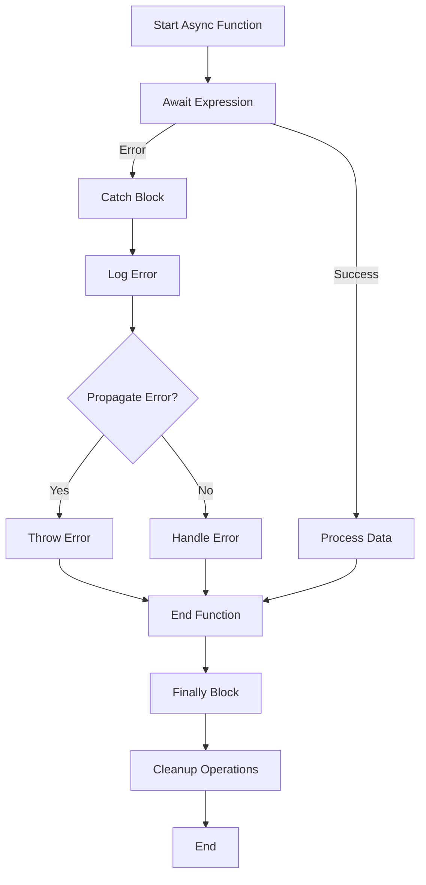

## 8.2.2 Error Handling in Async Functions

In the realm of asynchronous programming, managing errors effectively is crucial for building robust and reliable applications. TypeScript's `async`/`await` syntax offers a powerful way to handle asynchronous operations, but it also introduces unique challenges when it comes to error handling. In this section, we will delve into the intricacies of managing errors in `async` functions, explore best practices, and provide comprehensive examples to guide you through the process.

### Understanding Error Handling in Async Functions

When working with `async` functions, errors can be thrown at various stages of execution. These errors are typically encapsulated within Promises, and understanding how to manage them is key to maintaining control over your application's flow.

#### How Errors are Handled in Async Functions

Errors thrown within an `async` function are automatically wrapped in a Promise. This means that if an error occurs, the Promise returned by the `async` function will be rejected with that error. Let's look at a basic example:

```typescript
async function fetchData(url: string): Promise<any> {
  // Simulate an error
  throw new Error("Network error");
}

fetchData("https://api.example.com/data")
  .then(data => console.log(data))
  .catch(error => console.error("Error:", error.message));
```

In this example, the `fetchData` function throws an error, which is caught by the `.catch()` method chained to the Promise. This demonstrates how errors in `async` functions propagate through Promises.

### Using Try/Catch for Error Management

The `try/catch` construct is a fundamental tool for managing exceptions in synchronous code, and it can be seamlessly integrated into `async` functions to handle errors in asynchronous operations.

#### Wrapping Await Expressions in Try/Catch

When using `await` within an `async` function, it's important to wrap potentially error-prone expressions in `try/catch` blocks. This allows you to handle errors gracefully and maintain control over the execution flow.

```typescript
async function getData(url: string): Promise<any> {
  try {
    const response = await fetch(url);
    if (!response.ok) {
      throw new Error(`HTTP error! status: ${response.status}`);
    }
    return await response.json();
  } catch (error) {
    console.error("Failed to fetch data:", error.message);
    throw error; // Propagate the error
  }
}

getData("https://api.example.com/data")
  .then(data => console.log(data))
  .catch(error => console.error("Caught in main:", error.message));
```

In this example, the `await fetch(url)` expression is wrapped in a `try/catch` block. If the fetch operation fails, the error is caught and logged, and then re-thrown to propagate it to the caller.

#### Unhandled Errors and Their Impact

Unhandled errors in `async` functions can lead to unhandled Promise rejections, which can cause unexpected behavior in your application. It's crucial to ensure that all potential errors are caught and handled appropriately.

### The Role of the Finally Block

The `finally` block provides a mechanism to execute cleanup operations after a `try/catch` block, regardless of whether an error occurred. This is particularly useful for releasing resources or resetting state.

```typescript
async function processData(url: string): Promise<void> {
  try {
    const data = await getData(url);
    console.log("Data processed:", data);
  } catch (error) {
    console.error("Error processing data:", error.message);
  } finally {
    console.log("Cleanup operations completed.");
  }
}

processData("https://api.example.com/data");
```

In this example, the `finally` block ensures that cleanup operations are executed after attempting to process data, regardless of the outcome.

### Best Practices for Error Handling in Async/Await Code

To effectively manage errors in `async`/`await` code, consider the following best practices:

- **Propagate Errors**: Re-throw errors when necessary to ensure they are handled by the caller or higher-level error handlers.
- **Provide Fallback Mechanisms**: Implement fallback strategies to handle errors gracefully, such as retrying operations or returning default values.
- **Log Errors**: Integrate logging mechanisms to capture error details for debugging and monitoring purposes.
- **Use Specific Error Types**: Define custom error types to provide more context and facilitate error handling.

### Handling Multiple Error Scenarios

In complex applications, a single `async` function may encounter multiple error scenarios. It's important to handle each scenario appropriately to ensure robust error management.

```typescript
async function fetchAndProcessData(url: string): Promise<void> {
  try {
    const data = await getData(url);
    if (!data) {
      throw new Error("No data returned");
    }
    process(data);
  } catch (error) {
    if (error.message === "No data returned") {
      console.warn("Data was not available, using default values.");
      process(defaultData);
    } else {
      console.error("Unexpected error:", error.message);
      throw error; // Propagate unexpected errors
    }
  }
}

fetchAndProcessData("https://api.example.com/data");
```

In this example, different error scenarios are handled within the same `try/catch` block. Specific errors are managed with custom logic, while unexpected errors are propagated.

### Integrating Error Handling with Logging and Monitoring

Effective error management involves not only handling errors but also integrating with logging and monitoring tools to gain insights into application behavior.

- **Use Logging Libraries**: Leverage libraries like Winston or Bunyan to capture and format error logs.
- **Monitor Application Health**: Use monitoring tools like New Relic or Datadog to track error rates and application performance.
- **Set Up Alerts**: Configure alerts to notify you of critical errors or unusual patterns.

### Visualizing Error Handling in Async Functions

To better understand the flow of error handling in `async` functions, let's visualize the process using a flowchart.



This flowchart illustrates the typical flow of an `async` function with error handling, showing how errors are caught, logged, and either handled or propagated.

### Try It Yourself

To deepen your understanding, try modifying the code examples provided:

- **Experiment with Different Error Scenarios**: Introduce different types of errors and observe how they are handled.
- **Implement Custom Error Types**: Define and use custom error classes to provide more context in error handling.
- **Integrate with a Logging Library**: Set up a logging library and capture error details in a structured format.

### Conclusion

Mastering error handling in `async` functions is essential for building resilient applications. By leveraging `try/catch` blocks, propagating errors appropriately, and integrating with logging and monitoring tools, you can ensure that your asynchronous code is robust and reliable. Remember, effective error management is not just about catching errors but also about understanding their impact and taking proactive measures to mitigate them.

## Quiz Time!



### What happens when an error is thrown inside an async function?

- [x] The error is wrapped in a rejected Promise.
- [ ] The error is ignored.
- [ ] The error is logged to the console automatically.
- [ ] The async function stops executing immediately.

> **Explanation:** When an error is thrown inside an async function, it is automatically wrapped in a rejected Promise, allowing the error to be handled using Promise methods like `.catch()`.

### How can you handle errors in async functions?

- [x] By using try/catch blocks.
- [ ] By using only .catch() methods.
- [ ] By ignoring them.
- [ ] By using finally blocks only.

> **Explanation:** Errors in async functions can be handled using try/catch blocks, which allow you to manage exceptions and maintain control over the execution flow.

### What is the purpose of the finally block in error handling?

- [x] To execute cleanup operations after try/catch.
- [ ] To catch errors that were not caught by catch.
- [ ] To stop the execution of the function.
- [ ] To log errors automatically.

> **Explanation:** The finally block is used to execute cleanup operations after a try/catch block, regardless of whether an error occurred.

### Why is it important to propagate errors in async functions?

- [x] To ensure they are handled by higher-level error handlers.
- [ ] To stop the function from executing.
- [ ] To log them automatically.
- [ ] To ignore them.

> **Explanation:** Propagating errors in async functions ensures that they are handled by higher-level error handlers, allowing for consistent error management across the application.

### What should you do if a specific error scenario occurs in an async function?

- [x] Implement custom logic to handle it.
- [ ] Ignore it and continue execution.
- [ ] Log it and stop the function.
- [ ] Always propagate it.

> **Explanation:** If a specific error scenario occurs, you should implement custom logic to handle it, ensuring that the application can continue to function correctly.

### How can you integrate error handling with logging?

- [x] Use logging libraries to capture error details.
- [ ] Ignore errors and log them later.
- [ ] Use console.log for all errors.
- [ ] Only log errors in production.

> **Explanation:** Integrating error handling with logging involves using logging libraries to capture error details in a structured format, aiding in debugging and monitoring.

### What is the impact of unhandled errors in async functions?

- [x] They lead to unhandled Promise rejections.
- [ ] They are automatically logged.
- [ ] They stop the application.
- [ ] They are ignored.

> **Explanation:** Unhandled errors in async functions lead to unhandled Promise rejections, which can cause unexpected behavior in the application.

### How can you manage multiple error scenarios in a single async function?

- [x] Use try/catch blocks with specific error handling logic.
- [ ] Ignore all errors and continue execution.
- [ ] Log all errors and stop the function.
- [ ] Use finally blocks for all error handling.

> **Explanation:** Managing multiple error scenarios in a single async function involves using try/catch blocks with specific error handling logic for each scenario.

### What is a best practice for error handling in async/await code?

- [x] Provide fallback mechanisms for errors.
- [ ] Ignore errors and continue execution.
- [ ] Log all errors and stop the function.
- [ ] Use finally blocks for all error handling.

> **Explanation:** A best practice for error handling in async/await code is to provide fallback mechanisms for errors, ensuring that the application can continue to function correctly.

### True or False: The finally block is executed only if an error occurs.

- [ ] True
- [x] False

> **Explanation:** The finally block is executed regardless of whether an error occurs, making it ideal for cleanup operations.


