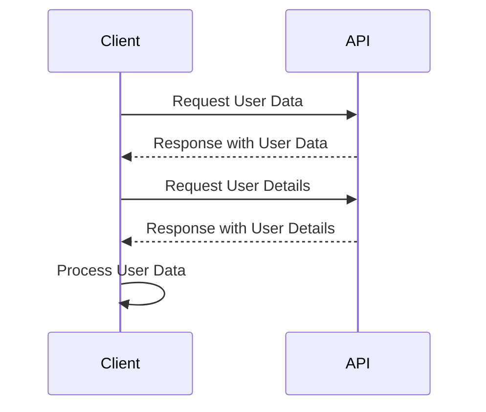

## 8.2.3 Use Cases and Examples

In the realm of asynchronous programming, the `async`/`await` pattern has revolutionized how we write and manage asynchronous code in TypeScript. By allowing developers to write asynchronous code that looks and behaves like synchronous code, `async`/`await` enhances readability and maintainability. In this section, we will delve into real-world use cases and examples where `async`/`await` significantly improves code clarity and functionality.

### Simplifying Asynchronous Code

The primary advantage of `async`/`await` is its ability to simplify complex Promise chains. Let's explore a typical scenario where we fetch data from an API and process it.

#### Example: Fetching Data from an API

Consider a scenario where we need to fetch user data from an API, then fetch additional details based on the user data. Here's how this might look using Promises:

```typescript
function fetchUserData(userId: number): Promise<User> {
    return fetch(`https://api.example.com/users/${userId}`)
        .then(response => response.json())
        .then(user => {
            return fetch(`https://api.example.com/details/${user.detailsId}`)
                .then(detailsResponse => detailsResponse.json())
                .then(details => {
                    user.details = details;
                    return user;
                });
        })
        .catch(error => {
            console.error('Error fetching user data:', error);
            throw error;
        });
}
```

While this code works, it quickly becomes difficult to read and maintain due to the nested `.then()` calls. Now, let's refactor this using `async`/`await`:

```typescript
async function fetchUserData(userId: number): Promise<User> {
    try {
        const response = await fetch(`https://api.example.com/users/${userId}`);
        const user = await response.json();
        
        const detailsResponse = await fetch(`https://api.example.com/details/${user.detailsId}`);
        const details = await detailsResponse.json();
        
        user.details = details;
        return user;
    } catch (error) {
        console.error('Error fetching user data:', error);
        throw error;
    }
}
```

**Key Improvements:**

- **Readability**: The code reads top-to-bottom, similar to synchronous code.
- **Error Handling**: We use a single `try/catch` block to handle errors, simplifying error management.
- **Maintainability**: The code is easier to modify and extend.

### Handling Dependent Asynchronous Operations

In many applications, operations are dependent on the results of previous operations. `async`/`await` makes it straightforward to handle such dependencies.

#### Example: Sequential Data Processing

Imagine we need to process a list of user IDs, fetch data for each user, and then perform an operation on the fetched data. Here's how you might implement this using `async`/`await`:

```typescript
async function processUserIds(userIds: number[]): Promise<void> {
    for (const userId of userIds) {
        const user = await fetchUserData(userId);
        await performOperationOnUser(user);
    }
}

async function performOperationOnUser(user: User): Promise<void> {
    // Perform some operation on the user data
    console.log(`Processing user: ${user.name}`);
}
```

**Performance Consideration**: In this example, each user is processed sequentially. If the operations on each user are independent, consider using `Promise.all` to process them in parallel for better performance.

### Error Handling with Async/Await

Proper error handling is crucial in asynchronous programming. With `async`/`await`, error handling becomes more intuitive and manageable.

#### Example: Robust Error Handling

Let's enhance our previous example with robust error handling:

```typescript
async function processUserIds(userIds: number[]): Promise<void> {
    for (const userId of userIds) {
        try {
            const user = await fetchUserData(userId);
            await performOperationOnUser(user);
        } catch (error) {
            console.error(`Failed to process user with ID ${userId}:`, error);
        }
    }
}
```

**Key Takeaway**: By wrapping each asynchronous operation in a `try/catch` block, we can handle errors gracefully and continue processing other users.

### Performance Considerations

While `async`/`await` simplifies asynchronous code, it's essential to be mindful of performance implications, particularly regarding serial versus parallel execution.

#### Example: Parallel Execution with Promise.all

When operations are independent, use `Promise.all` to execute them in parallel:

```typescript
async function processUserIdsInParallel(userIds: number[]): Promise<void> {
    const userPromises = userIds.map(userId => fetchUserData(userId));
    const users = await Promise.all(userPromises);
    
    const operationPromises = users.map(user => performOperationOnUser(user));
    await Promise.all(operationPromises);
}
```

**Benefits**: By executing operations in parallel, we can significantly reduce the overall execution time.

### Limitations and Caveats

While `async`/`await` is powerful, there are some limitations and caveats to be aware of:

- **Top-Level Await**: In some contexts, such as older versions of Node.js or certain module systems, `await` cannot be used at the top level of a module. This limitation is being addressed in modern JavaScript environments.
- **Blocking Code**: While `async`/`await` simplifies asynchronous code, it can lead to blocking behavior if not used carefully. Ensure that long-running operations are truly asynchronous to prevent blocking the event loop.

### Advanced Techniques

For expert developers, `async`/`await` can be combined with other advanced techniques to create powerful asynchronous workflows.

#### Custom Async Iterators

Custom async iterators can be used to handle streaming data or long-running asynchronous operations. Here's a simple example:

```typescript
async function* asyncGenerator(): AsyncIterableIterator<number> {
    let i = 0;
    while (i < 5) {
        await new Promise(resolve => setTimeout(resolve, 1000)); // Simulate async operation
        yield i++;
    }
}

(async () => {
    for await (const num of asyncGenerator()) {
        console.log(num); // Logs 0, 1, 2, 3, 4 with a delay
    }
})();
```

**Key Concept**: By using `async`/`await` with generators, we can create asynchronous data streams that are easy to consume.

### Try It Yourself

To solidify your understanding of `async`/`await`, try modifying the examples above:

- **Experiment with Error Handling**: Introduce intentional errors and observe how they are caught and handled.
- **Optimize Performance**: Refactor sequential operations to run in parallel where possible.
- **Create Custom Async Iterators**: Implement an async iterator that fetches data from an API in chunks.

### Visualizing Asynchronous Flow

To better understand how `async`/`await` works, let's visualize the flow of asynchronous operations:



**Diagram Explanation**: This sequence diagram illustrates the flow of asynchronous operations when fetching and processing user data. The client makes requests to the API and processes the responses, highlighting the asynchronous nature of the interactions.

### References and Links

For further reading on `async`/`await` and asynchronous programming in TypeScript, consider the following resources:

- [MDN Web Docs: Async functions](https://developer.mozilla.org/en-US/docs/Web/JavaScript/Reference/Statements/async_function)
- [TypeScript Handbook: Promises](https://www.typescriptlang.org/docs/handbook/release-notes/typescript-2-1.html#asyncawait)
- [MDN Web Docs: Promise.all](https://developer.mozilla.org/en-US/docs/Web/JavaScript/Reference/Global_Objects/Promise/all)

### Knowledge Check

Before moving on, consider these questions to test your understanding:

- How does `async`/`await` improve code readability compared to Promises?
- What are the performance implications of using `async`/`await` for sequential versus parallel operations?
- How can you handle errors effectively when using `async`/`await`?

### Embrace the Journey

Remember, mastering `async`/`await` is just the beginning of your journey into asynchronous programming. As you continue to explore and experiment, you'll discover new ways to leverage this powerful pattern to build more efficient and maintainable applications. Keep experimenting, stay curious, and enjoy the journey!

## Quiz Time!



### How does `async`/`await` improve code readability compared to Promises?

- [x] It allows writing asynchronous code in a synchronous style.
- [ ] It eliminates the need for error handling.
- [ ] It automatically optimizes performance.
- [ ] It replaces all asynchronous operations with synchronous ones.

> **Explanation:** `async`/`await` allows developers to write asynchronous code that looks and behaves like synchronous code, improving readability.

### What is a key benefit of using `async`/`await` for error handling?

- [x] Errors can be caught using `try/catch` blocks.
- [ ] It eliminates all errors in asynchronous code.
- [ ] It provides automatic error correction.
- [ ] It requires no additional error handling logic.

> **Explanation:** `async`/`await` allows for intuitive error handling using `try/catch` blocks, similar to synchronous code.

### When should you consider using `Promise.all` with `async`/`await`?

- [x] When you have independent asynchronous operations that can run in parallel.
- [ ] When you need to execute operations sequentially.
- [ ] When you want to block the event loop.
- [ ] When you want to handle errors automatically.

> **Explanation:** `Promise.all` is used to execute multiple independent asynchronous operations in parallel, improving performance.

### What is a limitation of `async`/`await` in some contexts?

- [x] `await` cannot be used at the top level of modules in some environments.
- [ ] It cannot handle errors.
- [ ] It only works with synchronous code.
- [ ] It is slower than using Promises directly.

> **Explanation:** In some environments, `await` cannot be used at the top level of modules, though this is being addressed in modern JavaScript environments.

### How can custom async iterators be useful?

- [x] They allow for handling streaming data or long-running asynchronous operations.
- [ ] They replace all asynchronous code with synchronous code.
- [ ] They eliminate the need for Promises.
- [ ] They automatically optimize performance.

> **Explanation:** Custom async iterators allow for handling streaming data or long-running asynchronous operations in a manageable way.

### What is a potential performance issue with using `async`/`await`?

- [x] It can lead to blocking behavior if not used carefully.
- [ ] It automatically blocks the event loop.
- [ ] It eliminates the need for asynchronous operations.
- [ ] It is always slower than using callbacks.

> **Explanation:** While `async`/`await` simplifies asynchronous code, it can lead to blocking behavior if long-running operations are not truly asynchronous.

### Why might you use `try/catch` with `async`/`await`?

- [x] To handle errors in asynchronous operations.
- [ ] To automatically fix errors.
- [ ] To eliminate the need for error handling.
- [ ] To make code run faster.

> **Explanation:** `try/catch` is used with `async`/`await` to handle errors in asynchronous operations in a clear and manageable way.

### What is the benefit of using `Promise.all` in parallel execution?

- [x] It reduces the overall execution time by running operations concurrently.
- [ ] It ensures operations run sequentially.
- [ ] It automatically handles all errors.
- [ ] It replaces the need for `async`/`await`.

> **Explanation:** `Promise.all` allows multiple asynchronous operations to run concurrently, reducing the overall execution time.

### How does `async`/`await` affect code maintainability?

- [x] It makes code easier to read and modify.
- [ ] It eliminates the need for comments.
- [ ] It automatically updates code.
- [ ] It requires more complex error handling.

> **Explanation:** `async`/`await` improves code maintainability by making asynchronous code easier to read and modify.

### True or False: `async`/`await` can be used to write asynchronous code that behaves like synchronous code.

- [x] True
- [ ] False

> **Explanation:** True. `async`/`await` allows developers to write asynchronous code that looks and behaves like synchronous code, enhancing readability and maintainability.


