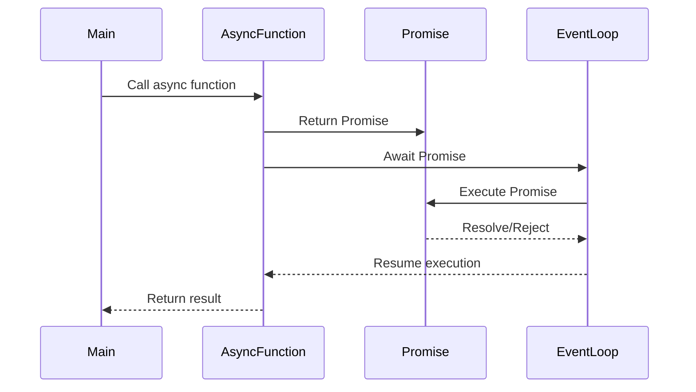

## 8.2 Async/Await Pattern

Asynchronous programming is a cornerstone of modern software development, especially in environments like JavaScript and TypeScript, where non-blocking operations are essential for performance and responsiveness. The `async`/`await` pattern is a powerful tool that allows developers to write asynchronous code in a style that resembles synchronous code, thereby enhancing readability and maintainability. In this section, we will delve into the intricacies of the `async`/`await` pattern, exploring its syntax, benefits, and best practices, along with detailed TypeScript code examples.

### Understanding Async/Await Syntax

The `async`/`await` syntax is built on top of Promises, providing a more intuitive way to work with asynchronous operations. Let's break down the key components:

- **`async` Function**: Declaring a function with the `async` keyword automatically makes it return a Promise. This allows the function to use the `await` keyword inside its body.

- **`await` Expression**: The `await` keyword can only be used inside an `async` function. It pauses the execution of the function until the Promise is resolved or rejected, allowing subsequent code to be executed as if it were synchronous.

#### Example: Basic Async/Await Syntax

```typescript
async function fetchData(url: string): Promise<any> {
    try {
        const response = await fetch(url);
        const data = await response.json();
        return data;
    } catch (error) {
        console.error('Error fetching data:', error);
        throw error;
    }
}
```

In this example, `fetchData` is an `async` function that fetches data from a given URL. The `await` keyword is used to pause the function execution until the `fetch` operation completes, making the code easier to read and understand.

### Benefits of Using Async/Await

The `async`/`await` pattern offers several advantages over traditional Promise chaining or callback-based asynchronous code:

1. **Improved Readability**: By allowing asynchronous code to be written in a synchronous style, `async`/`await` makes it easier to follow the flow of logic, reducing cognitive load.

2. **Simplified Error Handling**: With `async`/`await`, error handling can be done using `try/catch` blocks, similar to synchronous code, which is more intuitive than handling errors with `.catch()` in Promise chains.

3. **Reduced Callback Hell**: The nesting of callbacks, often referred to as "callback hell," is eliminated, leading to cleaner and more maintainable code.

4. **Seamless Integration with Existing Promises**: `async`/`await` can be used alongside existing Promise-based APIs, providing flexibility in how asynchronous code is structured.

#### Example: Converting Promise Chains to Async/Await

Consider the following Promise chain:

```typescript
function getData(url: string): Promise<any> {
    return fetch(url)
        .then(response => response.json())
        .then(data => {
            console.log('Data received:', data);
            return data;
        })
        .catch(error => {
            console.error('Error fetching data:', error);
            throw error;
        });
}
```

This can be refactored using `async`/`await`:

```typescript
async function getData(url: string): Promise<any> {
    try {
        const response = await fetch(url);
        const data = await response.json();
        console.log('Data received:', data);
        return data;
    } catch (error) {
        console.error('Error fetching data:', error);
        throw error;
    }
}
```

### Error Handling in Async Functions

Error handling in `async` functions is straightforward with `try/catch` blocks. This approach is not only more readable but also aligns with how errors are handled in synchronous code.

#### Example: Error Handling with Try/Catch

```typescript
async function processData(url: string): Promise<void> {
    try {
        const data = await fetchData(url);
        // Process data
    } catch (error) {
        console.error('Processing error:', error);
    }
}
```

In this example, any errors thrown by `fetchData` will be caught by the `catch` block, allowing for graceful error handling.

### Best Practices for Async/Await

To make the most of the `async`/`await` pattern, consider the following best practices:

- **Avoid Blocking the Event Loop**: Ensure that `await` is used with non-blocking operations. Blocking the event loop can lead to performance issues.

- **Handle Rejected Promises**: Always handle rejected Promises, either with `try/catch` or by explicitly handling errors.

- **Use `Promise.all` for Concurrent Operations**: When multiple asynchronous operations can be performed concurrently, use `Promise.all` to improve performance.

#### Example: Using Promise.all with Async/Await

```typescript
async function fetchMultipleUrls(urls: string[]): Promise<any[]> {
    try {
        const fetchPromises = urls.map(url => fetch(url).then(response => response.json()));
        const results = await Promise.all(fetchPromises);
        return results;
    } catch (error) {
        console.error('Error fetching multiple URLs:', error);
        throw error;
    }
}
```

In this example, `Promise.all` is used to fetch multiple URLs concurrently, improving efficiency.

### Potential Pitfalls

While `async`/`await` simplifies asynchronous programming, there are potential pitfalls to be aware of:

- **Forgetting to Use `await`**: Omitting `await` can lead to unexpected behavior, as the function will not pause for the Promise to resolve.

- **Unhandled Rejections**: Ensure that all Promises are handled to avoid unhandled rejections, which can lead to application crashes.

- **Blocking Code**: Avoid using `await` in loops where operations can be performed concurrently, as this can lead to performance bottlenecks.

#### Example: Avoiding Blocking Code in Loops

```typescript
async function processUrls(urls: string[]): Promise<void> {
    const results = [];
    for (const url of urls) {
        results.push(fetchData(url)); // Do not use await here
    }
    const data = await Promise.all(results);
    console.log('Processed data:', data);
}
```

In this example, `await` is used outside the loop to avoid blocking each iteration.

### Async/Await and TypeScript's Type System

TypeScript's type system enhances the `async`/`await` pattern by providing type safety and autocompletion. When using `async` functions, TypeScript infers the return type as a Promise of the resolved value type.

#### Example: TypeScript Type Inference with Async/Await

```typescript
async function getUserData(userId: number): Promise<{ name: string; age: number }> {
    const response = await fetch(`/api/users/${userId}`);
    const userData = await response.json();
    return userData;
}
```

In this example, TypeScript infers that `getUserData` returns a Promise with an object containing `name` and `age` properties.

### Integration with Other Asynchronous Patterns

The `async`/`await` pattern can be integrated with other asynchronous patterns, such as Observables or Generators, to create powerful and flexible asynchronous workflows.

#### Example: Combining Async/Await with Observables

```typescript
import { from } from 'rxjs';
import { map, mergeMap } from 'rxjs/operators';

async function fetchDataAsync(url: string): Promise<any> {
    const response = await fetch(url);
    return response.json();
}

const urls = ['https://api.example.com/data1', 'https://api.example.com/data2'];

from(urls)
    .pipe(
        mergeMap(url => from(fetchDataAsync(url))),
        map(data => console.log('Data:', data))
    )
    .subscribe();
```

In this example, `async`/`await` is used within an Observable pipeline, demonstrating how these patterns can complement each other.

### Try It Yourself

To solidify your understanding of the `async`/`await` pattern, try modifying the examples provided:

- **Experiment with Error Handling**: Introduce errors in the `fetchData` function and observe how they are handled with `try/catch`.

- **Optimize Concurrent Operations**: Refactor the `processUrls` function to use `Promise.all` more effectively.

- **Integrate with Other Patterns**: Combine `async`/`await` with other patterns, such as Generators or Observables, to explore new possibilities.

### Visualizing Async/Await Execution Flow

To better understand how `async`/`await` interacts with the event loop, let's visualize the execution flow:



**Diagram Description**: This sequence diagram illustrates the flow of execution when using `async`/`await`. The main function calls an `async` function, which returns a Promise. The `await` expression pauses execution until the Promise is resolved or rejected, after which the `async` function resumes and returns the result to the main function.

### Knowledge Check

Before we conclude, let's reinforce what we've learned:

- How does `async`/`await` improve code readability compared to traditional Promise chaining?
- What are the best practices for handling errors in `async` functions?
- How can `Promise.all` be used to optimize concurrent operations?
- What are some potential pitfalls when using `async`/`await`?

### Summary

The `async`/`await` pattern is a powerful tool for writing asynchronous code in TypeScript. By allowing asynchronous operations to be expressed in a synchronous style, it enhances code readability and maintainability. With proper error handling and awareness of potential pitfalls, `async`/`await` can significantly improve the quality of your asynchronous code. Remember, this is just the beginning. As you progress, you'll build more complex and interactive applications. Keep experimenting, stay curious, and enjoy the journey!

## Quiz Time!



### What is the primary advantage of using `async`/`await` over traditional Promise chaining?

- [x] Improved readability and maintainability
- [ ] Faster execution
- [ ] Reduced memory usage
- [ ] Increased security

> **Explanation:** The `async`/`await` syntax allows asynchronous code to be written in a synchronous style, which improves readability and maintainability.

### How does an `async` function handle errors?

- [x] Using `try/catch` blocks
- [ ] Using `.catch()` method
- [ ] Using `finally` blocks
- [ ] Using `throw` keyword

> **Explanation:** Errors in `async` functions are typically handled using `try/catch` blocks, similar to synchronous code.

### What happens if you forget to use `await` in an `async` function?

- [ ] The function will throw an error
- [x] The function will not pause for the Promise to resolve
- [ ] The function will return `undefined`
- [ ] The function will block the event loop

> **Explanation:** Forgetting to use `await` means the function will not pause for the Promise to resolve, potentially leading to unexpected behavior.

### Which method is recommended for performing multiple asynchronous operations concurrently?

- [ ] Using `await` in a loop
- [x] Using `Promise.all`
- [ ] Using `setTimeout`
- [ ] Using `try/catch`

> **Explanation:** `Promise.all` is recommended for performing multiple asynchronous operations concurrently, as it waits for all Promises to resolve.

### What is a potential pitfall of using `await` in loops?

- [x] It can lead to performance bottlenecks
- [ ] It causes syntax errors
- [ ] It blocks the event loop
- [ ] It increases memory usage

> **Explanation:** Using `await` in loops can lead to performance bottlenecks, as each iteration waits for the previous one to complete.

### How does TypeScript enhance the `async`/`await` pattern?

- [x] By providing type safety and autocompletion
- [ ] By making code execution faster
- [ ] By reducing code size
- [ ] By simplifying syntax

> **Explanation:** TypeScript enhances `async`/`await` by providing type safety and autocompletion, helping developers write more reliable code.

### What is the return type of an `async` function in TypeScript?

- [ ] `void`
- [ ] `any`
- [x] `Promise`
- [ ] `Object`

> **Explanation:** An `async` function in TypeScript returns a `Promise`, which resolves to the value returned by the function.

### How can `async`/`await` be integrated with Observables?

- [x] By using `async` functions within Observable pipelines
- [ ] By converting Observables to Promises
- [ ] By using `setTimeout`
- [ ] By using `try/catch`

> **Explanation:** `async` functions can be used within Observable pipelines to handle asynchronous operations.

### What does the `await` keyword do in an `async` function?

- [x] Pauses execution until the Promise settles
- [ ] Throws an error if the Promise is rejected
- [ ] Converts a Promise to a synchronous value
- [ ] Blocks the event loop

> **Explanation:** The `await` keyword pauses execution until the Promise settles (is resolved or rejected).

### True or False: `async`/`await` can only be used with Promises.

- [x] True
- [ ] False

> **Explanation:** `async`/`await` is specifically designed to work with Promises, allowing asynchronous code to be written in a synchronous style.


