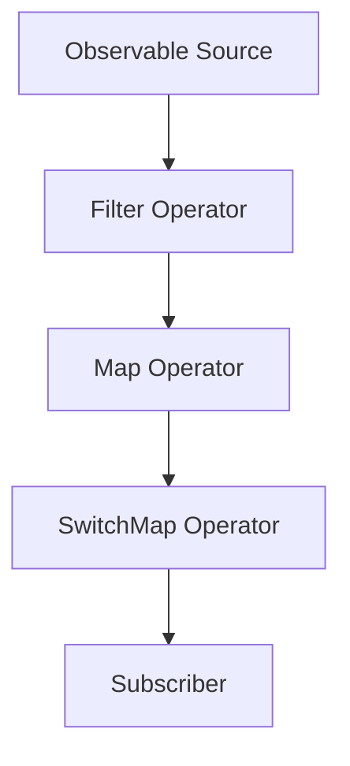

## 8.3.1 Implementing Observables with RxJS

In the world of modern web development, handling asynchronous data streams efficiently is crucial. RxJS (Reactive Extensions for JavaScript) is a library that brings the power of reactive programming to JavaScript and TypeScript. It provides a robust framework for working with asynchronous data streams, known as Observables. In this section, we'll delve into how to implement Observables using RxJS in TypeScript, explore the rich set of operators available, and discuss best practices for managing asynchronous workflows.

### Introduction to RxJS and TypeScript

RxJS is a library for composing asynchronous and event-based programs using observable sequences. It is a powerful tool for managing complex data flows and asynchronous events in a declarative manner. TypeScript, with its static typing and modern features, complements RxJS by providing type safety and better tooling support.

#### Why Use RxJS?

- **Declarative Programming**: RxJS allows you to express complex asynchronous logic in a clear and concise manner.
- **Composability**: With a wide range of operators, RxJS enables you to compose complex data flows from simple building blocks.
- **Asynchronous Data Handling**: RxJS excels at handling asynchronous data streams, such as user inputs, HTTP requests, and WebSocket messages.

#### Integrating RxJS with TypeScript

TypeScript enhances RxJS by providing strong typing for Observables and operators, which helps catch errors at compile time and improves code readability and maintainability.

### Creating Observables

Observables are the core primitive in RxJS. They represent a sequence of values over time, which can be synchronous or asynchronous. Let's explore how to create Observables in RxJS.

#### Using `Observable.create`

The `Observable.create` method allows you to create a custom Observable by specifying how values are emitted.

```typescript
import { Observable } from 'rxjs';

// Create an observable that emits values 1, 2, 3 and then completes
const simpleObservable = Observable.create((observer: any) => {
  observer.next(1);
  observer.next(2);
  observer.next(3);
  observer.complete();
});

// Subscribe to the observable
simpleObservable.subscribe({
  next: (value: any) => console.log(`Value: ${value}`),
  complete: () => console.log('Completed'),
});
```

**Explanation**: In this example, we create an Observable that emits three values and then completes. The `subscribe` method is used to listen for emitted values and handle completion.

#### Creating Observables from Existing Data Sources

RxJS provides utility functions to create Observables from various data sources, such as arrays, events, and Promises.

- **From Arrays**: Use `from` to convert an array into an Observable.

```typescript
import { from } from 'rxjs';

const arrayObservable = from([10, 20, 30]);
arrayObservable.subscribe(value => console.log(`Array Value: ${value}`));
```

- **From Events**: Use `fromEvent` to create an Observable from DOM events.

```typescript
import { fromEvent } from 'rxjs';

const button = document.querySelector('button');
const clickObservable = fromEvent(button, 'click');
clickObservable.subscribe(() => console.log('Button clicked'));
```

- **From Promises**: Use `from` or `fromPromise` to convert a Promise into an Observable.

```typescript
import { from } from 'rxjs';

const promise = fetch('https://api.example.com/data');
const promiseObservable = from(promise);
promiseObservable.subscribe(response => console.log(response));
```

### Subscribing to Observables

Subscribing to an Observable is how you start receiving its emitted values. The `subscribe` method takes an observer object with handlers for `next`, `error`, and `complete`.

```typescript
const observable = from([1, 2, 3]);

observable.subscribe({
  next: (value) => console.log(`Received value: ${value}`),
  error: (err) => console.error(`Error: ${err}`),
  complete: () => console.log('Observable completed'),
});
```

**Explanation**: Here, we subscribe to an Observable and provide handlers for each type of notification: `next` for values, `error` for errors, and `complete` for completion.

### Transforming and Combining Observables with Operators

Operators are functions that enable sophisticated manipulation of Observables. They can be used to transform, filter, combine, and manage data flows.

#### Common Operators

- **`map`**: Transforms each value emitted by an Observable by applying a function to it.

```typescript
import { map } from 'rxjs/operators';

const numbers = from([1, 2, 3, 4]);
const squaredNumbers = numbers.pipe(map(x => x * x));
squaredNumbers.subscribe(value => console.log(`Squared: ${value}`));
```

- **`filter`**: Emits only those values that pass a specified condition.

```typescript
import { filter } from 'rxjs/operators';

const evenNumbers = numbers.pipe(filter(x => x % 2 === 0));
evenNumbers.subscribe(value => console.log(`Even: ${value}`));
```

- **`merge`**: Combines multiple Observables into one by merging their emissions.

```typescript
import { merge } from 'rxjs';

const observable1 = from([1, 2, 3]);
const observable2 = from([4, 5, 6]);
const merged = merge(observable1, observable2);
merged.subscribe(value => console.log(`Merged: ${value}`));
```

- **`switchMap`**: Maps each value to an Observable, then flattens all of these inner Observables using switch.

```typescript
import { switchMap } from 'rxjs/operators';
import { of } from 'rxjs';

const letters = from(['a', 'b', 'c']);
const switched = letters.pipe(switchMap(letter => of(letter.toUpperCase())));
switched.subscribe(value => console.log(`Switched: ${value}`));
```

- **`debounceTime`**: Emits a value from the source Observable only after a particular time span has passed without another source emission.

```typescript
import { debounceTime } from 'rxjs/operators';

const clicks = fromEvent(document, 'click');
const debouncedClicks = clicks.pipe(debounceTime(1000));
debouncedClicks.subscribe(() => console.log('Debounced Click'));
```

### Composing Complex Workflows

RxJS's pipeable operator pattern allows you to compose complex workflows by chaining operators together. This pattern enhances readability and maintainability.

```typescript
const complexWorkflow = from([1, 2, 3, 4, 5])
  .pipe(
    filter(x => x % 2 === 0),
    map(x => x * 10),
    switchMap(x => of(`Transformed: ${x}`))
  );

complexWorkflow.subscribe(value => console.log(value));
```

**Explanation**: In this example, we filter even numbers, multiply them by 10, and then transform them into strings. The `pipe` method allows chaining of operators, making the workflow clear and concise.

### TypeScript's Role in Enhancing RxJS

TypeScript's type system plays a crucial role in enhancing the development experience with RxJS. It provides strong typing for Observables and operators, reducing runtime errors and improving code quality.

#### Strong Typing for Observables

```typescript
import { Observable } from 'rxjs';

const typedObservable: Observable<number> = from([1, 2, 3]);
typedObservable.subscribe(value => console.log(`Typed Value: ${value}`));
```

**Explanation**: By specifying the type of values an Observable emits, TypeScript ensures that only compatible operations are performed, catching errors at compile time.

### Best Practices for Error Handling and Resource Management

Handling errors and managing resources efficiently are critical aspects of working with Observables.

#### Error Handling

Use the `catchError` operator to handle errors gracefully.

```typescript
import { catchError } from 'rxjs/operators';
import { of } from 'rxjs';

const faultyObservable = from([1, 2, 3, 4, 5]).pipe(
  map(x => {
    if (x === 3) {
      throw new Error('Error at 3');
    }
    return x;
  }),
  catchError(err => {
    console.error(`Caught error: ${err}`);
    return of('Fallback value');
  })
);

faultyObservable.subscribe(value => console.log(value));
```

**Explanation**: Here, we catch an error and provide a fallback value, ensuring the Observable continues to emit values.

#### Resource Management

Use the `unsubscribe` method to prevent memory leaks by unsubscribing from Observables when they are no longer needed.

```typescript
const subscription = simpleObservable.subscribe(value => console.log(value));

// Unsubscribe when done
subscription.unsubscribe();
```

**Explanation**: Always unsubscribe from Observables to release resources and avoid potential memory leaks.

### Try It Yourself

Experiment with the provided code examples by modifying them to suit your needs. Try creating Observables from different data sources, applying various operators, and handling errors in creative ways. This hands-on approach will deepen your understanding of RxJS and its integration with TypeScript.

### Visualizing RxJS Workflow

Below is a diagram illustrating the flow of data through an Observable with various operators applied:



**Description**: This diagram represents a typical RxJS workflow where data flows from an Observable source through a series of operators before reaching the subscriber.

### References and Further Reading

- [RxJS Documentation](https://rxjs.dev/): Official documentation for RxJS.
- [TypeScript Handbook](https://www.typescriptlang.org/docs/handbook/intro.html): Comprehensive guide to TypeScript.
- [MDN Web Docs on Promises](https://developer.mozilla.org/en-US/docs/Web/JavaScript/Guide/Using_promises): Detailed explanation of Promises in JavaScript.

### Knowledge Check

Before moving on, ensure you understand the following key concepts:

- How to create and subscribe to Observables in RxJS.
- The role of operators in transforming and combining Observables.
- How TypeScript enhances RxJS with strong typing.
- Best practices for error handling and resource management.

### Embrace the Journey

Remember, mastering RxJS and Observables is a journey. As you continue to explore and experiment, you'll uncover the full potential of reactive programming in TypeScript. Stay curious, keep experimenting, and enjoy the process!

## Quiz Time!



### What is the primary purpose of RxJS?

- [x] To handle asynchronous data streams in a declarative manner
- [ ] To compile TypeScript code to JavaScript
- [ ] To manage CSS styles in web applications
- [ ] To create static HTML pages

> **Explanation:** RxJS is designed to handle asynchronous data streams using a declarative approach, making it easier to manage complex data flows.

### Which method is used to create a custom Observable in RxJS?

- [x] `Observable.create`
- [ ] `Observable.from`
- [ ] `Observable.subscribe`
- [ ] `Observable.map`

> **Explanation:** `Observable.create` is used to create a custom Observable by specifying how it emits values.

### What does the `map` operator do in RxJS?

- [x] Transforms each value emitted by an Observable
- [ ] Filters values based on a condition
- [ ] Combines multiple Observables
- [ ] Delays emissions by a specified time

> **Explanation:** The `map` operator applies a function to each value emitted by an Observable, transforming it.

### How does TypeScript enhance RxJS?

- [x] By providing strong typing for Observables and operators
- [ ] By compiling Observables to JavaScript
- [ ] By managing CSS styles
- [ ] By creating static HTML pages

> **Explanation:** TypeScript enhances RxJS by providing strong typing, which helps catch errors at compile time and improves code quality.

### What is the purpose of the `catchError` operator?

- [x] To handle errors in an Observable stream
- [ ] To delay emissions by a specified time
- [ ] To transform values emitted by an Observable
- [ ] To combine multiple Observables

> **Explanation:** The `catchError` operator is used to handle errors in an Observable stream, allowing for graceful error handling.

### Which operator would you use to combine multiple Observables into one?

- [x] `merge`
- [ ] `map`
- [ ] `filter`
- [ ] `debounceTime`

> **Explanation:** The `merge` operator combines multiple Observables into one by merging their emissions.

### What is a best practice for managing resources with Observables?

- [x] Unsubscribe from Observables when they are no longer needed
- [ ] Always use `map` operator
- [ ] Use `debounceTime` for all Observables
- [ ] Avoid using operators

> **Explanation:** Unsubscribing from Observables when they are no longer needed is crucial to prevent memory leaks and manage resources efficiently.

### What does the `debounceTime` operator do?

- [x] Emits a value only after a specified time span has passed without another emission
- [ ] Transforms each value emitted by an Observable
- [ ] Combines multiple Observables
- [ ] Filters values based on a condition

> **Explanation:** The `debounceTime` operator delays emissions from the source Observable until a specified time span has passed without another source emission.

### Which of the following is a benefit of using RxJS?

- [x] Composability of complex data flows
- [ ] Automatic CSS styling
- [ ] Static HTML generation
- [ ] Compiling TypeScript to JavaScript

> **Explanation:** RxJS provides composability, allowing developers to build complex data flows from simple building blocks.

### True or False: RxJS can only be used with TypeScript.

- [x] False
- [ ] True

> **Explanation:** RxJS is a JavaScript library and can be used with both JavaScript and TypeScript. TypeScript enhances RxJS with strong typing.


