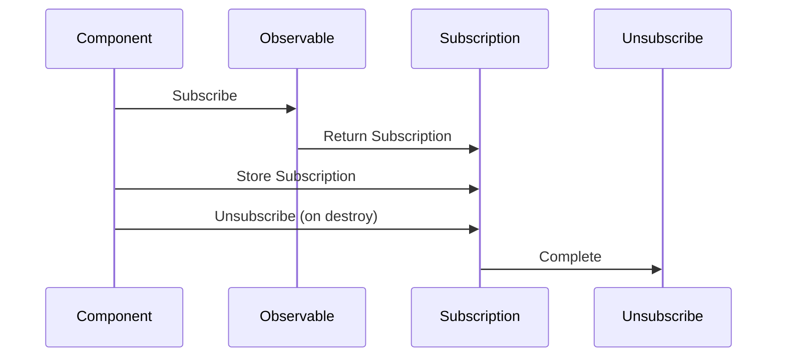

## 8.3.2 Subscription Management

In the world of reactive programming, Observables play a crucial role in handling asynchronous data streams. However, managing subscriptions to these Observables is equally important to ensure efficient resource utilization and prevent memory leaks. This section delves into the intricacies of subscription management in TypeScript, providing expert guidance on best practices and strategies to maintain application performance and stability.

### The Importance of Unsubscribing from Observables

When working with Observables, especially in environments like Angular, it's essential to unsubscribe from them when they are no longer needed. Failing to do so can lead to memory leaks, as the subscriptions will continue to exist in memory, consuming resources and potentially causing performance issues.

In Angular applications, components are often created and destroyed dynamically. If an Observable subscription is not properly managed, it can persist beyond the lifecycle of the component, leading to unintended behavior and resource wastage.

### Manual Unsubscription Using the `Subscription` Object

The `Subscription` object in RxJS provides a straightforward way to manage and unsubscribe from Observables manually. When you subscribe to an Observable, it returns a `Subscription` object that you can use to unsubscribe when necessary.

```typescript
import { Observable, Subscription } from 'rxjs';

const myObservable = new Observable(observer => {
  // Emit some values
  observer.next('Hello');
  observer.next('World');
  observer.complete();
});

const subscription: Subscription = myObservable.subscribe({
  next: value => console.log(value),
  complete: () => console.log('Completed')
});

// Unsubscribe when done
subscription.unsubscribe();
```

In the example above, we manually unsubscribe from the Observable once we're done processing its values. This is a crucial step to prevent memory leaks, especially in long-lived applications.

### Automating Subscription Management with Operators

While manual unsubscription is effective, it can become cumbersome in complex applications with numerous subscriptions. RxJS provides several operators to automate subscription management, making it easier to handle Observables efficiently.

#### Using `take`, `takeUntil`, and `first` Operators

- **`take`**: This operator allows you to specify the number of emissions you want to receive from an Observable before automatically unsubscribing.

  ```typescript
  import { interval } from 'rxjs';
  import { take } from 'rxjs/operators';

  const source = interval(1000);
  const example = source.pipe(take(3));

  example.subscribe(value => console.log(value)); // Outputs: 0, 1, 2
  ```

- **`takeUntil`**: This operator takes another Observable as a notifier. The subscription to the source Observable will automatically unsubscribe when the notifier emits a value.

  ```typescript
  import { Subject, interval } from 'rxjs';
  import { takeUntil } from 'rxjs/operators';

  const source = interval(1000);
  const notifier = new Subject();

  const example = source.pipe(takeUntil(notifier));

  example.subscribe(value => console.log(value));

  // Emit a value to stop the subscription after 3 seconds
  setTimeout(() => notifier.next(), 3000);
  ```

- **`first`**: This operator automatically completes the subscription after receiving the first emission.

  ```typescript
  import { from } from 'rxjs';
  import { first } from 'rxjs/operators';

  const source = from([10, 20, 30, 40]);
  const example = source.pipe(first());

  example.subscribe(value => console.log(value)); // Outputs: 10
  ```

### Multicasting and Subscription Management with `Subject` and `BehaviorSubject`

In some scenarios, you might want to multicast an Observable to multiple subscribers. `Subject` and `BehaviorSubject` in RxJS allow you to do this effectively, managing subscriptions collectively.

- **`Subject`**: Acts as both an Observable and an Observer, allowing you to multicast values to multiple subscribers.

  ```typescript
  import { Subject } from 'rxjs';

  const subject = new Subject<number>();

  subject.subscribe(value => console.log(`Subscriber A: ${value}`));
  subject.subscribe(value => console.log(`Subscriber B: ${value}`));

  subject.next(1);
  subject.next(2);
  ```

- **`BehaviorSubject`**: Similar to `Subject`, but it requires an initial value and emits the most recent value to new subscribers.

  ```typescript
  import { BehaviorSubject } from 'rxjs';

  const behaviorSubject = new BehaviorSubject<number>(0);

  behaviorSubject.subscribe(value => console.log(`Subscriber A: ${value}`));

  behaviorSubject.next(1);
  behaviorSubject.next(2);

  behaviorSubject.subscribe(value => console.log(`Subscriber B: ${value}`)); // Outputs: Subscriber B: 2
  ```

### Common Pitfalls and Strategies for Subscription Management

#### Forgetting to Unsubscribe

One of the most common pitfalls in subscription management is forgetting to unsubscribe from Observables, especially when they are long-lived or when components are destroyed. This can lead to memory leaks and degraded application performance.

#### Strategies for Managing Subscriptions

1. **Use the `AsyncPipe` in Angular**: The `AsyncPipe` automatically subscribes and unsubscribes from Observables, making it an excellent choice for managing subscriptions in Angular templates.

   ```html
   <div *ngIf="data$ | async as data">
     {{ data }}
   </div>
   ```

2. **Implement a Base Component Class**: Create a base component class that handles unsubscription logic in its `ngOnDestroy` lifecycle hook.

   ```typescript
   import { OnDestroy } from '@angular/core';
   import { Subscription } from 'rxjs';

   export class BaseComponent implements OnDestroy {
     private subscriptions: Subscription[] = [];

     protected addSubscription(subscription: Subscription): void {
       this.subscriptions.push(subscription);
     }

     ngOnDestroy(): void {
       this.subscriptions.forEach(sub => sub.unsubscribe());
     }
   }
   ```

3. **Use `takeUntil` with a `Subject`**: Create a `Subject` that emits a value when the component is destroyed, and use it with the `takeUntil` operator to manage subscriptions.

   ```typescript
   import { Component, OnDestroy } from '@angular/core';
   import { Subject } from 'rxjs';
   import { takeUntil } from 'rxjs/operators';

   @Component({
     selector: 'app-example',
     template: '<p>Example Component</p>'
   })
   export class ExampleComponent implements OnDestroy {
     private destroy$ = new Subject<void>();

     constructor() {
       // Example Observable subscription
       someObservable.pipe(takeUntil(this.destroy$)).subscribe(data => {
         console.log(data);
       });
     }

     ngOnDestroy(): void {
       this.destroy$.next();
       this.destroy$.complete();
     }
   }
   ```

### Best Practices for Subscription Management

- **Always Unsubscribe**: Make it a habit to unsubscribe from Observables, especially in components with a defined lifecycle.
- **Use Operators for Automation**: Leverage RxJS operators like `take`, `takeUntil`, and `first` to automate subscription management.
- **Leverage Angular's `AsyncPipe`**: Utilize the `AsyncPipe` in Angular templates to handle subscriptions automatically.
- **Centralize Subscription Logic**: Consider implementing a base component class to centralize and reuse subscription management logic across components.
- **Monitor Application Performance**: Regularly monitor your application's performance to identify and address any memory leaks or resource issues.

### Visualizing Subscription Management

To better understand how subscription management works, let's visualize the flow of managing subscriptions using a sequence diagram.



This diagram illustrates the process of subscribing to an Observable, storing the Subscription, and unsubscribing when the component is destroyed.

### Try It Yourself

To reinforce your understanding of subscription management, try modifying the code examples provided. Experiment with different RxJS operators and see how they affect the subscription lifecycle. Consider creating a small Angular application that utilizes Observables and implements the strategies discussed for managing subscriptions.

### Knowledge Check

Before moving on, let's review some key takeaways:

- Unsubscribing from Observables is crucial to prevent memory leaks.
- The `Subscription` object allows for manual unsubscription.
- Operators like `take`, `takeUntil`, and `first` automate subscription management.
- `Subject` and `BehaviorSubject` enable multicasting and collective subscription management.
- Strategies like using the `AsyncPipe` and implementing a base component class help manage subscriptions in complex applications.

Remember, mastering subscription management is essential for maintaining application performance and stability. Keep experimenting, stay curious, and enjoy the journey!

## Quiz Time!



### Why is it important to unsubscribe from Observables in Angular components?

- [x] To prevent memory leaks
- [ ] To increase application speed
- [ ] To reduce code complexity
- [ ] To enhance user interface design

> **Explanation:** Unsubscribing from Observables is crucial to prevent memory leaks, especially when components are destroyed.

### What does the `Subscription` object provide?

- [x] A way to unsubscribe from an Observable
- [ ] A method to emit values
- [ ] A function to create Observables
- [ ] A tool to manage component lifecycle

> **Explanation:** The `Subscription` object provides a method to unsubscribe from an Observable.

### Which operator automatically unsubscribes after the first emission?

- [ ] take
- [ ] takeUntil
- [x] first
- [ ] map

> **Explanation:** The `first` operator automatically completes the subscription after receiving the first emission.

### What is the purpose of the `takeUntil` operator?

- [x] To unsubscribe when a notifier Observable emits
- [ ] To take a specific number of emissions
- [ ] To multicast values
- [ ] To delay emissions

> **Explanation:** The `takeUntil` operator uses a notifier Observable to determine when to unsubscribe from the source Observable.

### How does the `AsyncPipe` help in Angular?

- [x] It automatically subscribes and unsubscribes from Observables
- [ ] It enhances the UI design
- [ ] It speeds up the application
- [ ] It reduces code size

> **Explanation:** The `AsyncPipe` in Angular automatically handles subscriptions and unsubscriptions in templates.

### What is a common pitfall in subscription management?

- [x] Forgetting to unsubscribe
- [ ] Using too many Observables
- [ ] Overusing the `map` operator
- [ ] Not using `Subject`

> **Explanation:** Forgetting to unsubscribe from Observables can lead to memory leaks.

### What does a `BehaviorSubject` require?

- [x] An initial value
- [ ] A notifier Observable
- [ ] A complete method
- [ ] A subscription object

> **Explanation:** A `BehaviorSubject` requires an initial value and emits the most recent value to new subscribers.

### Which strategy helps manage subscriptions in complex applications?

- [x] Implementing a base component class
- [ ] Using only manual unsubscription
- [ ] Avoiding Observables
- [ ] Using `map` operator

> **Explanation:** Implementing a base component class can centralize and reuse subscription management logic.

### What does the `take` operator do?

- [x] Takes a specified number of emissions
- [ ] Multicasts values
- [ ] Delays emissions
- [ ] Completes immediately

> **Explanation:** The `take` operator specifies the number of emissions to receive before unsubscribing.

### True or False: The `Subject` can act as both an Observable and an Observer.

- [x] True
- [ ] False

> **Explanation:** The `Subject` in RxJS can act as both an Observable and an Observer, allowing it to multicast values to multiple subscribers.


