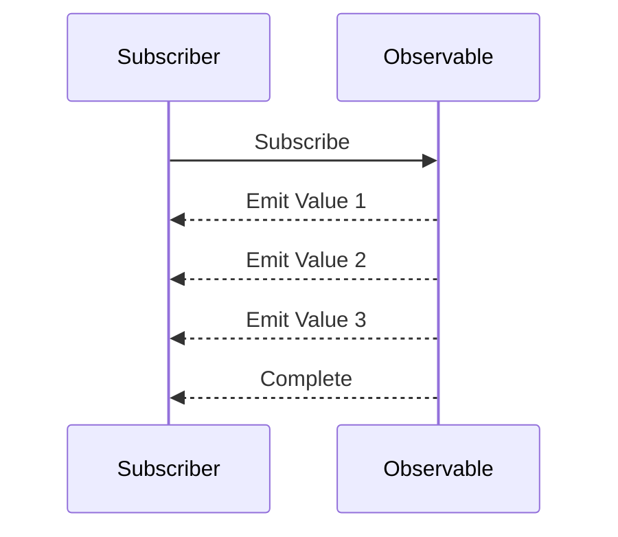

## 8.3 Observable Pattern

In the realm of modern software development, handling asynchronous data streams efficiently is a crucial skill. The Observable Pattern, a cornerstone of Reactive Programming, provides a robust framework for managing these streams. In this section, we will delve into the intricacies of Observables, contrasting them with Promises, and explore how they fit into the Reactive Programming paradigm. We will also examine the powerful RxJS library, which facilitates the implementation of Observables in TypeScript.

### Understanding Observables

Observables are a powerful tool for working with asynchronous data streams. Unlike Promises, which handle a single value or error, Observables can emit multiple values over time. This makes them ideal for scenarios where data arrives in chunks, such as user input events, WebSocket messages, or real-time data feeds.

#### Observables vs. Promises

While both Observables and Promises are used to handle asynchronous operations, they differ significantly in their capabilities:

- **Promises** resolve to a single value or error, representing a one-time event. Once a Promise is resolved or rejected, it cannot be reused.
- **Observables**, on the other hand, can emit multiple values over time. They are lazy, meaning they do not start emitting values until subscribed to, and they can be canceled, which helps in managing resources efficiently.

### Reactive Programming Principles

Reactive Programming is a paradigm that focuses on asynchronous data streams and the propagation of change. Observables are at the heart of this paradigm, allowing developers to work with data as it flows through the system.

#### Key Concepts

- **Streams**: Continuous sequences of data events.
- **Observers**: Entities that subscribe to streams and react to emitted values.
- **Operators**: Functions that transform, filter, or combine streams.

### Advantages of Using Observables

Observables offer several advantages over traditional asynchronous handling mechanisms:

- **Multiple Emissions**: Unlike Promises, Observables can emit multiple values over time.
- **Composability**: Observables can be combined and transformed using operators, allowing for complex data manipulation.
- **Cancellation**: Subscriptions can be canceled, preventing memory leaks and unnecessary computations.
- **Lazy Evaluation**: Observables do not execute until subscribed to, which can improve performance.

### Introduction to RxJS

RxJS (Reactive Extensions for JavaScript) is a library that enables Reactive Programming in JavaScript and TypeScript. It provides a rich set of operators to work with Observables, making it easier to handle complex asynchronous workflows.

#### Key Features of RxJS

- **Comprehensive Operator Set**: RxJS offers a wide range of operators for transforming, filtering, and combining streams.
- **TypeScript Support**: RxJS is fully compatible with TypeScript, providing type safety and autocompletion.
- **Community and Documentation**: RxJS has a large community and extensive documentation, making it accessible to developers of all levels.

### Creating Observables in TypeScript

Let's start by creating a simple Observable in TypeScript. We'll use RxJS to demonstrate this process.

```typescript
import { Observable } from 'rxjs';

// Create an Observable that emits values 1, 2, and 3
const simpleObservable = new Observable<number>((subscriber) => {
  subscriber.next(1);
  subscriber.next(2);
  subscriber.next(3);
  subscriber.complete(); // Signal that no more values will be emitted
});

// Subscribe to the Observable
simpleObservable.subscribe({
  next: (value) => console.log(`Received value: ${value}`),
  complete: () => console.log('Observable completed'),
});
```

In this example, we create an Observable that emits three numbers and then completes. The `subscribe` method is used to listen for emitted values and handle them accordingly.

### Subscribing to Observables

Subscribing to an Observable is how you start receiving data. The `subscribe` method takes an observer object with `next`, `error`, and `complete` callbacks.

```typescript
simpleObservable.subscribe({
  next: (value) => console.log(`Received value: ${value}`),
  error: (err) => console.error(`Error occurred: ${err}`),
  complete: () => console.log('Observable completed'),
});
```

- **next**: Called for each emitted value.
- **error**: Called if an error occurs.
- **complete**: Called when the Observable completes.

### Using Operators to Manipulate Data Streams

Operators are functions that enable complex data manipulations on Observables. RxJS provides a plethora of operators, such as `map`, `filter`, and `mergeMap`.

#### Example: Using the `map` Operator

The `map` operator transforms each emitted value according to a specified function.

```typescript
import { map } from 'rxjs/operators';

// Create an Observable and apply the map operator
const mappedObservable = simpleObservable.pipe(
  map((value) => value * 2) // Double each emitted value
);

mappedObservable.subscribe({
  next: (value) => console.log(`Mapped value: ${value}`),
  complete: () => console.log('Mapped Observable completed'),
});
```

In this example, the `map` operator doubles each emitted value before passing it to the subscriber.

### Best Practices for Managing Observables

To effectively manage Observables, consider the following best practices:

- **Unsubscribe Properly**: Always unsubscribe from Observables to prevent memory leaks. Use `takeUntil` or `unsubscribe` in Angular components to clean up subscriptions.
- **Error Handling**: Use the `catchError` operator to handle errors gracefully.
- **Combine Streams**: Use operators like `merge`, `concat`, and `combineLatest` to work with multiple Observables.
- **Avoid Nesting**: Use higher-order mapping operators like `switchMap` to flatten nested Observables.

### Scenarios Where Observables Shine

Observables are particularly useful in scenarios involving:

- **Event Handling**: Observables can handle user input events, such as clicks and keystrokes, efficiently.
- **Data Streams**: Real-time data feeds, such as WebSocket messages, are naturally modeled as Observables.
- **Complex Async Workflows**: Observables can coordinate multiple asynchronous operations, making them ideal for complex workflows.

### Advanced Operators and Error Handling

For expert developers, mastering advanced operators and error handling techniques is essential.

#### Example: Using `switchMap` for Flattening

The `switchMap` operator is used to switch to a new Observable, canceling the previous one.

```typescript
import { fromEvent } from 'rxjs';
import { switchMap } from 'rxjs/operators';

// Create an Observable from button clicks
const button = document.getElementById('myButton');
const clicks = fromEvent(button, 'click');

// Use switchMap to handle clicks
clicks.pipe(
  switchMap(() => {
    // Return a new Observable for each click
    return new Observable((subscriber) => {
      subscriber.next('New data stream');
      subscriber.complete();
    });
  })
).subscribe({
  next: (value) => console.log(value),
  complete: () => console.log('Stream completed'),
});
```

In this example, `switchMap` is used to switch to a new data stream each time a button is clicked, canceling any previous streams.

#### Error Handling with `catchError`

The `catchError` operator allows you to handle errors within an Observable chain.

```typescript
import { of } from 'rxjs';
import { catchError } from 'rxjs/operators';

// Create an Observable that throws an error
const errorObservable = new Observable((subscriber) => {
  subscriber.error('An error occurred');
});

// Handle the error with catchError
errorObservable.pipe(
  catchError((err) => {
    console.error(`Caught error: ${err}`);
    return of('Fallback value'); // Return a fallback value
  })
).subscribe({
  next: (value) => console.log(`Received: ${value}`),
  complete: () => console.log('Completed with fallback'),
});
```

In this example, `catchError` catches the error and returns a fallback value, allowing the stream to continue.

### Try It Yourself

Experiment with the provided examples by modifying them to suit your needs:

- **Change Emitted Values**: Modify the values emitted by the Observables to see how the output changes.
- **Add More Operators**: Try adding operators like `filter` or `mergeMap` to manipulate the data streams further.
- **Handle Different Events**: Use `fromEvent` to create Observables from different DOM events, such as mouse movements or keyboard inputs.

### Visualizing Observable Streams

To better understand how Observables work, let's visualize a simple data flow using a sequence diagram.



**Diagram Description**: This sequence diagram illustrates the interaction between a subscriber and an Observable. The Observable emits three values and then completes, which is communicated back to the subscriber.

### References and Further Reading

For more information on Observables and RxJS, consider exploring the following resources:

- [RxJS Documentation](https://rxjs.dev/guide/overview)
- [MDN Web Docs on Promises](https://developer.mozilla.org/en-US/docs/Web/JavaScript/Guide/Using_promises)
- [ReactiveX Introduction](http://reactivex.io/intro.html)

### Knowledge Check

To reinforce your understanding of Observables, consider the following questions:

- How do Observables differ from Promises in handling asynchronous data?
- What are some common operators used with Observables, and what do they do?
- How can you prevent memory leaks when working with Observables?

### Embrace the Journey

Remember, this is just the beginning. As you progress, you'll be able to build more complex and interactive applications using Observables. Keep experimenting, stay curious, and enjoy the journey!

## Quiz Time!



### What is a key difference between Observables and Promises?

- [x] Observables can emit multiple values over time.
- [ ] Promises can emit multiple values over time.
- [ ] Observables resolve to a single value.
- [ ] Promises are lazy and cancelable.

> **Explanation:** Observables can emit multiple values over time, whereas Promises resolve to a single value.

### Which operator would you use to transform each emitted value in an Observable?

- [x] map
- [ ] filter
- [ ] switchMap
- [ ] merge

> **Explanation:** The `map` operator is used to transform each emitted value in an Observable.

### What is the purpose of the `catchError` operator in RxJS?

- [x] To handle errors within an Observable chain.
- [ ] To transform emitted values.
- [ ] To combine multiple Observables.
- [ ] To unsubscribe from an Observable.

> **Explanation:** The `catchError` operator is used to handle errors within an Observable chain.

### How can you prevent memory leaks when using Observables?

- [x] By unsubscribing from Observables when they are no longer needed.
- [ ] By using the `map` operator.
- [ ] By using Promises instead.
- [ ] By avoiding the use of Observables.

> **Explanation:** Unsubscribing from Observables when they are no longer needed helps prevent memory leaks.

### Which operator would you use to switch to a new Observable and cancel the previous one?

- [x] switchMap
- [ ] map
- [ ] filter
- [ ] concat

> **Explanation:** The `switchMap` operator is used to switch to a new Observable, canceling the previous one.

### What is the primary library used for implementing Observables in TypeScript?

- [x] RxJS
- [ ] Lodash
- [ ] jQuery
- [ ] Angular

> **Explanation:** RxJS is the primary library used for implementing Observables in TypeScript.

### What is a key advantage of using Observables for event handling?

- [x] They can handle multiple events over time.
- [ ] They resolve to a single event.
- [ ] They cannot be canceled.
- [ ] They are eager and start immediately.

> **Explanation:** Observables can handle multiple events over time, making them ideal for event handling.

### Which of the following is NOT a common use case for Observables?

- [ ] Event handling
- [ ] Real-time data streams
- [ ] Complex async workflows
- [x] Synchronous data processing

> **Explanation:** Observables are used for asynchronous data processing, not synchronous.

### What does the `subscribe` method do in the context of Observables?

- [x] It starts receiving data from the Observable.
- [ ] It transforms data in the Observable.
- [ ] It cancels the Observable.
- [ ] It combines multiple Observables.

> **Explanation:** The `subscribe` method starts receiving data from the Observable.

### True or False: Observables are eager and start executing immediately upon creation.

- [ ] True
- [x] False

> **Explanation:** Observables are lazy and do not start executing until they are subscribed to.


